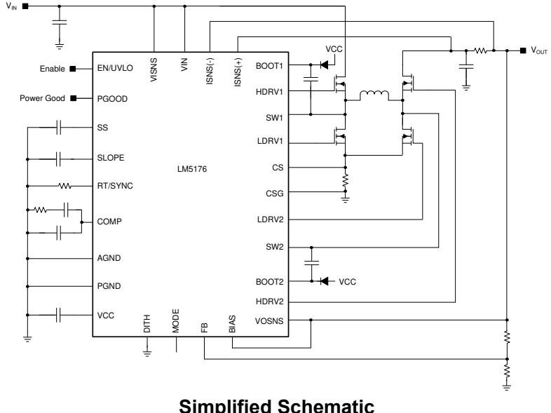

# 8 Application and Implementation

# Note

Information in the following applications sections is not part of the TI component specification, and TI does not warrant its accuracy or completeness. TI’s customers are responsible for determining suitability of components for their purposes, as well as validating and testing their design implementation to confirm system functionality.

# 8.1 Application Information

The LM5176 is a four-switch buck-boost controller. A quick-start tool on the LM5176 product webpage can be used to design a buck-boost converter using the LM5176. Alternatively, Webench® software can create a complete buck-boost design using the LM5176 and generate bill of materials, estimate efficiency, solution size, and cost of the complete solution. Section 8.2 describes a detailed step-by-step design procedure for a typical application circuit.

# 8.2 Typical Application

A typical application example is a buck-boost converter operating from a wide input voltage range of $6 \vee$ to $5 0 \lor$ and providing a stable $_ { 1 2 \vee }$ output voltage with current capability of $\textsf { G A }$ .

  
Figure 8-1. LM5176 Four-Switch Buck Boost Application Schematic

# 8.2.1 Design Requirements

For this design example, the following are used as the input parameters.

<table><tr><td rowspan=1 colspan=1>DESIGN PARAMETER</td><td rowspan=1 colspan=1>EXAMPLE VALUE</td></tr><tr><td rowspan=1 colspan=1>Input voltage range</td><td rowspan=1 colspan=1>6 V to 50 V</td></tr><tr><td rowspan=1 colspan=1>Output</td><td rowspan=1 colspan=1>12V</td></tr><tr><td rowspan=1 colspan=1>Load current</td><td rowspan=1 colspan=1>6A</td></tr><tr><td rowspan=1 colspan=1>Switching frequency</td><td rowspan=1 colspan=1>300 kHz</td></tr><tr><td rowspan=1 colspan=1>Mode</td><td rowspan=1 colspan=1>CCM, Hiccup</td></tr></table>

# 8.2.2 Detailed Design Procedure

# 8.2.2.1 Custom Design with WEBENCH Tools

Click here to create a custom design using the LM5176 device with the WEBENCH® Power Designer.

1. Start by entering your $V _ { \mathsf { I N } }$ , $\mathsf { V } _ { \mathsf { O U T } }$ and IOUT requirements.   
2. Optimize your design for key parameters like efficiency, footprint and cost using the optimizer dial and compare this design with other possible solutions from Texas Instruments.   
3. WEBENCH Power Designer provides you with a customized schematic along with a list of materials with real time pricing and component availability.

4. In most cases, you will also be able to:

Run electrical simulations to see important waveforms and circuit performance, Run thermal simulations to understand the thermal performance of your board, Export your customized schematic and layout into popular CAD formats, Print PDF reports for the design, and share your design with colleagues.

5. Get more information about WEBENCH tools at www.ti.com/webench.

# 8.2.2.2 Frequency

The switching frequency of LM5176 is set by an $\mathsf { R } _ { \mathsf { T } }$ resistor connected from the RT/SYNC pin to AGND. The $\mathsf { R } _ { \mathsf { T } }$ resistor required to set the desired frequency is calculated using Equation 5 or Figure 6-3. A $1 \%$ standard resistor of $2 7 . 4 \ : \mathsf { k } \Omega$ is selected for $\mathsf { F } _ { \mathsf { s w } } = 3 0 0 ~ \mathsf { k H z }$ .

# 8.2.2.3 VOUT

The output voltage is set using a resistor divider to the FB pin. The internal reference voltage is $0 . 8 \lor .$ Normally the bottom resistor in the resistor divider is selected to be in the $1 \ \mathsf { k } \Omega$ to $1 0 0 ~ \mathsf { k } \Omega$ range.

$$
\mathsf { R } _ { \mathsf { F B 1 } } = 2 0 \mathsf { k } \Omega
$$

The top resistor in the feedback resistor divider is selected using Equation 12:

$$
\mathsf { R } _ { \mathsf { F B 2 } } = \frac { \mathsf { V } _ { \mathsf { O U T } } - 0 . 8 \mathsf { V } } { 0 . 8 \mathsf { V } } \times \mathsf { R } _ { \mathsf { F B 1 } } = 2 8 0 \mathsf { k } \Omega
$$

# 8.2.2.4 Inductor Selection

The inductor selection is based on consideration of both buck and boost modes of operation. For buck mode, inductor selection is based on limiting the peak-to-peak current ripple $\Delta \mathfrak { l }$ to approximately $40 \%$ of the maximum inductor current at the maximum input voltage. The target inductance for buck mode is:

$$
\mathsf { L } _ { \mathsf { B U C K } } = \frac { ( \mathsf { V } _ { \mathsf { I N } ( \mathsf { M A X } ) } - \mathsf { V } _ { \mathsf { O U T } } ) \times \mathsf { V } _ { \mathsf { O U T } } } { 0 . 4 \times \mathsf { I } _ { \mathsf { O U T } ( \mathsf { M A X } ) } \times \mathsf { F } _ { \mathsf { s w } } \times \mathsf { V } _ { \mathsf { I N } ( \mathsf { M A X } ) } } = 1 2 . 7 \mu \mathsf { H }
$$

For boost mode, the inductor selection is based on limiting the peak-to-peak current ripple $\Delta \mathfrak { l } _ { \mathrm { L } }$ to approximately $30 \%$ of the maximum inductor current at the minimum input voltage. The target inductance for boost mode is:

$$
\mathsf { L } _ { \mathsf { B O O S T } } = \frac { \mathsf { V } _ { \mathsf { I N } ( \mathsf { M I N } ) } ^ { 2 } \times ( \mathsf { V } _ { \mathsf { O U T } } - \mathsf { V } _ { \mathsf { I N } ( \mathsf { M I N } ) } ) } { 0 . 3 \times \mathsf { I } _ { \mathsf { O U T } ( \mathsf { M A X } ) } \times \mathsf { F } _ { \mathsf { s w } } \times \mathsf { V } _ { \mathsf { O U T } } ^ { 2 } } = 2 . 8 \mu \mathsf { H }
$$

In this particular application, the buck inductance is larger. Choosing a larger inductance reduces the ripple current but also increases the size of the inductor. A larger inductor also reduces the achievable bandwidth of the converter by moving the right half plane zero to lower frequencies. Therefore, a judicious compromise should be made based on the application requirements. For this design a $4 . 7 – \mu \ H$ inductor is selected. With this inductor selection, the inductor current ripple is 6.5 A, 4.3 A, and $2 . 1 \mathsf { A }$ , at $V _ { \mathsf { I N } }$ of 50 V, 24 V, and $6 \vee$ , respectively.

The maximum average inductor current occurs at the minimum input voltage and maximum load current:

$$
\mathsf { I } _ { \mathsf { L } ( \mathsf { M A X } ) } = \frac { \mathsf { V } _ { \mathsf { O U T } } \times \mathsf { I } _ { \mathsf { O U T } ( \mathsf { M A X } ) } } { 0 . 9 \times \mathsf { V } _ { \mathsf { I N } ( \mathsf { M I N } ) } } = 1 3 . 3 ~ \mathsf { A }
$$

where a $90 \%$ efficiency is assumed. The peak inductor current occurs at minimum input voltage and is given by:

$$
l _ { L ( P E A K ) } = l _ { L ( \mathsf { M A X } ) } + \frac { V _ { \mathsf { I N } ( \mathsf { M I N } ) } \times ( \mathsf { V } _ { \mathsf { O U T } } - V _ { \mathsf { I N } ( \mathsf { M I N } ) } ) } { 2 \times \mathsf { L } \mathsf { I } \times \mathsf { F } _ { \mathsf { s w } } \times \mathsf { V } _ { \mathsf { O U T } } } = 1 4 . 4 \mathsf { A }
$$

To ensure sufficient output current, the current limit threshold must be set to allow the maximum load current in boost operation. The inductor peak current during overload depends on the current limit resistor, RSENSE, (refer to the subsection on selecting RSENSE). The peak inductor current in current limit when in boost mode is given by:

$$
\mathsf { I } _ { \mathsf { L } ( \mathsf { P E A K } , \mathsf { u l M I T } , \mathsf { B O O S T } ) } = \frac { 1 2 0 \mathsf { m V } } { \mathsf { R } _ { \mathsf { S E N S E } } }
$$

The peak inductor current in current limit when in buck mode happens at high input voltage and is given by:

$$
{ \mathsf { I } } _ { \mathsf { L } ( { \mathsf { P E A K } } , \mathsf { L I M I T } , \mathsf { B U C K } ) } = { \frac { 8 0 \mathsf { m V } } { { \mathsf { R } } _ { \mathsf { S E N S E } } } } + { \frac { \left( { \mathsf { V } } _ { \mathsf { I N } ( { \mathsf { M A X } } ) } - { \mathsf { V } } _ { \mathsf { O U T } } \right) } { { \mathsf { L } } { \mathsf { I } } \times { \mathsf { F } } _ { \mathsf { s w } } } } \times \left( { \frac { \mathsf { V } _ { \mathsf { O U T } } } { \mathsf { V } _ { \mathsf { I N } ( { \mathsf { M A X } } ) } } } \right)
$$

The peak inductor current in current limit is $\mathtt { 1 5  A }$ and $1 6 . 5 A$ in boost mode and buck mode, respectively. The inductor should be selected to handle this current.

# 8.2.2.5 Output Capacitor

In the boost mode, the output capacitor conducts high ripple current. The output capacitor RMS ripple current is given by Equation 19 where the minimum $V _ { \mathsf { I N } }$ corresponds to the maximum capacitor current.

$$
\mathsf { I } _ { \mathsf { C O U T } ( \mathsf { R M S } ) } = \mathsf { I } _ { \mathsf { O U T } } \times \sqrt { \frac { \mathsf { V } _ { \mathsf { O U T } } } { \mathsf { V } _ { \mathsf { I N } } } - 1 }
$$

In this example, the maximum output ripple RMS current is ICOUT(RMS) $= 6$ A. A $\mathsf { 5 } / \mathsf { m } \Omega$ output capacitor ESR causes an output ripple voltage of $6 0 ~ \mathsf { m V }$ as given by:

$$
\Delta V _ { \mathsf { R I P P L E ( E S R ) } } = \frac { \mathsf { I _ { O U T } } \times \mathsf { V _ { O U T } } } { \mathsf { V _ { I N ( M I N ) } } } \times \mathsf { E S R }
$$

A 400-µF output capacitor causes a capacitive ripple voltage of $2 5 \mathsf { m V }$ as given by:

$$
\Delta \mathsf { V } _ { \mathsf { R I P P L E ( C O U T ) } } = \frac { \mathsf { l _ { O U T } } \times \left( 1 - \frac { \mathsf { V } _ { \mathsf { I N ( M I N ) } } } { \mathsf { V _ { O U T } } } \right) } { \mathsf { C _ { O U T } } \times \mathsf { F _ { s w } } }
$$

Typically, a combination of ceramic and bulk capacitors is needed to provide low ESR and high ripple current capacity. The complete schematic in Figure 8-1 shows a good starting point for ${ \mathsf { C } } _ { \mathsf { O U T } }$ for typical applications.

# 8.2.2.6 Input Capacitor

In buck mode, the input capacitor supplies high ripple current. The RMS current in the input capacitor is given by:

$$
| _ { \mathsf { C I N } ( \mathsf { R M S } ) } = | _ { \mathsf { O U T } } \sqrt { \mathsf { D } \times ( 1 - \mathsf { D } ) }
$$

The maximum RMS current occurs at $\mathsf { D } = 0 . 5$ , which gives $\mathsf { I } _ { \mathsf { C I N } ( \mathsf { R M S } ) } = \mathsf { I } _ { \mathsf { O U T } } / 2 = 3 \ ,$ A. A combination of ceramic and bulk capacitors should be used to provide a short path for high di/dt current and to reduce the output voltage ripple. The complete schematic in Figure 8-1 is a good starting point for $C _ { \mathsf { I N } }$ for typical applications.

# 8.2.2.7 Sense Resistor (RSENSE)

The current sense resistor between the CS and CSG pins should be selected to ensure that current limit is set high enough for both buck and boost modes of operation. For the buck operation, the current limit resistor is given by:

$$
\mathsf { R } _ { \mathsf { S E N S E ( B U C K ) } } = \frac { 8 0 \mathsf { m V } } { \mathsf { I } _ { \mathsf { O U T } ( \mathsf { M A X } ) } } = 1 3 \mathsf { m } \Omega
$$

For the boost mode of operation, the current limit resistor is given by:

$$
\mathsf { R } _ { \mathsf { S E N S E ( B O O S T ) } } = \frac { 1 2 0 \mathsf { m V } } { \mathsf { I } _ { \mathsf { L } ( \mathsf { P E A K } ) } } = 8 . 3 \mathsf { m } \Omega
$$

The closest standard value of $\mathsf { R } _ { \mathsf { S E N S E } } = 8 \mathsf { m } \Omega$ is selected based on the boost mode operation.

The maximum power dissipation in RSENSE happens at $\mathsf { V } _ { \mathsf { I N ( M I N ) } }$ :

$$
\mathsf { P } _ { \mathsf { R S E N S E } ( \mathsf { M A X } ) } = \left( \frac { 1 2 0 \mathsf { m V } } { \mathsf { R } _ { \mathsf { S E N S E } } } \right) ^ { 2 } \cdot \mathsf { R } _ { \mathsf { S E N S E } } \cdot \left( 1 - \frac { \mathsf { V } _ { \mathsf { I N } ( \mathsf { M i N } ) } } { \mathsf { V } _ { \mathsf { O U T } } } \right) = 0 . 9 \mathsf { W }
$$

Therefore, a sense resistor with 2-W power rating will be sufficient for this application.

For some application circuits, it can be required to add a filter network to attenuate noise in the CS and CSG sense lines. See Figure 8-1 for typical values. The filter resistance should not exceed $1 0 0 \Omega$ .

# 8.2.2.8 Slope Compensation

For stable current loop operation and to avoid subharmonic oscillations, the slope capacitor should be selected based on Equation 26:

$$
\mathsf { C } _ { \mathsf { S L O P E } } = \mathsf { g m } _ { \mathsf { S L O P E } } \times \frac { \mathsf { L } 1 } { \mathsf { R } _ { \mathsf { S E N S E } } \times \mathsf { A } _ { \mathsf { C S } } } = 2 \mu \mathsf { S } \times \frac { 4 . 7 \mu \mathsf { H } } { 8 \mathsf { m } \Omega \times 5 } = 2 3 5 \mu \mathsf { H }
$$

This slope compensation results in “dead-beat” operation, in which the current loop disturbances die out in one switching cycle. Theoretically, a current mode loop is stable with half the “dead-beat” slope (twice the calculated slope capacitor value in Equation 26). A smaller slope capacitor results in larger slope signal which is better for noise immunity in the transition region $( \mathsf { V } _ { \mathsf { I N } } { \sim } \mathsf { V } _ { \mathsf { O U T } } )$ . A larger slope signal, however, restricts the achievable input voltage range for a given output voltage, switching frequency, and inductor. For this design, $\mathsf { C } _ { \mathsf { S L O P E } } = 2 2 0$ pF is selected for better transition region behavior while still providing the required $V _ { \mathsf { I N } }$ range. This selection of slope capacitor, inductor, switching frequency, and inductor satisfies the COMP range limitation explained in Section 7.3.13.

# 8.2.2.9 UVLO

The UVLO resistor divider must be designed for turnon below 6 V. Selecting $\mathsf { R } _ { \mathsf { U V } 2 } = 2 4 9 \ \mathsf { k } \Omega$ gives a UVLO hysteresis of $0 . 8 \vee$ based on Equation 2. The lower UVLO resistor is the selected using Equation 27:

$$
R _ { \mathsf { U V } 1 } = { \frac { \mathsf { R } _ { \mathsf { U V } 2 } \times \mathsf { V } _ { \mathsf { E N } ( { \mathsf { O P } } ) } } { \mathsf { V } _ { \mathsf { I N } ( { \mathsf { U V } } ) } + \mathsf { I } _ { \mathsf { E N } ( { \mathsf { S T B Y } } ) } \times \mathsf { R } _ { \mathsf { U V } 2 } - \mathsf { V } _ { \mathsf { E N } ( { \mathsf { O P } } ) } } }
$$

A standard value of $5 9 . 0 \mathsf { k } \Omega$ is selected for $\mathsf { R } _ { \mathsf { U V } 1 }$ .

When programming the UVLO threshold for lower input voltage operation, it is important to choose MOSFETs with gate (Miller) plateau voltage lower than the minimum $V _ { \sf I N }$ .

# 8.2.2.10 Soft-Start Capacitor

The soft-start time is programmed using the soft-start capacitor. The relationship between $\mathtt { C } _ { \mathtt { S S } }$ and the soft-start time is given by:

$$
\mathrm { \Delta t _ { s s } = \frac { C _ { S S } \times V _ { R E F } } { l _ { S S } } }
$$

$\mathsf { C } _ { \mathsf { S } \mathsf { S } } = 0 . 1 \ \mu \mathsf { F }$ gives a soft-start time of $1 6 \mathsf { m s }$ .

# 8.2.2.11 Dither Capacitor

The dither capacitor sets the modulation frequency of the frequency dithering around the nominal switching frequency. A larger $\mathsf { C } _ { \mathsf { D } | \mathsf { T } | }$ results in lower modulation frequency. For proper operation, the modulation frequency $( \mathsf { F } _ { \mathsf { M O D } } )$ must be much lower than the switching frequency. Use Equation 29 to select $\mathsf { C } _ { \mathsf { D } | \mathsf { T } \mathsf { H } }$ for the target modulation frequency.

$$
\mathsf { C } _ { \mathsf { D I T H } } = \frac { 1 0 \mu \mathsf { A } } { \mathsf { F } _ { \mathsf { M O D } } \times 0 . 2 4 \bigvee }
$$

For the current design, dithering is not being implemented. Therefore, a 0-Ω resistor from the DITH pin to AGND disables this feature.

# 8.2.2.12 MOSFETs QH1 and QL1

The input side MOSFETs QH1 and QL1 need to withstand the maximum input voltage of $5 0 \lor .$ In addition, they must withstand the transient spikes at SW1 during switching. Therefore, QH1 and QL1 should be rated for $6 0 \vee$ or higher. The gate plateau voltages of the MOSFETs should be smaller than the minimum input voltage of the converter, otherwise the MOSFETs may not fully enhance during start-up or overload conditions.

The power loss in QH1 in the boost mode of operation is approximated by:

$$
\mathsf { P } _ { \mathsf { C O N D } ( \mathsf { Q H } ) } = \left( \mathsf { I } _ { \mathsf { O U T } } \cdot \frac { \mathsf { V } _ { \mathsf { O U T } } } { \mathsf { V } _ { \mathsf { I N } } } \right) ^ { 2 } \cdot \mathsf { R } _ { \mathsf { D S O N } ( \mathsf { Q H } ) }
$$

The power loss in QH1 in buck mode of operation consists of both conduction and switching loss components given by Equation 31 and Equation 32, respectively:

$$
\mathsf { P } _ { \mathsf { C O N D ( Q H 1 ) } } = \left( \frac { \mathsf { V } _ { \mathsf { O U T } } } { \mathsf { V } _ { \mathsf { I N } } } \right) \cdot \mathsf { I } _ { \mathsf { O U T } } { } ^ { 2 } \cdot \mathsf { R } _ { \mathsf { D S O N ( Q H 1 ) } }
$$

$$
\mathsf { P } _ { \mathsf { S W } ( \mathsf { O H } 1 ) } = \frac { 1 } { 2 } \cdot \mathsf { V } _ { \mathsf { I N } } \cdot \mathsf { I } _ { \mathsf { O U T } } \cdot \left( \mathsf { t } _ { \mathsf { r } } + \mathsf { t } _ { \mathsf { f } } \right) \cdot \mathsf { F } _ { \mathsf { s w } }
$$

The rise (tr) and the fall $( t _ { \mathsf { f } } )$ times are based on the MOSFET data sheet information or measured in the lab. Typically, a MOSFET with smaller RDSON (smaller conduction loss) will have longer rise and fall times (larger switching loss).

The power loss in QL1 in the buck mode of operation is shown in Equation 33:

$$
\mathsf { P } _ { \mathsf { C O N D } ( \mathrm { Q L } 1 ) } = \left( 1 - \frac { \mathsf { V } _ { \mathrm { O U T } } } { \mathsf { V } _ { \mathsf { I N } } } \right) \cdot \mathsf { I } _ { \mathrm { O U T } } { } ^ { 2 } \cdot \mathsf { R } _ { \mathsf { D S O N } ( \mathrm { Q L } 1 ) }
$$

# 8.2.2.13 MOSFETs QH2 and QL2

The output side MOSFETs QH2 and QL2 see the output voltage of $_ { 1 2 \mathrm { ~ V ~ } }$ and additional transient spikes at SW2 during switching. Therefore, QH2 and QL2 should be rated for $^ { 2 0 \mathrm { ~ V ~ } }$ or more. The gate plateau voltages of the MOSFETs should be smaller than the minimum input voltage of the converter, otherwise the MOSFETs may not fully enhance during start-up or overload conditions.

The power loss in QH2 in buck mode of operation is approximated by:

$$
\mathsf { P } _ { \mathsf { C O N D ( Q H 2 ) } } = \mathsf { I } _ { \mathsf { O U T } } ^ { 2 } \cdot \mathsf { R } _ { \mathsf { D S O N ( Q H 2 ) } }
$$

The power loss in QL2 in the boost mode of operation consists of both conduction and switching loss components given by Equation 35 and Equation 36, respectively:

$$
\begin{array} { r l } & { \mathsf { P } _ { \mathsf { C O N D } ( \mathrm { O L } 2 ) } = \left( 1 - \frac { \mathsf { V } _ { \mathsf { I N } } } { \mathsf { V } _ { \mathrm { O U T } } } \right) \cdot \left( \mathsf { I } _ { \mathrm { O U T } } \cdot \frac { \mathsf { V } _ { \mathrm { O U T } } } { \mathsf { V } _ { \mathrm { I N } } } \right) ^ { 2 } \cdot \mathsf { R } _ { \mathsf { D S O N } ( \mathrm { O L } 2 ) } } \\ & { \mathsf { P } _ { \mathsf { S W } ( \mathrm { O L } 2 ) } = \displaystyle \frac { 1 } { 2 } \cdot \mathsf { V } _ { \mathrm { O U T } } \cdot \left( \mathsf { I } _ { \mathrm { O U T } } \cdot \frac { \mathsf { V } _ { \mathrm { O U T } } } { \mathsf { V } _ { \mathrm { I N } } } \right) \cdot \left( \mathsf { t } _ { \mathrm { r } } + \mathsf { t } _ { \mathrm { f } } \right) \cdot \mathsf { F } _ { \mathrm { s w } } } \end{array}
$$

The rise $\smash { \bigl ( \mathfrak { t } _ { \Gamma } \bigr ) }$ and the fall $\left( \mathfrak { t } _ { \mathsf { f } } \right)$ times can be based on the MOSFET data sheet information or measured in the lab. Typically, a MOSFET with smaller RDSON (lower conduction loss) has longer rise and fall times (larger switching loss).

The power loss in QH2 in the boost mode of operation is shown in Equation 37:

$$
\mathsf { P } _ { \mathsf { C O N D } ( \mathsf { O H } 2 ) } = \frac { \mathsf { V } _ { \mathsf { I N } } } { \mathsf { V } _ { \mathsf { O U T } } } \cdot \left( \mathsf { I } _ { \mathsf { O U T } } \cdot \frac { \mathsf { V } _ { \mathsf { O U T } } } { \mathsf { V } _ { \mathsf { I N } } } \right) ^ { 2 } \cdot \mathsf { R } _ { \mathsf { D S O N } ( \mathsf { O H } 2 ) }
$$

# 8.2.2.14 Frequency Compensation

This section presents the control loop compensation design procedure for the LM5176 buck-boost controller. The LM5176 operates mainly in buck or boost modes, separated by a transition region, and therefore, the control loop design is done for both buck and boost operating modes. Then, a final selection of compensation is made based on the mode that is more restrictive from a loop stability point of view. Typically, for a converter designed to go deep into both buck and boost operating regions, the boost compensation design is more restrictive due to the presence of a right half plane zero (RHPZ) in the boost mode.

The boost power stage output pole location is given by:

$$
f _ { \sf p 1 ( b o o s t ) } = \frac { 1 } { 2 \pi } \left( \frac { 2 } { \sf R _ { O U T } \times C _ { O U T } } \right) = 3 9 8 \sf H z
$$

where $\mathsf { R o u r } = 2 \ \Omega$ corresponds to the maximum load of 6 A.

The boost power stage ESR zero location is given by:

$$
f _ { z 1 } = \frac { 1 } { 2 \pi } \left( \frac { 1 } { \mathsf { R } _ { \mathsf { E S R } } \times \mathsf { C } _ { 0 \mathsf { U T } } } \right) = 7 9 . 6 ~ \mathsf { k H z }
$$

The boost power stage RHP zero location is given by:

$$
f _ { \mathsf { R H P } } = \frac { 1 } { 2 \pi } \left( \frac { \mathsf { R } _ { \mathsf { O U T } } \times ( 1 - \mathsf { D } _ { \mathsf { M A X } } ) ^ { 2 } } { \mathsf { L } 1 } \right) = 1 6 . 9 ~ \mathsf { k H z }
$$

where $\mathsf { D } _ { \mathsf { M A X } }$ is the maximum duty cycle at the minimum $V _ { \mathsf { I N } }$ .

The buck power stage output pole location is given by:

$$
f _ { \sf p 1 ( \sf b u c k ) } = \frac { 1 } { 2 \pi } \left( \frac { 1 } { \sf R _ { \sf O U T } \times C _ { \sf O U T } } \right) = 1 9 9 \sf H z
$$

The buck power stage ESR zero location is the same as the boost power stage ESR zero.

It is clear from Equation 40 that RHP zero is the main factor limiting the achievable bandwidth. For a robust design, the crossover frequency should be less than $1 / 3$ of the RHP zero frequency. Given the position of the RHP zero, a reasonable target bandwidth in boost operation is around 4 kHz:

$$
f _ { \mathsf { b w } } = 4 ~ \mathsf { k H z }
$$

For some power stages, the boost RHP zero might not be as restrictive. This happens when the boost maximum duty cycle $( \mathsf { D } _ { \mathsf { M A X } } )$ is small, or when a really small inductor is used. In those cases, compare the limits posed by the RHP zero $( \mathfrak { f } _ { \mathsf { R H P } } \ / \ 3 )$ with $1 / 2 0$ of the switching frequency and use the smaller of the two values as the achievable bandwidth.

The compensation zero can be placed at 1.5 times the boost output pole frequency. Keep in mind that this locates the zero at three times the buck output pole frequency which results in approximately 30 degrees of phase loss before crossover of the buck loop and 15 degrees of phase loss at intermediate frequencies for the boost loop:

$$
f _ { z \mathrm { c } } = 6 0 0 \mathsf { H z }
$$

If the crossover frequency is well below the RHP zero and the compensation zero is placed well below the crossover, the compensation gain resistor, $\mathsf { R } _ { \mathsf { c } 1 }$ , is calculated using the approximation:

$$
\mathsf { R } _ { \mathsf { c } 1 } = \frac { 2 \pi \times f _ { \mathsf { b } \mathsf { w } } } { \mathsf { g m } _ { \mathsf { E A } } } \times \frac { \mathsf { R } _ { \mathsf { F B } 1 } + \mathsf { R } _ { \mathsf { F B } 2 } } { \mathsf { R } _ { \mathsf { F B } 1 } } \times \frac { \mathsf { A } _ { \mathsf { C S } } \times \mathsf { R } _ { \mathsf { S E N S E } } \times \mathsf { C } _ { \mathsf { O U T } } } { 1 - \mathsf { D } _ { \mathsf { M A X } } } = 9 . 4 9 \mathsf { k } \Omega
$$

where $\mathsf { D } _ { \mathsf { M A X } }$ is the maximum duty cycle at the minimum $V _ { \mathsf { I N } }$ in boost mode and $\mathsf { A } _ { \mathsf { C S } }$ is the current sense amplifier gain. The compensation capacitor $\complement _ { \mathsf { c } 1 }$ is then calculated from:

$$
\mathsf { C } _ { \mathsf { c } 1 } = \frac { 1 } { 2 \times \pi \times f _ { \mathsf { z c } } \times \mathsf { R } _ { \mathsf { c } 1 } } = 2 7 . 9 \mathsf { n F }
$$

The standard values of compensation components are selected to be $\mathsf { R } _ { \mathsf { c } 1 } = 1 0 \mathsf { k } \Omega$ and $\mathtt { C } _ { \mathtt { c } 1 } = 3 3$ nF.

A high frequency pole $( \mathsf { f } _ { \mathsf { p c } 2 } )$ is placed using a capacitor $( \mathsf C _ { \mathsf C 2 } )$ in parallel with $\mathsf { R } _ { \mathsf { c } 1 }$ and $\complement _ { \mathsf { c } 1 }$ . Set the frequency of this pole at seven to ten times of $\mathsf { f } _ { \mathsf { b w } }$ to provide attenuation of switching ripple and noise on COMP while avoiding excessive phase loss at the crossover frequency. For a target $\mathsf { f } _ { \mathsf { p c } 2 } = 2 8 \mathsf { k H z }$ , ${ \sf C } _ { \sf c 2 }$ is calculated using Equation 46:

$$
\mathsf { C } _ { \mathsf { c } 2 } = \frac { 1 } { 2 \times \pi \times f _ { \mathsf { p c } 2 } \times \mathsf { R } _ { \mathsf { c } 1 } } = 5 6 8 \mathsf { p F }
$$

Select a standard value of 560 pF for ${ \sf C } _ { \sf c 2 }$ . These values provide a good starting point for the compensation design. Each design should be tuned in the lab to achieve the desired balance between stability margin across the operating range and transient response time.

# 8.2.3 Application Curves

  
Figure 8-2. Efficiency vs Load

  
Figure 8-4. Output Voltage Ripple

  
Figure 8-3. Efficiency vs Input Voltage

  
Figure 8-5. Line Transient Response $( 8 \lor - 2 4 \lor ,$ IOUT = 2 A)

# 9 Power Supply Recommendations

The LM5176 is a power management device. The power supply for the device is any dc voltage source within the specified input range. The supply should also be capable of supplying sufficient current based on the maximum inductor current in boost mode operation. The input supply should be bypassed with additional electrolytic capacitor at the input of the application board to avoid ringing due to parasitic impedance of the connecting cables.

# 10 Layout

# 10.1 Layout Guidelines

The basic PCB board layout requires separation of sensitive signal and power paths. This checklist must be followed to get good performance for a well designed board.

Place the power components including the input filter capacitor $C _ { \mathsf { I N } }$ , the power MOSFETs QL1 and QH1, and the sense resistor RSENSE close together to minimize the loop area for input switching current in buck operation.   
Place the power components including the output filter capacitor ${ \mathsf { C o u r } }$ , the power MOSFETs QL2 and QH2, and the sense resistor RSENSE close together to minimize the loop area for output switching current in boost operation.   
Use a combination of bulk capacitors and smaller ceramic capacitors with low series impedance for the input and output capacitors. Place the smaller capacitors closer to the IC to provide a low impedance path for high di/dt switching currents.   
Minimize the SW1 and SW2 loop areas as these are high dv/dt nodes.   
Layout the gate drive traces and return paths as directly as possible. Layout the forward and return traces close together, either running side by side or on top of each other on adjacent layers to minimize the inductance of the gate drive path.   
Use Kelvin connections to RSENSE for the current sense signals CS and CSG and run lines in parallel from the RSENSE terminals to the IC pins. Avoid crossing noisy areas such as SW1 and SW2 nodes or high-side gate drive traces. Place the filter capacitor for the current sense signal as close to the IC pins as possible. Place the $C _ { \mathsf { I N } }$ , ${ \mathsf { C } } _ { \mathsf { O U T } }$ , and RSENSE ground pins as close as possible with thick ground trace and/or planes on multiple layers.   
Place the VCC bypass capacitor close to the controller IC, between the VCC and PGND pins. A 1-µF ceramic capacitor is typically used.   
Place the BIAS bypass capacitor close to the controller IC, between the BIAS and PGND pins. A 0.1-µF ceramic capacitor is typically used.   
Place the BOOT1 bootstrap capacitor close to the IC and connect directly to the BOOT1 to SW1 pins. Place the BOOT2 bootstrap capacitor close to the IC and connect directly to the BOOT2 to SW2 pins. Bypass the $V _ { \mathsf { I N } }$ pin to AGND with a low ESR ceramic capacitor located close to the controller IC. A $0 . 1 \mathsf { - } \mu \mathsf { F }$ ceramic capacitor is typically used. When using external BIAS, use a diode between input rails and $V _ { \sf I N }$ pins to prevent reverse conduction when $\mathsf { V } _ { \mathsf { I N } } < \mathsf { V C C }$ .   
Connect the feedback resistor divider between the COUT positive terminal and AGND pin of the IC. Place the components close to the FB pin.   
Use care to separate the power and signal paths so that no power or switching current flows through the AGND connections which can either corrupt the COMP, SLOPE, or SYNC signals, or cause dc offset in the FB sense signal. The PGND and AGND traces can be connected near the PGND pin, near the VCC capacitor PGND connection, or near the PGND connection of the CS, CSG pin current sense resistor. When using the average current loop, divide the overall capacitor $C _ { \mathsf { I N } }$ or ${ \mathsf { C o u r } }$ ) between the two sides of the sense resistor to ensure small cycle-by-cycle ripple. Place the average current loop filter capacitor close to the IC between the ${ | \mathsf { S N S } ( + ) }$ and ${ \mathsf { I S N S } } ( - )$ pins.

  
Figure 6-13. Forced CCM Operation (Buck-Boost)

  
Figure 6-15. Load Step (Boost)

  
Figure 6-17. Load Step (Buck)

  
Figure 6-14. Forced CCM Operation (Buck)

  
Figure 6-16. Load Step (Buck-Boost)

  
Figure 6-18. Line Transient

  
Figure 6-19. Hiccup Mode Current Limit

  
Figure 6-20. Constant Current Constant Voltage (CCCV) Operation

# 7 Detailed Description 7.1 Overview

The LM5176 is a wide input voltage four-switch buck-boost controller IC with integrated drivers for N-channel MOSFETs. It operates in buck mode when $V _ { \mathsf { I N } }$ is greater than $\mathsf { V } _ { \mathsf { O U T } }$ and in boost mode when $V _ { \mathsf { I N } }$ is less than $\mathsf { V } _ { \mathsf { O U T } }$ . When $V _ { \sf I N }$ is close to $\mathsf { V } _ { \mathsf { O U T } }$ , the device operates in a proprietary transition buck or boost mode. The control scheme provides smooth operation for any input/output combination within the specified operating range. The buck or boost transition control scheme provides a low ripple output voltage when $V _ { \mathsf { I N } }$ equals $\mathsf { V } _ { \mathsf { O U T } }$ without compromising the efficiency.

The LM5176 integrates four N-Channel MOSFET drivers including two low-side drivers and two high-side drivers, eliminating the need for external drivers or floating bias supplies. The internal VCC regulator supplies internal bias rails as well as the MOSFET gate drivers. The VCC regulator is powered either from the input voltage through the VIN pin or from the output or an external supply through the BIAS pin for improved efficiency.

The PWM control scheme is based on valley current mode control for buck operation and peak current mode control for boost operation. The inductor current is sensed through a single sense resistor in series with the low-side MOSFETs. The sensed current is also monitored for cycle-by-cycle current limit. The behavior of the LM5176 during an overload condition is dependent on the MODE pin programming (see the Section 7.4.2 section). If hiccup mode fault protection is selected, the controller turns off after a fixed number of switching cycles in cycle-by-cycle current limit and restarts after another fixed number of clock cycles. The hiccup mode reduces the heating in the power components in a sustained overload condition. If hiccup mode is disabled through the MODE pin, the controller remains in a cycle-by-cycle current limit condition until the overload is removed.

In addition to the cycle-by-cycle current limiting, the LM5176 also provides an optional average current regulation loop that can be configured for either input or output current limiting. This is useful for battery charging or other applications where a constant current behavior may be required.

The soft-start time of LM5176 is programmed by a capacitor connected to the SS pin to minimize the inrush current and overshoot during start-up.

The precision EN/UVLO pin supports programmable input undervoltage lockout (UVLO) with hysteresis. The output overvoltage protection (OVP) feature turns off the high-side drivers when the voltage at the FB pin exceeds the output overvoltage threshold $( \mathsf { V } _ { \mathsf { O V P } } )$ . The PGOOD output indicates when the FB voltage is inside the PGOOD regulation window centered at $V _ { \mathsf { R E F } }$ .

# 7.2 Functional Block Diagram

# 7.3 Feature Description

# 7.3.1 Fixed Frequency Valley/Peak Current Mode Control with Slope Compensation

The LM5176 implements a fixed frequency current mode control of both the buck and boost switches. The output voltage, scaled down by the feedback resistor divider, appears at the FB pin and is compared to the internal reference $( V _ { \mathsf { R E F } } )$ by an internal error amplifier. The error amplifier produces an error voltage by driving the COMP pin. An adaptive slope compensation signal based on $V _ { \mathsf { I N } }$ , $\mathsf { V } _ { \mathsf { O U T } }$ , and the capacitor at the SLOPE pin is added to the current sense signal measured across the CS and CSG pins. The result is compared to the COMP error voltage by the PWM comparator.

The LM5176 regulates the output using valley current mode control in buck mode and peak current mode control in boost mode. For valley current mode control, the high-side buck MOSFET controlled by HDRV1 is turned on by the PWM comparator at the valley of the inductor ripple current and turned off by the oscillator clock signal. Valley current mode control is advantageous for buck converters where the PWM controller must resolve very short on-times. For peak current mode control in the boost mode, the low-side boost MOSFET controlled by

LDRV2 is turned on by the clock signal in each switching cycle and turned off by the PWM comparator at the peak of the inductor ripple current.

The low-side gate drive, LDRV1, complementary to the HDRV1 drive signal, controls the synchronous rectification MOSFET of the buck stage. The high-side gate drive, HDRV2, complementary to the low-side gate drive LDRV2, controls the high-side synchronous rectifier of the boost stage. For operation with $V _ { \mathsf { I N } }$ close to $\mathsf { V } _ { \mathsf { O U T } }$ , the LM5176 uses a proprietary buck or boost transition scheme to achieve smooth, low ripple transition zone behavior.

Peak and valley current mode controllers require slope compensation for stable current loop operation at duty cycle greater than $50 \%$ in peak current mode control and less than $50 \%$ in valley current mode control. The LM5176 provides a SLOPE pin to program optimum slope for any $V _ { \sf I N }$ and $\mathsf { V } _ { \mathsf { O U T } }$ combination using an external capacitor.

# 7.3.2 VCC Regulator and Optional BIAS Input

The VCC regulator provides a regulated bias supply to the gate drivers. When EN/UVLO is above the standby threshold $( V _ { E N } ( S T B Y ) )$ , the VCC regulator is turned on. For $V _ { \mathsf { I N } }$ less than the VCC regulation target, the VCC voltage tracks $V _ { \mathsf { I N } }$ with a small voltage drop as shown in Figure 6-4. If the EN/UVLO input is above the operating threshold $( \mathsf { V } _ { \mathsf { E N } ( \mathsf { O P } ) } )$ and VCC exceeds the VCC UV threshold $( \mathsf { V } _ { \mathsf { U V ( V C C ) } } )$ , the controller is enabled and switching begins.

The VCC regulator draws power from $V _ { \mathsf { I N } }$ when there is no supply voltage connected to the BIAS pin. If the BIAS pin is connected to an external voltage source that exceeds VCC by one diode drop, the VCC regulator draws power from the BIAS input instead of $V _ { \mathsf { I N } }$ . Connecting the BIAS pin to $\mathsf { V } _ { \mathsf { O U T } }$ in applications with $\mathsf { V } _ { \mathsf { O U T } }$ greater than $8 . 5 \vee$ improves the efficiency of the regulator in the buck mode.

For low $V _ { \sf I N }$ operation, ensure that the VCC voltage is sufficient to fully enhance the MOSFETs. Use an external bias supply if $V _ { \sf I N }$ dips below the voltage required to sustain the VCC voltage. For these conditions, use a series blocking diode between the input supply and the VIN pin (Figure 7-1). This prevents VCC from back-feeding into $V _ { \sf I N }$ through the body diode of the VCC regulator.

A ceramic capacitor of $1 6 \vee$ or higher voltage rating and a value between $1 ~ \mu \mathsf { F }$ and $4 . 7 \mu \mathsf { F }$ is required to supply the VCC regulator load transients. The VCC bypass capacitor should be connected between VCC and PGND pins.

  
Figure 7-1. VCC Regulator and Optional BIAS

# 7.3.3 Enable/UVLO

The LM5176 has a dual function enable and undervoltage lockout (UVLO) circuit. The EN/UVLO pin has three distinct voltage ranges: shutdown, standby, and operating (see Section 7.4.1). When the EN/UVLO pin is below the standby threshold, $V _ { E N ( S T B Y ) }$ , the converter is held in a low power shutdown mode. When EN/UVLO voltage is greater than the standby threshold, $V _ { E N ( S T B Y ) }$ , but less than the operating threshold, $V _ { \mathsf { E N ( O P ) } }$ , the internal bias rails and the VCC regulator are enabled but the soft-start (SS) pin is held low and the PWM controller is disabled. A pullup current IEN(STBY) is sourced out of the EN/UVLO pin in standby mode to provide hysteresis between the shutdown mode and the standby mode. When EN/UVLO is greater than the operating threshold, $\mathsf { V } _ { \mathsf { E N ( O P ) } } ,$ , and VCC is above the undervoltage threshold, $\mathsf { V } _ { \mathsf { U V ( V C C ) } }$ , the controller starts operation. A hysteresis current $\Delta I _ { \mathsf { H Y S } ( \mathsf { O P } ) }$ is sourced out of the EN/UVLO pin when the EN/UVLO input exceeds the operating threshold to provide hysteresis that prevents on/off chattering in the presence of noise with a slowly changing input voltage.

The $\mathsf { V } _ { \mathsf { I N } } \mathsf { U V } \mathsf { L O }$ threshold is typically set by a resistor divider from $V _ { \sf I N }$ to AGND (Figure 7-2). The turnon threshold $\mathsf { V } _ { \mathsf { I N ( U V ) } }$ is calculated using Equation 1 where $\mathsf { R } _ { \mathsf { U V } 2 }$ is the upper resistor and $\mathsf { R } _ { \mathsf { U V 1 } }$ is the lower resistor in the EN/UVLO resistor divider:

$$
\mathsf { V } _ { \mathsf { I N } ( \mathsf { U V } ) } = \mathsf { V } _ { \mathsf { E N } ( \mathsf { O P } ) } \times \left( 1 + \frac { \mathsf { R } _ { \mathsf { U V } 2 } } { \mathsf { R } _ { \mathsf { U V } 1 } } \right) - \mathsf { R } _ { \mathsf { U V } 2 } \times \mathsf { I } _ { \mathsf { E N } ( \mathsf { S T B Y } ) }
$$

The hysteresis between the UVLO turnon threshold and turnoff threshold is set by the upper resistor in the EN/UVLO resistor divider and is given by:

$$
\Delta \mathsf { V } _ { \mathsf { H Y S ( U V ) } } = \Delta \mathsf { I } _ { \mathsf { H Y S ( O P ) } } \times \mathsf { R } _ { \mathsf { U V } 2 }
$$

  
Figure 7-2. UVLO Threshold Programming

# 7.3.4 Soft Start

The LM5176 soft-start time is programmed using a soft-start capacitor from the SS pin to AGND. When the converter is enabled, an internal current source $( \mathsf { I } _ { \mathsf { S } \mathsf { S } } )$ charges the soft-start capacitor. When the SS pin voltage is below the feedback reference voltage, VREF, the soft-start pin controls the regulated FB voltage. Once SS exceeds $V _ { \mathsf { R E F } }$ , the soft-start interval is complete and the error amplifier is referenced to $V _ { \mathsf { R E F } }$ . The soft-start time is given by Equation 3:

$$
\mathrm { \Delta t _ { s s } = \frac { C _ { S S } \times V _ { R E F } } { l _ { S S } } }
$$

The soft-start capacitor is internally discharged when the converter is disabled because of EN/UVLO falling below the operating threshold or VCC falling below the VCC UV threshold. The soft-start pin is also discharged when the converter is in hiccup mode current limiting or in thermal shutdown. When average input or output current limiting is active, the soft-start capacitor is discharged by the constant current loop transconductance (gm) amplifier to limit either input or output current.

# 7.3.5 Overcurrent Protection

The LM5176 provides cycle-by-cycle current limit to protect against overcurrent and short circuit conditions. In buck operation, the sensed valley voltage across the CSG and CS pins is limited to $\mathsf { V } _ { \mathsf { C S ( B U C K ) } }$ . The high-side buck switch skips a cycle if the sensed voltage does not fall below this threshold during the buck switch off time. In boost operation, the maximum peak voltage across CS and CSG is limited to VCS(BOOST). If the peak current in the low-side boost switch causes the voltage across CS and CSG to exceed this threshold voltage, the boost switch is turned off for the remainder of the clock cycle.

Applying the appropriate voltage to the MODE pin of the LM5176 enables hiccup mode fault protection (see Section 7.4.2). In hiccup mode, the controller shuts down after detecting cycle-by-cycle current limiting for 128 consecutive cycles and the soft-start capacitor is discharged. The soft-start capacitor is automatically released after 4000 oscillator clock cycles and the controller restarts. If hiccup mode protection is not enabled through the MODE pin, the LM5176 will operate in cycle-by-cycle current limiting as long as the overload condition persists.

# 7.3.6 Average Input/Output Current Limiting

The LM5176 provides optional average current limiting capability to limit either the input or the output current of the DC/DC converter. The average current limiting circuit uses an additional current sense resistor connected in series with the input supply or output voltage of the converter. A current sense gm amplifier with inputs at the ${ \mathsf { I S N S } } ( + )$ and ISNS(-) pins monitors the voltage across the sense resistor and compares it with an internal $5 0 \mathrm { - m V }$ reference. If the drop across the sense resistor is greater than $5 0 ~ \mathsf { m V } ,$ the gm amplifier gradually discharges the soft-start capacitor. When the soft-start capacitor discharges below the feedback reference voltage, VREF, the output voltage of the converter decreases to limit the input or output current. The average current limiting feature can be used in applications requiring a regulated current from the input supply or into the load. The target constant current is given by Equation 4:

$$
| _ { \mathsf { C L } ( \mathsf { A V G } ) } = \frac { 5 0 \mathsf { m V } } { \mathsf { R } _ { \mathsf { S N S } } }
$$

A filter network as shown in Figure 8-1 is often used across the ${ \mathsf { I S N S } } ( + )$ and ISNS(-) pins to filter the ripple in the average current sense signal.

The average current loop can be disabled by shorting the ${ | \mathsf { S N S } ( + ) }$ and ISNS(-) pins together to AGND.

# 7.3.7 Operation Above 40-V Input

For application where input voltage is higher than $4 0 \ \mathsf { V } _ { : }$ , a $2 \cdot \mathsf { k } \Omega$ resistor in series with the VISNS pin is required as shown in Figure 8-1.

# 7.3.8 CCM Operation

The LM5176 works in continuous conduction mode (CCM). In CCM operation, the inductor current can flow in either direction and the controller switches at a fixed frequency regardless of the load current. The CCM operation is useful for noise-sensitive applications where a fixed switching eases filter design.

# 7.3.9 Frequency and Synchronization (RT/SYNC)

The LM5176 switching frequency can be programmed between $1 0 0 ~ \mathsf { k H z }$ and $6 0 0 ~ \mathsf { k H z }$ using a resistor from the RT/SYNC pin to AGND. The $\mathsf { R } _ { \mathsf { T } }$ resistor is related to the nominal switching frequency $( \mathsf { F } _ { \mathsf { s w } } )$ by Equation 5:

$$
\mathsf { R _ { T } } = \frac { \left( \displaystyle \frac { 1 } { \mathsf { F _ { s w } } } \right) - 1 9 0 \mathsf { n s } } { 1 1 6 \mathsf { p F } }
$$

Figure 6-3 in the Section 6.6 shows the relationship between the programmed switching frequency $( \mathsf { F } _ { \mathsf { s w } } )$ and the $\mathsf { R } _ { \mathsf { T } }$ resistor.

The RT/SYNC pin can also be used to synchronize the internal oscillator to an external clock signal. The external synchronization pulse is ac coupled using a capacitor to the RT/SYNC pin. The external synchronization pulse frequency range is $7 5 \%$ to $12 5 \%$ of the resistor programmed frequency. A $50 \%$ duty cycle is acceptable for external SYNC.

  
Figure 7-3. Using External SYNC

# 7.3.10 Frequency Dithering

The LM5176 provides an optional frequency dithering function that is enabled by connecting a capacitor from DITH to AGND. Figure 7-4 illustrates the dithering circuit. A triangular waveform centered at $1 . 2 2 \lor$ is generated across the $\mathsf { C } _ { \mathsf { D } | \mathsf { T } \mathsf { H } }$ capacitor. This triangular waveform modulates the oscillator frequency by $10 \%$ of the nominal frequency set by the $\mathsf { R } _ { \mathsf { T } }$ resistor. The $\mathsf { C } _ { \mathsf { D } | \mathsf { T } | }$ capacitance value sets the rate of the low frequency modulation. A lower $\mathsf { C } _ { \mathsf { D } | \mathsf { T } \mathsf { H } }$ capacitance will modulate the oscillator frequency at a faster rate than a higher capacitance. For the dithering circuit to effectively reduce peak EMI, the modulation rate must be much less than the oscillator frequency $( \mathsf { F } _ { \mathsf { s w } } )$ . Equation 6 calculates the DITH pin capacitance required to set the modulation frequency, ${ \mathsf { F } } _ { \mathsf { M O D } } .$ Connecting the DITH pin directly to AGND disables frequency dithering, and the internal oscillator operates at a fixed frequency set by the RT resistor. Dither is disabled when external SYNC is used.

$$
\mathsf { C } _ { \mathsf { D I T H } } = \frac { 1 0 \mu \mathsf { A } } { \mathsf { F } _ { \mathsf { M O D } } \times 0 . 2 4 \bigvee }
$$

  
Figure 7-4. Dither Operation

# 7.3.11 Output Overvoltage Protection (OVP)

The LM5176 provides an output overvoltage protection (OVP) circuit that turns off the gate drives when the feedback voltage is above the output overvoltage threshold $\mathsf { V } _ { \mathsf { O V P } }$ . Switching resumes once the feedback voltage falls below the OVP threshold. There is a small hysteresis to prevent chattering.

# 7.3.12 Power Good (PGOOD)

PGOOD is an open-drain output that is pulled low when the voltage at the FB pin is outside $- 9 \% / + 1 0 \%$ of the nominal $V _ { \mathsf { R E F } }$ . The PGOOD internal N-Channel MOSFET pulldown strength is typically $4 . 2 ~ \mathsf { m A }$ . This pin can be connected to a voltage supply of up to $8 \vee$ through a pullup resistor.

# 7.3.13 Gm Error Amplifier

The LM5176 has a gm error amplifier for loop compensation. The gm amplifier output (COMP) range is $0 . 3 ~ \mathsf { V }$ to $3 \ V .$ Connect an ${ \sf R } _ { { \sf c } 1 } { \sf - C } _ { { \sf c } 1 }$ compensation network between COMP and ground for type II (PI) compensation (see Figure 8-1). Another pole is usually added using ${ \sf C } _ { \sf c 2 }$ to suppress higher frequency noise and switching frequency ripple.

The COMP output voltage $( \mathsf { V } _ { \mathsf { C O M P } } )$ range limits the possible $V _ { \mathsf { I N } }$ and $\mathsf { I } _ { \mathsf { O U T } }$ ranges for a given design. In buck mode, the maximum $V _ { \mathsf { I N } }$ for which the converter can regulate the output at no load is when $\mathsf { V } _ { \mathsf { C O M P } }$ reaches $0 . 3 \lor .$ Equation 7 gives $\mathsf { V } _ { \mathsf { C O M P } }$ as a function of $V _ { \mathsf { I N } }$ at no load in CCM buck mode:

$$
\mathsf { V } _ { \mathrm { C O M P ( B U C K ) } } = 1 . 6 \lor - \mathsf { A } _ { \mathrm { C S } } \cdot \mathsf { R } _ { \mathrm { S E N S E } } \cdot \frac { \mathsf { V } _ { \mathrm { O U T } } } { 2 \cdot \mathsf { L } _ { 1 } \cdot \mathsf { F } _ { \mathrm { s w } } } \cdot \left( 1 - \mathsf { D } _ { \mathsf { B U C K } } \right) - \frac { 2 \mu \mathbb { S } \cdot \left( \mathsf { V } _ { \mathrm { I N } } - \mathsf { V } _ { \mathrm { O U T } } \right) + 6 \mu \mathbb { A } } { \mathsf { C } _ { \mathrm { S L O P E } } \cdot \mathsf { F } _ { \mathrm { s w } } } \cdot \left( 1 - \mathsf { D } _ { \mathsf { B U C K } } \right)
$$

Where DBUCK in Equation 7 is the buck duty cycle given by:

$$
\mathsf { D } _ { \mathsf { B U C K } } = \frac { \mathsf { V } _ { \mathsf { O U T } } } { \mathsf { V } _ { \mathsf { I N } } }
$$

A larger L1, lower slope ripple (higher $\mathsf { C } _ { \mathsf { S L O P E } } )$ , smaller sense resistor (RSENSE), and higher frequency can increase the maximum $V _ { \sf I N }$ range for buck operation.

For boost mode, the minimum $V _ { \mathsf { I N } }$ for which the converter can regulate the output at full load is when VCOMP reaches ${ } _ { 3 } \backslash .$ Equation 9 gives VCOMP as a function of $V _ { \sf I N }$ in boost mode:

$$
\mathsf { V } _ { \mathsf { C O M P ( B O O S T ) } } = 1 . 6 \mathsf { V } + \mathsf { A } _ { \mathrm { C S } } \cdot \mathsf { R } _ { \mathsf { S E N S E } } \cdot \left( \mathsf { I } _ { \mathsf { O U T } } \cdot \frac { \mathsf { V } _ { \mathsf { O U T } } } { \mathsf { V } _ { \mathsf { I N } } } + \frac { \mathsf { V } _ { \mathsf { I N } } } { 2 \cdot \lfloor \mathsf { 1 } \cdot \mathsf { F } _ { \mathsf { s w } } } \cdot \mathsf { D } _ { \mathsf { B O O S T } } \right) + \frac { 2 \mu \mathbb { S } \cdot \left( \mathsf { V } _ { \mathsf { O U T } } - \mathsf { V } _ { \mathsf { I N } } \right) } { \mathsf { C } _ { \mathsf { S L O P E } } \cdot \mathsf { F } _ { \mathsf { I N } } } ,
$$

Where DBOOST in Equation 9 is the boost duty cycle given by:

$$
\mathsf { D } _ { \mathsf { B O O S T } } = 1 - \frac { \mathsf { V } _ { \mathsf { I N } } } { \mathsf { V } _ { \mathsf { O U T } } }
$$

A larger L1, lower slope ripple (higher CSLOPE), smaller sense resistor (RSENSE), and higher frequency can extend the minimum $V _ { \mathsf { I N } }$ range for boost operation.

# 7.3.14 Integrated Gate Drivers

The LM5176 provides four N-channel MOSFET gate drivers: two floating high-side gate drivers at the HDRV1 and HDRV2 pins, and two ground referenced low-side drivers at the LDRV1 and LDRV2 pins. Each driver is capable of sourcing 1.8-A and sinking 2.2-A peak current. In buck operation, LDRV1 and HDRV1 are switched by the PWM controller while HDRV2 remains continuously on. In boost operation, LDRV2 and HDRV2 are switched while HDRV1 remains continuously on.

The low-side gate drivers are powered from VCC and the high-side gate drivers HDRV1 and HDRV2 are powered from bootstrap capacitors CBOOT1 (between BOOT1 and SW1) and CBOOT2 (between BOOT2 and SW2), respectively. The $\mathtt { C _ { B O O T 1 } }$ and CBOOT2 capacitors are charged through external Schottky diodes connected to the VCC pin as shown in Figure 8-1.

In most applications, ceramic capacitors of 16-V or higher voltage rating and values between $0 . 1 \mu \mathsf { F }$ and 0.22 µF are sufficient for $\mathsf { C } _ { \mathsf { B O O T } 1 }$ and CBOOT2.

# 7.3.15 Thermal Shutdown

The LM5176 is protected by a thermal shutdown circuit that shuts down the device when the internal junction temperature exceeds $1 6 5 ^ { \circ } \mathsf { C }$ (typical). The soft-start capacitor is discharged when thermal shutdown is triggered and the gate drivers are disabled. The converter automatically restarts when the junction temperature drops by the thermal shutdown hysteresis of $1 5 ^ { \circ } \mathsf { C }$ below the thermal shutdown threshold.

# 7.4 Device Functional Modes

Refer to Section 7.3.3 for the description of EN/UVLO pin function. Section 7.4.1 lists the shutdown, standby, and operating modes for LM5176 as a function of EN/UVLO and VCC voltages.

# 7.4.1 Shutdown, Standby, and Operating Modes

<table><tr><td rowspan=1 colspan=1>EN/UVLO</td><td rowspan=1 colspan=1>vcc</td><td rowspan=1 colspan=1>DEVICE MODE</td></tr><tr><td rowspan=1 colspan=1>EN/UVLO &lt;VEN(STBY)</td><td rowspan=1 colspan=1></td><td rowspan=1 colspan=1>Shutdown: VCC off,No switching</td></tr><tr><td rowspan=1 colspan=1>VEN(STBY) &lt;EN/UVLO &lt; VEN(OP)</td><td rowspan=1 colspan=1></td><td rowspan=1 colspan=1>Standby: VCC on, No switching</td></tr><tr><td rowspan=1 colspan=1>EN/UVLO &gt;VEN(OP)</td><td rowspan=1 colspan=1>VCC &lt; Vuv(vCC)</td><td rowspan=1 colspan=1>Standby:VCC on, No switching</td></tr><tr><td rowspan=1 colspan=1>EN/UVLO &gt;VEN(OP)</td><td rowspan=1 colspan=1>vCC &gt; Vuv(vCC)</td><td rowspan=1 colspan=1>Operating: VCC on,Switching enabled</td></tr></table>

# 7.4.2 MODE Pin Configuration

The MODE pin is used to select hiccup mode current limit. The MODE selection is based on the voltages at the MODE pin. The MODE voltage is decided by the programming resistor, RMODE, between MODE and AGND, and the source current out of the MODE pin (IMODE). MODE is latched during start-up.

<table><tr><td>MODE PIN CONNECTION</td><td> HICCUP FAULT PROTECTION</td></tr><tr><td>RMODE to AGND = 200 kΩ or connect MODE to VCC</td><td>No Hiccup</td></tr><tr><td>RMODE to AGND = 93.1 kΩ</td><td>Hiccup Enabled</td></tr></table>

# LM5176 55-V Wide $\mathsf { V } _ { \mathsf { I N } }$ Synchronous 4-switch Buck-boost Controller

# 1 Features

# 3 Description

Functional Safety-Capable Documentation available to aid functional safety system design   
Single inductor buck-boost controller for step-up/   
step-down DC/DC conversion   
Wide $V _ { \mathsf { I N } }$ : $4 . 2 \lor$ (2.5 V with bias) to 55 V (60 V   
maximum)   
Flexible VOUT: 0.8 V to $5 5 \lor$   
$\mathsf { V } _ { \mathsf { O U T } }$ short protection   
High efficiency buck-boost transition   
Adjustable switching frequency   
Optional frequency sync and dithering   
Integrated 2-A MOSFET gate drivers   
Cycle-by-cycle current limit and optional hiccup   
Optional input or output average current limiting   
Programmable input UVLO and soft start   
Power Good and output overvoltage protection   
Available in HTSSOP-28 and QFN-28 packages   
Create a custom design using the LM5176 with the   
WEBENCH Power Designer

# 2 Applications

Industrial PC power supplies USB power delivery Battery-powered systems LED lighting

The LM5176 is a synchronous four-switch buck-boost DC/DC controller capable of regulating the output voltage at, above, or below the input voltage. The LM5176 operates over a wide input voltage range of $4 . 2 \lor$ to 55 V (60-V absolute maximum) to support a variety of applications.

The LM5176 uses current-mode control both in buck and boost modes of operation for superior load and line regulation. The switching frequency is programmed by an external resistor and can be synchronized to an external clock signal.

The device also features a programmable soft-start function and offers protection features including cycleby-cycle current limiting, input undervoltage lockout (UVLO), output overvoltage protection (OVP), and thermal shutdown. In addition, the LM5176 features optional average input or output current limiting, optional spread spectrum to reduce peak EMI, and optional hiccup mode protection in sustained overload conditions.

Device Information   

<table><tr><td rowspan=1 colspan=1> PART NUMBER</td><td rowspan=1 colspan=1>PACKAGE</td><td rowspan=1 colspan=1>BODY SIZE</td></tr><tr><td rowspan=2 colspan=1>LM5176</td><td rowspan=1 colspan=1>HTSSOP (28)</td><td rowspan=1 colspan=1>9.70 mm × 4.40mm</td></tr><tr><td rowspan=1 colspan=1>QFN (28)</td><td rowspan=1 colspan=1>5.00 mm × 4.00 mm</td></tr></table>

# Table of Contents

1 Features.. 1   
2 Applications.. 1   
3 Description.. .1   
4 Revision History.. 2   
5 Pin Configuration and Functions.. .3   
6 Specifications... 5   
6.1 Absolute Maximum Ratings.. . 5   
6.2 ESD Ratings... 5   
6.3 Recommended Operating Conditions.. .5   
6.4 Thermal Information. .6   
6.5 Electrical Characteristics.. .6   
6.6 Typical Characteristics.. 9

# 7 Detailed Description.. .13

7.1 Overview.. .13   
7.2 Functional Block Diagram.. . 14   
7.3 Feature Description.... .14   
7.4 Device Functional Modes.. .19

# 8 Application and Implementation.. .21

8.1 Application Information.. 21   
8.2 Typical Application... . 21

# 9 Power Supply Recommendations.. .29

10 Layout.. .30

10.1 Layout Guidelines. . 30   
10.2 Layout Example.. . 31

# 11 Device and Documentation Support. .32

11.1 Device Support.. .3232   
11.2 Documentation Support...   
11.3 Receiving Notification of Documentation Updates.. 32   
11.4 Support Resources.. 32   
11.5 Trademarks.. 32   
11.6 Electrostatic Discharge Caution.. 32   
11.7 Glossary... 33

# 12 Mechanical, Packaging, and Orderable

Information.. 33

# 4 Revision History

NOTE: Page numbers for previous revisions may differ from page numbers in the current version.

Changes from Revision C (June 2020) to Revision D (August 2021)

Updated the numbering format for tables, figures, and cross-references throughout the document. . 1

anges from Revision B (June 2020) to Revision C (June 2020) Page

Added functional safety bullet to the Section 1 .

# 5 Pin Configuration and Functions

  
Figure 5-1. PWP Package 28-Pin HTSSOP WithPowerPAD™ Top View

  
Figure 5-2. RHF Package 28-Pin QFN With PowerPAD Top View

Table 5-1. Pin Functions   

<table><tr><td rowspan=1 colspan=3> PIN</td><td rowspan=2 colspan=1>/0</td><td rowspan=2 colspan=1> DESCRIPTION</td></tr><tr><td rowspan=1 colspan=1>NAME</td><td rowspan=1 colspan=1> HTSSOP</td><td rowspan=1 colspan=1>QFN</td></tr><tr><td rowspan=1 colspan=1>EN/UVLO</td><td rowspan=1 colspan=1>1</td><td rowspan=1 colspan=1>26</td><td rowspan=1 colspan=1>一</td><td rowspan=1 colspan=1>Enable pin.For EN/UVLO&lt; 0.4 V, the LM5176 is in a low current shutdown mode. ForEN/UVLO&gt; 1.22 V, the PWM function is enabled,provided VCC exceeds the VCC UVthreshold.</td></tr><tr><td rowspan=1 colspan=1>VIN</td><td rowspan=1 colspan=1>2</td><td rowspan=1 colspan=1>27</td><td rowspan=1 colspan=1>I/P</td><td rowspan=1 colspan=1>The input supply pin to the IC. Connect ViN to a supply voltage between 4.2 Vand 55 V.</td></tr><tr><td rowspan=1 colspan=1>VISNS</td><td rowspan=1 colspan=1>3</td><td rowspan=1 colspan=1>28</td><td rowspan=1 colspan=1>一</td><td rowspan=1 colspan=1>ViN sense input. Connect to power stage input rail.</td></tr><tr><td rowspan=2 colspan=1>MODE</td><td rowspan=2 colspan=1>4</td><td rowspan=2 colspan=1>1</td><td rowspan=2 colspan=1>一</td><td rowspan=1 colspan=1>1.38 V&lt; MODE &lt;2.22 V: CCM, hiccup enabled (set RmoDE resistor to AGND = 93.1 kΩ)</td></tr><tr><td rowspan=1 colspan=1>2.6 V&lt;MODE&lt;VCC: CCM, hiccup disabled (set RmODE resistor to AGND = 200 kΩ orconnect to VCC)</td></tr><tr><td rowspan=1 colspan=1>DITH</td><td rowspan=1 colspan=1>5</td><td rowspan=1 colspan=1>2</td><td rowspan=1 colspan=1>一</td><td rowspan=1 colspan=1>A capacitor connected between the DITH pin and AGND is charged and discharged with acurrent source.As the voltage on the DITH pin ramps up and down the oscilator frequencyis modulated by 10% of the nominal frequency set by the RT resistor. Grounding the DITHpin will disable the dithering feature.In the external Sync mode,the DITH pin voltage isignored.</td></tr><tr><td rowspan=1 colspan=1>RT/SYNC</td><td rowspan=1 colspan=1>6</td><td rowspan=1 colspan=1>3</td><td rowspan=1 colspan=1>一</td><td rowspan=1 colspan=1>Switching frequency programming pin. An external resistor is connected to the RT/SYNCpin and AGND to set the switching frequency.This pin can also be used to synchronize thePWM controller to an external clock.</td></tr><tr><td rowspan=1 colspan=1>SLOPE</td><td rowspan=1 colspan=1>7</td><td rowspan=1 colspan=1>4</td><td rowspan=1 colspan=1>1</td><td rowspan=1 colspan=1>A capacitor connected between the SLOPE pin and AGND provides the slopecompensation ramp for stable current mode operation in both buck and boost mode.</td></tr><tr><td rowspan=1 colspan=1>SS</td><td rowspan=1 colspan=1>8</td><td rowspan=1 colspan=1>5</td><td rowspan=1 colspan=1>1</td><td rowspan=1 colspan=1>Soft-start programming pin.A capacitor between the SS pin and AGND pin programssoft-start time.</td></tr><tr><td rowspan=1 colspan=1>COMP</td><td rowspan=1 colspan=1>9</td><td rowspan=1 colspan=1>6</td><td rowspan=1 colspan=1>0</td><td rowspan=1 colspan=1>Output of the error amplifier. An external RC network connected between COMP andAGND compensates the regulator feedback loop.</td></tr><tr><td rowspan=1 colspan=1>AGND</td><td rowspan=1 colspan=1>10</td><td rowspan=1 colspan=1>7</td><td rowspan=1 colspan=1>G</td><td rowspan=1 colspan=1>Analog ground of the IC</td></tr><tr><td rowspan=1 colspan=1>FB</td><td rowspan=1 colspan=1>11</td><td rowspan=1 colspan=1>8</td><td rowspan=1 colspan=1>1</td><td rowspan=1 colspan=1>Feedback pin for output voltage regulation.Connect a resistor divider network from theoutput of the converter to the FB pin.</td></tr></table>

Table 5-1. Pin Functions (continued)   

<table><tr><td rowspan=1 colspan=3> PIN</td><td rowspan=2 colspan=1>/0</td><td rowspan=2 colspan=1>DESCRIPTION</td></tr><tr><td rowspan=1 colspan=1>NAME</td><td rowspan=1 colspan=1>HTSSOP</td><td rowspan=1 colspan=1>QFN</td></tr><tr><td rowspan=1 colspan=1>VOSNS</td><td rowspan=1 colspan=1>12</td><td rowspan=1 colspan=1>9</td><td rowspan=1 colspan=1>一</td><td rowspan=1 colspan=1>VouT sense input. Connect to the power stage output rail.</td></tr><tr><td rowspan=1 colspan=1>ISNS(-)ISNS(+)</td><td rowspan=1 colspan=1>1314</td><td rowspan=1 colspan=1>1011</td><td rowspan=1 colspan=1>1</td><td rowspan=1 colspan=1>Input or output current sense amplifier inputs.An optional current sense resistor connectedbetween ISNS(+)and ISNS(-)can be located either on the input side or on the outputside of the converter.If the sensed voltage across the ISNS(+) and ISNS(-) pins reaches50 mV,a slow constant current (CC) control loop becomes active and starts dischargingthe soft-start capacitor to regulate the drop across ISNS(+) and ISNS(-) to 50 mV. ShortISNS(+) and ISNS(-) together to disable this feature.</td></tr><tr><td rowspan=1 colspan=1>CSG</td><td rowspan=1 colspan=1>15</td><td rowspan=1 colspan=1>12</td><td rowspan=1 colspan=1>1</td><td rowspan=1 colspan=1>The negative or ground input to the PWM current sense amplifier. Connect directly to thelow-side (ground) of the current sense resistor.</td></tr><tr><td rowspan=1 colspan=1>cs</td><td rowspan=1 colspan=1>16</td><td rowspan=1 colspan=1>13</td><td rowspan=1 colspan=1>一</td><td rowspan=1 colspan=1>The positive input to the PWM current sense amplifier</td></tr><tr><td rowspan=1 colspan=1>PGOOD</td><td rowspan=1 colspan=1>17</td><td rowspan=1 colspan=1>14</td><td rowspan=1 colspan=1>0</td><td rowspan=1 colspan=1>Power-Good open drain output. PGOOD is pulld low when FB is outside a -9%/+10%regulation window around the 0.8-V VREF.</td></tr><tr><td rowspan=1 colspan=1>sW2SW1</td><td rowspan=1 colspan=1>1828</td><td rowspan=1 colspan=1>1525</td><td rowspan=1 colspan=1>一</td><td rowspan=1 colspan=1>The boost and the buck side switching nodes,respectively.</td></tr><tr><td rowspan=1 colspan=1>HDRV2HDRV1</td><td rowspan=1 colspan=1>1927</td><td rowspan=1 colspan=1>1624</td><td rowspan=1 colspan=1>0</td><td rowspan=1 colspan=1>Output of the high-side gate drivers. Connect directly to the gates of the high-sideMOSFETs.</td></tr><tr><td rowspan=1 colspan=1>BOOT2BOOT1</td><td rowspan=1 colspan=1>2026</td><td rowspan=1 colspan=1>1723</td><td rowspan=1 colspan=1>P</td><td rowspan=1 colspan=1>An external capacitor is required between the BOOT1, BOOT2 pins and the SW1, SW2pins respectively to provide bias to the high-side MOSFET gate drivers.</td></tr><tr><td rowspan=1 colspan=1>LDRV2LDRV1</td><td rowspan=1 colspan=1>2125</td><td rowspan=1 colspan=1>1822</td><td rowspan=1 colspan=1>0</td><td rowspan=1 colspan=1>Output of the low-side gate drivers. Connect directly to the gates of the low-sideMOSFETs.</td></tr><tr><td rowspan=1 colspan=1>PGND</td><td rowspan=1 colspan=1>22</td><td rowspan=1 colspan=1>19</td><td rowspan=1 colspan=1>G</td><td rowspan=1 colspan=1>Power ground of the IC.The high current ground connection to the low-side gate drivers</td></tr><tr><td rowspan=1 colspan=1>vcc</td><td rowspan=1 colspan=1>23</td><td rowspan=1 colspan=1>20</td><td rowspan=1 colspan=1>/O/P</td><td rowspan=1 colspan=1>Output of the VCC bias regulator. Connect capacitor to ground.</td></tr><tr><td rowspan=1 colspan=1>BIAS</td><td rowspan=1 colspan=1>24</td><td rowspan=1 colspan=1>21</td><td rowspan=1 colspan=1>I/P</td><td rowspan=1 colspan=1>Optional input to the VCC bias regulator. Powering VCC from an external supply insteadof VIN can reduce power loss at high VIN. For VBIAs &gt;8 V,the VCC regulator draws powerfrom the BIAS pin.</td></tr><tr><td rowspan=1 colspan=1>PowerPADTM</td><td rowspan=1 colspan=1></td><td rowspan=1 colspan=1></td><td rowspan=1 colspan=1></td><td rowspan=1 colspan=1>Solder the PowerPAD to the analog ground. If possible, use thermal vias to connect to aPCB ground plane for improved power dissipation.</td></tr></table>

# 6 Specifications 6.1 Absolute Maximum Ratings

(1)

<table><tr><td></td><td rowspan=1 colspan=1>MIN      MAX</td><td rowspan=1 colspan=1>UNIT</td></tr><tr><td rowspan=1 colspan=1>VIN, EN/UVLO, VISNS,VOSNS, ISNS(+), ISNS(-)</td><td rowspan=1 colspan=1>-0.3        60</td><td rowspan=1 colspan=1>V</td></tr><tr><td rowspan=1 colspan=1>BIAS</td><td rowspan=1 colspan=1>-0.3        40</td><td rowspan=1 colspan=1>V</td></tr><tr><td rowspan=1 colspan=1>FB, SS, DITH, RT/SYNC, SLOPE,COMP</td><td rowspan=1 colspan=1>-0.3        3.6</td><td rowspan=1 colspan=1>V</td></tr><tr><td rowspan=1 colspan=1>SW1, SW2</td><td rowspan=1 colspan=1>-1         60</td><td rowspan=1 colspan=1>V</td></tr><tr><td rowspan=1 colspan=1>SW1, SW2 (20 ns transient)</td><td rowspan=1 colspan=1>-5.0        65</td><td rowspan=1 colspan=1>V</td></tr><tr><td rowspan=1 colspan=1>VCC,MODE,PGOOD</td><td rowspan=1 colspan=1>-0.3        8.5</td><td rowspan=1 colspan=1>V</td></tr><tr><td rowspan=1 colspan=1>LDRV1, LDRV2</td><td rowspan=1 colspan=1>-0.3        8.5</td><td rowspan=1 colspan=1>V</td></tr><tr><td rowspan=1 colspan=1>BOOT1, HDRV1 with respect to SW1</td><td rowspan=1 colspan=1>-0.3        8.5</td><td rowspan=1 colspan=1>V</td></tr><tr><td rowspan=1 colspan=1>BOOT2, HDRV2 with respect to SW2</td><td rowspan=1 colspan=1>-0.3        8.5</td><td rowspan=1 colspan=1>V</td></tr><tr><td rowspan=1 colspan=1>BOOT1, BOOT2</td><td rowspan=1 colspan=1>-0.3         68</td><td rowspan=1 colspan=1>V</td></tr><tr><td rowspan=1 colspan=1>ISNS(+) with respect to ISNS(-)</td><td rowspan=1 colspan=1>-0.3        0.3</td><td rowspan=1 colspan=1>V</td></tr><tr><td rowspan=1 colspan=1>CS, CSG</td><td rowspan=1 colspan=1>-0.3        0.3</td><td rowspan=1 colspan=1>V</td></tr><tr><td rowspan=1 colspan=1>Operating junction temperature</td><td rowspan=1 colspan=1>-40       150</td><td rowspan=2 colspan=1>℃</td></tr><tr><td rowspan=1 colspan=1>Storage temperature,Tstg</td><td rowspan=1 colspan=1>-65        150</td></tr></table>

(1) Stresses beyond those listed under Absolute Maximum Ratings may cause permanent damage to the device. These are stress ratings only, which do not imply functional operation of the device at these or any other conditions beyond those indicated under Recommended Operating Conditions. Exposure to absolute-maximum-rated conditions for extended periods may affect device reliability.

# 6.2 ESD Ratings

<table><tr><td rowspan=1 colspan=1></td><td></td><td rowspan=1 colspan=1>VALUE</td><td rowspan=1 colspan=1> UNIT</td></tr><tr><td rowspan=2 colspan=1>VESD (1)</td><td rowspan=1 colspan=1>Human body model (HBM) ESD stress voltage(2)</td><td rowspan=1 colspan=1>±2000</td><td rowspan=2 colspan=1>V</td></tr><tr><td rowspan=1 colspan=1>Charged device model (CDM) ESD stress voltage(3)</td><td rowspan=1 colspan=1>±750</td></tr></table>

(1) Electrostatic discharge (ESD) to measure device sensitivity and immunity to damage caused by assembly line electrostatic discharges into the device.   
(2) Level listed above is the passing level per ANSI/ESDA/JEDEC JS-001. JEDEC document JEP155 states that 500 V HBM allows safe manufacturing with a standard ESD control process.   
(3) Level listed above is the passing level per EIA-JEDEC JESD22-C101. JEDEC document JEP157 states that 250 V CDM allows safe manufacturing with a standard ESD control process.

# 6.3 Recommended Operating Conditions

over operating free-air temperature range (unless otherwise noted)(1)

<table><tr><td></td><td></td><td rowspan=1 colspan=1>MIN          MAX</td><td rowspan=1 colspan=1> UNIT</td></tr><tr><td rowspan=1 colspan=1>VIN</td><td rowspan=1 colspan=1>Input bias voltage</td><td rowspan=1 colspan=1>4.2            55</td><td rowspan=1 colspan=1>V</td></tr><tr><td rowspan=1 colspan=1>VISNS</td><td rowspan=1 colspan=1>Input power stage voltage with external bias (BIAS ≥ 5 Vor VIN ≥4.5V)</td><td rowspan=1 colspan=1>2.5            55</td><td rowspan=1 colspan=1>V</td></tr><tr><td rowspan=1 colspan=1>BIAS</td><td rowspan=1 colspan=1>Bias supply voltage (when VCC in regulation)</td><td rowspan=1 colspan=1>8             36</td><td rowspan=1 colspan=1>V</td></tr><tr><td rowspan=1 colspan=1>VOSNS</td><td rowspan=1 colspan=1>Output voltage range</td><td rowspan=1 colspan=1>0.8            55</td><td rowspan=1 colspan=1>V</td></tr><tr><td rowspan=1 colspan=1>EN/UVLO</td><td rowspan=1 colspan=1>Enable voltage range</td><td rowspan=1 colspan=1>0            55</td><td rowspan=1 colspan=1>V</td></tr><tr><td rowspan=1 colspan=1>ISNS(+), ISNS(-)</td><td rowspan=1 colspan=1>Average current sense common mode range</td><td rowspan=1 colspan=1>0            55</td><td rowspan=1 colspan=1>V</td></tr><tr><td rowspan=1 colspan=1>T</td><td rowspan=1 colspan=1>Operating temperature(2)</td><td rowspan=1 colspan=1>-40           125</td><td rowspan=1 colspan=1>℃</td></tr><tr><td rowspan=1 colspan=1>fsw</td><td rowspan=1 colspan=1>Operating frequency</td><td rowspan=1 colspan=1>100           600</td><td rowspan=1 colspan=1>kHz</td></tr></table>

(1) Recommended Operating Conditions are conditions under the device is intended to be functional. For specifications and test conditions, see Section 6.5. (2) High junction temperatures degrade operating lifetimes. Operating lifetime is de-rated for junction temperatures greater than $1 2 5 ^ { \circ } \mathrm { C }$ .

# 6.4 Thermal Information

<table><tr><td rowspan=3 colspan=2>THERMAL METRIC(1)</td><td rowspan=1 colspan=2>LM5176</td><td rowspan=3 colspan=1> UNIT</td></tr><tr><td rowspan=1 colspan=1>PWP (HTSSOP)</td><td rowspan=1 colspan=1>RHF (QFN)</td></tr><tr><td rowspan=1 colspan=2>28 PINS</td></tr><tr><td rowspan=1 colspan=1>ReJA</td><td rowspan=1 colspan=1>Junction-to-ambient thermal resistance</td><td rowspan=1 colspan=1>32.6</td><td rowspan=1 colspan=1>34.7</td><td rowspan=1 colspan=1>°C/W</td></tr><tr><td rowspan=1 colspan=1>ReJc(top)</td><td rowspan=1 colspan=1>Junction-to-case (top) thermal resistance</td><td rowspan=1 colspan=1>21.4</td><td rowspan=1 colspan=1>26.6</td><td rowspan=1 colspan=1>C/W</td></tr><tr><td rowspan=1 colspan=1>ReJB</td><td rowspan=1 colspan=1>Junction-to-board thermal resistance</td><td rowspan=1 colspan=1>8.2</td><td rowspan=1 colspan=1>6.3</td><td rowspan=1 colspan=1>C/W</td></tr><tr><td rowspan=1 colspan=1>JT</td><td rowspan=1 colspan=1>Junction-to-top characterization parameter</td><td rowspan=1 colspan=1>0.3</td><td rowspan=1 colspan=1>0.3</td><td rowspan=1 colspan=1>C/W</td></tr><tr><td rowspan=1 colspan=1>JB</td><td rowspan=1 colspan=1>Junction-to-board characterization parameter</td><td rowspan=1 colspan=1>8.3</td><td rowspan=1 colspan=1>6.2</td><td rowspan=1 colspan=1>C/W</td></tr><tr><td rowspan=1 colspan=1>ReJc(bot)</td><td rowspan=1 colspan=1>Junction-to-case (bottom) thermal resistance</td><td rowspan=1 colspan=1>1</td><td rowspan=1 colspan=1>2.0</td><td rowspan=1 colspan=1>C/W</td></tr></table>

(1) For more information about traditional and new thermal metrics, see the Semiconductor and IC Package Thermal Metrics application report.

# 6.5 Electrical Characteristics

Typical values correspond to ${ \sf T } _ { \sf J } = 2 5 ^ { \circ } { \sf C }$ . Minimum and maximum limits apply over the $\scriptscriptstyle - 4 0 ^ { \circ } \mathsf { C }$ to $12 5 ^ { \circ } \mathsf { C }$ junction temperature range unless otherwise stated. $\vee _ { 1 \ N } = 2 4 \vee$ unless otherwise stated.(1)   

<table><tr><td colspan="2">PARAMETER</td><td>TEST CONDITION</td><td>MIN</td><td>TYP</td><td>MAX</td><td> UNIT</td></tr><tr><td colspan="2">SUPPLY VOLTAGE (VIN)</td><td></td><td></td><td></td><td></td><td></td></tr><tr><td>lQ</td><td>Vin shutdown current</td><td>VEN/UVLO = 0 V</td><td></td><td>2.6</td><td>10</td><td>UA</td></tr><tr><td></td><td>ViN operating current</td><td>VEN/UVLO =2V,VB=0.9V</td><td></td><td>2</td><td>4</td><td>mA</td></tr><tr><td colspan="2">vcc</td><td></td><td></td><td></td><td></td><td></td></tr><tr><td>Vvcc(vVIN)</td><td>Regulation voltage</td><td>VBIAS =0 V,VCC open</td><td>6.95</td><td>7.35</td><td>7.88</td><td>v</td></tr><tr><td>Vuv(vcc)</td><td>VCC undervoltage lockout</td><td>VCC increasing</td><td>3.11</td><td>3.27</td><td>3.43</td><td>v</td></tr><tr><td></td><td>Undervoltage hysteresis</td><td></td><td></td><td>176</td><td></td><td>mV</td></tr><tr><td>Ivcc</td><td>VCC current limit</td><td>Vvcc =0v</td><td>65</td><td></td><td></td><td>mA</td></tr><tr><td>RouTNcC)</td><td>VCC regulator output impedance</td><td>Ivcc = 30 mA,Vin =4V</td><td></td><td>8</td><td>16</td><td>0</td></tr><tr><td>BIAS</td><td></td><td></td><td></td><td></td><td></td><td></td></tr><tr><td colspan="2">BIAS switchover voltage</td><td></td><td></td><td></td><td></td><td></td></tr><tr><td>VBIAS(SW) EN/UVLO</td><td></td><td>ViN = 24V</td><td>7.25</td><td>8</td><td>8.75</td><td>v</td></tr><tr><td colspan="2">Standby threshold</td><td></td><td></td><td></td><td></td><td></td></tr><tr><td>VEN(STBY) IEN(STBY)</td><td>Standby source current</td><td>EN/UVLO rising VEN/UVLO = 1.1V</td><td>0.55</td><td>0.82</td><td>0.97</td><td>v</td></tr><tr><td>VEN(OP)</td><td>Operating threshold</td><td>EN/UVLO rising</td><td>1</td><td>2</td><td>3</td><td>uA</td></tr><tr><td>△IHYS(OP)</td><td></td><td></td><td>1.17</td><td>1.22</td><td>1.29</td><td>v</td></tr><tr><td>ss</td><td>Operating hysteresis current</td><td>VEN/UVLO = 1.5 V</td><td>2.15</td><td>3.15</td><td>4.25</td><td>A</td></tr><tr><td colspan="2"></td><td></td><td></td><td></td><td></td><td></td></tr><tr><td>Iss</td><td>Soft-start pullup current</td><td>Vss =0V</td><td>3.75</td><td>5</td><td>6.35</td><td>UA</td></tr><tr><td>Vss(CL)</td><td>sS clamp voltage</td><td>SS open</td><td></td><td>1.21</td><td></td><td>v</td></tr><tr><td>VFB -Vss</td><td>FB to SS offset</td><td>Vss =0v</td><td></td><td>-18</td><td></td><td>mV</td></tr><tr><td colspan="2">EA (ERROR AMPLIFIER)</td><td></td><td></td><td></td><td></td><td></td></tr><tr><td>VREF</td><td>Feedback reference voltage</td><td>FB=COMP</td><td>0.788</td><td>0.800</td><td>0.812</td><td>v</td></tr><tr><td>gmEA</td><td>Error amplifier gm</td><td></td><td></td><td>1.31</td><td></td><td>ms</td></tr><tr><td>ISINK/SOURCE</td><td>COMP sink/source current</td><td>VFB=VREF ±300 mV</td><td></td><td>280</td><td></td><td>uA</td></tr><tr><td>RouT</td><td>Amplifier output resistance</td><td></td><td></td><td>20</td><td></td><td>MΩ</td></tr><tr><td>BW</td><td>Unity gain bandwidth</td><td></td><td></td><td>2</td><td></td><td>MHz</td></tr><tr><td>BIAS(FB)</td><td>Feedback pin input bias current</td><td>FB in regulation</td><td></td><td></td><td>25</td><td>nA</td></tr><tr><td colspan="2">FREQUENCY</td><td></td><td></td><td></td><td></td><td></td></tr><tr><td>fsw(1)</td><td>Switching frequency 1</td><td>RT = 40 kΩ</td><td>175</td><td>200</td><td>225</td><td>kHz</td></tr><tr><td>fsw(2)</td><td>Switching frequency 2</td><td>RT = 20 kΩ</td><td>350</td><td>390</td><td>430</td><td></td></tr></table>

Typical values correspond to ${ \sf T } _ { \sf J } = 2 5 ^ { \circ } { \sf C }$ . Minimum and maximum limits apply over the $\scriptscriptstyle - 4 0 ^ { \circ } \mathsf { C }$ to $12 5 ^ { \circ } \mathsf { C }$ junction temperature   

<table><tr><td rowspan=1 colspan=2> PARAMETER</td><td rowspan=1 colspan=1> TEST CONDITION</td><td rowspan=1 colspan=1>MIN   TYP  MAX</td><td rowspan=1 colspan=1> UNIT</td></tr><tr><td rowspan=1 colspan=5>DITHER</td></tr><tr><td rowspan=1 colspan=1>IDITHER</td><td rowspan=1 colspan=1>Dither source/sink current</td><td rowspan=1 colspan=1></td><td rowspan=1 colspan=1>11</td><td rowspan=1 colspan=1>uA</td></tr><tr><td rowspan=2 colspan=1>VDITHER</td><td rowspan=1 colspan=1>Dither high threshold</td><td rowspan=1 colspan=1></td><td rowspan=1 colspan=1>1.27</td><td rowspan=2 colspan=1>V</td></tr><tr><td rowspan=1 colspan=1>Dither low threshold</td><td rowspan=1 colspan=1></td><td rowspan=1 colspan=1>1.16</td></tr><tr><td rowspan=1 colspan=2>SYNC</td><td rowspan=1 colspan=1></td><td rowspan=1 colspan=1></td><td rowspan=1 colspan=1></td></tr><tr><td rowspan=2 colspan=1>VsYNC</td><td rowspan=1 colspan=1>Sync input high threshold</td><td rowspan=1 colspan=1></td><td rowspan=1 colspan=1>2.1</td><td rowspan=2 colspan=1>V</td></tr><tr><td rowspan=1 colspan=1>Sync input low threshold</td><td rowspan=1 colspan=1></td><td rowspan=1 colspan=1>1.2</td></tr><tr><td rowspan=1 colspan=1>PWsYNC</td><td rowspan=1 colspan=1>Minimum sync input pulse width</td><td rowspan=1 colspan=1></td><td rowspan=1 colspan=1>50</td><td rowspan=1 colspan=1>ns</td></tr><tr><td rowspan=1 colspan=1>CURRENTLIMIT</td><td rowspan=1 colspan=1></td><td rowspan=1 colspan=1></td><td rowspan=1 colspan=1></td><td rowspan=1 colspan=1></td></tr><tr><td rowspan=1 colspan=1>VcS(BUCK)</td><td rowspan=1 colspan=1>Buck current limit threshold (Valley,HTSSOP-28)</td><td rowspan=1 colspan=1>VIN = VvISNs=24V,VvOSS =12VVsLOPE=0V</td><td rowspan=1 colspan=1>66     80     94</td><td rowspan=1 colspan=1>mV</td></tr><tr><td rowspan=1 colspan=1></td><td rowspan=1 colspan=1>Buck current limit threshold (Valley,QFN-28)</td><td rowspan=1 colspan=1>ViN =VvIss=24V=12VVsLOPE=0V</td><td rowspan=1 colspan=1>60     80     94</td><td rowspan=1 colspan=1>mV</td></tr><tr><td rowspan=1 colspan=1>VcS(BOOST)</td><td rowspan=1 colspan=1>Boost current limit threshold (Peak,HTSSOP-28)</td><td rowspan=1 colspan=1>VIN =VvISs=12VVvOSs =18VVsLOPE =0V</td><td rowspan=1 colspan=1>100   120    140</td><td rowspan=1 colspan=1>mV</td></tr><tr><td rowspan=1 colspan=1></td><td rowspan=1 colspan=1>Boost current limit threshold (Peak,QFN-28)</td><td rowspan=1 colspan=1>VIN = VvISNs=12V, VvOSS =18VVsLOPE =0V</td><td rowspan=1 colspan=1>96    120    140</td><td rowspan=1 colspan=1>mV</td></tr><tr><td rowspan=1 colspan=1>IBIAS(CS/CSG)</td><td rowspan=1 colspan=1>CS/CSG pin bias current</td><td rowspan=1 colspan=1>Vcs = VcsG =0V</td><td rowspan=1 colspan=1>-80</td><td rowspan=2 colspan=1>HA</td></tr><tr><td rowspan=1 colspan=1>IOFFSET(CS/CSG)</td><td rowspan=1 colspan=1>CSG pin bias current</td><td rowspan=1 colspan=1>Vcs = VcsG =0 V</td><td rowspan=1 colspan=1>19</td></tr><tr><td rowspan=1 colspan=1>CONSTANT CURRENT LOOP</td><td rowspan=1 colspan=1>CONSTANT CURRENT LOOP</td><td rowspan=1 colspan=1></td><td rowspan=1 colspan=1></td><td rowspan=1 colspan=1></td></tr><tr><td rowspan=1 colspan=1>VsNS</td><td rowspan=1 colspan=1>Average current loop regulation target</td><td rowspan=1 colspan=1>VisNs(-)= 24V,sweep ISN(+), Vs=0.8V</td><td rowspan=1 colspan=1>43     50     57</td><td rowspan=1 colspan=1>mV</td></tr><tr><td rowspan=1 colspan=1>IsNs</td><td rowspan=1 colspan=1>ISNS(+), ISNS(-) pin bias currents</td><td rowspan=1 colspan=1>VisNS(+)= VisNS(-)= Vin = 24 V</td><td rowspan=1 colspan=1>3</td><td rowspan=1 colspan=1>HA</td></tr><tr><td rowspan=1 colspan=1>Gm</td><td rowspan=1 colspan=1>gm of soft-start pulldown amplifier</td><td rowspan=1 colspan=1>VisNs(+)-Vs(-)=55 Vs=0.5V</td><td rowspan=1 colspan=1>1</td><td rowspan=1 colspan=1>mS</td></tr><tr><td rowspan=1 colspan=1>SLOPE</td><td rowspan=1 colspan=1></td><td rowspan=1 colspan=1></td><td rowspan=1 colspan=1></td><td rowspan=1 colspan=1></td></tr><tr><td rowspan=2 colspan=1>IsLOPE</td><td rowspan=1 colspan=1>Buck adaptive slope current</td><td rowspan=1 colspan=1>VIN = VvISNs= 24V, VvOSNS =12VVsLOPE=0V</td><td rowspan=1 colspan=1>24    30     35</td><td rowspan=1 colspan=1>UA</td></tr><tr><td rowspan=1 colspan=1>Boost adaptive slope current</td><td rowspan=1 colspan=1>Vin =VvIss=12V,=18VVsLOPE=0V</td><td rowspan=1 colspan=1>13     17     21</td><td rowspan=1 colspan=1>uA</td></tr><tr><td rowspan=1 colspan=1>gmsLOPE</td><td rowspan=1 colspan=1>Slope compensation amplifier gm</td><td rowspan=1 colspan=1></td><td rowspan=1 colspan=1>2</td><td rowspan=1 colspan=1>uS</td></tr><tr><td rowspan=1 colspan=1>MODE</td><td rowspan=1 colspan=1></td><td rowspan=1 colspan=1></td><td rowspan=1 colspan=1></td><td rowspan=1 colspan=1></td></tr><tr><td rowspan=1 colspan=1>IMODE</td><td rowspan=1 colspan=1>Source current out of MODE pin</td><td rowspan=1 colspan=1></td><td rowspan=1 colspan=1>17     20     23</td><td rowspan=1 colspan=1>uA</td></tr><tr><td rowspan=1 colspan=1>VccM_HIC</td><td rowspan=1 colspan=1>CCM with hiccup threshold</td><td rowspan=1 colspan=1></td><td rowspan=1 colspan=1>1.18   1.28   1.38</td><td rowspan=1 colspan=1>V</td></tr><tr><td rowspan=1 colspan=1>Vccm</td><td rowspan=1 colspan=1>CCM no hiccup threshold</td><td rowspan=1 colspan=1></td><td rowspan=1 colspan=1>2.22    2.4    2.6</td><td rowspan=1 colspan=1>v</td></tr></table>

Typical values correspond to ${ \sf T } _ { \sf J } = 2 5 ^ { \circ } { \sf C }$ . Minimum and maximum limits apply over the $\scriptscriptstyle - 4 0 ^ { \circ } \mathsf { C }$ to $12 5 ^ { \circ } \mathsf { C }$ junction temperature range unless otherwise stated. $V _ { | \mathsf { N } } = 2 4 \ V$ unless otherwise stated.(1)   

<table><tr><td rowspan=1 colspan=2>PARAMETER</td><td rowspan=1 colspan=1>TEST CONDITION</td><td rowspan=1 colspan=1>MIN   TYP  MAX</td><td rowspan=1 colspan=1> UNIT</td></tr><tr><td rowspan=1 colspan=5>PGOOD</td></tr><tr><td rowspan=2 colspan=1>VPGD</td><td rowspan=1 colspan=1>PGOOD trip threshold for falling FB</td><td rowspan=1 colspan=1>Measured with respect to VREF</td><td rowspan=1 colspan=1>-9%</td><td rowspan=1 colspan=1></td></tr><tr><td rowspan=1 colspan=1>PGOOD trip threshold for rising FB</td><td rowspan=1 colspan=1>Measured with respect to VREF</td><td rowspan=1 colspan=1>10%</td><td rowspan=1 colspan=1></td></tr><tr><td rowspan=1 colspan=1></td><td rowspan=1 colspan=1>Hysteresis</td><td rowspan=1 colspan=1></td><td rowspan=1 colspan=1>2.5%</td><td rowspan=1 colspan=1></td></tr><tr><td rowspan=1 colspan=1>ILEAK(PGD)</td><td rowspan=1 colspan=1>PGOOD leakage current</td><td rowspan=1 colspan=1></td><td rowspan=1 colspan=1>100</td><td rowspan=1 colspan=1>nA</td></tr><tr><td rowspan=1 colspan=1>ISINK(PGD)</td><td rowspan=1 colspan=1>PGOOD sink current</td><td rowspan=1 colspan=1>VPGOOD = 0.4 V</td><td rowspan=1 colspan=1>2    4.2    6.5</td><td rowspan=1 colspan=1>mA</td></tr><tr><td rowspan=1 colspan=4>OUTPUT 0VP</td><td rowspan=1 colspan=1></td></tr><tr><td rowspan=1 colspan=1>VovP</td><td rowspan=1 colspan=1>Output overvoltage threshold at FB pin</td><td rowspan=1 colspan=1>Measured with respect to VREF</td><td rowspan=1 colspan=1>10%</td><td rowspan=1 colspan=1></td></tr><tr><td rowspan=1 colspan=1></td><td rowspan=1 colspan=1>Hysteresis</td><td rowspan=1 colspan=1></td><td rowspan=1 colspan=1>2.5%</td><td rowspan=1 colspan=1></td></tr><tr><td rowspan=1 colspan=2>NMOS DRIVERS</td><td rowspan=1 colspan=1></td><td rowspan=1 colspan=2></td></tr><tr><td rowspan=2 colspan=1>IHDRV1.2</td><td rowspan=1 colspan=1>Driver peak source current</td><td rowspan=1 colspan=1>VBOOT-Vsw = 7V</td><td rowspan=1 colspan=1>1.8</td><td rowspan=1 colspan=1>A</td></tr><tr><td rowspan=1 colspan=1>Driver peak sink current</td><td rowspan=1 colspan=1>VBOOT-Vsw=7V</td><td rowspan=1 colspan=1>2.2</td><td rowspan=1 colspan=1>A</td></tr><tr><td rowspan=2 colspan=1>LDRV1.2</td><td rowspan=1 colspan=1>Driver peak source current</td><td rowspan=1 colspan=1></td><td rowspan=1 colspan=1>1.8</td><td rowspan=1 colspan=1>A</td></tr><tr><td rowspan=1 colspan=1>Driver peak sink current</td><td rowspan=1 colspan=1></td><td rowspan=1 colspan=1>2.2</td><td rowspan=1 colspan=1>A</td></tr><tr><td rowspan=2 colspan=1>RHDRV1.2</td><td rowspan=1 colspan=1>Driver pullup resistance</td><td rowspan=1 colspan=1>VBOOT - Vsw =7 V</td><td rowspan=1 colspan=1>1.8</td><td rowspan=1 colspan=1>0</td></tr><tr><td rowspan=1 colspan=1>Driver pulldown resistance</td><td rowspan=1 colspan=1>VBOOT - Vsw =7V</td><td rowspan=1 colspan=1>1.1</td><td rowspan=1 colspan=1>0</td></tr><tr><td rowspan=1 colspan=1>VUv(B0OT1.2)</td><td rowspan=1 colspan=1>BOOT1,2 to SW1,2 UVLO threshold</td><td rowspan=1 colspan=1>HDRV1,2 shut off</td><td rowspan=1 colspan=1>3.4</td><td rowspan=1 colspan=1>v</td></tr><tr><td rowspan=1 colspan=1></td><td rowspan=1 colspan=1>BOOT1,2 to SW1,2 UVLO hysteresis</td><td rowspan=1 colspan=1>HDRV1,2start switching</td><td rowspan=1 colspan=1>150</td><td rowspan=1 colspan=1>mV</td></tr><tr><td rowspan=2 colspan=1>RLDRV1.2</td><td rowspan=1 colspan=1>Driver pullup resistance</td><td rowspan=1 colspan=1></td><td rowspan=1 colspan=1>1.7</td><td rowspan=1 colspan=1>0</td></tr><tr><td rowspan=1 colspan=1>Driver pulldown resistance</td><td rowspan=1 colspan=1></td><td rowspan=1 colspan=1>1.3</td><td rowspan=1 colspan=1>0</td></tr><tr><td rowspan=1 colspan=1>tDT1</td><td rowspan=1 colspan=1>Dead time HDRV1,2 offto LDRV1,2 on</td><td rowspan=1 colspan=1></td><td rowspan=1 colspan=1>45</td><td rowspan=1 colspan=1>ns</td></tr><tr><td rowspan=1 colspan=1>tDT2</td><td rowspan=1 colspan=1>Dead time LDRV1,2 offto HDRV1,2 on</td><td rowspan=1 colspan=1></td><td rowspan=1 colspan=1>45</td><td rowspan=1 colspan=1>ns</td></tr><tr><td rowspan=1 colspan=5>THERMAL SHUTDOWN</td></tr><tr><td rowspan=1 colspan=1>TsD</td><td rowspan=1 colspan=1>Thermal shutdown temperature</td><td rowspan=1 colspan=1></td><td rowspan=1 colspan=1>165</td><td rowspan=1 colspan=1>℃</td></tr><tr><td rowspan=1 colspan=1>TSD(HYS)</td><td rowspan=1 colspan=1>Thermal shutdown hysteresis</td><td rowspan=1 colspan=1></td><td rowspan=1 colspan=1>15</td><td rowspan=1 colspan=1>℃</td></tr><tr><td rowspan=1 colspan=5>(1)Allminimum and maximi</td></tr></table>

(1) All minimum and maximum limits are specified by correlating the electrical characteristics to process and temperature variations and applying statistical process control.

# 6.6 Typical Characteristics

At $\bar { \mathsf { T } } _ { \mathsf { A } } = 2 5 ^ { \circ } \mathsf { C }$ , unless otherwise stated.

  
Figure 6-1. Efficiency vs $\mathsf { v } _ { \mathbb { N } }$

  
Figure 6-2. Efficiency vs Load

  
Figure 6-3. Oscillator Frequency

  
Figure 6-4. VCC vs $\mathsf { v } _ { \mathsf { I N } }$

  
Figure 6-5. $\mathsf { I } _ { \mathsf { I N } }$ Operating vs $\mathsf { v } _ { \mathsf { I N } }$

  
Figure 6-6. $\mathsf { I } _ { \mathsf { I N } }$ Shutdown vs $\mathsf { v } _ { \mathsf { I N } }$

  
Figure 6-7. ENABLE/UVLO Rising Threshold vs Temperature

  
Figure 6-8. Buck Current Limit vs Temperature

  
Figure 6-9. Boost Current Limit vs Temperature

  
Figure 6-10. Forced CCM Operation (Boost)

  
Figure 6-11. Forced CCM Operation (Buck-Boost)

  
Figure 6-12. Forced CCM Operation (Buck-Boost)

# 10.2 Layout Example

  
Figure 10-1. LM5176 Power Stage Layout

# 11 Device and Documentation Support 11.1 Device Support

11.1.1 Third-Party Products Disclaimer

TI'S PUBLICATION OF INFORMATION REGARDING THIRD-PARTY PRODUCTS OR SERVICES DOES NOT CONSTITUTE AN ENDORSEMENT REGARDING THE SUITABILITY OF SUCH PRODUCTS OR SERVICES OR A WARRANTY, REPRESENTATION OR ENDORSEMENT OF SUCH PRODUCTS OR SERVICES, EITHER ALONE OR IN COMBINATION WITH ANY TI PRODUCT OR SERVICE.

# 11.1.2 Development Support

# 11.1.2.1 Custom Design with WEBENCH Tools

Click here to create a custom design using the LM5176 device with the WEBENCH® Power Designer.

1. Start by entering your $V _ { \mathsf { I N } }$ , $\mathsf { V } _ { \mathsf { O U T } }$ and IOUT requirements.   
2. Optimize your design for key parameters like efficiency, footprint and cost using the optimizer dial and compare this design with other possible solutions from Texas Instruments.   
3. WEBENCH Power Designer provides you with a customized schematic along with a list of materials with real time pricing and component availability.

4. In most cases, you will also be able to:

Run electrical simulations to see important waveforms and circuit performance, Run thermal simulations to understand the thermal performance of your board, Export your customized schematic and layout into popular CAD formats, Print PDF reports for the design, and share your design with colleagues.

5. Get more information about WEBENCH tools at www.ti.com/webench.

# 11.2 Documentation Support

# 11.2.1 Related Documentation

See TI homepage for latest technical document including application notes, user guides, and reference designs.

Texas Instruments, Semiconductor and IC Package Thermal Metrics

# 11.3 Receiving Notification of Documentation Updates

To receive notification of documentation updates, navigate to the device product folder on ti.com. Click on Subscribe to updates to register and receive a weekly digest of any product information that has changed. For change details, review the revision history included in any revised document.

# 11.4 Support Resources

TI E2E™ support forums are an engineer's go-to source for fast, verified answers and design help — straight from the experts. Search existing answers or ask your own question to get the quick design help you need.

Linked content is provided "AS IS" by the respective contributors. They do not constitute TI specifications and do not necessarily reflect TI's views; see TI's Terms of Use.

# 11.5 Trademarks

PowerPAD™ are trademarks of Texas Instruments.   
TI E2E™ is a trademark of Texas Instruments.   
Webench®, WEBENCH® and are registered trademarks of Texas Instruments.   
All trademarks are the property of their respective owners.

# 11.6 Electrostatic Discharge Caution

This integrated circuit can be damaged by ESD. Texas Instruments recommends that all integrated circuits be handled with appropriate precautions. Failure to observe proper handling and installation procedures can cause damage.

ESD damage can range from subtle performance degradation to complete device failure. Precision integrated circuits may be more susceptible to damage because very small parametric changes could cause the device not to meet its published specifications.

# 11.7 Glossary

TI Glossary This glossary lists and explains terms, acronyms, and definitions.

# 12 Mechanical, Packaging, and Orderable Information

The following pages include mechanical, packaging, and orderable information. This information is the most current data available for the designated devices. This data is subject to change without notice and revision of this document. For browser-based versions of this data sheet, refer to the left-hand navigation.

PACKAGING INFORMATION   

<table><tr><td> Orderable part number</td><td>Status (1)</td><td>Material type (2)</td><td> Package | Pins</td><td>Package qty |Carrier</td><td>RoHS (3）</td><td>Lead finish/ Ball material</td><td>MSL rating/ Peak reflow</td><td>Op temp(℃)</td><td>Part marking (6)</td></tr><tr><td>LM5176PWPR</td><td>Active</td><td>Production</td><td>HTSSOP (PWP)|28</td><td>2000|LARGET&amp;R</td><td>Yes</td><td>(4) NIPDAU</td><td>(5) Level-3-260C-168 HR</td><td>-40 to 125</td><td>LM5176</td></tr><tr><td>LM5176PWPR.B</td><td>Active</td><td>Production</td><td>HTSSOP (PWP)|28</td><td>2000|LARGET&amp;R</td><td>Yes</td><td>NIPDAU</td><td>Level-3-260C-168 HR</td><td>-40to 125</td><td>LM5176</td></tr><tr><td>LM5176PWPT</td><td>Active</td><td>Production</td><td>HTSSOP (PWP)|28</td><td>250|SMALL T&amp;R</td><td>Yes</td><td>NIPDAU</td><td>Level-3-260C-168 HR</td><td>-40 to 125</td><td>LM5176</td></tr><tr><td>LM5176PWPT.B</td><td>Active</td><td>Production</td><td>HTSSOP (PWP)|28</td><td>250|SMALL T&amp;R</td><td>Yes</td><td>NIPDAU</td><td>Level-3-260C-168 HR</td><td>-40to 125</td><td>LM5176</td></tr><tr><td>LM5176PWPTG4</td><td>Active</td><td>Production</td><td>HTSSOP (PWP)|28</td><td>250|SMALL T&amp;R</td><td>Yes</td><td>NIPDAU</td><td>Level-3-260C-168 HR</td><td>-40 to 125</td><td>LM5176</td></tr><tr><td>LM5176PWPTG4.B</td><td>Active</td><td>Production</td><td>HTSSOP (PWP)|28</td><td>250|SMALL T&amp;R</td><td>Yes</td><td>NIPDAU</td><td>Level-3-260C-168 HR</td><td>-40to 125</td><td>LM5176</td></tr><tr><td>LM5176RHFR</td><td>Active</td><td>Production</td><td>VQFN (RHF)|28</td><td>3000|LARGET&amp;R</td><td>Yes</td><td>NIPDAU</td><td>Level-1-260C-UNLIM</td><td>-40 to 125</td><td>LM5176</td></tr><tr><td>LM5176RHFR.B</td><td>Active</td><td>Production</td><td>VQFN (RHF)|28</td><td>3000|LARGET&amp;R</td><td>Yes</td><td>NIPDAU</td><td>Level-1-260C-UNLIM</td><td>-40 to 125</td><td>LM5176</td></tr><tr><td>LM5176RHFT</td><td>Active</td><td>Production</td><td>VQFN (RHF)|28</td><td>250|SMALL T&amp;R</td><td>Yes</td><td>NIPDAU</td><td>Level-1-260C-UNLIM</td><td>-40 to 125</td><td>LM5176</td></tr><tr><td>LM5176RHFT.B</td><td>Active</td><td>Production</td><td>VQFN (RHF)|28</td><td>250|SMALL T&amp;R</td><td>Yes</td><td>NIPDAU</td><td>Level-1-260C-UNLIM</td><td>-40 to 125</td><td>LM5176</td></tr><tr><td>LM5176RHFTG4</td><td>Active</td><td>Production</td><td>VQFN (RHF)I28</td><td>250|SMALL T&amp;R</td><td>Yes</td><td>NIPDAU</td><td>Level-1-260C-UNLIM</td><td>-40 to 125</td><td>LM5176</td></tr><tr><td>LM5176RHFTG4.B</td><td>Active</td><td>Production</td><td>VQFN (RHF)|28</td><td>250|SMALL T&amp;R</td><td>Yes</td><td>NIPDAU</td><td>Level-1-260C-UNLIM</td><td>-40 to 125</td><td>LM5176</td></tr></table>

(1) Status: For more details on status, see our product life cycle.

(2) Material type: When designated, preproduction parts are prototypes/experimental devices, and are not yet approved or released for full production. Testing and final process, including without limitation quality assurance, reliability performance testing, and/or process qualification, may not yet be complete, and this item is subject to further changes or possible discontinuation. If available for ordering, purchases will be subject to an additional waiver at checkout, and are intended for early internal evaluation purposes only. These items are sold without warranties of any kind.

(3) RoHS values: Yes, No, RoHS Exempt. See the TI RoHS Statement for additional information and value definition.

ial: Parts may have multiple material finish options. Finish options are separated by a vertical ruled line. Lead finish/Ball material values may wrap to two lines if the finish value exceeds the maximum

ow: The moisture sensitivity level ratings and peak solder (reflow) temperatures. In the event that a part has multiple moisture sensitivity ratings, only the lowest level per JEDEC standards is shown.   
for the actual reflow temperature that will be used to mount the part to the printed circuit board.

(6) Part marking: There may be an additional marking, which relates to the logo, the lot trace code information, or the environmental category of the part.

Multiple part markings will be inside parentheses. Only one part marking contained in parentheses and separated by a "\~" will appear on a part. If a line is indented then it is a continuation of the previous line and the two combined represent the entire part marking for that device.

Important Information and Disclaimer:The information provided on this page represents TI's knowledge and belief as of the date that it is provided. TI bases its knowledge and belief on information provided by third parties, and makes no representation or warranty as to the accuracy of such information. Efforts are underway to better integrate information from third parties. TI has taken and continues to take reasonable steps to provide representative and accurate information but may not have conducted destructive testing or chemical analysis on incoming materials and chemicals. TI and TI suppliers consider certain information to be proprietary, and thus CAS numbers and other limited information may not be available for release.

n no event shall TI's liability arising out of such information exceed the total purchase price of the TI part(s) at issue in this document sold by TI to Customer on an annual basis.

# OTHER QUALIFIED VERSIONS OF LM5176 :

Automotive : LM5176-Q1

NOTE: Qualified Version Definitions:

• Automotive - Q100 devices qualified for high-reliability automotive applications targeting zero defects

# TAPE AND REEL INFORMATION

<table><tr><td rowspan=1 colspan=1>A0</td><td rowspan=1 colspan=1>A0Dimension designed to accommodate the component width</td></tr><tr><td rowspan=1 colspan=1>B0</td><td rowspan=1 colspan=1>Dimension designed to accommodate the component length</td></tr><tr><td rowspan=1 colspan=1>K0</td><td rowspan=1 colspan=1>Dimension designed to accommodate the component thickness</td></tr><tr><td rowspan=1 colspan=1>W</td><td rowspan=1 colspan=1>Overall width of the carrier tape</td></tr><tr><td rowspan=1 colspan=1>P1</td><td rowspan=1 colspan=1>Pitch between successive cavity centers</td></tr></table>

# QUADRANT ASSIGNMENTS FOR PIN 1 ORIENTATION IN TAPE

\*All dimensions are nominal   

<table><tr><td rowspan=1 colspan=1>Device</td><td rowspan=1 colspan=1>PackageType</td><td rowspan=1 colspan=1>PackageDrawing</td><td rowspan=1 colspan=1>Pins</td><td rowspan=1 colspan=1>SPQ</td><td rowspan=1 colspan=1>ReelDiameter(mm)</td><td rowspan=1 colspan=1>ReelWidthW1 (mm)</td><td rowspan=1 colspan=1>A0(mm)</td><td rowspan=1 colspan=1>B0(mm)</td><td rowspan=1 colspan=1>K0(mm)</td><td rowspan=1 colspan=1>P1(mm)</td><td rowspan=1 colspan=1>W(mm)</td><td rowspan=1 colspan=1>Pin1Quadrant</td></tr><tr><td rowspan=1 colspan=1>LM5176PWPR</td><td rowspan=1 colspan=1>HTSSOP</td><td rowspan=1 colspan=1>PWP</td><td rowspan=1 colspan=1>28</td><td rowspan=1 colspan=1>2000</td><td rowspan=1 colspan=1>330.0</td><td rowspan=1 colspan=1>16.4</td><td rowspan=1 colspan=1>6.9</td><td rowspan=1 colspan=1>10.2</td><td rowspan=1 colspan=1>1.8</td><td rowspan=1 colspan=1>12.0</td><td rowspan=1 colspan=1>16.0</td><td rowspan=1 colspan=1>Q1</td></tr><tr><td rowspan=1 colspan=1>LM5176RHFR</td><td rowspan=1 colspan=1>VQFN</td><td rowspan=1 colspan=1>RHF</td><td rowspan=1 colspan=1>28</td><td rowspan=1 colspan=1>3000</td><td rowspan=1 colspan=1>330.0</td><td rowspan=1 colspan=1>12.4</td><td rowspan=1 colspan=1>4.3</td><td rowspan=1 colspan=1>5.3</td><td rowspan=1 colspan=1>1.3</td><td rowspan=1 colspan=1>8.0</td><td rowspan=1 colspan=1>12.0</td><td rowspan=1 colspan=1>Q1</td></tr><tr><td rowspan=1 colspan=1>LM5176RHFT</td><td rowspan=1 colspan=1>VQFN</td><td rowspan=1 colspan=1>RHF</td><td rowspan=1 colspan=1>28</td><td rowspan=1 colspan=1>250</td><td rowspan=1 colspan=1>180.0</td><td rowspan=1 colspan=1>12.4</td><td rowspan=1 colspan=1>4.3</td><td rowspan=1 colspan=1>5.3</td><td rowspan=1 colspan=1>1.3</td><td rowspan=1 colspan=1>8.0</td><td rowspan=1 colspan=1>12.0</td><td rowspan=1 colspan=1>Q1</td></tr><tr><td rowspan=1 colspan=1>LM5176RHFTG4</td><td rowspan=1 colspan=1>VQFN</td><td rowspan=1 colspan=1>RHF</td><td rowspan=1 colspan=1>28</td><td rowspan=1 colspan=1>250</td><td rowspan=1 colspan=1>180.0</td><td rowspan=1 colspan=1>12.4</td><td rowspan=1 colspan=1>4.3</td><td rowspan=1 colspan=1>5.3</td><td rowspan=1 colspan=1>1.3</td><td rowspan=1 colspan=1>8.0</td><td rowspan=1 colspan=1>12.0</td><td rowspan=1 colspan=1>Q1</td></tr></table>

\*All dimensions are nominal   

<table><tr><td rowspan=1 colspan=1>Device</td><td rowspan=1 colspan=1>Package Type</td><td rowspan=1 colspan=1>Package Drawing</td><td rowspan=1 colspan=1>Pins</td><td rowspan=1 colspan=1>SPQ</td><td rowspan=1 colspan=1>Length (mm)</td><td rowspan=1 colspan=1>Width (mm)</td><td rowspan=1 colspan=1>Height (mm)</td></tr><tr><td rowspan=1 colspan=1>LM5176PWPR</td><td rowspan=1 colspan=1>HTSSOP</td><td rowspan=1 colspan=1>PWP</td><td rowspan=1 colspan=1>28</td><td rowspan=1 colspan=1>2000</td><td rowspan=1 colspan=1>350.0</td><td rowspan=1 colspan=1>350.0</td><td rowspan=1 colspan=1>43.0</td></tr><tr><td rowspan=1 colspan=1>LM5176RHFR</td><td rowspan=1 colspan=1>VQFN</td><td rowspan=1 colspan=1>RHF</td><td rowspan=1 colspan=1>28</td><td rowspan=1 colspan=1>3000</td><td rowspan=1 colspan=1>367.0</td><td rowspan=1 colspan=1>367.0</td><td rowspan=1 colspan=1>35.0</td></tr><tr><td rowspan=1 colspan=1>LM5176RHFT</td><td rowspan=1 colspan=1>VQFN</td><td rowspan=1 colspan=1>RHF</td><td rowspan=1 colspan=1>28</td><td rowspan=1 colspan=1>250</td><td rowspan=1 colspan=1>210.0</td><td rowspan=1 colspan=1>185.0</td><td rowspan=1 colspan=1>35.0</td></tr><tr><td rowspan=1 colspan=1>LM5176RHFTG4</td><td rowspan=1 colspan=1>VQFN</td><td rowspan=1 colspan=1>RHF</td><td rowspan=1 colspan=1>28</td><td rowspan=1 colspan=1>250</td><td rowspan=1 colspan=1>210.0</td><td rowspan=1 colspan=1>185.0</td><td rowspan=1 colspan=1>35.0</td></tr></table>

PLASTIC QUADFLATPACK-NO LEAD

PLASTIC QUAD FLATPACK - NO LEAD

NOTES:

1. All linear dimensions are in millimeters. Any dimensions in parenthesis are for reference only. Dimensioning and tolerancing per ASME ${ \mathsf { Y } } 1 4 . 5 { \mathsf { M } }$ .   
2. This drawing is subject to change without notice.   
3. The package thermal pad must be soldered to the printed circuit board for thermal and mechanical performance.

PLASTIC QUAD FLATPACK - NO LEAD

  
NOTES: (continued)

4220383/A 11/2016

4. This package is designed to be soldered to a thermal pad on the board. For more information, see Texas Instruments literature number SLUA271 (www.ti.com/lit/slua271).   
5. Vias are optional depending on application, refer to device data sheet. If any vias are implemented, refer to their locations shown on this view. It is recommended that vias under paste be filled, plugged or tented.

PLASTIC QUAD FLATPACK - NO LEAD

  
NOTES: (continued)

EXPOSED PAD 29 $76 \%$ PRINTED SOLDER COVERAGE BY AREA UNDER PACKAGE SCALE:20X

6. Laser cutting apertures with trapezoidal walls and rounded corners may offer better paste release. IPC-7525 may have alternate design recommendations.

SMALL OUTLINE PACKAGE

NOTES:

PowerPAD is a trademark of Texas Instruments.

1. All linear dimensions are in millimeters. Any dimensions in parenthesis are for reference only. Dimensioning and tolerancing per ASME Y14.5M.   
2. This drawing is subject to change without notice.   
3. This dimension does not include mold flash, protrusions, or gate burrs. Mold flash, protrusions, or gate burrs shall not exceed $0 . 1 5 \mathrm { m m }$ per side.   
4. Reference JEDEC registration MO-153.   
5. Features may differ or may not be present.

SMALL OUTLINE PACKAGE

  
NOTES: (continued)

6. Publication IPC-7351 may have alternate designs.   
7. Solder mask tolerances between and around signal pads can vary based on board fabrication site.   
8. This package is designed to be soldered to a thermal pad on the board. For more information, see Texas Instruments literature numbers SLMA002 (www.ti.com/lit/slma002) and SLMA004 (www.ti.com/lit/slma004).   
9. Size of metal pad may vary due to creepage requirement.   
10. Vias are optional depending on application, refer to device data sheet. It is recommended that vias under paste be filled, plugged or tented.

SMALL OUTLINE PACKAGE

11. Laser cutting apertures with trapezoidal walls and rounded corners may offer better paste release. IPC-7525 may have alternate design recommendations.   
12. Board assembly site may have different recommendations for stencil design.

# IMPORTANT NOTICE AND DISCLAIMER

TI PROVIDES TECHNICAL AND RELIABILITY DATA (INCLUDING DATA SHEETS), DESIGN RESOURCES (INCLUDING REFERENCE DESIGNS), APPLICATION OR OTHER DESIGN ADVICE, WEB TOOLS, SAFETY INFORMATION, AND OTHER RESOURCES “AS IS” AND WITH ALL FAULTS, AND DISCLAIMS ALL WARRANTIES, EXPRESS AND IMPLIED, INCLUDING WITHOUT LIMITATION ANY IMPLIED WARRANTIES OF MERCHANTABILITY, FITNESS FOR A PARTICULAR PURPOSE OR NON-INFRINGEMENT OF THIRD PARTY INTELLECTUAL PROPERTY RIGHTS.

These resources are intended for skilled developers designing with TI products. You are solely responsible for (1) selecting the appropriate TI products for your application, (2) designing, validating and testing your application, and (3) ensuring your application meets applicable standards, and any other safety, security, regulatory or other requirements.

These resources are subject to change without notice. TI grants you permission to use these resources only for development of an application that uses the TI products described in the resource. Other reproduction and display of these resources is prohibited. No license is granted to any other TI intellectual property right or to any third party intellectual property right. TI disclaims responsibility for, and you will fully indemnify TI and its representatives against, any claims, damages, costs, losses, and liabilities arising out of your use of these resources.

TI’s products are provided subject to TI’s Terms of Sale or other applicable terms available either on ti.com or provided in conjunction with such TI products. TI’s provision of these resources does not expand or otherwise alter TI’s applicable warranties or warranty disclaimers for TI products.

TI objects to and rejects any additional or different terms you may have proposed.

Mailing Address: Texas Instruments, Post Office Box 655303, Dallas, Texas 75265 Copyright $\circledcirc$ 2025, Texas Instruments Incorporated