# LTC3789 High Efficiency Synchronous 4-Switch Buck-Boost Controller

> Source: [docs/datasheets/source/LTC3789-datasheet.pdf](./source/LTC3789-datasheet.pdf)

# FEATURES

Single Inductor Architecture Allows $\mathsf { V } _ { \mathsf { I N } }$ Above,   
Below or Equal to the Regulated VouT   
Programmable Input or Output Current   
Wide $\mathsf { V } _ { \mathsf { I N } }$ Range: 4V to 38V   
$1 \%$ Output Voltage Accuracy: $ { \boldsymbol { 0 . 8 } }  { \mathsf { V } } <  { \mathsf { V } } _ { 0  { \mathsf { U T } } } < 3 8  { \mathsf { V } }$   
Synchronous Rectification: Up to $9 8 \%$ Efficiency   
Current Mode Control   
Phase-Lockable Fixed Frequency: 2OokHz to 600kHz   
No Reverse Current During Start-Up   
Power Good Output Voltage Monitor   
Internal 5.5VLDO   
Quad N-Channel MOSFET Synchronous Drive   
VouT Disconnected from $\mathsf { V } _ { \mathsf { I N } }$ During Shutdown   
True Soft-Start and VouT Short Protection,Even in   
Boost Mode   
Available in 28-Lead QFN $( 4 \mathsf { m m } \times 5 \mathsf { m m } )$ and   
28-Lead SSOP Packages

# APPLICATIONS

Automotive Systems   
Distributed DC Power Systems   
High Power Battery-Operated Devices   
Industrial Control

# DESCRIPTION

The $\mathbb { L } \mathbb { C } ^ { \otimes } 3 7 8 9$ is a high performance buck-boost switching regulator controller that operates from input voltages above，below or equal to the output voltage.The constant-frequency， current mode architecture allows a phase-lockable frequency of up to 6ookHz，while an output current feedback loop provides support for battery charging.With a wide 4Vto 38V(40V maximum) input and output range and seamless,low noise transitions between operating regions, the LTC3789 is ideal for automotive, telecom and battery-powered systems.

The operating mode ofthe controlleris determinedthrough the MODE/PLLIN pin.The MODE/PLLIN pin can select between pulse-skipping mode and forced continuous mode operation and allows the IC to be synchronized to an externai clock.Pulse-skipping mode offers high efficiency and low ripple at light loads，while forced continuous mode operates at a constantfrequency for noise-sensitive applications.

A PGOOD pin indicates when the output is within $10 \%$ of its designed set point.The LTC3789 is available in low profile 28-pin $4 \mathsf { m m } \times 5 \mathsf { m m } 0 \mathsf { F } \mathsf { N }$ Iand narrow SSOP packages.

# TYPICAL APPLICATION

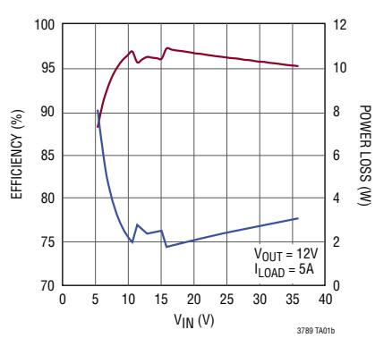  
Efficiency and Power Loss

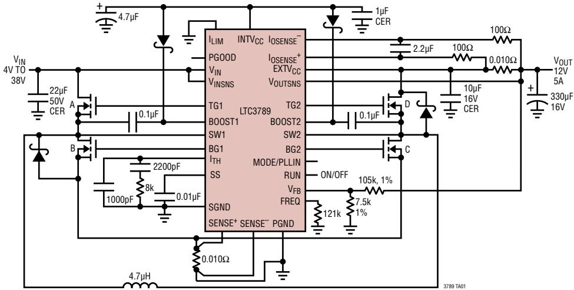

# ABSOLUTE mAXIMUM RATINGS (Note 1)

Input Supply Voltage (VIN). .40V to -0.3V VINSNS,VOUTSNS 40V to -0.3V Topside Driver Voltages TG1,TG2,BG1,BG2 Voltages . (Note 6) (BOOST1, BOOST2). 46V to -0.3V ITH, FREQ,ILIM Voltages INTVcc to $- 0 . 3 V$ Switch Voltage (SW1, SW2). .40V to -5V VFB Voltage . 2.7V to -0.3V Current Sense Voltages (losENSE+, loSENSE)..4OVto-0.3V RUN, PGOOD Voltage .6V to-0.3V BOOST1, BOOST2-SW1,SW2. .6V to -0.3V Operating Junction Temperature Range TG1, TG2 - SW1, SW2. 6V to -0.3V (Notes 2,3).. $- 4 0 \%$ to $1 2 5 \%$ EXTVcc Voltage. 14V to -0.3V Storage Temperature Range $- 6 5 \textdegree$ to $1 2 5 \%$ INTVcc Voltage. .6V to -0.3V INTVcc Peak Output Current. .100mA SENSE+, SENSE-Voltages. .INTVcc to -0.3V Lead Temperature (Soldering,10 sec.) MODE/PLLIN, SS Voltages .. .INTVcc to -0.3V GN Package... $3 0 0 ^ { \circ } \complement$

# PIN CONFIGURATION

# ORDER INFORMATION

<table><tr><td rowspan=1 colspan=1>LEAD FREE FINISH</td><td rowspan=1 colspan=1>TAPE AND REEL</td><td rowspan=1 colspan=1>PART MARKING*</td><td rowspan=1 colspan=1>PACKAGEDESCRIPTION</td><td rowspan=1 colspan=1>TEMPERATURERANGE</td></tr><tr><td rowspan=1 colspan=1>LTC3789EGN#PBF</td><td rowspan=1 colspan=1>LTC3789EGN#TRPBF</td><td rowspan=1 colspan=1>LTC3789</td><td rowspan=1 colspan=1>28-Lead Narrow Plastic SSOP</td><td rowspan=1 colspan=1>-40°C to 125C</td></tr><tr><td rowspan=1 colspan=1>LTC3789IGN#PBF</td><td rowspan=1 colspan=1>LTC3789IGN#TRPBF</td><td rowspan=1 colspan=1>LTC3789</td><td rowspan=1 colspan=1>28-Lead Narrow Plastic SSOP</td><td rowspan=1 colspan=1>-40°C to 125℃</td></tr><tr><td rowspan=1 colspan=1>LTC3789EUFD#PBF</td><td rowspan=1 colspan=1>LTC3789EUFD#TRPBF</td><td rowspan=1 colspan=1>3789</td><td rowspan=1 colspan=1>28-Lead (4mm×5mm) Plastic QFN</td><td rowspan=1 colspan=1>-40°C to 125C</td></tr><tr><td rowspan=1 colspan=1>LTC3789IUFD#PBF</td><td rowspan=1 colspan=1>LTC3789IUFD#TRPBF</td><td rowspan=1 colspan=1>3789</td><td rowspan=1 colspan=1>28-Lead (4mm × 5mm) Plastic QFN</td><td rowspan=1 colspan=1>-40°C to 125°℃</td></tr></table>

CosultCartrsseidereatimeraturemperauregdeitbeo For more information on lead free part marking, go to: http://www.linear.com/leadfree/ For more information on tape and reel specifications,go to: http://www.linear.com/tapeandreel/

ELECTRICAL CHARACTERISTICS The●denotes the specifications which apply over the specified operating junction temperature range,otherwise specifications are at $T _ { A } = 2 5 ^ { \circ } C$ (Note 2). $V _ { \vert \mathsf { N } } = \mathsf { 1 5 V }$ $V _ { B U N } = 5 V$ ,unless otherwise noted.   

<table><tr><td rowspan=1 colspan=1>SYMBOL</td><td rowspan=1 colspan=1>PARAMETER</td><td rowspan=1 colspan=2>CONDITIONS</td><td rowspan=1 colspan=1>MIN  TYP  MAX</td><td rowspan=1 colspan=1>UNITS</td></tr><tr><td rowspan=1 colspan=1>VIN</td><td rowspan=1 colspan=1>Input Supply Voltage</td><td rowspan=1 colspan=1></td><td rowspan=1 colspan=1></td><td rowspan=1 colspan=1>4            38</td><td rowspan=1 colspan=1>V</td></tr><tr><td rowspan=1 colspan=1>VouT</td><td rowspan=1 colspan=1>Output Voltage</td><td rowspan=1 colspan=1></td><td rowspan=1 colspan=1></td><td rowspan=1 colspan=1>0.8            38</td><td rowspan=1 colspan=1>V</td></tr><tr><td rowspan=1 colspan=1>VFB</td><td rowspan=1 colspan=1>RegulatedFeedback Voltage</td><td rowspan=1 colspan=1>ITHVoltage=1.2V(Note4),TA=-40°C to85CH=1.2V，TA=125°CTA=-40°Ct125C</td><td rowspan=1 colspan=1>：</td><td rowspan=1 colspan=1>0.792 0.800 0.8080.7880.800 0.812</td><td rowspan=1 colspan=1>VV</td></tr><tr><td rowspan=1 colspan=1>FB</td><td rowspan=1 colspan=1>Feedback Current</td><td rowspan=1 colspan=1>(Note 4)</td><td rowspan=1 colspan=1></td><td rowspan=1 colspan=1>-15  -50</td><td rowspan=1 colspan=1>nA</td></tr><tr><td rowspan=1 colspan=1>VREFLNREG</td><td rowspan=1 colspan=1>Reference Voltage Line Regulation</td><td rowspan=1 colspan=1>VIN = 4V to 38V (Note 4)</td><td rowspan=1 colspan=1></td><td rowspan=1 colspan=1>0.002 0.02</td><td rowspan=1 colspan=1>%/V</td></tr><tr><td rowspan=1 colspan=1>VLOADREG</td><td rowspan=1 colspan=1>Output Voltage Load Regulation</td><td rowspan=1 colspan=1>(Note 4)Measured in Servo Loop,△lTH Voltage =1.4V to 2VMeasured inServoLoop,△ltHVoltage=2Vto2.5V</td><td rowspan=1 colspan=1>：</td><td rowspan=1 colspan=1>0.01  0.1-0.01 -0.1</td><td rowspan=1 colspan=1>%%</td></tr><tr><td rowspan=1 colspan=1>gm</td><td rowspan=1 colspan=1>Transconductance Amplifier gm</td><td rowspan=1 colspan=1>ITH=1.2V,Sink/Source 5uA(Note 4)</td><td rowspan=1 colspan=1></td><td rowspan=1 colspan=1>1.5</td><td rowspan=1 colspan=1>mmho</td></tr><tr><td rowspan=1 colspan=1>lQ</td><td rowspan=1 colspan=1>Input DC Supply CurrentNormal ModeShutdown</td><td rowspan=1 colspan=1>(Note 5)VRUN = OV</td><td rowspan=1 colspan=1></td><td rowspan=1 colspan=1>340   60</td><td rowspan=1 colspan=1>mA</td></tr><tr><td rowspan=1 colspan=1>UVLO</td><td rowspan=1 colspan=1>Undervoltage Lockout</td><td rowspan=1 colspan=1> INTVcc Ramping Down</td><td rowspan=1 colspan=1></td><td rowspan=1 colspan=1>3.4   3.6</td><td rowspan=1 colspan=1>V</td></tr><tr><td rowspan=1 colspan=1>UVL0 Hyst</td><td rowspan=1 colspan=1>Undervoltage Hysteresis</td><td rowspan=1 colspan=1></td><td rowspan=1 colspan=1></td><td rowspan=1 colspan=1>0.4</td><td rowspan=1 colspan=1>V</td></tr><tr><td rowspan=1 colspan=1>ISENSEISENSE</td><td rowspan=1 colspan=1>SENSE Pins Current</td><td rowspan=1 colspan=1>VSENSE=VSENSE+ = OV</td><td rowspan=1 colspan=1></td><td rowspan=1 colspan=1>0.2   +1</td><td rowspan=1 colspan=1>A</td></tr><tr><td rowspan=1 colspan=1>IOSENSElIOSENSE</td><td rowspan=1 colspan=1>loSENSE Pins Current</td><td rowspan=1 colspan=1>VIOSENSE=VIOSENSE+=10V</td><td rowspan=1 colspan=1></td><td rowspan=1 colspan=1>10   14</td><td rowspan=1 colspan=1>A</td></tr><tr><td rowspan=1 colspan=1>Iss</td><td rowspan=1 colspan=1>Soft-Start Charge Current</td><td rowspan=1 colspan=1>Vss = 0V</td><td rowspan=1 colspan=1></td><td rowspan=1 colspan=1>2     3     4</td><td rowspan=1 colspan=1>A</td></tr><tr><td rowspan=1 colspan=1>VRUN(ON)</td><td rowspan=1 colspan=1>RUN Pin On-Threshold</td><td rowspan=1 colspan=1>VRUN Rising</td><td rowspan=1 colspan=1></td><td rowspan=1 colspan=1>1.22</td><td rowspan=1 colspan=1>V</td></tr><tr><td rowspan=1 colspan=1>VRUN(HYS)</td><td rowspan=1 colspan=1>RUN Pin On-Hysteresis</td><td rowspan=1 colspan=1></td><td rowspan=1 colspan=1></td><td rowspan=1 colspan=1>150</td><td rowspan=1 colspan=1>mV</td></tr><tr><td rowspan=1 colspan=1>IRUN</td><td rowspan=1 colspan=1>RUN Pin Source Current</td><td rowspan=1 colspan=1></td><td rowspan=1 colspan=1></td><td rowspan=1 colspan=1>1.2</td><td rowspan=1 colspan=1>uA</td></tr><tr><td rowspan=1 colspan=1>IRUN(HYS)</td><td rowspan=1 colspan=1>RUN Pin Hysteresis Current</td><td rowspan=1 colspan=1></td><td rowspan=1 colspan=1></td><td rowspan=1 colspan=1>5</td><td rowspan=1 colspan=1>uA</td></tr><tr><td rowspan=1 colspan=1>VSENSE(MAX)</td><td rowspan=1 colspan=1>Maximum Current Sense ThresholdBuck Region, (IValley)Boost Region, (Peak)</td><td rowspan=1 colspan=1>VFB = 0.7VVFB =0.7V</td><td rowspan=1 colspan=1>：</td><td rowspan=1 colspan=1>73   90   107123  140  157</td><td rowspan=1 colspan=1>mVmV</td></tr><tr><td rowspan=1 colspan=1>VSENSE(IAVG)</td><td rowspan=1 colspan=1>Maximum Input/Output AverageCurrent Sense Threshold</td><td rowspan=1 colspan=1>LIM=OVILIM FloatingILIM = INTVcc</td><td rowspan=1 colspan=1></td><td rowspan=1 colspan=1>48   50   52.590   100  106130  145  160</td><td rowspan=1 colspan=1>mVmVmV</td></tr><tr><td rowspan=1 colspan=1>RDSPFET(ON)</td><td rowspan=1 colspan=1>Driver Pull-Up On-Resistance</td><td rowspan=1 colspan=1></td><td rowspan=1 colspan=1></td><td rowspan=1 colspan=1>2.6</td><td rowspan=1 colspan=1>1</td></tr><tr><td rowspan=1 colspan=1>RDSNFET(ON)</td><td rowspan=1 colspan=1>Driver Pull-Down On-Resistance</td><td rowspan=1 colspan=1></td><td rowspan=1 colspan=1></td><td rowspan=1 colspan=1>1.5</td><td rowspan=1 colspan=1>1</td></tr><tr><td rowspan=1 colspan=1>TGtrTGt</td><td rowspan=1 colspan=1>Top Gate Rise TimeTop Gate Fall Time</td><td rowspan=1 colspan=1></td><td rowspan=1 colspan=1></td><td rowspan=1 colspan=1>2525</td><td rowspan=1 colspan=1>nsns</td></tr><tr><td rowspan=1 colspan=1>BGtrBGt</td><td rowspan=1 colspan=1>Bottom Gate Rise TimeBottom Gate Fall Time</td><td rowspan=1 colspan=1></td><td rowspan=1 colspan=1></td><td rowspan=1 colspan=1>2525</td><td rowspan=1 colspan=1>nsns</td></tr><tr><td rowspan=1 colspan=1>TG/BG t1D</td><td rowspan=1 colspan=1>Top Gate Off to Bottom Gate OnDelay Synchronous Switch-OnDelay Time</td><td rowspan=1 colspan=1>CLOAD =3300pFEach Driver(Note6)</td><td rowspan=1 colspan=1></td><td rowspan=1 colspan=1>60</td><td rowspan=1 colspan=1>ns</td></tr><tr><td rowspan=1 colspan=1>BG/TG t1D</td><td rowspan=1 colspan=1>Bottom Gate Off to Top Gate OnDelay Top Switch-On Delay Time</td><td rowspan=1 colspan=1>CLOAD = 3300pF Each Driver (Note 6)</td><td rowspan=1 colspan=1></td><td rowspan=1 colspan=1>60</td><td rowspan=1 colspan=1>ns</td></tr><tr><td rowspan=1 colspan=1>DFMAX.BO0ST</td><td rowspan=1 colspan=1>Maximum Duty Factor</td><td rowspan=1 colspan=1>% Switch C On</td><td rowspan=1 colspan=1></td><td rowspan=1 colspan=1>90</td><td rowspan=1 colspan=1>%</td></tr><tr><td rowspan=1 colspan=1>DON(MIN,BOOST)</td><td rowspan=1 colspan=1>Minimum Duty Factor for MainSwitch in Boost Operation</td><td rowspan=1 colspan=1>% Switch C On</td><td rowspan=1 colspan=1></td><td rowspan=1 colspan=1>9</td><td rowspan=1 colspan=1>%</td></tr><tr><td rowspan=1 colspan=1>DON(MIN,BUCK)</td><td rowspan=1 colspan=1>Minimum Duty Factor forSynchronous Switch in BuckOperation</td><td rowspan=1 colspan=1>% Switch B On</td><td rowspan=1 colspan=1></td><td rowspan=1 colspan=1>9</td><td rowspan=1 colspan=1>%</td></tr></table>

ELECTRICAL CHARACTERISTICSThe · denotes the specifications which apply over the specified operating junction temperature range, otherwise specifications are at $T _ { A } = 2 5 ^ { \circ } C$ (Note 2). $V _ { \vert \mathsf { N } } = 1 5 V$ $V _ { B U N } = 5 V$ ,unless otherwise noted.   

<table><tr><td rowspan=1 colspan=1>SYMBOL</td><td rowspan=1 colspan=1>PARAMETER</td><td rowspan=1 colspan=2>CONDITIONS</td><td rowspan=1 colspan=1>MIN   TYP  MAX</td><td rowspan=1 colspan=1>UNITS</td></tr><tr><td rowspan=1 colspan=6>INTVcc Linear Regulator</td></tr><tr><td rowspan=1 colspan=1>VINTVCCVIN</td><td rowspan=1 colspan=1>Internal Vcc Voltage</td><td rowspan=1 colspan=1>6.5V&lt;VIN&lt;40VVExTvCC= OV</td><td rowspan=1 colspan=1></td><td rowspan=1 colspan=1>5.2   5.5   5.8</td><td rowspan=1 colspan=1>V</td></tr><tr><td rowspan=1 colspan=1>VLDOVIN</td><td rowspan=1 colspan=1>INTVcc Load Regulation</td><td rowspan=1 colspan=1>Icc =OmA to20mA,VExTvCC= OV</td><td rowspan=1 colspan=1></td><td rowspan=1 colspan=1>0.2   1.0</td><td rowspan=1 colspan=1>%</td></tr><tr><td rowspan=1 colspan=1>VINTVCCEXT</td><td rowspan=1 colspan=1>Internal Vcc Voltage</td><td rowspan=1 colspan=1>6.5V &lt;VEXTVCC &lt;14V</td><td rowspan=1 colspan=1></td><td rowspan=1 colspan=1>5.2   5.5   5.8</td><td rowspan=1 colspan=1>V</td></tr><tr><td rowspan=1 colspan=1>VLDOEXT</td><td rowspan=1 colspan=1>INTVcc Load Regulation</td><td rowspan=1 colspan=1>Icc =0mA toAcc=12V</td><td rowspan=1 colspan=1></td><td rowspan=1 colspan=1>0.2   1.0</td><td rowspan=1 colspan=1>%</td></tr><tr><td rowspan=1 colspan=1>VExTvCC</td><td rowspan=1 colspan=1>EXTVcc Switchover Voltage</td><td rowspan=1 colspan=1>Icc = 0mA to 20mA,EXTVcc Ramping Positive</td><td rowspan=1 colspan=1></td><td rowspan=1 colspan=1>4.7   4.8</td><td rowspan=1 colspan=1>V</td></tr><tr><td rowspan=1 colspan=1>VLDOHYS</td><td rowspan=1 colspan=1>EXTVcc Hysteresis</td><td rowspan=1 colspan=1></td><td rowspan=1 colspan=1></td><td rowspan=1 colspan=1>0.25</td><td rowspan=1 colspan=1>V</td></tr></table>

# Oscillator and Phase-Locked Loop

<table><tr><td></td><td>Nominal Frequency</td><td>VFREQ = 1.2V</td><td></td><td>350</td><td>400</td><td>440</td><td></td></tr><tr><td>fNOM</td><td></td><td></td><td></td><td></td><td></td><td></td><td>KHz</td></tr><tr><td>fLow</td><td>Low Fixed Frequency</td><td>VFREQ = OV</td><td></td><td>175</td><td>200</td><td>225</td><td>KHz</td></tr><tr><td>fHIGH</td><td>High Fixed Frequency</td><td>VFREQ = 2.4V</td><td></td><td>570</td><td>640</td><td>710</td><td>KHz</td></tr><tr><td>fsYNC</td><td>Synchronizable Frequency</td><td>MODE/PLLIN = External Clock</td><td>·</td><td>200</td><td></td><td>600</td><td>KHz</td></tr><tr><td>RMODE/PLLIN</td><td>MODE/PLLIN Input Resistance</td><td></td><td></td><td></td><td>220</td><td></td><td>k</td></tr><tr><td>IFREQ</td><td>Frequency Setting Current</td><td></td><td></td><td>8</td><td>10</td><td>12</td><td>UA</td></tr></table>

# PGOOD Output

Note 1: Stresses beyond those listed under Absolute Maximum Ratings may cause permanent damage to the device.Exposure to any Absolute Maximum Rating condition for extended periods may afect device reliabilityand lifetime.   

<table><tr><td rowspan=1 colspan=1>VPGL</td><td rowspan=1 colspan=1>PGOOD Voltage Low</td><td rowspan=1 colspan=1>IPGOOD = 2mA</td><td rowspan=1 colspan=1></td><td rowspan=1 colspan=1>0.1    0.3</td><td rowspan=1 colspan=1>V</td></tr><tr><td rowspan=1 colspan=1>IPGOOD</td><td rowspan=1 colspan=1>PGOOD Leakage Current</td><td rowspan=1 colspan=1>VPGOOD =5V</td><td rowspan=1 colspan=1></td><td rowspan=1 colspan=1>±1</td><td rowspan=1 colspan=1>UA</td></tr><tr><td rowspan=1 colspan=1>VPG</td><td rowspan=1 colspan=1>PGOOD Trip Level</td><td rowspan=1 colspan=1>VFB with Respect to Set Output VoltageVFB Ramping NegativeVFB Ramping Positive</td><td rowspan=1 colspan=1></td><td rowspan=1 colspan=1>-1010</td><td rowspan=1 colspan=1>%%</td></tr></table>

Note $3 : \top _ { \mathrm { J } }$ is calculated from the ambient temperature $\intercal _ { \mathsf { A } }$ and power dissipation $\mathsf { P } _ { \mathsf { D } }$ according to the following formula: LTC3789GN: $\mathsf { T } _ { \mathsf { J } } = \mathsf { T } _ { \mathsf { A } } + ( \mathsf { P } _ { \mathsf { D } } \bullet 8 0 ^ { \circ } \mathsf { C } N )$ LTC3789UFD: $\mathsf { T } _ { \mathsf { J } } = \mathsf { T } _ { \mathsf { A } } + ( \mathsf { P } _ { \mathsf { D } } \bullet 3 4 ^ { \circ } \mathsf { C } / \mathsf { W } )$

Note 2:The LTC3789 is tested under pulse load conditions such that $\mathsf { T } _ { \mathsf { J } } \approx \mathsf { T } _ { \mathsf { A } }$ .The LTC3789E is guaranteed to meet performance specifications from $0 \%$ to $\mathtt { 8 5 ^ { \circ } C }$ operating junction temperature.Specifications over the $- 4 0 ^ { \circ } \complement$ to $1 2 5 ^ { \circ } 0$ operating junction temperature range are assured by design, characterization and correlation with statistical process controls. The LTC3789l is guaranteed to meet performance specifications over the full $- 4 0 ^ { \circ } \complement$ t0 $1 2 5 ^ { \circ } 0$ operating junction temperature range.

Note 4:The LTC3789 is tested in afeedback loop that servos $\mathsf { V } _ { \mathsf { I T H } }$ to a specified voltage and measures the resultant $V _ { F B }$

Note 5: Dynamic supply current is higher due to the gate charge being delivered at the switching frequency.See the Applications Information section.

Note 6: Do not apply a voltage or current to these pins.They must be connected to capacitive loads only,otherwise permanent damage may occur.

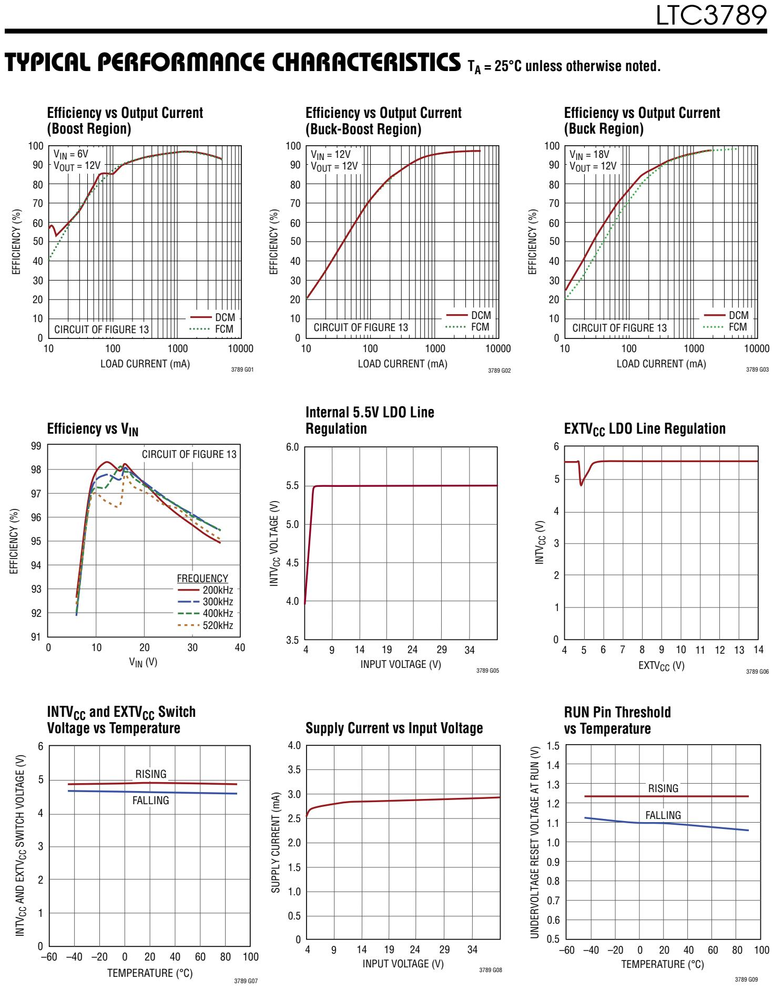

# TYPICAL PERFORMANCE CHARACTERISTICS $T _ { A } = 2 5 ^ { \circ } C$ uness therwise noted.

  
Forced Continuous Mode

  
Forced Continuous Mode

  
Forced Continuous Mode

  
Pulse-Skipping Mode

  
Pulse-Skipping Mode

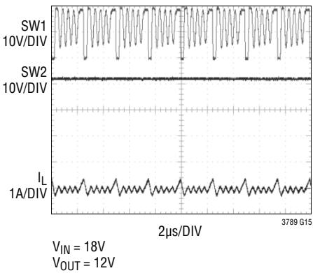  
Pulse-Skipping Mode

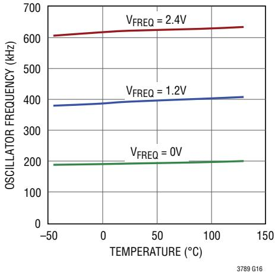  
Oscillator Frequency vs Temperature

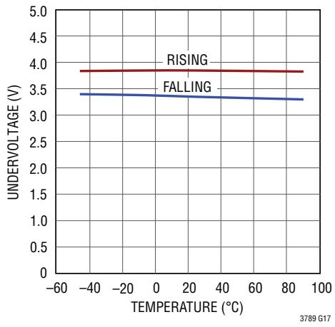  
Undervoltage Threshold at ${ \| { \mathsf { N I V } } _ { \complement } } _ { \complement }$ vs Temperature

  
Undervoltage Threshold at $\mathsf { V } _ { \mathsf { I N } }$ vs Temperature

# TYPICAL PERFORMANCE CHARACTERISTICS $T _ { A } = 2 5 ^ { \circ } C$ uness therwise noted.

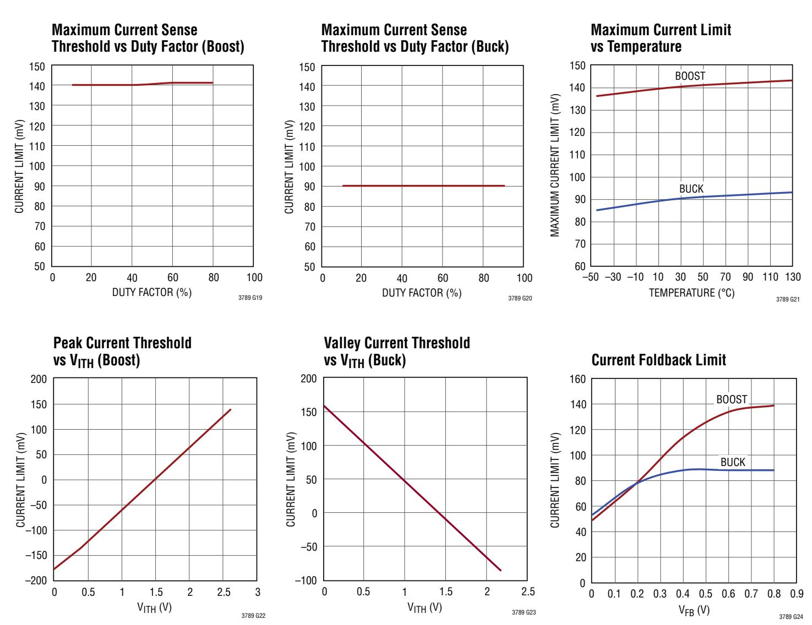

# TYPICAL PERFORMANCE CHARACTERISTICS $T _ { A } = 2 5 ^ { \circ } C$ uness therwise noted.

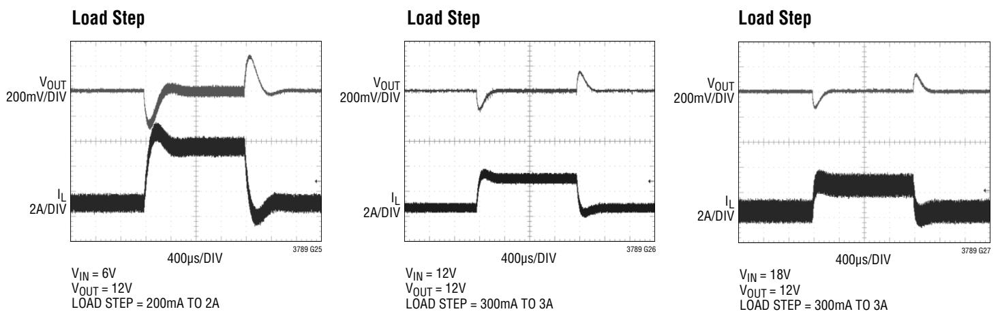

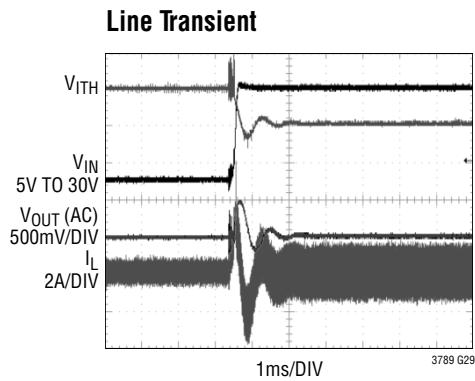

# PIN FUNCTIONS (SSOP/QFN)

$V _ { F B }$ (Pin1/Pin26): Error Amplifier Feedback Pin. Receives the feedback voltage for the controller from an external resistive divider across the output.

SS (Pin 2/Pin 27): External Soft-Start Input.The LTC3789 regulates the VFb voltage to the smaller of $0 . 8 \mathsf { V }$ or the voltage on the SS pin. A internal $3 \mu \ A$ pull-up current source is connected to this pin. A capacitor to ground at this pin sets the ramp time to final regulated output voltage.

$\pmb { \ S } \pmb { \mathrm { K } } \pmb { \mathrm { M } } \pmb { \ S } \pmb { \mathrm { F } } ^ { + }$ (Pin 3/Pin 28): The $\left( + \right)$ Input to the Current Sense Comparator. The $\mathsf { I } _ { \mathsf { T } \mathsf { H } }$ pin voltage and controlled offsets between the SENSE- and ${ \tt S E N S E } ^ { + }$ pins,in conjunction with RsENSE,set the current trip threshold.

SENSE- (Pin 4/Pin 1): The $\left( - \right)$ Input to the Current Sense Comparator.

ITH (Pin 5/Pin 2): Error Amplifier Output and Switching Regulator Compensation Point. The channel's current comparator trip point increases with this control voltage.

SGND (Pin 6/Pins 3， Exposed Pad Pin 29): Small Signal Ground. Must be routed separately from high current grounds to the common $\left( - \right)$ terminals of the $\complement _ { \mathsf { I N } }$ capacitors.In the QFN package, the exposed pad is SGND.It must be soldered to PCB ground for rated thermal performance.

MODE/PLLIN (Pin 7/Pin 4): Mode Selection or External Synchronization Input to Phase Detector.This is a dualpurpose pin.When external frequency synchronization is not used,this pin selects the operating mode.The pin can be tied to SGND or INTVcc. SGND or below $0 . 8 \mathsf { V }$ enables forced continuous mode. INTVcc enables pulse-skipping mode.For external sync,apply a clock signal to this pin. The internal PLL willsynchronize the internal oscillator to the clock，and forced continuous mode willbe enabled.The PLL composition network is integrated into the IC.

FREQ(Pin 8/Pin5): Frequency SetPin.There is aprecision $1 0 \mu \ A$ current flowing out of this pin. A resistor to ground sets a voltage which, in turn， programs the frequency. Alternatively,this pin can be driven with a DC voltage to vary the frequency of the internal oscillator.

RUN (Pin 9/Pin 6): Run Control Input. Forcing the pin below $0 . 5 \mathsf { V }$ shuts down the controller, reducing quiescent current. There are $1 . 2 \mu \ A$ pull-up currents for this pin. Once the RUN pin rises above 1.22V,the IC is turned on，and an additional 5uA pull-up current is added to the pin.

VINSNs (Pin 10/Pin 7): $\mathsf { V } _ { \mathsf { I N } }$ Sense Input to the Buck-Boost Transition Comparator.Connect this pin to the drain of the top N-channel MOSFET on the input side.

VoUTSNs (Pin 11/Pin 8): VouT Sense Input to the BuckBoost Transition Comparator.Connectthis pinto the VouT.

ILIM (Pin 12/Pin 9): Input/Output Average Current Sense Range Input. This pin tied to SGND,INTVcc or left floating， sets the maximum average current sense threshold.

lOSENSE+(Pin 13/Pin10): The $\left( + \right)$ Inputto the Input/Output Average Current Sense Amplifier.

loSENSE-(Pin14/Pin11): The $\left( - \right)$ Inputto the Input/Output Average Current Sense Amplifier.

TRIM (Pin 15/Pin 12): Tie this pin to GND for normal operation. Do not allow this pin to float.

$\mathtt { E X N } _ { \mathtt { C C } }$ (Pin 20/Pin 17): External Power Input to an Internal LDO Connected to ${ \| \mathsf { N P } _ { \complement } } _ { }$ .This LDO supplies INTVcc power,bypassing the internal LDO powered from $\mathsf { V } _ { \mathsf { I N } }$ whenever $\mathsf { E X N } _ { \mathsf { C C } }$ is higher than $4 . 8 \mathsf { V } .$ See EXTVccC Connection in the Applications Information section. Do not exceed 14V on this pin.

# PIN FUNCTIONS (SOP/QFN)

INTVcc (Pin 21/Pin 18): Output of the Internal Linear Low Dropout Regulator. The driver and control circuits are powered from this voltage source. Must be bypassed to power ground with aminimum of4.7uF tantalum,ceramic, or other low ESR capacitor.

$\mathsf { V } _ { \mathsf { I N } }$ (Pin 22/Pin 19): Main Supply Pin.A bypass capacitor should be tied between this pin and the power ground pin.

BG1，BG2 (Pins 23，19/Pins 20,16): High Current Gate Drives for Bottom (Synchronous） N-Channel MOSFETs.Voltage swing at these pins is from ground to INTVcc

PGND (Pin 24/Pin 21): Driver Power Ground. Connects to CouT and RsENSE(-)terminal(s) of $\complement _ { \mathsf { I N } }$

BOOST1,BO0ST2(Pins25,18/Pins22,15):Bootstrapped Supplies to the Top Side Floating Drivers.Capacitors are connected between the BOOST and SW pins and Schottky diodes are tied between the BOOST and ${ \sf N N } _ { \sf C C }$ pins. Voltage swing at the BOOST1 pin is from INTVcc to $( \mathsf { V } _ { | \mathsf { N } } + \mathsf { I N } \mathsf { T } \mathsf { V } _ { \mathsf { C C } } )$ . Voltage swing at the BOOST2 pin is from ${ \| \mathsf { N T V } _ { \complement } } _ { }$ to $( \mathsf { V } _ { 0 } \mathsf { U } \mathsf { T } + \mathsf { I N } \mathsf { T } \mathsf { V } _ { \mathsf { C } } \mathsf { c } )$

TG1，TG2 (Pins 26,17/Pins 23,14): High Current Gate Drives for Top $\mathbb { N }$ -Channel MOSFETs.These are the outputs of floating drivers with a voltage swing equal to $\| \mathsf { N T V } _ { \complement } - 0 . 5 \mathsf { V }$ superimposed on the switch node voltage SW.

SW1,SW2 (Pins 27, 16/Pins 24, 13): Switch Node Connections to Inductors. Voltage swing at the SW1 pin is from a Schottky diode (external) voltage drop below ground to $\mathsf { V } _ { \mathsf { I N } }$ . Voltage swing at the SW2 pin is from a Schottky diode voltage drop below ground to VOUT·

PGOOD (Pin 28/Pin 25): Open-Drain Logic Output. PGOOD is pulled to ground when the voltage on the VFB pin is not within $\pm 1 0 \%$ of its regulation window,after the internal 2Ous power-bad mask timer expires.

# BLOCK DIAGRAM

# OPERATION

# MAIN CONTROL LOOP

The LTC3789 is a current mode controller that provides an output voltage above,equal to or below the input voltage.The LTC proprietary topology and control architecture employs a current-sensing resistor.The inductor current is controlled by the voltage on the $\mathsf { I } _ { \mathsf { T } \mathsf { H } }$ pin, which is the output of the error amplifier EA. The $V _ { F B }$ pin receives the voltage feedback signal,which is compared to the internal reference voltage by the EA.If the input/output current regulation loop is implemented,the sensed inductor current is controlled by either the sensed feedback voltage or the input/output current.

# $1 \mathsf { N T V } _ { \mathsf { C C } } / \mathsf { E X T V } _ { \mathsf { C C } }$ Power

Power for the top and bottom MOSFET drivers and most other internal circuitry is derived from the ${ \| \mathsf { N N } _ { \complement } } _ { \complement }$ pin. When the $\mathsf { E X N } _ { \mathsf { C C } }$ is left open or tied to a voltage less than $4 . 5 \mathsf { V }$ , an internal $5 . 5 \mathsf { V }$ low dropout (LDO) regulator Supplies INTVcc power from $\mathsf { V } _ { \mathsf { I N } }$ If EXTVccis taken above $4 . 8 V _ { \mathrm { { i } } }$ the $5 . 5 \mathsf { V }$ regulator is turned off,and another LDO regulates ${ \| \mathsf { N T V } _ { \complement } } _ { }$ from $\mathsf { E X N } _ { \mathsf { C C } }$ The $\mathsf { E X N } _ { \mathsf { C C } }$ LDO allows the ${ \| \mathsf { N T V } _ { \complement } } _ { }$ power to be derived from a high eficiency external source such as the LTC3789 regulator output to reduce IC power dissipation. The absolute maximum voltage on $\mathsf { E X N } _ { \mathsf { C C } }$ is $1 4 \lor .$

# Internal Charge Pump

Each top MOSFET driver is biased from the floating bootstrap capacitors $\complement _ { \mathsf { A } }$ and $\complement _ { \mathsf { B } }$ ,which are normally recharged by ${ \| \mathsf { N P } _ { \complement } } _ { }$ through an external diode when the top MOSFET is turned off.When the LTC3789 operates exclusively in the buck or boost regions,one of the top MOSFETs is constantly on.An internal charge pump recharges the bootstrap capacitor to compensate for the smalleakage current through the bootstrap diode so that the MOSFET can be kept on. However, if a high leakage diode is used such thattheinternalcharge pump cannot providesufficient charges to the external bootstrap capacitor,an internal UVLO comparator, which constantly monitors the drop across the capacitor, willsense the (BOOST-SW) voltage when it is below $3 . 6 \mathbb { V } .$ It will turn off the top MOSFET for about one-twelfth of the clock period every four cycles to allow $\complement _ { A } 0 \ u { \Gamma } \complement _ { \mathsf { B } }$ to recharge.

# Shutdown and Start-Up

The controller can be shut down by pulling the RUN pin low.When the RUN pin voltage is below $0 . 5 \mathsf { V }$ the LTC3789 goes into low quiescent current mode. Releasing RUN allows an internal $1 . 2 \mu \ A$ current to pull up the pin and enable the controller.When RUN is above the accurate threshold of $1 . 2 2 \vee$ ,the internal LDO will power up the INTVcc. At the same time,a 6uA pull-up current will kick in to provide more RUN pin hysteresis.The RUN pin may be externally pulled up or driven directly by logic. Be careful not to exceed the absolute maximum rating of 6V on this pin.

The start-up of the controller's output voltage VouT is controlled by the voltage on the SS pin.When the voltage on the SS pin is less than the $0 . 8 \mathsf { V }$ internal reference,the LTC3789 regulates the VFB voltage to the SS voltage instead of the $0 . 8 \mathsf { V }$ reference.This allows the SS pin to be used to program soft-start by connecting an external capacitor from the SS pin to SGND.An internal 3uA pull-up current charges this capacitor, creating avoltage ramp on the SS pin. As the SS voltage rises linearly from OV to $0 . 8 \mathsf { V }$ (and beyond),the output voltage Vour rises smoothly from zero to its final value. Alternatively,the SS pin can be used to cause the start-up of Vout to track that of another supply. When RUN is pulled low to disable the controller,or when ${ \| \mathsf { N T V } _ { \complement } } _ { }$ is below the undervoltage lockout threshold of 3.4V,the SS pin is pulled low by an internal MOSFET. In undervoltage lockout, the controller is disabled and the external MOSFETs are held off.

# OPERATION

# POWER SWITCH CONTROL

Figure 1 shows a simplified diagram of how the four power switches are connected to the inductor, $\mathsf { V } _ { \mathsf { I N } } , \mathsf { V } _ { 0 \mathsf { U T } }$ and GND.Figure 2 shows the regions of operation for the LTC3789 as a function of duty cycle,D.The power switches are properly controlled so the transfer between regions is continuous.

# Buck Region $( \mathsf { V } _ { | \mathsf { N } } > > \mathsf { V } _ { 0 \mathsf { U T } } )$

Switch D is always on and switch C is always off in this region.At the start of every cycle,synchronous switch B is turned on first. Inductor current is sensed when synchronous switch B is turned on.After the sensed inductor valley current falls below a reference voltage, which is proportional to $\mathsf { V } _ { \sf I T H } .$ ，synchronous switch B is turned off and switch A is turned on for the remainder of the cycle. Switches A and B will alternate,behaving like a typical synchronous buck regulator. The duty cycle of switch A increases until the maximum duty cycle of the Converter reaches DMAX_BUCK, given by:

$$
D _ { \sf M A X \_ B U G K } = \left( 1 - \frac { 1 } { 1 2 } \right) \bullet 1 0 0 \% = 9 1 . 6 7 \%
$$

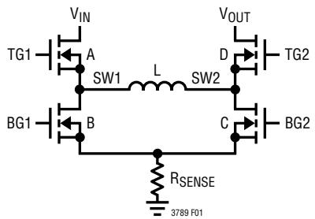  
Figure 1. Simplified Diagram of the Output Switches

  
Figure 2.Operating Region vs Duty Cycle

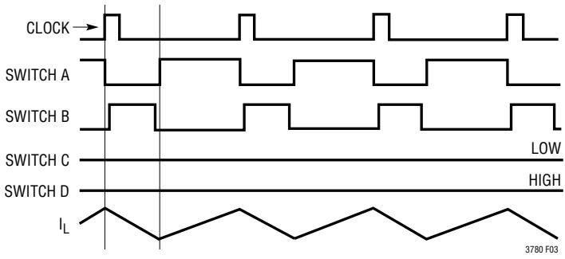  
Figure 3 shows typical buck region waveforms. If $\mathsf { V } _ { \mathsf { I N } }$ approaches $\mathsf { V } _ { 0 \mathsf { U } } ,$ the buck-boost region is reached.   
Figure 3. Buck Region $( \mathsf { V } _ { \mathsf { I N } } > > \mathsf { V _ { O U T } } )$

# Buck-Boost Region $( \mathsf { V } _ { | \mathsf { N } } \approx \mathsf { V } _ { 0 \mathsf { U T } } )$

When $\mathsf { V } _ { \mathsf { I N } }$ is close to $\mathsf { V } _ { 0 \mathsf { U } \mathsf { T } }$ ,the controller enters buckboost region. Figure 4 shows the typical waveforms in this region.At the beginning of a clock cycle,if the controller starts with B and D on,the controller first operates as a buck region.When lcMp trips,switch B is turned off,and switch A is turned on. At $1 2 0 ^ { \circ }$ clock phase, switch C is turned on.The LTC3789 starts to operate as a boost until IcMP trips.Then, switch D is turned on for the remainder of the clock period.If the controller starts with switches A and C on, the controller first operates as a boost, until IcMP trips and switch D is turned on. At $1 2 0 ^ { \circ } ,$ switch B is turned on,making it operate as a buck.Then,lcMp trips, turning switch B off and switch A on for the remainder of the clock period.

# Boost Region $( \mathsf { V } _ { \mathsf { I N } } < < \mathsf { V } _ { \mathsf { O U T } } )$

Switch A is always on and synchronous switch Bis always off in the boost region.In every cycle,switch C is turned on first. Inductor current is sensed when synchronous switch C is turned on.After the sensed inductor peak current exceeds what the reference voltage demands, which is proportional to $\mathsf { V } _ { \sf I T H }$ ,switch C is turned off and synchronous switch D is turned on for the remainder of the cycle. Switches C and D willalternate,behaving like a typical synchronous boost regulator.

# OPERATION

The duty cycle of switch C decreases until the minimum duty cycle ofthe converter reaches DMIN_BOosT,given by:

$$
\mathsf { D } _ { \mathsf { M I N \_ B O 0 S 7 } } = \left( \frac { 1 } { 1 2 } \right) \bullet 1 0 0 \% = 8 . 3 3 \%
$$

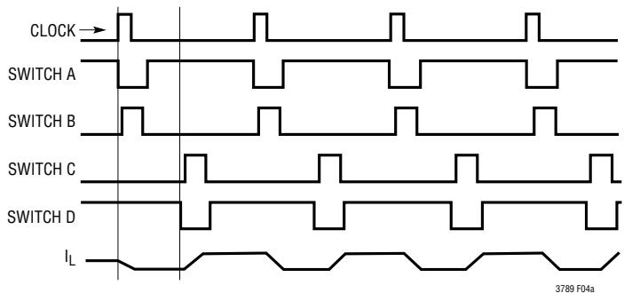  
Figure 5 shows typical boost region waveforms. If $\mathsf { V } _ { \mathsf { I N } }$ approaches $\mathsf { V } _ { 0 \mathsf { U } \mathsf { T } }$ ,the buck-boost region is reached.

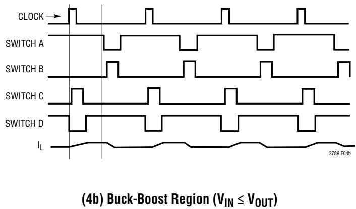  
(4a) Buck-Boost Region $( \mathsf { V } _ { \mathsf { I N } } \geq \mathsf { V } _ { \mathsf { O U T } } )$   
Figure 4. Buck-Boost Region

# Light Load Current Operation

The LTC3789 can be enabledto enter pulse-skipping mode or forced continuous conduction mode.To select forced continuous operation, tie the MODE/PLLIN pin to a DC voltage below $0 . 8 \mathsf { V }$ (e.g.,SGND).To selectpulse-skipping mode of operation,tie the MODE/PLLIN pin to INTVcc.

When the LTC3789 enters pulse-skipping mode, in the boost region, synchronous switch D is held off whenever reverse current through switch A is detected.At very light loads,the current comparator，lcMp，may remain tripped for several cycles and force switch C to stay off for the same number of cycles (i.e., skipping pulses). In the buck region,the inductor current is not allowed to reverse.Synchronous switch B is held off whenever reverse current on the inductor is detected.At very light loads, the current comparator,lcMp，may remain untripped for several cycles, holding switch A off for the same number of cycles. Synchronous switch B also remains off for the skipped cycles.In the buck-boost region,the controller operates alternatively in boost and buck region in one clock cycle, as in continuous operation. A small amount of reverse current is allowed,to minimize ripple.For the same reason,a narrow band of continuous buck and boost operation is allowed on the high and low line ends of the buck-boost region.

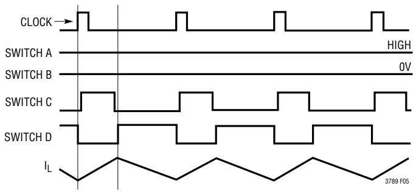  
Figure 5. Boost Region $( \mathsf { V } _ { \mathsf { I N } } < < \mathsf { V } _ { 0 \mathsf { U T } } )$

# Output Overvoltage

If the output voltage is higher than the value commanded by the VFB resistor divider, the LTC3789 will respond according to the mode and region of operation.In continuous conduction mode, the LTC3789 will sink current into the input. If the input supply is capable of sinking current, the LTC3789 will allow up to about 160mV/RsENsE to be sunk into the input.In pulse-skipping mode and in the buck or boost regions, switching will stop and the output will be allowed to remain high.In pulse-skipping mode,and in the buck/boost region as well as the narrow band of continuous boost operation that adjoins it, current sunk into the input through switch A is limited to approximately 40mV/ RDS(ON) ofswitchA.If this level is reached,switching will stop and the output will rise. In pulse-skipping mode,and in the narrow continuous buck region thatadjoins the buck/ boost region, current sunk into the input through RsENSE is limited to approximately 40mV/RsENSE

# OPERATION

# Constant-Current Regulation

The LTC3789 provides a constant-current regulation loop for either input or output current. A sensing resistor close to the input or output capacitor will sense the input or outputcurrent.When the current exceeds the programmed current limit,the voltage on the $\mathsf { I } _ { \mathsf { T } \mathsf { H } }$ pin will be pulled down to maintain the desired maximum input or output current. The input current limit function prevents overloading the DC input source, while the output current limit provides a building block for battery charger or LED driver applications. It can also serve as an extra current limit protection for a constant-voltage regulation application.The input/ outputcurrentlimitfunction hasan operating voltage range of GND to the absolute maximum ${ \mathsf { V } } _ { 0 \mathsf { U T } } \left( { \mathsf { V } } _ { \mathsf { I N } } \right)$

# Frequency Selection and Phase-Locked Loop (FREQ and MODE/PLLIN Pins)

The selection of switching frequencyis atrade-off between efficiency and component size.Low frequency operation increases efficiency by reducing MOSFET switching losses,but requires larger inductance and/or capacitance to maintain low output ripple voltage.The switching frequency of the LTC3789's controllers can be selected using the FREQ pin.If the MODE/PLLIN pin is not being driven by an external clock source,the FREQ pin can be used to program the controller's operating frequency from 200kHz to 600kHz.

Switching frequency is determined by the voltage on the FREQ pin. Since there is a precision $1 0 \mu \ A$ current flowing out of the FREQ pin,the user can program the controller's switching frequency with a single resistor to SGND.A curve is provided in the Applications Information section to show the relationship between the voltage on the FREQ pin and the switching frequency.

A phase-locked loop (PLL) is integrated on the LTC3789 to synchronize the internal oscillator to an external clock Source driving the MODE/PLLIN pin. The controller operates in forced continuous mode when it is synchronized. The PLL filter network is integrated inside the LTC3789.

The PLL is capable of locking to any frequency within the range of 2OokHz to 60okHz. The frequency setting resistor should always be present to set the controller's initial switching frequency before locking to the external clock.

# Power Good (PGOOD) Pins

The PGOOD pin is connected to the open drain ofan internal N-channel MOSFET.When $V _ { F B }$ is not within $\pm 1 0 \%$ of the $0 . 8 \mathsf { V }$ reference voltage,the PGOOD pin is pulled low.The PGOOD pin is also pulled low when RUN is below $1 . 2 2 \lor$ or when the LTC3789 is in the soft-start phase.There is an internal 2Ous power good or bad mask when $\mathsf { V } _ { \mathsf { F B } } \mathsf { g o e s }$ in or out of the $\pm 1 0 \%$ window. The PGOOD pin is allowed to be pulled up by an external resistor to INTVcc or an external source of up to $6 \vee$

# Short-Circuit Protection, Current Limit and Current Limit Foldback

The maximum currentthreshold ofthe controlleris limited by a voltage clamp on the $\mathsf { I } _ { \mathsf { T } \mathsf { H } } \mathsf { p i n }$ .In every boost cycle, the sensed maximum peak voltage is limited to $1 4 0 \mathsf { m V }$ In every buck cycle,the sensed maximum valley voltage is limited to $9 0 { \mathsf { m } } \mathsf { V } .$ .In the buck-boost region,only peak sensed voltage is limited by the same threshold as in the boost region.

The LTC3789 includes current foldback to help limit load current when the output is shorted to ground. If the output falls below $50 \%$ of its nominal output level, then the maximum sense voltage is progressively lowered from its maximum value to one-third of the maximum value. Foldback current limiting is disabled during the soft-start. Under short-circuit conditions, the LTC3789 willimit the current by operating as a buck with very low duty cycles, and by skipping cycles. In this situation， synchronous switch B wili dissipate most of the power (but less than in normal operation).

# APPLICATIONS INFORMATION

The Typical Application on the first page is a basic LTC3789 application circuit. External component selection is driven by the load requirement,and begins with the selection of RsENSE and the inductor value.Next, the power MOSFETs are selected.Finally, $\complement _ { \mathsf { I N } }$ and $\complement _ { 0 \updownarrow \tau }$ are selected.This circuit can be configured for operation up to an input voltage of $3 8 \mathsfit { V }$

# RsENSE Selection and Maximum Output Current

RSENSE is chosen based on the required output current. The current comparator threshold sets the peak of the inductor current in the boost region and the maximum inductor valley current in the buck region.In the boost region,the maximum average load current at $\mathsf { V } _ { \mathsf { I N ( M I N ) } }$ is:

$$
{ \sf I } _ { 0 0 \sf T ( \sf M A X , B 0 0 S \sf 7 ) } = \left( \frac { 1 4 0 \sf m V } { { \sf R } _ { \sf S E N S E } } - \frac { \Delta { \sf I } _ { \sf L } } { 2 } \right) \bullet \frac { { \sf V } _ { \sf I N ( \sf M I N ) } } { { \sf V } _ { 0 0 \sf I 7 } }
$$

where $\Delta \mathfrak { l }$ is peak-to-peak inductor ripple current. In the buck region, the maximum average load current is:

$$
| \mathsf { \Gamma } _ { 0 \mathsf { U T } ( \mathsf { M A X } , \mathsf { B U C K } ) } = \frac { 9 0 \mathsf { m V } } { \mathsf { R } _ { \mathsf { S E N S E } } } + \frac { \Delta \mathsf { l } _ { \mathsf { L } } } { 2 }
$$

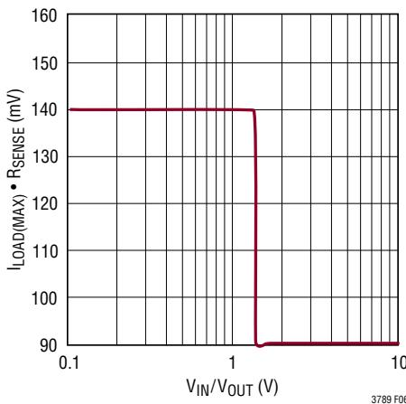  
Figure 6 shoWs hoW ILOAD(MAX)·RSENSE Varies with input and output voltage.   
Figure 6. Load Current vs $\nu _ { \sf I N } / \nu _ { \sf 0 U T }$

The maximum current sensing RsENSE Value for the boost region is:

$$
\frac { 2 \bullet 1 4 0 \mathsf { m V } \bullet \mathsf { V } _ { \mathsf { I N } ( \mathsf { M I N } ) } } { 2 \bullet | _ { 0 \mathsf { U T } ( \mathsf { M A X } , \mathsf { B O O S T } ) } \bullet \mathsf { V } _ { 0 \mathsf { U T } } + \Delta | _ { \mathsf { L } , \mathsf { B O O S T } } \bullet \mathsf { V } _ { \mathsf { I N } ( \mathsf { M I N } ) } }
$$

The maximum current sensing RsENsE value for the buck region is:

$$
R _ { \mathbb { S } \in \mathbb { N S E } ( \mathbb { M A X } ) } = \frac { 2 \bullet 9 0 \mathsf { m V } } { 2 \bullet | _ { 0 \sqcup \mathsf { T } ( \mathbb { M A X } , \mathbb { B } \cup \mathbb { C } \mathsf { K } ) } - \Delta | _ { \mathsf { L } , \mathbb { B } \cup \mathbb { C } \mathsf { K } } }
$$

Thefinal RsENsE Value should be lower than the calculated RsENSE(MAX) in both the boost and buck regions. A $20 \%$ to $30 \%$ margin is usually recommended.

# Programming Input/Output Current Limit

As shown in Figures 7 and 8, input/output current sense resistor RsENSE2 should be placed between the bulk capacitor for $\mathsf { V } _ { \mathsf { I N } } / \mathsf { V } _ { 0 \mathsf { U T } }$ and the decoupling capacitor. A lowpass filter formed by $\mathsf { R } _ { \mathsf { F } }$ and $\complement _ { \ F }$ is recommended to reduce the switching noise and stabilize the current loop.The input/ output currentlimit is set by the lLim pin for 50mV,100mV or 140mV with $\mathsf { I } _ { \mathsf { L } } | \mathsf { M } | ^ { \mathsf { p } }$ ulled to the GND,floating,or tied to ${ \| \mathsf { N P } _ { \mathsf { C C } } }$ ，respectively.If input/output current limit is not desired,the losENse+and losENSE pins should be shorted to either ${ \mathsf { V } } _ { 0 \mathsf { U T } } \circ { \mathsf { r } } \ V _ { | \mathsf { N } }$

  
Figure 7. Programming Output Current Limit

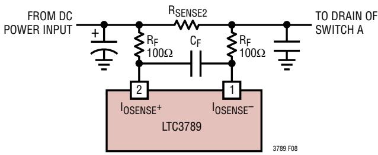  
Figure 8.Programming Input Current Limit

# APPLICATIONS INFORMATION

With the typical 10OΩ resistors shown here,the value of capacitor $\complement _ { \ F }$ should be 1uF to 2.2uF. The current loop's transfer function should approximate that of the voltage loop. Crossoverfrequency should be one-tenth the switching frequency,and gain should decrease by 2OdB/decade. Similar current and voltage loop transfer functions will ensure overall system stability.

When the losENSE Common mode voltage is above ${ \sim } 3 . 2 \lor$ thelosENSE-pin sources 1OuA.The losENSE+ pin, however, sources $1 8 . 3 \mu \ A$ $2 6 . 6 \mu \mathsf { A }$ and $3 5 \mu \ A$ when the lLIM pin is low,floating,and high,respectively,and when a constant current is being regulated.The error introduced by this mismatch can be offset to a first order by scaling the loSENSE+ and losENsE-resistors accordingly.For example, if the losENsE+ branch has a 10OΩ resistor, the $1 . 8 3 \mathsf { m V }$ across it can be replicated in the losENsE-branch by using a 182Ω resistor.

When the losENsE Common mode voltage falls below ${ \sim } 3 . 2 \lor$ by a diode drop,the losENsE Current decreases linearly; it reaches approximately $- 3 0 0 \mu \mathrm { A }$ at zero volts.The values of the diode drop and maximum current sinking can vary by $20 \%$ to $30 \%$ due to process variation. Ensure that loSENSE common mode voltage never exceeds its absolute maximum of $0 . 3 \mathsfit { V }$ below ground. Pay special attention to short-circuit conditions in high power applications.

# Slope Compensation

Slope compensation provides stability in constantfrequency architectures by preventing subharmonic oscillations at high duty cycles in boost operation and at low duty cycles in buck operation.This is accomplished internally by adding a compensating ramp to the inductor current signal at duty cycles in excess of $40 \%$ in the boost region,or subtracting a ramp from the inductor current signal at lower than $40 \%$ duty cycles in the buck region. Normally,this results in a reduction of maximum inductor peak current for duty cycles ${ > } 4 0 \%$ in the boost region, or an increase of maximum inductor current for duty cycles ${ < } 4 0 \%$ in the buck region. However, the LTC3789 uses a scheme that counteracts this compensating ramp,which allows the maximum inductor currentto remain unaffected throughout all duty cycles.

# Phase-Locked Loop and Frequency Synchronization

The LTC3789 has a phase-locked loop (PLL) comprised of an internal voltage-controlled oscillator(VCO)and a phase detector.This allows the turn-on of the top MOSFET of the controller to be locked to the rising edge of an external clock signal applied to the MODE/PLLIN pin.The phase detector is an edge sensitive digital type that provides zero degrees phase shift between the external and internal oscillators.This type of phase detector does not exhibit false locking to harmonics of the external clock.

The output of the phase detector is a pair of complementary current sources that charge or discharge the internal filter network.There is a precision $1 0 \mu \ A$ of current flowing out of the FREQ pin. This allows a single resistor to SGND to set the switching frequency when no external clock is applied to the MODE/PLLIN pin.The internal switch between FREQand the integrated PLL filter network is on,allowing the filter network to be at the same voltage on the FREQ pin. Operating frequency is shown in Figure 9 and specified in the Electrical Characteristics table.If an external clock is detected on the MODE/PLLIN pin, the internal switch previously mentioned will turn off and isolate the influence of the FREQ pin. Note that the LTC3789 can only be synchronized to an external

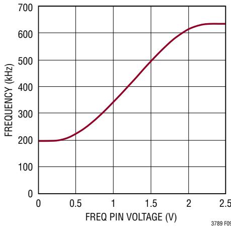  
Figure 9. Relationship Between Oscillator Frequency and Voltage at the FREQ Pin

# APPLICATIONS INFORMATION

clock whose frequency is within range of the LTC3789's internal VCO.This is guaranteed to be between 200kHz and 600kHz.A simplified block diagram is shown in Figure 10.

  
Figure 10. Phase-Locked Loop Block Diagram

If the external clock frequency is greater than the internal oscillator's frequency,fosc,then current is sourced continuously from the phase detector output, pulling up the filter network.When the external clock frequency is less than fosc, current is sunk continuously,pulling down the filter network.If the external and internal frequencies are the same but exhibit a phase difference,the current sources turn on for the amount of time corresponding to the phase difference.The voltage on the filter network is adjusted until the phase and frequency of the internal and external oscillators are identical.At the stable operating point, the phase detector output is high impedance and the filter capacitor holds the voltage.

Typically,the external clock (on the MODE/PLLIN pin) input high threshold is $1 . 6 \mathsf { V }$ ,while the input low threshold is 1V.

# Inductor Selection

The operating frequency and inductor selection are interrelated in that higher operating frequencies allow the use of smaller inductor and capacitor values.The inductor value has a direct effect on ripple current. The inductor current ripple $\Delta \mathfrak { l }$ is typically set to $20 \%$ to $40 \%$ of the maximuminductorcurrentin the boostregionat $\mathsf { V } _ { \mathsf { I N ( M I N ) } }$

For a given ripple the inductance terms in continuous mode are as follows:

$$
\begin{array} { r l } & { \mathsf { L } _ { \mathsf { B O O S T } } > \frac { \mathsf { V } _ { \mathsf { I N } ( \mathsf { M } \mathsf { I N } ) } ) ^ { 2 } \bullet ( \mathsf { V } _ { \mathsf { O U T } } - \mathsf { V } _ { \mathsf { I N } ( \mathsf { M } \mathsf { I N } ) } ) \bullet \mathsf { I } 0 0 } { \mathsf { f } \bullet \mathsf { I } _ { \mathsf { O U T } ( \mathsf { M A X } ) } \bullet \mathsf { o } _ { \mathsf { \Omega } } \mathsf { R i p p l e } \bullet \mathsf { V } _ { \mathsf { O U T } } \mathrm {  { \mathrm { ~ \Omega } } } ^ { 2 } } \mathsf { H } , } \\ & { \mathsf { L } _ { \mathsf { B U C K } } > \frac { \mathsf { V } _ { \mathsf { O U T } } \bullet \left( \mathsf { V } _ { \mathsf { I N } ( \mathsf { M A X } ) } - \mathsf { V } _ { \mathsf { O U T } } \right) \bullet \mathsf { I } 0 0 } { \mathsf { f } \bullet \mathsf { I } _ { \mathsf { O U T } ( \mathsf { M A X } ) } \bullet \mathsf { o } _ { \mathsf { \Omega } } \mathsf { R i p p l e } \bullet \mathsf { V } _ { \mathsf { I N } ( \mathsf { M A X } ) } } \mathsf { H } } \end{array}
$$

where:

f is operating frequency, Hz   
$\%$ Ripple is allowable inductor current ripple   
$\mathsf { V } _ { \mathsf { I N ( M I N ) } }$ is minimum input voltage, V   
$\mathsf { V } _ { \mathsf { I N } ( \mathsf { M A X } ) }$ is maximum input voltage, V   
VouT is output voltage, V   
loUT(MAX) is maximum output load current, A

For high efficiency，choose an inductor with low core loss, such as ferrite. Also,the inductor should have low DC resistance to reduce the I2R losses,and must be able to handle the peak inductor current without saturating.To minimize radiated noise,use a toroid,pot core or shielded bobbin inductor.

# $\complement _ { \parallel N }$ and CouT Selection

In the boost region, input current is continuous.In the buck region, input current is discontinuous.In the buck region,the selection of input capacitor $\complement _ { \mathsf { I N } }$ is driven by the need to filter the input square wave current. Use a low ESR capacitor sized to handle the maximum RMS current. For buck operation,the input RMS current is given by:

$$
| _ { \mathsf { R M S } } \approx | _ { 0 \mathsf { U T } ( \mathsf { M A X } ) } \bullet \frac { \mathsf { V } _ { 0 \mathsf { U T } } } { \mathsf { V } _ { \mathsf { I N } } } \bullet \sqrt { \frac { \mathsf { V } _ { \mathsf { I N } } } { \mathsf { V } _ { 0 \mathsf { U T } } } - 1 }
$$

This formula has a maximum at $\mathsf { V } _ { | \mathsf { N } } = 2 \mathsf { V } _ { 0 \mathsf { U T } }$ where $\mathsf { I } _ { \mathsf { R M S } } = \mathsf { I } _ { 0 \mathsf { U T } ( \mathsf { M A X } ) } / 2$ .This simple worst-case condition is commonly used for design because even significant deviations do not offer much relief.Note that ripple current ratings from capacitor manufacturers are often based on only 2Ooo hours of life which makes it advisable to derate the capacitor.

# APPLICATIONS INFORMATION

In the boost region， the discontinuous current shifts from the input to the output, so CouT must be capable of reducing the output voltage ripple.The effects of ESR (equivalent series resistance) and the bulk capacitance must be considered when choosing the right capacitor for a given output ripple voltage.The steady ripple due to charging and discharging the bulk capacitanceis given by:

$$
\mathsf { R i p p l e } \left( \mathsf { B o o s t , C a p } \right) = \frac { \mathsf { I _ { 0 \cup T ( M A X ) } \bullet \left( \mathsf { V _ { 0 \cup T } - V _ { \mathsf { I N ( M I N ) } }  } } { \ma\right)thsf { C _ { 0 \cup T } \bullet V _ { 0 \cup T } \bullet f } } \mathsf { V } } { \mathsf { C _ { 0 \cup T } } \bullet \mathsf { V _ { 0 \cup T } } \bullet \mathsf { I } }
$$

where $\complement _ { 0 \cup \intercal }$ is the output filter capacitor.

The steady ripple due to the voltage drop across the ESR is given by:

$$
\Delta \mathsf { V } _ { \mathsf { B 0 0 S 7 , E S R } } = \mathsf { I } _ { \mathsf { O U T } ( \mathsf { M A X , B 0 0 S 7 } ) } \bullet \mathsf { E S R }
$$

In buck mode, $\mathsf { V } _ { 0 \mathsf { U } \mathsf { T } }$ ripple is given by:

$$
\Delta V _ { 0 \mathsf { U T } } \leq \Delta | _ { \mathsf { L } } \bullet ( \mathsf { E S R } + 1 / ( 8 \bullet \mathsf { f } \bullet \mathsf { C } _ { 0 \mathsf { U T } } )
$$

Multiple capacitors placed in parallel may be needed to meet the ESR and RMS current handling requirements. Dry tantalum，special polymer，aluminum electrolytic and ceramic capacitors are all available in surface mount packages. Ceramic capacitors have excellent low ESR characteristics but can have a high voltage coefficient. Capacitors are now available with low ESR and high ripple current ratings, such as OS-CON and POSCAP.

# Power MOSFET Selection and Efficiency Considerations

The LTC3789 requires four external N-channel power MOSFETs,two for the top switches (switches A and D,shown in Figure 1) and two for the bottom switches (switches B and C, shown in Figure 1). Important parameters for the power MOSFETs are the breakdown voltage VBR,DSS, threshold voltage $V _ { G S , T H }$ ,on-resistanceRps(On),reverse transfercapacitanceCRss andmaximumcurrntIDs(MAX)

The drive voltage is set by the 5.5V INTVcc Supply. Consequently, logic-level threshold MOSFETs must be used in LTC3789 applications.

In orderto selectthe power MOSFETs,the power dissipated by the device must be known.For switch A,the maximum power dissipation happens in the boost region,when it remains on all the time.Its maximum power dissipation at maximum output current is given by:

$$
\mathsf { P } _ { \mathsf { A , B O O S T } } = \left( \frac { \mathsf { V } _ { \mathsf { O U T } } } { \mathsf { V } _ { \mathsf { I N } } } \bullet \mathsf { I } _ { \mathsf { O U T } ( \mathsf { M A X } ) } \right) ^ { 2 } \bullet \mathsf { \rho } _ { \tau } \bullet \mathsf { R } _ { \mathsf { D S ( O N ) } }
$$

where $\rho _ { \tau }$ is a normalization factor (unity at $2 5 ^ { \circ } \mathrm { C }$ accounting for the significant variation in on-resistance with temperature, typically about $0 . 4 \% / ^ { \circ } \complement$ ,as shown in Figure 11.For a maximum junction temperature of $1 2 5 \%$ using a value $\rho _ { \tau } = 1 . 5$ is reasonable.

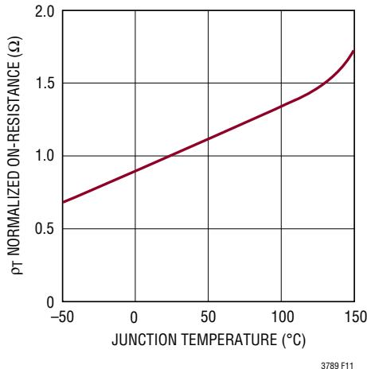  
Figure 11. Normalized RDs(oN) Vs Temperature

Switch B operates in the buck region as the synchronous rectifier.Its power dissipation at maximum output current is given by:

$$
\mathsf { P } _ { \mathsf { B , B U C K } } = \frac { \mathsf { V } _ { \mathsf { I N } } - \mathsf { V } _ { \mathsf { O U T } } } { \mathsf { V } _ { \mathsf { I N } } } \bullet \mathsf { I 0 U T } ( \mathsf { M A X } ) ^ { 2 } \bullet \mathsf { p } _ { \tau } \bullet \mathsf { R } _ { \mathsf { D S } ( \mathsf { T } }
$$

Switch C operates in the boost region as the control switch. Its power dissipation at maximum current is given by:

$$
\mathsf { P } _ { \mathtt { C } , \mathtt { B } 0 0 \mathtt { S } \mathtt { T } } = \frac { \left( \mathsf { V } _ { 0 \sqcup \mathtt { T } } - \mathsf { V } _ { 1 \mathtt { N } } \right) \mathsf { V } _ { 0 \sqcup \mathtt { T } } } { { \mathsf { V } _ { 1 \mathtt { N } } } ^ { 2 } } \bullet \mathsf { I } _ { 0 \sqcup \mathtt { T } ( \mathsf { M } \mathtt { A } \mathtt { X } ) } ^ { 2 } \bullet \mathsf { p } _ { \mathtt {tau } }
$$

$$
\bullet \mathsf { R } _ { \mathsf { D S } ( 0 \mathsf { N } ) } + \mathsf { k } \bullet \mathsf { V } _ { 0 \mathsf { U T } } { } ^ { 3 } \bullet \frac { \mathsf { I } _ { 0 \mathsf { U T } ( \mathsf { M A X } ) } } { \mathsf { V } _ { \mathsf { I N } } } \bullet \mathsf { C } _ { \mathsf { R S S } } \bullet \mathsf { f }
$$

# APPLCATIONS INFORMATION

where CRss is usually specified by the MOSFET manufacturers.The constant k, which accounts for the loss caused by reverse recovery current, is inversely proportional to the gate drive current and has an empirical value of 1.7.

For switch D,the maximum power dissipation happens in the boost region,when its duty cycle is higher than $50 \%$ . Its maximum power dissipation at maximum output current is given by:

$$
\mathsf { P } _ { \mathsf { D } , \mathsf { B } 0 0 \mathsf { S } \mathsf { T } } = \frac { \mathsf { V } _ { | \mathsf { N } | } } { \mathsf { V } _ { 0 \mathsf { U } \mathsf { T } } } \bullet \left( \frac { \mathsf { V } _ { 0 \mathsf { U } \mathsf { T } } } { \mathsf { V } _ { | \mathsf { N } | } } \bullet \mathsf { I } _ { 0 \mathsf { U } \mathsf { T } ( \mathsf { M } \mathsf { A } \mathsf { X } ) } \right) ^ { 2 } \bullet \mathsf { p } _ { \tau } \bullet \mathsf { R } _ { \mathsf { D } \mathsf { S } ( \mathsf { T } \hdots \hdots \hdots }
$$

For the same output voltage and current, switch A has the highest power dissipation and switch B has the lowest power dissipation unless a short occurs at the output.

From a known power dissipated in the power MOSFET, its junction temperature can be obtained using the following formula:

$$
\mathsf { T } _ { \mathsf { J } } = \mathsf { T } _ { \mathsf { A } } + \mathsf { P } \bullet \mathsf { R } _ { \mathsf { T } \mathsf { H } ( \mathsf { J } \mathsf { A } ) }
$$

The $\mathsf { R } _ { \mathsf { T H } ( \mathsf { J A } ) }$ to be used in te equation normally includes the $\mathsf { R } _ { \mathsf { T H } ( \mathsf { J C } ) }$ for the device plus the thermal resistance from the case to the ambient temperature $( \mathsf { R } _ { \mathsf { T H } ( \mathsf { J C } ) } )$ . This value of ${ \sf T } _ { \sf \sf \sf { J } }$ can then be compared to the original,assumed value used in the iterative calculation process.

# Schottky Diode (D1, D2) Selection

The Schottky diodes,D1 and D2,shown in Figure 13, conduct during the dead time between the conduction of the power MOSFET switches.They are intended to prevent the body diode of synchronous switches B and D from turning on and storing charge during the dead time. In particular, D2 significantly reduces reverse recovery current between switch D turn-off and switch C turn-on, which improves converter efficiency and reduces switch C voltage stress.In order for the diode to be effective, the inductance between it and the synchronous switch must be as smallas possible, mandating that these components be placed adjacently.

# ${ \| \mathsf { N I V } _ { \complement } } _ { }$ Regulators and EXTVcc

The LTC3789 features a true PMOS LDO that supplies power to ${ \| \mathsf { N N } _ { \complement } } _ { \complement }$ from the $\mathsf { V } _ { \mathsf { I N } }$ supply. ${ \| \mathsf { N N } _ { \complement } } _ { \complement }$ powers the gate drivers and much ofthe LTC3789's internal circuitry. The linear regulator regulates the voltage at the INTVcc pin to $5 . 5 \mathsf { V }$ when $\mathsf { V } _ { \mathsf { I N } }$ is greater than $6 . 5 \mathsf { V } .$ $\mathsf { E X N } _ { \mathsf { C C } }$ can supply the needed power when its voltage is higher than $4 . 8 \mathsf { V }$ through another on-chip PMOS LDO. Each of these can supply a peak current of 1OomA and must be bypassed to ground with a minimum of 1uF ceramic capacitor or low ESR electrolytic capacitor.No matter what type of bulk capacitor is used,an additional O.1uF ceramic capacitor placed directly adjacent to the INTVcc and PGND pins is highly recommended. Good bypassing is needed to supply the high transient current required by the MOSFET gate drivers and to prevent interaction between the channels.

High input voltage applications in which large MOSFETs are being driven at high frequencies may cause the maximum junction temperature rating for the LTC3789 to be exceeded.The INTVcc current, which is dominated by the gate charge current,may be supplied by either the $5 . 5 \mathsf { V }$ linear regulator from $\mathsf { V } _ { \mathsf { I N } }$ or the $5 . 5 \mathsf { V }$ LDO from EXTVcc · When the voltage on the $\mathsf { E X N } _ { \mathsf { C C } }$ pin is less than $4 . 5 \mathsf { V }$ the linear regulator from $\mathsf { V } _ { \mathsf { I N } }$ is enabled.Power dissipation for thelCinthis caseis highestandis equalto $\mathsf { V } _ { | \mathsf { N } } \bullet \mathsf { I }$ INTVCc. The gate charge current is dependent on operating frequency, as discussed in the Efficiency Considerations section.The junction temperature can be estimated by using the equations given in Note 3 of the Electrical Characteristics. For example, the LTC3789 INTVcc current is limited to less than 24mA from a 24V supply in the SSOP package and not using the EXTVcc Supply:

$$
T _ { \mathrm { J } } = 7 0 ^ { \circ } \mathsf { C } + ( 2 8 \mathsf { m A } ) ( 2 4 \mathsf { V } ) ( 8 0 ^ { \circ } \mathsf { C } / \mathsf { W } ) = 1 2 5 ^ { \circ } \mathsf { C }
$$

To preventthe maximum junction temperaturefrom being exceeded,the input supply current must be checked while operating in continuous conduction mode (MODE/PLLIN $= { \tt S G N D } )$ at maximum $\mathsf { V } _ { \mathsf { I N } }$ .When the voltage applied to $\mathsf { E X N } _ { \mathsf { C C } }$ rises above $4 . 8 \lor$ ,the ${ \| \mathsf { N T V } _ { \complement } } _ { }$ linear regulator from $\mathsf { V } _ { \mathsf { I N } }$ is turned off and the linear regulator from $\mathsf { E X N } _ { \mathsf { C C } }$ is turned on and remains on as long as the voltage applied to EXTVcc remains above $4 . 5 \mathsf { V }$ Using EXTVcc allows the MOSFET driver and control power to be derived from the LTC3789's switching regulator output during normal operation and from the $\mathsf { V } _ { \mathsf { I N } }$ when the output is out of regulation (e.g.， start-up，short-circuit)． Do not apply more than 14V to $\mathsf { E X N } _ { \mathsf { C C } }$

# APPLICATIONS INFORMATION

Significant efficiency and thermal gains can be realized by powering $\mathsf { E X N } _ { \mathsf { C C } }$ from the output, since the $\mathsf { V } _ { \mathsf { I N } }$ current resulting from the driver and control currents will be Scaled by a factor of (Duty Cycle)/(Switcher Efficiency).

Tying the $\mathsf { E X N } _ { \mathsf { C C } }$ pin to a $1 2 \vee$ output reduces the junction temperature in the previous example from $1 2 5 ^ { \circ } 0$ to $9 7 \%$

$$
\mathsf { T } _ { \mathsf { J } } = 7 0 ^ { \circ } \mathsf { C } + ( 2 8 \mathsf { m } \mathsf { A } ) ( 1 2 \mathsf { V } ) ( 8 0 ^ { \circ } \mathsf { C } / \mathsf { W } ) = 9 7 ^ { \circ } \mathsf { C }
$$

Powering $\mathsf { E X N } _ { \mathsf { C C } }$ from the output can also provide enough gate drive when $\mathsf { V } _ { \mathsf { I N } }$ drops below $5 \vee$ .This allows a wider operating range for $\mathsf { V } _ { \mathsf { I N } }$ after the controller start into regulation.

The following list summarizes the three possible connections for $\mathsf { E X N } _ { \mathsf { C C } }$

1. $\mathsf { E X N } _ { \mathsf { C C } }$ left open (or grounded).This will cause ${ \| \mathsf { N P } _ { \complement } } _ { }$ to be powered from the internal $5 . 5 \mathsf { V }$ regulator at the cost of a small efficiency penalty.   
2.EXTVcc connected directlyt $\mathsf { V } _ { 0 \mathsf { U T } } ( 4 . 7 \mathsf { V } < \mathsf { V } _ { 0 \mathsf { U T } } < 1 4 \mathsf { V } )$ This is the normal connection for the $5 . 5 \mathsf { V }$ regulator and provides the highest efficiency.   
3.EXTVcc connected to an external supply. If an external supply is available in the $4 . 7 \lor$ to 14V range, it may be used to power EXTVcc provided it is compatible with the MOSFET gate drive requirements.

Note that there is an internal body diode from ${ \| \mathsf { N N } _ { \complement } } _ { \complement }$ t0 $\mathsf { V } _ { \mathsf { I N } }$ .When ${ \| \mathsf { N N } _ { \complement } } _ { \complement }$ is powered from $\mathsf { E X N } _ { \mathsf { C C } }$ and $\mathsf { V } _ { \mathsf { I N } }$ drops lower than $4 . 5 \mathsf { V }$ ,the diode willcreate a back-feeding path from EXTVcc to $\mathsf { V } _ { \mathsf { I N } }$ .To limit this back-feeding current,a $1 0 \Omega \sim 1 5 \Omega$ resistor is recommended between the system $\mathsf { V } _ { \mathsf { I N } }$ voltage and the chip $\mathsf { V } _ { \mathsf { I N } }$ pin.To truly eliminate this back-feeding current,a blocking Schottky diode should be connected between the system $\mathsf { V } _ { \mathsf { I N } }$ and the chip $\mathsf { V } _ { \mathsf { I N } }$

# Output Voltage

The LTC3789 output voltage is set by an external feedback resistive divider carefully placed across the output capacitor.The resultant feedback signal is compared with

the internal precision $0 . 8 \mathsf { V }$ voltage reference by the error amplifier.The output voltage is given by the equation:

$$
\ifmmode \mathsf { V } _ { 0 \sqcup \intercal } = 0 . 8 \lor \bullet \left( 1 + \frac { \mathsf { R } 2 } { \mathsf { R } 1 } \right)
$$

where R1 and R2 are defined in Figure 13.

# Topside MOSFET Driver Supply $( \mathbb { C } _ { \mathsf { A } } , \mathbb { D } _ { \mathsf { A } } , \mathbb { C } _ { \mathsf { B } } , \mathbb { D } _ { \mathsf { B } } )$

Referring to Figure 13,the external bootstrap capacitors $\complement _ { \mathsf { A } }$ and $\complement _ { \mathsf { B } }$ connected to the BOOST1 and BOOST2 pins supply the gate drive voltage for the topside MOSFET switches A and D.When the top switch A turns on, the switch node SW1 rises to $\mathsf { V } _ { \mathsf { I N } }$ and the BOOST1 pin rises to approximately $\mathsf { V } _ { | \mathsf { N } } + \mathsf { I N } \mathsf { T } \mathsf { C } \mathsf { C }$ .When the bottom switch B turns on,the switch node SW1 drops to low and the boost capacitor $\complement _ { \mathsf { A } }$ is charged through $\mathsf { D } _ { \mathsf { A } }$ from ${ \| \mathsf { N P } _ { \complement } } _ { }$ When the top switch D turns on, the switch node SW2 rises to $\mathsf { V } _ { 0 \mathsf { U } \mathsf { T } }$ and the BOOST2 pin rises to approximately $\mathsf { V } _ { 0 \mathsf { U T } } + \mathsf { I N T } _ { \mathsf { C C } }$ .When the bottom switch C turns on, the switch node SW2 drops to low and the boost capacitor $\complement _ { \mathsf { B } }$ is charged through $\mathsf { D } _ { \mathsf { A } }$ from INTVcc.The boost capacitors $\complement _ { \mathsf { A } }$ and $\complement _ { \mathsf { B } }$ need to store about 1O0 times the gate charge required by the top switches Aand D.In most applications,a 0.1uF to 0.47uF, X5R or X7R dielectric capacitor is adequate.

# Undervoltage Lockout

The LTC3789 has two functions that help protect the controller in case of undervoltage conditions.A precision UVLO comparator constantly monitors the INTVcc voltage to ensure that an adequate gate-drive voltage is present. It locks out the switching action when ${ | \mathsf { N T V } _ { \complement } } { \sf C }$ is below 3.4V.To prevent oscillation when there is a disturbance on the ${ \sf N N } _ { \sf C C }$ ,the UVLO comparator has 400mVof precision hysteresis.

Another way to detectan undervoltage condition is to monitor the $\mathsf { V } _ { \mathsf { I N } }$ Supply. Because the RUN pin has a precision turn-on reference of $1 . 2 2 \vee$ ,one can use a resistor divider to $\mathsf { V } _ { \mathsf { I N } }$ to turn on the IC when $\mathsf { V } _ { \mathsf { I N } }$ is high enough. An extra $5 \mu \mathsf { A }$ of current flows out of the RUN pin once its voltage passes 1.22V.One can program the hysteresis of the run comparator by adjusting the values of the resistive divider.

# APPLCATIONS INFORMATION

# Soft-Start Function

When a capacitor is connected to the SS pin,a soft-start current of 3uA starts to charge the capacitor. A soft-start function is achieved by controlling the output ramp voltage according to the ramp rate on the SS pin. Current foldback is disabled during this phase to ensure smooth soft-start.When the chip is in the shutdown state with its RUN pin voltage below $1 . 2 2 \lor$ ,the SS pin is actively pulled to ground.The soft-start range is defined to be the voltage range from OV to $0 . 8 \mathsf { V }$ on the SS pin.The total soft-start time can be calculated as:

$$
\mathfrak { t } _ { \mathtt { S } 0 \mathsf { F } \mathsf { T } \mathbb { S } \mathsf { T } A \mathsf { R } \mathsf { T } } = 0 . 8 \bullet \frac { \mathbb { C } _ { \mathbb { S } \mathbb { S } } } { 3 \mu \mathbb { A } }
$$

Regardless of the mode selected by the MODE/PLLIN pin, the regulator will always start in pulse-skipping mode up to $\mathsf { S S } = 0 . 8 \mathsf { V }$

# Fault Conditions: Current Limit and Current Foldback

The maximum inductor current is inherently limited in a current mode controller by the maximum sense voltage.In the boost region, maximum sense voltage and the sense resistance determine the maximum alowed inductor peak current, which is:

$$
\mathsf { I } _ { \mathsf { L } ( \mathsf { M A X , B O O S T } ) } = \frac { 1 4 0 \mathsf { m V } } { \mathsf { R } _ { \mathsf { S E N S E } } }
$$

In the buck region,maximum sense voltage and the sense resistance determine the maximum allowed inductorvalley current, which is:

$$
1 _ { \mathsf { L } ( \mathsf { M A X , B U C K } ) } = { \frac { 9 0 { \mathsf { m V } } } { \mathsf { R } _ { \mathsf { S E N S E } } } }
$$

To further limit current in the event of a short circuit to ground,the LTC3789 includes foldback current limiting. If the output falls by more than $50 \%$ ,then the maximum sense voltage is progressively lowered to about one-third of its full value.

# Efficiency Considerations

The percent effciency of a switching regulator is equal to the output power divided by the input power times $100 \%$ . It is often useful to analyze individual losses to determine what is limiting the efficiency and which change would produce the mostimprovement. Although all dissipative elements in circuit produce losses, four main sources account for most of the losses in LTC3789 circuits:

1. DC I²R losses.These arise from the resistances of the MOSFETs,sensing resistor,inductorand PC board traces and cause the efficiency to drop at high output currents.

2.MOSFET Transition loss.This loss arises from the brief amount of time switch A or switch C spends in the saturated region during switch node transitions. It depends upon the input voltage,load current, driver strength and MOSFET capacitance,among otherfactors.

3. INTVcc current. This is the sum of the MOSFET driver and control currents.This loss can be reduced by supplying ${ \| \mathsf { N N } _ { \complement } } _ { \complement }$ current through the $\mathsf { E X N } _ { \mathsf { C C } }$ pin from a high efficiency source, such as the output (if $4 . 7 \lor <$ $\mathsf { V } _ { 0 \mathsf { U T } } < 1 4 \mathsf { V } )$ or alternate supply if available.

4. $\complement _ { \mathsf { I N } }$ and CouT loss.The input capacitor has the difficult job offiltering the large RMS input currentto the regulator in buck mode. The output capacitor has the more difficult job of filtering the large RMS output current in boost mode. Both $\complement _ { \mathsf { I N } }$ and $\complement _ { 0 \lor \ J }$ are required to have low ESR to minimize the AC i2R loss and sufficient capacitance to prevent the RMS current from causing additional upstream losses in fuses or batteries.

5. Otherlosses.Schottky diodes D1and D2are responsible for conduction losses during dead time and light load conduction periods. Inductor core loss should also be considered. Switch C causes reverse recovery current loss in boost mode.

When making adjustments to improve efficiency,the input current is the best indicator of changes in efficiency.If one makes a change and the input current decreases, then the efficiency has increased.If there is no change in input current,then there is no change in efficiency.

# APPLICATIONS INFORMATION

# Design Example

$V _ { \vert \mathrm { N } } = 5 V$ to 18V $\mathsf { V } _ { 0 \mathsf { U T } } = 1 2 \mathsf { V }$ $\mathsf { I } _ { 0 \mathsf { U T } ( \mathsf { M A X } ) } = 5 \mathsf { A }$ $\mathsf { f } = 4 0 0 \mathsf { k H z }$

Maximum ambient temperature $= 6 0 ^ { \circ } 0$

Setthe frequency at 40okHz by applying 1.2V on the FREQ pin (see Figure 7).The $1 0 \mu \ A$ current flowing out of the FREQ pin will give 1.2V across a 120k resistor to GND.The inductance value is chosen first based on a $30 \%$ ripple current assumption. In the buck region, the ripple current is:

$$
\Delta \mathsf { I } _ { \mathsf { L , B U C K } } = \frac { \mathsf { V _ { 0 } u } _ { \mathsf { T } } } { \mathsf { f } \bullet \mathsf { L } } \bullet \left( 1 - \frac { \mathsf { V _ { 0 } u } _ { \mathsf { T } } } { \mathsf { V _ { | \mathsf { N } } } } \right)
$$

$$
| _ { \mathsf { R I P P L E , B U C K } } \ = \ { \frac { \Delta | _ { _ { \mathsf { L , B U C K } } } \bullet 1 0 0 } { | _ { _ { 0 \sqcup \mathsf { T } } } } } \%
$$

The highest value of ripple current occurs atthe maximum input voltage. In the boost region, the ripple current is:

$$
 \Delta \mathsf { I } _ { \mathsf { L , B O O S T } } = \frac { \mathsf { V } _ { \mathsf { I N } } } { \mathsf { f } \bullet \mathsf { L } } \bullet ( 1 - \frac { \mathsf { V } _ { \mathsf { I N } } } { \mathsf { V } _ { \mathsf { O U T } } } )
$$

$$
| _ { \mathsf { R I P P L E , B O O S T } } = \frac { \Delta | _ { \mathsf { L , B O O S T } } \bullet 1 0 0 } { | _ { \mathsf { I N } } } \%
$$

The highest value of ripple current occurs at $\mathsf { V } _ { \mathsf { I N } } = \mathsf { V } _ { 0 \mathsf { U T } } / 2$

$\mathsf { A 6 . 8 | \mu H }$ inductor will produce $1 1 \%$ ripple in the boostregion $( V _ { \vert \mathsf { N } } = 6 V )$ and $2 9 \%$ ripple in the buck region $( \mathsf { V } _ { | \mathsf { N } } = 1 8 \mathsf { V } )$

The RsENSE resistor value can be calculated by using the maximum current sense voltage specification with some accommodation for tolerances.

$$
R _ { \mathtt { S E M S E } } = \frac { 2 \bullet 1 4 0 \mathsf { m V } \bullet \mathsf { V } _ { \mathsf { I N } ( \mathsf { M I N } ) } } { 2 \bullet | _ { \mathsf { O U T } ( \mathsf { M A X } , \mathsf { B O O S T } ) } \bullet \mathsf { V } _ { \mathsf { O U T } } + \Delta | _ { \mathsf { L , B O O S T } } \bullet \mathsf { V } _ { \mathsf { I N } ( \mathsf { M I N } ) } }
$$

Select an RsENSE of 10mΩ.

Output voltage is 12V. Select R1 as 20k. R2 is:

$$
{ \mathsf { R } } 2 = { \frac { \mathsf { V } _ { 0 \sqcup \top } \bullet { \mathsf { R } } 1 } { 0 . 8 } } - { \mathsf { R } } 1
$$

Select R2 as 28Ok. Both R1 and R2 should have a tolerance of no more than $1 \%$

# Selecting MOSFET Switches

The MOSFETs are selected based on voltage rating and RDs(ON) value. It is important to ensure that the part is specified for operation with the available gate voltage amplitude.In this case, the amplitude is $5 . 5 \mathsf { V }$ and MOSFETs with an RDs(oN) value specified at $V _ { \sf G S } = 4 . 5 V$ can be used.

Select QA and QB.With $1 8 \mathsf { V }$ maximum input voltage MOSFETs with a rating of at least $3 0 \vee$ are used. As we do not yet knowtheactualthermal resistance(circuit board design and airflow have a major impact) we assume that the MOSFET thermal resistance from junction to ambient is $5 0 ^ { \circ } \complement / W$

If we designforamaximumjunctiontemperature, $\mathsf { T } _ { \mathsf { J } ( \mathsf { M A X } ) }$ $= 1 2 5 \%$ ,the maximum RDs(oN) value can be calculated. First,calculate the maximum power dissipation:

$$
\begin{array} { l l } { \mathsf { P } _ { \mathsf { D } ( \mathsf { M A X } ) } = \left( \frac { \mathsf { T } _ { \mathsf { J } ( \mathsf { M A X } ) } - \mathsf { T } _ { \mathsf { A } ( \mathsf { M A X } ) } } { \mathsf { R } _ { ( \mathsf { j } - \mathsf { a } ) } } \right) } \\ { \mathsf { P } _ { \mathsf { D } ( \mathsf { M A X } ) } = \frac { ( 1 2 5 - 6 0 ) } { 5 0 } = 1 . 3 \mathsf { W } } \end{array}
$$

The maximum dissipation in QA occurs at minimum input voltage when the circuit operates in the boost region and QA is on continuously.The input current is then:

$$
\frac { \mathsf { V } _ { 0 \cup \mathsf { T } } \bullet \mathsf { I } _ { 0 \cup \mathsf { T } ( \mathsf { M A X } ) } } { \mathsf { V } _ { 1 \mathsf { N } ( \mathsf { M I N } ) } } , ~ 0 \mathsf { R } ~ 1 2 \mathsf { A }
$$

We calculate a maximum value for Rs(ON):

$$
\mathsf { R } _ { \mathsf { D S } ( 0 \mathsf { N } ) } \left( 1 2 5 ^ { \circ } \mathsf { C } \right) < \frac { \mathsf { P } _ { \mathsf { D } ( \mathsf { M A X } ) } } { \mathsf { I } _ { \mathsf { N } ( \mathsf { M A X } ) } { } ^ { 2 } }
$$

$$
{ \sf R } _ { \sf D S ( O N ) } \left( 1 2 5 ^ { \circ } { \sf C } \right) < \frac { 1 . 3 { \sf W } } { \left( 1 2 { \sf A } \right) ^ { 2 } } = 0 . 0 0 9 \Omega
$$

# APPLICATIONS INFORMATION

The Vishay SiR422DP has a typical RDs(ON) of 0.010Ω at ${ \bar { \mathsf { I } } } _ { \mathsf { J } } = 1 2 5 ^ { \circ } { \mathsf { C } }$ and $\mathsf { V } _ { \mathsf { G S } } = 4 . 5 \mathsf { V }$

The maximum dissipation in QB occurs at maximum input voltage when the circuit is operating in the buck region. The dissipation is:

$$
\mathsf { P } _ { \mathsf { B , B U C K } } = \frac { \mathsf { V } _ { \mathsf { I N } } - \mathsf { V } _ { \mathsf { O U T } } } { \mathsf { V } _ { \mathsf { I N } } } \bullet \mathsf { I } _ { \mathsf { O U T } ( \mathsf { M A X } ) } { } ^ { 2 } \bullet \mathsf { p } _ { \tau } \bullet \mathsf { R } _ { \mathsf { D S } ( \mathsf { O N } ) }
$$

$$
\mathsf { R } _ { \mathsf { D S } ( 0 \mathbb { N } ) } ( 1 2 5 ^ { \circ } \mathsf { C } ) < \frac { 1 . 3 \mathsf { W } } { \frac { 1 8 \lor \mathsf { T } 0 \mathrm { ~ } - 1 2 \lor } { 1 8 \lor } \bullet ( 5 \mathsf { A } ) ^ { 2 } } = 0 . 1 5 6 \Omega
$$

This seems to indicate that a quite small MOSFET can be used for QB if we only look at power loss. However, with 5A currentthe voltage drop across O.156Ωis $0 . 7 8 \lor$ ,which means the MOSFET body diode is conducting. To avoid body diode current flow we should keep the maximum voltage drop well below $0 . 5 \mathsf { V }$ ,using,forexample,Vishay Si4840BDYin the SO-8 package $( \mathsf { R } _ { \mathsf { D S O N } ( \mathsf { M A X } ) } = 0 . 0 1 2 \Omega )$

Select QC and QD.With 12V output voltage we need MOSFETs with $2 0 \vee$ or higher rating.

The highest dissipation occurs at minimum input voltage when the inductor current is highest. For switch QC the dissipation is:

$$
\begin{array} { r l } & { \mathsf { P } _ { \mathsf { G } , \mathsf { B O O S T } } = \frac { \left( \mathsf { V } _ { \mathsf { O U T } } - \mathsf { V } _ { \mathsf { I N } } \right) \mathsf { V } _ { \mathsf { O U T } } } { \mathsf { V } _ { \mathsf { I N } } } } \\ & { \bullet \mathsf { I } _ { 0 \sqcup \mathsf { T } ( \mathbb { M A X } ) } 2 \bullet \mathsf { \rho } _ { \mathsf { o } } \bullet \mathsf { R } _ { 0 \mathsf { S } ( 0 \mathbb { N } ) } } \\ & { + \textup { k } \bullet \mathsf { V } _ { 0 \sqcup \mathsf { T } } ^ { 3 } \bullet \frac { \mathsf { I } _ { 0 \sqcup \mathsf { T } ( \mathbb { M A X } ) } } { \mathsf { V } _ { \mathsf { I N } } } \bullet \mathsf { C } _ { \mathsf { R S S } } \bullet \mathsf { \rho } _ { \mathsf { f } } } \end{array}
$$

where CRss is usually specified by the MOSFET manufacturers.The constant k,which accounts for the loss caused by reverse recovery current, is inversely proportional to the gate drive current and has an empirical value of 1.7.

The dissipation in switch QD is:

$$
\begin{array} { r } { \mathsf { P } _ { \mathsf { D , B O O S T } } = \frac { \mathsf { V } _ { \mathsf { I N } } } { \mathsf { V } _ { \mathsf { O U T } } } \bullet \left( \frac { \mathsf { V } _ { \mathsf { O U T } } } { \mathsf { V } _ { \mathsf { I N } } } \bullet \mathsf { I } _ { 0 \mathsf { U T } ( \mathbb { M A X } ) } \right) ^ { 2 } } \\ { \bullet \mathsf { p } _ { \tau } \bullet \mathsf { R } _ { \mathsf { D S ( O N ) } } } \end{array}
$$

Vishay SiR484OYis a possible choice for QC and QD.The calculated power loss at $5 V$ input voltage is then 1.3W for QC and 0.84W for QD.

$\complement _ { \mathsf { I N } }$ is chosen to filterthe squarecurrentin the buck region. In this mode, the maximum input current peak is:

$$
I _ { | \mathrm { N , P E A K ( M A X , B U C K ) } } = 5 \mathsf { A } \bullet \left( 1 + \frac { 2 9 \% } { 2 } \right) = 5 . 7 \mathsf { A }
$$

A low ESR (10mΩ) capacitor is selected.Input voltage ripple is $5 7 \mathsf { m } \mathsf { V }$ (assuming ESR dominates the ripple).

CouT is chosen to filter the square current in the boost region.In this mode,the maximum output current peak is:

$$
I _ { 0 \mathsf { U T } , \mathsf { P E A K } ( \mathsf { M A X } , \mathsf { B O O S } \mathsf { T } ) } = \frac { 1 2 } { 5 } \bullet 5 \bullet \left( 1 + \frac { 1 1 \% } { 2 } \right) = 1 0 . 6 \mathsf { A }
$$

A low ESR (5mΩ) capacitor is suggested.This capacitor will limit output voltage ripple to 53mV (assuming ESR dominates the ripple).

# PC Board Layout Checklist

The basic PC board layout requires a dedicated ground plane layer.Also,for high current,a multilayer board provides heat sinking for power components.

· The ground plane layer should not have any traces and should be as close as possible to the layer with power MOSFETs. Place $\complement _ { \mathsf { I N } }$ ，switch A,switch B and D1 in one compact area. Place CouT, switch C, switch D and D2 in one compact area. One layout example is shown in Figure 12. Use immediate vias to connect the components (including the LTC3789's SGND and PGND pins) to the ground plane. Use several large vias for each power component.

# APPLICATIONS INFORMATION

· Use planes for $\mathsf { V } _ { \mathsf { I N } }$ and $\mathsf { V } _ { 0 \mathsf { U } \mathsf { T } }$ to maintain good voltage filtering and to keep power losses low.

· Flood all unused areas on allayers with copper.Flooding with copper will reduce the temperature rise of power components. Connect the copper areas to any DC net $( \mathsf { V } _ { | \mathsf { N } } 0 \mathsf { r } G \mathsf { N } \mathsf { D } )$ .When laying out the printed circuit board,the following checklist should be used to ensure proper operation of the LTC3789.These items are also illustrated in Figure 13.

· Segregate the signal and power grounds.All smallsignal components should return to the SGND pin at one point, which is then tied to the PGND pin close to the inductor current sense resistor RsENSE.

·Place switch Band switch C as close to the controller as possible, keeping the PGND, BG and SW traces short.

· Keep the high dV/dT SW1， SW2， BOOST1， BOOST2, TG1 and TG2 nodes away from sensitive smal-signal nodes.

· The path formed by switch A,switch B,D1 and the $\complement _ { \mathsf { I N } }$ capacitor should have short leads and PC trace lengths. The path formed by switch C,switch D, D2 and the CouT capacitor also should have short leads and PC trace lengths.

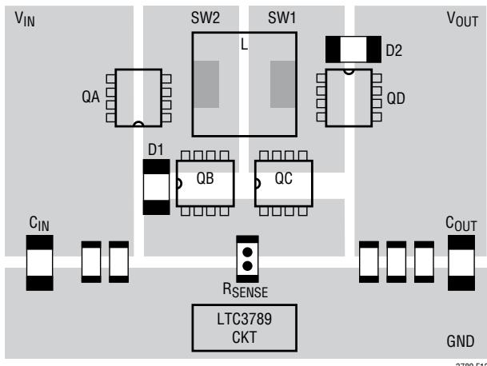  
Figure 12. Switches Layout

· The outputcapacitor $\left( - \right)$ terminals should be connected as closely as possible to the $\left( - \right)$ terminals of the input capacitor.

·Connectthe top driverboost capacitor $\complement _ { \mathsf { A } }$ closely to the BOOST1 and SW1 pins.Connect the top driver boost capacitor $\complement _ { \mathsf { B } }$ closely to the BOOST2 and SW2 pins.

· Connectthe input capacitors $\complement _ { \mathsf { I N } }$ and output capacitors CouT closely to the power MOSFETs.These capacitors carry the MOSFET AC current in the boost and buck region.

· Connect VFB pin resistive dividers to the $\left( + \right)$ terminals of CouT and signal ground. A small $V _ { F B }$ bypass capacitor may be connected closely to the LTC3789 SGND pin. The R2 connection should not be along the high current or noise paths, such as the input capacitors.

· Route SENSE- and SENSE+ leads together with minimum PC trace spacing. Avoid having sense lines pass through noisy areas,such as switch nodes.The filter capacitor between ${ \tt S E N S E } ^ { + }$ and SENSE- should be as close as possible to the IC. Ensure accurate current sensing with Kelvin connections at the sense resistor. One layout example is shown in Figure 14.

· Connect the $\mathsf { I } _ { \mathsf { T } \mathsf { H } }$ pin compensation network closely to the IC, between ${ \mathsf { I } } _ { \mathsf { T } \mathsf { H } } \mathsf { a n d }$ the signal ground pins. The capacitor helps to filter the effects of PCB noise and output voltage ripple voltage from the compensation loop.

· Connect the ${ \| \mathsf { N P } _ { \complement } } _ { }$ bypass capacitor， Cvcc，closely to the IC,between the INTVcc and the power ground pins.This capacitor carries the MOSFETdrivers'current peaks.An additional 1uF ceramic capacitor placed immediately next to the iNTVcc and PGND pins can help improve noise performance substantially.

# 25

# APPLCATIONS INFORMATION

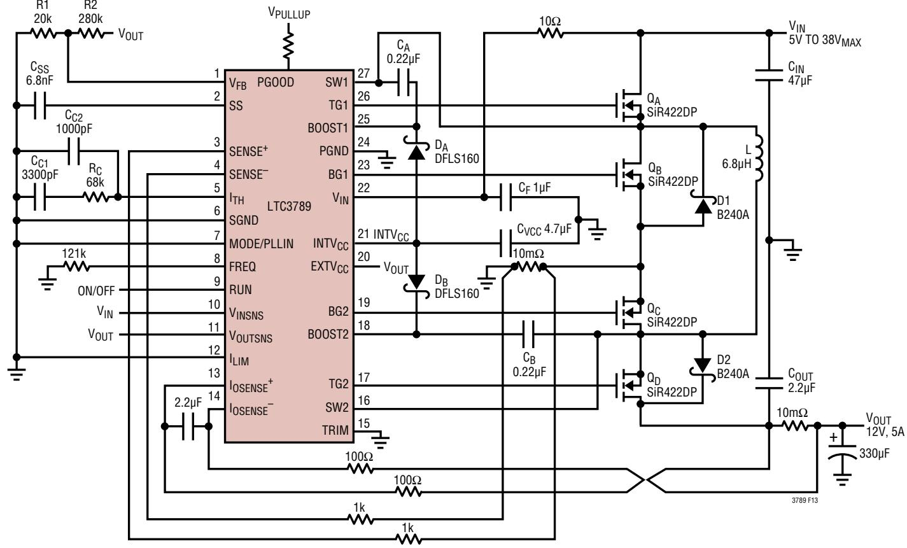  
Figure 13.LTC3789 12V/5A, Buck-Boost Regulator

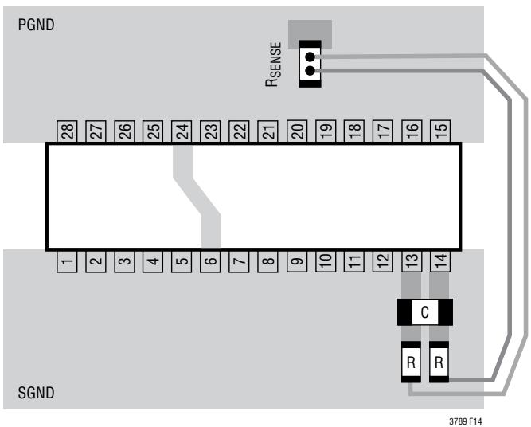  
Figure 14. Sense Lines Layout

# PACKAGE DESCRIPTION

Please refer to htp://ww.linear.com/designtools/packaging/for the most recent package drawings.

GN Package 28-Lead Plastic SSOP (Narrow .150 Inch) (Reference LTC DWG # O5-08-1641)

27

# PACKAGE DESCRIPTION

Please refer to htp://ww.linear.com/designtools/packaging/ for the most recent package drawings.

UFD Package 28-Lead Plastic QFN $( 4 \mathsf { m m } \times 5 \mathsf { m m } )$ (Reference LTC DWG # O5-08-1712 Rev B)

  
RECOMMENDED SOLDER PAD PITCHAND DIMENSIONS

NOTE:   
1.DRAWING PROPOSED TO BE MADEA JEDEC PACKAGE OUTLINE MO-22O VARIATION (WXXX-X).   
2.DRAWING NOT TO SCALE   
3.ALL DIMENSIONS ARE IN MILLIMETERS   
4.DIMENSIONS OF EXPOSED PAD ON BOTTOM OF PACKAGE DO NOT INCLUDE MOLD FLASH.MOLD FLASH,IF PRESENT, SHALL NOT EXCEED O.15mm ON ANY SIDE   
5.EXPOSED PAD SHALL BE SOLDER PLATED   
6.SHADED AREA IS ONLYA REFERENCE FOR PIN1 LOCATION ONTHETOP AND BOTTOMOFPACKAGE

# REVISION HISTORY

<table><tr><td rowspan=1 colspan=1>REV</td><td rowspan=1 colspan=1>DATE</td><td rowspan=1 colspan=1>DESCRIPTION</td><td rowspan=1 colspan=1>PAGE NUMBER</td></tr><tr><td rowspan=2 colspan=1>A</td><td rowspan=2 colspan=1>9/11</td><td rowspan=2 colspan=1>Updated Features, Description and Typical Application.Updated Electrical Characteristics section.Updated text in MODE/PLLIN, BOOST1, BOOST2, SW1, SW2 in Pin Functions section.Updated text in Operation section.Updated text in Applications Information section.Updated Figure 13.Updated Typical Application and Related Parts.</td><td rowspan=1 colspan=1>139,10</td></tr><tr><td rowspan=1 colspan=1>12-1516-252630</td></tr><tr><td rowspan=1 colspan=1>B</td><td rowspan=1 colspan=1>07/14</td><td rowspan=1 colspan=1>Updated Application SchematicUpdated Nominal Frequency ResistorUpdated VouTsNs and VIN SectionsUpdated LBoosT equation</td><td rowspan=1 colspan=1>149,1018</td></tr><tr><td rowspan=1 colspan=1>C</td><td rowspan=1 colspan=1>11/14</td><td rowspan=1 colspan=1>Added TG1,TG2 Absolute Maximum RatingsAdded Note 6Replaced Figure 9Added Text</td><td rowspan=1 colspan=1>241721</td></tr></table>

# TYPICAL APPLICATION

# 24V/5A Buck-Boost Regulator

# RELATED PARTS

<table><tr><td rowspan=1 colspan=1>PART NUMBER</td><td rowspan=1 colspan=1>DESCRIPTION</td><td rowspan=1 colspan=1>COMMENTS</td></tr><tr><td rowspan=1 colspan=1>LTC3780</td><td rowspan=1 colspan=1>High Effciency (Up to 98%) Synchronous,4-Switch Buck-BoostDC/DC Controller</td><td rowspan=1 colspan=1>4V ≤VIN ≤36V,0.8V≤VouT≤30V, 5mm × 5mm QFN-32 andSSOP-24 Packages</td></tr><tr><td rowspan=1 colspan=1>LTC3785</td><td rowspan=1 colspan=1>High Efficiency(Upto 98%)Synchronous,4-Switch Buck-BoostDC/DC Controller</td><td rowspan=1 colspan=1>2.7V ≤VIN ≤10V,2.7V≤VouT≤10V,4mm × 4mmQFN-24 Package</td></tr><tr><td rowspan=1 colspan=1>LTM4605</td><td rowspan=1 colspan=1>High Efficiency Buck-BoostDC/DC uModuleTM RegulatorComplete Power Supply</td><td rowspan=1 colspan=1>4.5V≤VIN ≤20V,0.8V≤VouT≤16V,15mm ×15mm ×2.8mmLGA Package</td></tr><tr><td rowspan=1 colspan=1>LTM4607</td><td rowspan=1 colspan=1>High Efficiency Buck-Boost DC/DC uModule RegulatorCompletePower Supply</td><td rowspan=1 colspan=1>4.5V≤VIn≤36V,0.8V≤Vout≤25V,15mm×15mm×2.8mmLGA Package</td></tr><tr><td rowspan=1 colspan=1>LTM4609</td><td rowspan=1 colspan=1>High Efficiency Buck-Boost DC/DC uModule RegulatorComplete Power Supply</td><td rowspan=1 colspan=1>4.5V≤VIN≤36V,0.8V≤VouT≤34V,15mm ×15mm ×2.8mmLGA Package</td></tr><tr><td rowspan=1 colspan=1>LTC3112</td><td rowspan=1 colspan=1>2.5A Synchronous Buck-Boost DC/DC Converter</td><td rowspan=1 colspan=1>2.7V ≤VIN ≤15V,2.5V≤VouT≤14V,4mm ×5mm DFN-16 andTSSOP-20 Packages</td></tr><tr><td rowspan=1 colspan=1>LTC3533</td><td rowspan=1 colspan=1>2A Synchronous Buck-Boost Monolithic DC/DC Converter</td><td rowspan=1 colspan=1>1.8V≤VIN≤5.5V,1.8V≤V0UT≤5.25V,lQ= 40uA,IsD&lt;1uA,3mm×4mm DFN-14 Package</td></tr></table>
