# NCE N-Channel Super Trench Power MOSFET

# Description

The NCEP40T13GU uses Super Trench technology that is uniquely optimized to provide the most efficient high frequency switching performance. Both conduction and switching power losses are minimized due to an extremely low combination of ${ \mathsf { R } } _ { { \mathsf { D } } { \mathsf { S } } ( { \mathsf { O N } } ) }$ and $\mathsf Q _ { \mathsf g }$ . This device is ideal for high-frequency switching and synchronous rectification.

# General Features

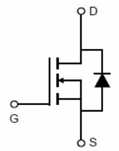  
Schematic Diagram

$\mathsf { V } _ { \mathsf { D S } } = 4 0 \mathsf { V } , \mathsf { I } _ { \mathsf { D } } = 1 3 0 \mathsf { A }$ $\mathsf { R o s } _ { ( \mathsf { O N } ) } { = } 1 . 8 \mathsf { m } \Omega$ (typical) $\textcircled { \scriptsize { \infty } } V _ { \odot } \textcircled { = } 1 0 V$ $\mathsf { R } _ { \mathsf { D S ( O N ) } } { = } 2 . 8 \mathsf { m } \Omega$ (typical) $\textcircled { \scriptsize { \infty } } V _ { \odot } \textcircled { = } 4 . 5 V$

$\bullet$ Excellent gate charge $\textsf { x R o s } ( \mathsf { o n } )$ product(FOM)   
$\bullet$ Very low on-resistance $R _ { \mathsf { D S } ( \mathsf { o n } ) }$   
$\bullet$ $1 5 0 ~ ^ { \circ } \mathrm { C }$ operating temperature   
$\bullet$ Pb-free lead plating   
$\bullet$ $100 \%$ UIS tested

# Application

$\bullet$ DC/DC Converter

  
Top View

$\bullet$ Ideal for high-frequency switching and synchronous rectification

100% UIS TESTED!

100% ∆Vds TESTED!

# Package Marking and Ordering Information

<table><tr><td rowspan=1 colspan=1>Device Marking</td><td rowspan=1 colspan=1>Device</td><td rowspan=1 colspan=1>Device Package</td><td rowspan=1 colspan=1>Reel Size</td><td rowspan=1 colspan=1>Tape width</td><td rowspan=1 colspan=1>Quantity</td></tr><tr><td rowspan=1 colspan=1>NCEP40T13GU</td><td rowspan=1 colspan=1>NCEP40T13GU</td><td rowspan=1 colspan=1>DFN5X6-8L</td><td rowspan=1 colspan=1>-</td><td rowspan=1 colspan=1>-</td><td rowspan=1 colspan=1>-</td></tr></table>

# Absolute Maximum Ratings $( \pi _ { \mathsf { C } } { = } 2 5 ^ { \circ } \mathrm { C }$ unless otherwise noted)

<table><tr><td rowspan=1 colspan=1>Parameter</td><td rowspan=1 colspan=1>Symbol</td><td rowspan=1 colspan=1>Limit</td><td rowspan=1 colspan=1>Unit</td></tr><tr><td rowspan=1 colspan=1>Drain-Source Voltage</td><td rowspan=1 colspan=1>VDs</td><td rowspan=1 colspan=1>40</td><td rowspan=1 colspan=1>V</td></tr><tr><td rowspan=1 colspan=1>Gate-Source Voltage</td><td rowspan=1 colspan=1>VGS</td><td rowspan=1 colspan=1>±20</td><td rowspan=1 colspan=1>V</td></tr><tr><td rowspan=1 colspan=1>Drain Current-Continuous (Silicon Limited)</td><td rowspan=1 colspan=1>b</td><td rowspan=1 colspan=1>130</td><td rowspan=1 colspan=1>A</td></tr><tr><td rowspan=1 colspan=1>Drain Current-Continuous(Tc=100℃)</td><td rowspan=1 colspan=1>Ib(100℃)</td><td rowspan=1 colspan=1>100</td><td rowspan=1 colspan=1>A</td></tr><tr><td rowspan=1 colspan=1>Pulsed Drain Current (Package Limited)</td><td rowspan=1 colspan=1>IDM</td><td rowspan=1 colspan=1>400</td><td rowspan=1 colspan=1>A</td></tr><tr><td rowspan=1 colspan=1>Maximum Power Dissipation</td><td rowspan=1 colspan=1>PD</td><td rowspan=1 colspan=1>80</td><td rowspan=1 colspan=1>W</td></tr><tr><td rowspan=1 colspan=1>Derating factor</td><td rowspan=1 colspan=1></td><td rowspan=1 colspan=1>0.64</td><td rowspan=1 colspan=1>W/C</td></tr><tr><td rowspan=1 colspan=1>Single pulse avalanche energy((Note 5)</td><td rowspan=1 colspan=1>EAS</td><td rowspan=1 colspan=1>600</td><td rowspan=1 colspan=1>mJ</td></tr><tr><td rowspan=1 colspan=1>Operating Junction and Storage Temperature Range</td><td rowspan=1 colspan=1>TJ,TsTG</td><td rowspan=1 colspan=1>-55 To 150</td><td rowspan=1 colspan=1>℃</td></tr></table>

# Thermal Characteristic

<table><tr><td></td><td>ReJc</td><td>1.56</td><td>℃/W</td></tr></table>

<table><tr><td rowspan=1 colspan=7>Electrical Characteristics (Tc=25Cunless otherwise noted)</td></tr><tr><td rowspan=1 colspan=1>Parameter</td><td rowspan=1 colspan=1>Symbol</td><td rowspan=1 colspan=1>Condition</td><td rowspan=1 colspan=1>Min</td><td rowspan=1 colspan=1>Typ</td><td rowspan=1 colspan=1>Max</td><td rowspan=1 colspan=1>Unit</td></tr><tr><td rowspan=1 colspan=7>Off Characteristics</td></tr><tr><td rowspan=1 colspan=1>Drain-Source Breakdown Voltage</td><td rowspan=1 colspan=1>BVDsS</td><td rowspan=1 colspan=1>VGs=0V ID=250μA</td><td rowspan=1 colspan=1>40</td><td rowspan=1 colspan=1></td><td rowspan=1 colspan=1>-</td><td rowspan=1 colspan=1>V</td></tr><tr><td rowspan=1 colspan=1> Zero Gate Voltage Drain Current</td><td rowspan=1 colspan=1>Ibss</td><td rowspan=1 colspan=1>VDs=40V,VGs=0V</td><td rowspan=1 colspan=1>-</td><td rowspan=1 colspan=1>-</td><td rowspan=1 colspan=1>1</td><td rowspan=1 colspan=1>UA</td></tr><tr><td rowspan=1 colspan=1>Gate-Body Leakage Current</td><td rowspan=1 colspan=1>IGsS</td><td rowspan=1 colspan=1>VGs=±20V,VDs=0V</td><td rowspan=1 colspan=1>-</td><td rowspan=1 colspan=1>1</td><td rowspan=1 colspan=1>±100</td><td rowspan=1 colspan=1>nA</td></tr><tr><td rowspan=1 colspan=7>On Characteristics (Note 3)</td></tr><tr><td rowspan=1 colspan=1>Gate Threshold Voltage</td><td rowspan=1 colspan=1>VGS(th)</td><td rowspan=1 colspan=1>VDs=VGs,ID=250uA</td><td rowspan=1 colspan=1>1.2</td><td rowspan=1 colspan=1>1.7</td><td rowspan=1 colspan=1>2.2</td><td rowspan=1 colspan=1>V</td></tr><tr><td rowspan=2 colspan=1>Drain-Source On-State Resistance</td><td rowspan=2 colspan=1>RDS(ON)</td><td rowspan=1 colspan=1>VGs=10V, ID=65A</td><td rowspan=1 colspan=1>:</td><td rowspan=1 colspan=1>1.8</td><td rowspan=1 colspan=1>2.3</td><td rowspan=1 colspan=1>mΩ</td></tr><tr><td rowspan=1 colspan=1>VGs=4.5V, ID=65A</td><td rowspan=1 colspan=1>-</td><td rowspan=1 colspan=1>2.8</td><td rowspan=1 colspan=1>3.6</td><td rowspan=1 colspan=1>mΩ</td></tr><tr><td rowspan=1 colspan=1>Forward Transconductance</td><td rowspan=1 colspan=1>gFs</td><td rowspan=1 colspan=1>VDs=5V,Ib=65A</td><td rowspan=1 colspan=1>-</td><td rowspan=1 colspan=1>62</td><td rowspan=1 colspan=1>：</td><td rowspan=1 colspan=1>S</td></tr><tr><td rowspan=1 colspan=1>Dynamic Characteristics (Note4)</td><td></td><td></td><td></td><td></td><td></td><td></td></tr><tr><td rowspan=1 colspan=1>Input Capacitance</td><td rowspan=1 colspan=1>Ciss</td><td rowspan=3 colspan=1>VDs=20V,Vgs=0V,F=1.0MHz</td><td rowspan=1 colspan=1>-</td><td rowspan=1 colspan=1>3334</td><td rowspan=1 colspan=1>3990</td><td rowspan=1 colspan=1>PF</td></tr><tr><td rowspan=1 colspan=1>Output Capacitance</td><td rowspan=1 colspan=1>Coss</td><td rowspan=1 colspan=1>-</td><td rowspan=1 colspan=1>650</td><td rowspan=1 colspan=1>750</td><td rowspan=1 colspan=1>PF</td></tr><tr><td rowspan=1 colspan=1>Reverse Transfer Capacitance</td><td rowspan=1 colspan=1>Crss</td><td rowspan=1 colspan=1>-</td><td rowspan=1 colspan=1>57</td><td rowspan=1 colspan=1>68</td><td rowspan=1 colspan=1>PF</td></tr><tr><td rowspan=1 colspan=7>Switching Characteristics(Note 4)</td></tr><tr><td rowspan=1 colspan=1>Turn-on Delay Time</td><td rowspan=1 colspan=1>ta（on)</td><td rowspan=2 colspan=1>VDD=20V,ID=65A</td><td rowspan=1 colspan=1>-</td><td rowspan=1 colspan=1>10</td><td rowspan=1 colspan=1>-</td><td rowspan=1 colspan=1>nS</td></tr><tr><td rowspan=1 colspan=1>Turn-on Rise Time</td><td rowspan=1 colspan=1>t</td><td rowspan=1 colspan=1>-</td><td rowspan=1 colspan=1>3</td><td rowspan=1 colspan=1>-</td><td rowspan=1 colspan=1>nS</td></tr><tr><td rowspan=1 colspan=1>Turn-Off Delay Time</td><td rowspan=1 colspan=1>ta（of</td><td rowspan=1 colspan=1>VGs=10V,Rg=1.6Ω</td><td rowspan=1 colspan=1>-</td><td rowspan=1 colspan=1>34</td><td rowspan=1 colspan=1>-</td><td rowspan=1 colspan=1>nS</td></tr><tr><td rowspan=1 colspan=1>Turn-Off Fall Time</td><td rowspan=1 colspan=1>t</td><td rowspan=1 colspan=1></td><td rowspan=1 colspan=1>-</td><td rowspan=1 colspan=1>3</td><td rowspan=1 colspan=1>-</td><td rowspan=1 colspan=1>nS</td></tr><tr><td rowspan=1 colspan=1>Total Gate Charge</td><td rowspan=1 colspan=1>Qg</td><td rowspan=3 colspan=1>VDs=20V,ID=65A,VGs=10V</td><td rowspan=1 colspan=1>-</td><td rowspan=1 colspan=1>49</td><td rowspan=1 colspan=1>70</td><td rowspan=1 colspan=1>nC</td></tr><tr><td rowspan=1 colspan=1>Gate-Source Charge</td><td rowspan=1 colspan=1>Qgs</td><td rowspan=1 colspan=1>-</td><td rowspan=1 colspan=1>9.4</td><td rowspan=1 colspan=1></td><td rowspan=1 colspan=1>nC</td></tr><tr><td rowspan=1 colspan=1>Gate-Drain Charge</td><td rowspan=1 colspan=1>Qgd</td><td rowspan=1 colspan=1>-</td><td rowspan=1 colspan=1>5</td><td rowspan=1 colspan=1></td><td rowspan=1 colspan=1>nC</td></tr><tr><td rowspan=1 colspan=7>Drain-Source Diode Characteristics</td></tr><tr><td rowspan=1 colspan=1>Diode Forward Voltage((Note3)</td><td rowspan=1 colspan=1>VsD</td><td rowspan=1 colspan=1>VGs=0V,ls=65A</td><td rowspan=1 colspan=1>-</td><td rowspan=1 colspan=1></td><td rowspan=1 colspan=1>1.2</td><td rowspan=1 colspan=1>V</td></tr><tr><td rowspan=1 colspan=1>Diode Forward Crrent (Note 2)</td><td rowspan=1 colspan=1>Is</td><td rowspan=1 colspan=1></td><td rowspan=1 colspan=1>-</td><td rowspan=1 colspan=1>-</td><td rowspan=1 colspan=1>130</td><td rowspan=1 colspan=1>A</td></tr><tr><td rowspan=1 colspan=1>Reverse Recovery Time</td><td rowspan=1 colspan=1>tr</td><td rowspan=1 colspan=1>Tj = 25℃,IF = Is</td><td rowspan=1 colspan=1>-</td><td rowspan=1 colspan=1></td><td rowspan=1 colspan=1>23</td><td rowspan=1 colspan=1>nS</td></tr><tr><td rowspan=1 colspan=1>Reverse Recovery Charge</td><td rowspan=1 colspan=1>Qrr</td><td rowspan=1 colspan=1>di/dt = 100A/us(Note3)</td><td rowspan=1 colspan=1>-</td><td rowspan=1 colspan=1></td><td rowspan=1 colspan=1>67</td><td rowspan=1 colspan=1>nC</td></tr></table>

# Notes:

1. Repetitive Rating: Pulse width limited by maximum junction temperature.   
2. Surface Mounted on FR4 Board, $\tan \tt { t } \leq 1 0$ sec.   
3. Pulse Test: Pulse Width $\leq 3 0 0 upmu \mathsf { s }$ , Duty Cycle $\leq 2 \%$ .   
4. Guaranteed by design, not subject to production   
5. EAS condition : $\mathsf { T j } = 2 5 \mathrm { \mathsf { C } } , \mathsf { V _ { D D } } = 2 0 \mathsf { V } , \mathsf { V _ { G } } = 1 0 \mathsf { V } , \mathsf { L } = 0 . 5 \mathsf { m H } , \mathsf { R g } = 2 5 \Omega$

  
Typical Electrical and Thermal Characteristics   
Figure 1 Output Characteristics

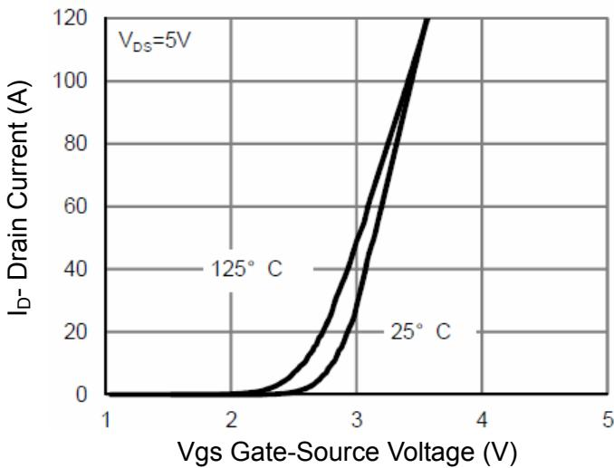  
Figure 2 Transfer Characteristics

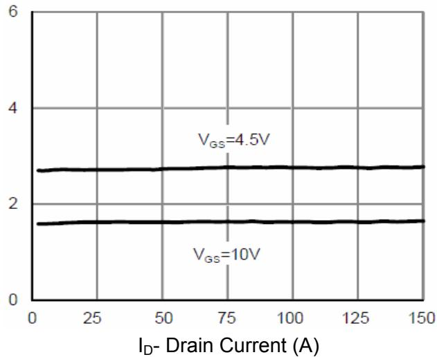  
Figure 3 Rdson- Drain Current

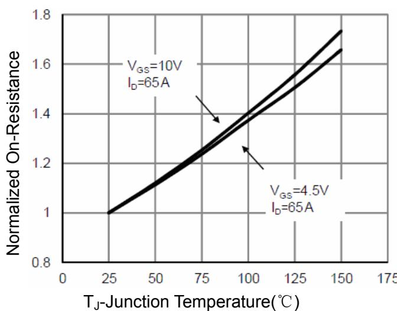  
Figure 4 Rdson-JunctionTemperature

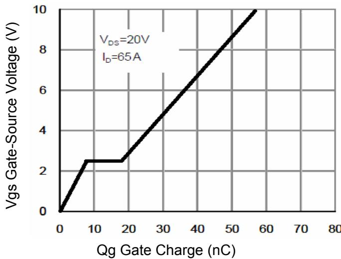  
Figure 5 Gate Charge

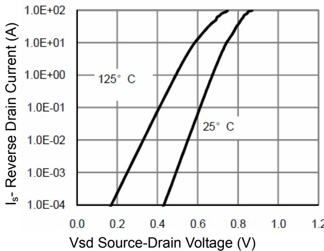  
Figure 6 Source- Drain Diode Forward

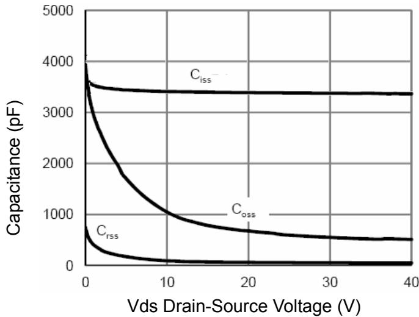  
Figure 7 Capacitance vs Vds

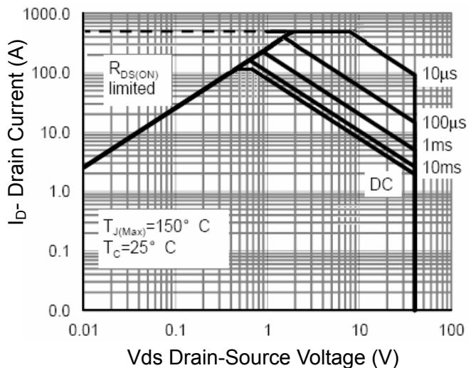  
Figure 8 Safe Operation Area

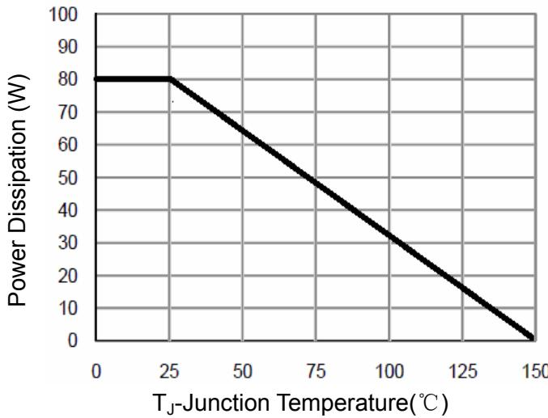  
Figure 9 Power De-rating

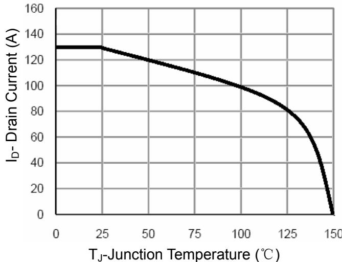  
Figure 10 Current De-rating

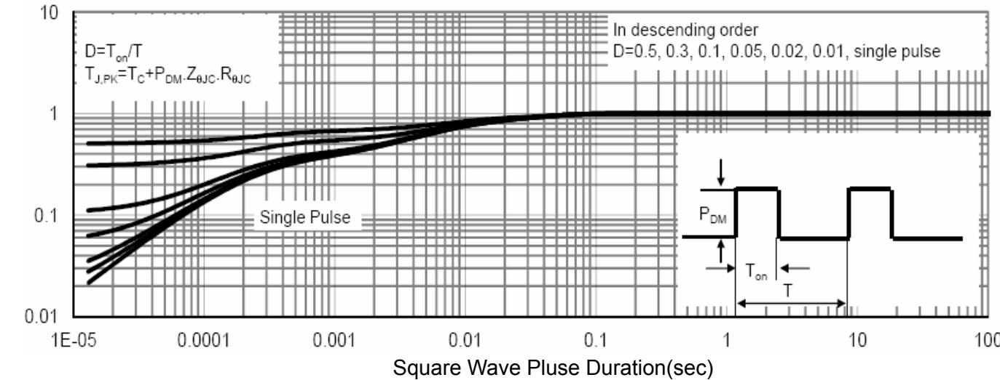  
Figure 11 Normalized Maximum Transient Thermal Impedance

# DFN5X6-8L Package Information

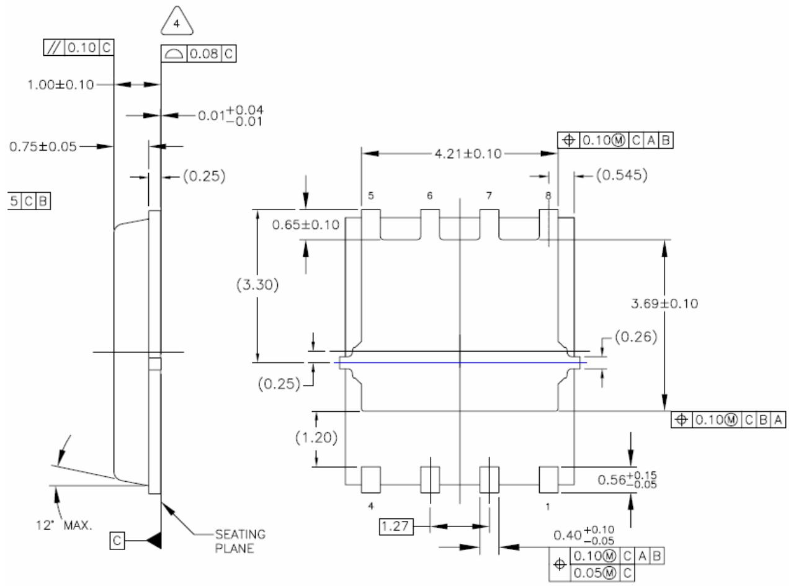

# Attention:

Any and all NCE power products described or contained herein do not have specifications that can handle applications that require extremely high levels of reliability, such as life-support systems, aircraft's control systems, or other applications whose failure can be reasonably expected to result in serious physical and/or material damage. Consult with your NCE power representative nearest you before using any NCE power products described or contained herein in such applications.

NCE power assumes no responsibility for equipment failures that result from using products at values that exceed, even momentarily, rated values (such as maximum ratings, operating condition ranges, or other parameters) listed in products specifications of any and all NCE power products described or contained herein.

Specifications of any and all NCE power products described or contained herein stipulate the performance, characteristics, and functions of the described products in the independent state, and are not guarantees of the performance, characteristics, and functions of the described products as mounted in the customer’s products or equipment. To verify symptoms and states that cannot be evaluated in an independent device, the customer should always evaluate and test devices mounted in the customer’s products or equipment.

NCE power Semiconductor CO.,LTD. strives to supply high-quality high-reliability products. However, any and all semiconductor products fail with some probability. It is possible that these probabilistic failures could give rise to accidents or events that could endanger human lives, that could give rise to smoke or fire, or that could cause damage to other property. When designing equipment, adopt safety measures so that these kinds of accidents or events cannot occur. Such measures include but are not limited to protective circuits and error prevention circuits for safe design, redundant design, and structural design.

In the event that any or all NCE power products(including technical data, services) described or contained herein are controlled under any of applicable local export control laws and regulations, such products must not be exported without obtaining the export license from the authorities concerned in accordance with the above law.

No part of this publication may be reproduced or transmitted in any form or by any means, electronic or mechanical, including photocopying and recording, or any information storage or retrieval system, or otherwise, without the prior written permission of NCE power Semiconductor CO.,LTD.

Information (including circuit diagrams and circuit parameters) herein is for example only ; it is not guaranteed for volume production. NCE power believes information herein is accurate and reliable, but no guarantees are made or implied regarding its use or any infringements of intellectual property rights or other rights of third parties.

Any and all information described or contained herein are subject to change without notice due to product/technology improvement, etc. When designing equipment, refer to the "Delivery Specification" for the NCE power product that you intend to use.

■ This catalog provides information as of Sep.2010. Specifications and information herein are subject to change without notice.