# High Efficiency 4-Switch Bidirectional Buck-Boost Controller

# 1 Features

# 3 Description

Bidirectional single Inductor Buck-Boost Controller for Step-Up/Step-Down DC/DC Conversion and battery charge management   
Bidirectional buck-boost operation to support battery charging and discharging using OTG signal   
Dynamical programming of input current, Output current and Output voltage using PWM signal or analog signal   
1 Cell to 6 Cells battery charge management   
2V to 32 V wide output range   
Comprehensive protection features including Output Short Protection (OSP), Cycle-by-Cycle input and output Peak Current Limit, thermal regulation, thermal shutdown, input UVLO, input OVP, output OVP etc.   
Adjustable Switching Frequency using resistor   
Frequency dithering for good EMI performance   
Integrated 2-A MOSFET Gate Drivers   
Input or Output Average Current Limiting with stable CC loop   
Available in QFN4x4-32 Package

# 2 Applications

 Automotive Start-Stop Systems Backup Battery and Super capacitor Charging Industrial PC Power Supplies USB Power Delivery

PL5500 is a synchronous 4-switch bidirectional Buck-Boost controller capable of regulating the output voltage at above or below the input voltage. PL5500 operates over a wide input voltage range of $3 . 6 \lor$ to $_ { 3 2 \lor }$ (36 V maximum) to support a variety of applications. PL5500 can operate at charger mode for 1, 2, 3, 4, 5 and 6 cells battery charge.

PL5500 employs Constant ON time control in buck, boost and buck-boost operation modes for superior load and line regulation. The switching frequency could be set to 150kHz, 300kHz, 600kHz or 1200kHz based on different resistor value between FREQ pin and GND pin. The device also features a programmable soft-start function and offers all kinds of protection features including cycle-by-cycle current limiting, input under voltage lockout (UVLO), output over voltage protection (OVP), input Over Voltage Protection, thermal shutdown and output short protection etc.

VADJ, IADJ pins are used to program output VBUS voltage and output current limit at battery discharging mode when OTG is high, which makes PL5500 an excellent option for USB Power Delivery (PD) application. PL5500 provides voltage control loop, constant current loop, thermal regulation loop, battery temperature sensing, which makes it a perfect solution for batter charge management.

# 4 Typical Application Schematic

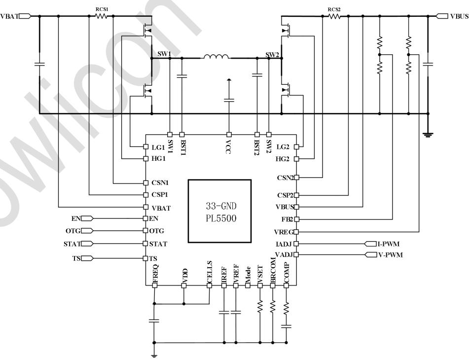  
Fig. 1 Application Schematic

# 5 Pin Configuration and Functions

  
Fig. 2 Pin-Function (QFN4X4-32)

<table><tr><td colspan="2" rowspan="1">Pin</td><td colspan="1" rowspan="2">Description</td></tr><tr><td colspan="1" rowspan="1">Number</td><td colspan="1" rowspan="1">Name</td></tr><tr><td colspan="1" rowspan="1">1</td><td colspan="1" rowspan="1">VADJ</td><td colspan="1" rowspan="1">Connect a 0-2V analog voltage or a PWM signal to program voltage reference on VREF pin.Connect this pin to VDDwillforce VREF toconstant 2V.</td></tr><tr><td colspan="1" rowspan="1">2</td><td colspan="1" rowspan="1">IADJ</td><td colspan="1" rowspan="1">Connect a O-2V analog voltage or a PWM signal to program voltage reference on IREF pin.Connect this pin to VDD will force IREF to 2V.</td></tr><tr><td colspan="1" rowspan="1">3</td><td colspan="1" rowspan="1">VSET</td><td colspan="1" rowspan="1">Connect a resistor between VSET and GND to program battery celltype (4.2V,4.35V,4.4V,4.5V) when OTG is low and PL5500 is working in battery charging mode. When OTG ishigher than 1.2V, voltage on VSET pin will be proportional to voltage difference betweenCSP2 and CSN2. Application processor can use this information to monitor dischargingcurrent in battery discharging mode.</td></tr><tr><td colspan="1" rowspan="1">4</td><td colspan="1" rowspan="1">IREF</td><td colspan="1" rowspan="1">Reference voltage for input and output current limiting loop.</td></tr><tr><td colspan="1" rowspan="1">5</td><td colspan="1" rowspan="1">VREF</td><td colspan="1" rowspan="1">Voltage reference for voltage control loop</td></tr><tr><td colspan="1" rowspan="1">6</td><td colspan="1" rowspan="1">BRCOM</td><td colspan="1" rowspan="1">Battery internal resistance compensation. The voltage on this pin will be proportional tovoltage difference between CSP1 and CSN1. Application processor can use this informationto monitor charging current in battery charging mode.</td></tr><tr><td colspan="1" rowspan="1">7</td><td colspan="1" rowspan="1">MODE</td><td colspan="1" rowspan="1">CCM/DCM mode set pin.Float can set the part operates in DCM mode inlight-load,connecting this pin to GND set the part operates in CCM mode.Mode is pulledhigh internally bya high value resistor.</td></tr><tr><td colspan="1" rowspan="1">8</td><td colspan="1" rowspan="1">STAT</td><td colspan="1" rowspan="1">Charging status display when OTG=Low. PGOOD signal when OTG=High.</td></tr><tr><td colspan="1" rowspan="1"></td><td colspan="1" rowspan="1">FREQ</td><td colspan="1" rowspan="1">Connect to GND to set the switching frequency at 150kHz. Connect this pin to VDD to setswitching frequency at 30okHz. Connect to a resistor divider between VDD and GND to setfrequency to 600k and 1200k Hz.</td></tr><tr><td colspan="1" rowspan="1">10</td><td colspan="1" rowspan="1">COMP</td><td colspan="1" rowspan="1">Error Amplifieroutput.</td></tr><tr><td colspan="1" rowspan="1">11</td><td colspan="1" rowspan="1">VREG</td><td colspan="1" rowspan="1">Add a resistor divider to program VBUS regulation voltage.When VBUS is pulled down tobe close to VREG setting point due to heavy charging current in battery charging mode, theVREG regulation loop will take over the control and lower down charging current to keepVBUS from being further puled down. VREG is not active in discharging mode.</td></tr><tr><td colspan="1" rowspan="1">12</td><td colspan="1" rowspan="1">FB2</td><td colspan="1" rowspan="1">VBUS voltage feedback. Connect a resistor divider between VBUS and GND to FB2 toprogram VBUS voltage in battery dischargingmode.</td></tr><tr><td colspan="1" rowspan="1">13</td><td colspan="1" rowspan="1">CSN2</td><td colspan="1" rowspan="1">The minus input of output current sense.</td></tr><tr><td colspan="1" rowspan="1">14</td><td colspan="1" rowspan="1">CSP2</td><td colspan="1" rowspan="1">The positive input of output current sense.</td></tr><tr><td colspan="1" rowspan="1">15</td><td colspan="1" rowspan="1">VBUS</td><td colspan="1" rowspan="1">VBUSvoltage</td></tr><tr><td colspan="1" rowspan="1">16</td><td colspan="1" rowspan="1">HG2</td><td colspan="1" rowspan="1">Highside MOSFET driver2.</td></tr><tr><td colspan="1" rowspan="1">17</td><td colspan="1" rowspan="1">BST2</td><td colspan="1" rowspan="1">Boost pin for high side MOSFET driver 2.</td></tr><tr><td colspan="1" rowspan="1">18</td><td colspan="1" rowspan="1">SW2</td><td colspan="1" rowspan="1">Connect this pin to the Switching point 2of the power stage.</td></tr><tr><td colspan="1" rowspan="1">19</td><td colspan="1" rowspan="1">LG2</td><td colspan="1" rowspan="1">Low side MOSFET driver output 2.</td></tr><tr><td colspan="1" rowspan="1">20</td><td colspan="1" rowspan="1">VCC</td><td colspan="1" rowspan="1">5.0V power supply for high side and low side driver</td></tr><tr><td colspan="1" rowspan="1">21</td><td colspan="1" rowspan="1">LG1</td><td colspan="1" rowspan="1">Lowside MOSFET driver output1.</td></tr><tr><td colspan="1" rowspan="1">22</td><td colspan="1" rowspan="1">SW1</td><td colspan="1" rowspan="1">Connect this pin to the Switching point1 of the power stage.</td></tr><tr><td colspan="1" rowspan="1">23</td><td colspan="1" rowspan="1">BST1</td><td colspan="1" rowspan="1">Boost pin for high side MOSFET driver1.</td></tr><tr><td colspan="1" rowspan="1">24</td><td colspan="1" rowspan="1">HG1</td><td colspan="1" rowspan="1">Highside MOSFETdriver1.</td></tr><tr><td colspan="1" rowspan="1">25</td><td colspan="1" rowspan="1">VBAT</td><td colspan="1" rowspan="1">Battery voltage or Input voltage.</td></tr><tr><td colspan="1" rowspan="1">26</td><td colspan="1" rowspan="1">CSP1</td><td colspan="1" rowspan="1">The positive input of input current sense.                                             </td></tr><tr><td colspan="1" rowspan="1">27</td><td colspan="1" rowspan="1">CSN1</td><td colspan="1" rowspan="1">The minus input of input current sense.</td></tr><tr><td colspan="1" rowspan="1">28</td><td colspan="1" rowspan="1">EN</td><td colspan="1" rowspan="1">Logic High will enable the converter.Logic Low will disable the whole PL5500 .EN is pulledhigh internallybya high value resistor.</td></tr><tr><td colspan="1" rowspan="1">29</td><td colspan="1" rowspan="1">CELLS</td><td colspan="1" rowspan="1">Connect a resistor divider between VDD and GND to program battery cells.</td></tr><tr><td colspan="1" rowspan="1">30</td><td colspan="1" rowspan="1">OTG</td><td colspan="1" rowspan="1">Connect OTG to 0 to set PL5500 in battery charging mode. Connect OTG to Mode to setPL5500 in battery discharging mode.</td></tr><tr><td colspan="1" rowspan="1">31</td><td colspan="1" rowspan="1">TS</td><td colspan="1" rowspan="1">Battertemperaturesense</td></tr><tr><td colspan="1" rowspan="1">32</td><td colspan="1" rowspan="1">VDD</td><td colspan="1" rowspan="1">5.4Vpowersupply for PL5500 control core.</td></tr></table>

# 6 Device Marking Information

<table><tr><td rowspan=1 colspan=1> Order Information</td><td rowspan=1 colspan=1> Label Part NO.</td><td rowspan=1 colspan=1> Package</td><td rowspan=1 colspan=1> Package Qty</td><td rowspan=1 colspan=1> Top Marking</td><td rowspan=1 colspan=1> MSL</td></tr><tr><td rowspan=1 colspan=1>PL5500</td><td rowspan=1 colspan=1>PL5500IQN32A</td><td rowspan=1 colspan=1>QFN4x4 - 32</td><td rowspan=1 colspan=1>4000</td><td rowspan=1 colspan=1>5500RAAYMD</td><td rowspan=1 colspan=1>3</td></tr></table>

PL5500: Part Number RAAYMD: RAA: LOT NO.; YMD: Package Date Code

# 7 Specifications

# 7.1 Absolute Maximum Ratings(Note1)

<table><tr><td rowspan=1 colspan=1>PARAMETER</td><td rowspan=1 colspan=1>MIN                         MAX</td><td rowspan=1 colspan=1>Unit</td></tr><tr><td rowspan=1 colspan=1>VBAT,VBUS,CSN1,CSN2,CSP1,CP2,SW1,SW2</td><td rowspan=1 colspan=1>-0.3                           40</td><td rowspan=9 colspan=1></td></tr><tr><td rowspan=1 colspan=1>HG1, BST1 to SW1</td><td rowspan=1 colspan=1>-0.3                           7</td></tr><tr><td rowspan=1 colspan=1>HG2, BST2 to SW2</td><td rowspan=1 colspan=1>-0.3                            7</td></tr><tr><td rowspan=1 colspan=1>LG1, LG2, VCC to GND</td><td rowspan=1 colspan=1>-0.3                            7</td></tr><tr><td rowspan=1 colspan=1>CSP1 to CSN1</td><td rowspan=1 colspan=1>-0.3                          0.6</td></tr><tr><td rowspan=1 colspan=1>CSP2 to CSN2</td><td rowspan=1 colspan=1>-0.3                          0.6</td></tr><tr><td rowspan=1 colspan=1>VBAT to CSP1, CSN1</td><td rowspan=1 colspan=1>-0.3                          0.6</td></tr><tr><td rowspan=1 colspan=1>VBUS to CSP2, CSN2</td><td rowspan=1 colspan=1>-0.3                          0.6</td></tr><tr><td rowspan=1 colspan=1>Other Pins to GND</td><td rowspan=1 colspan=1>-0.3                            6</td></tr></table>

# 7.2 Handling Ratings

<table><tr><td rowspan=1 colspan=1>PARAMETER</td><td rowspan=1 colspan=1>DEFINITION</td><td rowspan=1 colspan=1>MIN            MAX</td><td rowspan=1 colspan=1>UNIT</td></tr><tr><td rowspan=1 colspan=1>TsT</td><td rowspan=1 colspan=1> Storage Temperature Range</td><td rowspan=1 colspan=1>-65             150</td><td rowspan=1 colspan=1>℃</td></tr><tr><td rowspan=1 colspan=1>T</td><td rowspan=1 colspan=1>Junction Temperature</td><td rowspan=1 colspan=1>1        +150</td><td rowspan=1 colspan=1>℃</td></tr><tr><td rowspan=1 colspan=1>T</td><td rowspan=1 colspan=1> Lead Temperature                             T</td><td rowspan=1 colspan=1>&lt;           +260</td><td rowspan=1 colspan=1>℃</td></tr><tr><td rowspan=1 colspan=1>VESD</td><td rowspan=1 colspan=1>HBM Humanbodymodel</td><td rowspan=1 colspan=1>2</td><td rowspan=1 colspan=1>kV</td></tr></table>

# 7.3 Recommended Operating Conditions (Note 2)

<table><tr><td></td><td>PARAMETER</td><td> MIN</td><td>MAX</td><td> Unit</td></tr><tr><td>Input Voltages</td><td>VBAT ,VBUS</td><td>3.6</td><td>32</td><td>V</td></tr><tr><td>Temperature</td><td>Operating junction temperature range, TJ</td><td>-40</td><td>+125</td><td>℃</td></tr></table>

# 7.4 Thermal Information(Note 3)

<table><tr><td rowspan=1 colspan=1>Symbol</td><td rowspan=1 colspan=1>Description</td><td rowspan=1 colspan=1>QFN4X4-32</td><td rowspan=1 colspan=1>Unit</td></tr><tr><td rowspan=1 colspan=1>0JA</td><td rowspan=1 colspan=1> Junction to ambient thermal resistance</td><td rowspan=1 colspan=1>44</td><td rowspan=2 colspan=1>C/W</td></tr><tr><td rowspan=1 colspan=1>0Jc</td><td rowspan=1 colspan=1> Junction to case thermal resistance</td><td rowspan=1 colspan=1>9</td></tr></table>

# Notes:

1) Exceeding these ratings may damage the device.   
2) The device function is not guaranteed outside of the recommended operating conditions.   
3) Measured on approximately 1” square of 1 oz copper.

7.5 Electrical Characteristics (Typical at VBAT $\equiv$ 12V, ${ \mathsf { T } } _ { \mathsf { J } } = 2 5 ^ { \circ } { \mathsf { C } }$ , unless otherwise noted.)   

<table><tr><td colspan="1" rowspan="1">Supply voltages</td><td colspan="1" rowspan="1">PARAMETER</td><td colspan="1" rowspan="1">CONDITION</td><td colspan="1" rowspan="1">MIN TYP MAX</td><td colspan="1" rowspan="1">UNIT</td></tr><tr><td colspan="1" rowspan="1">VBAT</td><td colspan="1" rowspan="1">Batteryvoltage</td><td colspan="1" rowspan="1"></td><td colspan="1" rowspan="1">3.6             32</td><td colspan="1" rowspan="1">v</td></tr><tr><td colspan="1" rowspan="2">lQ_VBAT</td><td colspan="1" rowspan="1">VBAT Shutdown Current</td><td colspan="1" rowspan="1">EN=0V，VBAT=7.2V</td><td colspan="1" rowspan="1">15</td><td colspan="1" rowspan="1">uA</td></tr><tr><td colspan="1" rowspan="1">VBATSupply Current</td><td colspan="1" rowspan="1">No Switching,FB=2.1V</td><td colspan="1" rowspan="1">1000</td><td colspan="1" rowspan="1">uA</td></tr><tr><td colspan="1" rowspan="1">VBUS</td><td colspan="1" rowspan="1">Bus line voltage</td><td colspan="1" rowspan="1"></td><td colspan="1" rowspan="1">3.6             32</td><td colspan="1" rowspan="1">v</td></tr><tr><td colspan="1" rowspan="2">lo_VBUS</td><td colspan="1" rowspan="1">VBUS Shutdown Current</td><td colspan="1" rowspan="1">EN=0V，VBUS=7.2V</td><td colspan="1" rowspan="1">15</td><td colspan="1" rowspan="1">uA</td></tr><tr><td colspan="1" rowspan="1">VBUS Supply Current</td><td colspan="1" rowspan="1">No Switching,batteryfullycharged</td><td colspan="1" rowspan="1">1200     ?</td><td colspan="1" rowspan="1">uA</td></tr><tr><td colspan="1" rowspan="1">Vvcc</td><td colspan="1" rowspan="1">Driver powersupplyvoltage</td><td colspan="1" rowspan="1">VBAT=15V</td><td colspan="1" rowspan="1">5.0</td><td colspan="1" rowspan="1">V</td></tr><tr><td colspan="1" rowspan="1">VvDD</td><td colspan="1" rowspan="1">Control core power supply voltage</td><td colspan="1" rowspan="1">VBAT=15V</td><td colspan="1" rowspan="1">5.4</td><td colspan="1" rowspan="1">v</td></tr><tr><td colspan="1" rowspan="1"></td><td colspan="1" rowspan="1"></td><td colspan="1" rowspan="1"></td><td colspan="1" rowspan="1">1</td><td colspan="1" rowspan="1"></td></tr><tr><td colspan="1" rowspan="1"></td><td colspan="1" rowspan="1"></td><td colspan="1" rowspan="1"></td><td colspan="1" rowspan="1"></td><td colspan="1" rowspan="1">√</td></tr><tr><td colspan="1" rowspan="1">UVLO/EN</td><td colspan="1" rowspan="1"></td><td colspan="1" rowspan="1"></td><td colspan="1" rowspan="1"></td><td colspan="1" rowspan="1"></td></tr><tr><td colspan="1" rowspan="2">VBAT_uv</td><td colspan="1" rowspan="1">VBAT UVLORising</td><td colspan="1" rowspan="1"></td><td colspan="1" rowspan="1">3.5</td><td colspan="1" rowspan="1">v</td></tr><tr><td colspan="1" rowspan="1">UVLO Hysteresis</td><td colspan="1" rowspan="1"></td><td colspan="1" rowspan="1">300</td><td colspan="1" rowspan="1">mV</td></tr><tr><td colspan="1" rowspan="2">VBUS_uv</td><td colspan="1" rowspan="1">VBUS UVLO Rising</td><td colspan="1" rowspan="1"></td><td colspan="1" rowspan="1">3.5</td><td colspan="1" rowspan="1">v</td></tr><tr><td colspan="1" rowspan="1">UVLO Hysteresis</td><td colspan="1" rowspan="1"></td><td colspan="1" rowspan="1">300</td><td colspan="1" rowspan="1">mV</td></tr><tr><td colspan="1" rowspan="2">VEN_UV</td><td colspan="1" rowspan="1">Operation Threshold</td><td colspan="1" rowspan="1"></td><td colspan="1" rowspan="1">1.1    1.2 1.3</td><td colspan="1" rowspan="1">v</td></tr><tr><td colspan="1" rowspan="1">Hysteresis</td><td colspan="1" rowspan="1"></td><td colspan="1" rowspan="1">200</td><td colspan="1" rowspan="1">mV</td></tr><tr><td colspan="1" rowspan="1">OTG</td><td colspan="1" rowspan="1"></td><td colspan="1" rowspan="1"></td><td colspan="1" rowspan="1"></td><td colspan="1" rowspan="1"></td></tr><tr><td colspan="1" rowspan="1">VTH_OTG</td><td colspan="1" rowspan="1">OTG high voltage threshold</td><td colspan="1" rowspan="1"></td><td colspan="1" rowspan="1">1.2</td><td colspan="1" rowspan="1">v</td></tr><tr><td colspan="1" rowspan="1">VHYOTG</td><td colspan="1" rowspan="1">OTG Hysteresis</td><td colspan="1" rowspan="1"></td><td colspan="1" rowspan="1">200</td><td colspan="1" rowspan="1">mV</td></tr><tr><td colspan="1" rowspan="1">VREF</td><td colspan="1" rowspan="1"></td><td colspan="1" rowspan="1"></td><td colspan="1" rowspan="1"></td><td colspan="1" rowspan="1"></td></tr><tr><td colspan="1" rowspan="1">VvREF_Dischg</td><td colspan="1" rowspan="1">VREFvoltage in discharge mode</td><td colspan="1" rowspan="1">VADJ connected to VDD</td><td colspan="1" rowspan="1">2</td><td colspan="1" rowspan="1">v</td></tr><tr><td colspan="1" rowspan="1">VvREF_chg</td><td colspan="1" rowspan="1">VREFvoltage inchargemode</td><td colspan="1" rowspan="1">VADJconnected to VDD</td><td colspan="1" rowspan="1">1.8</td><td colspan="1" rowspan="1">V</td></tr><tr><td colspan="1" rowspan="1">Battery charge setting</td><td colspan="1" rowspan="1">ting</td><td colspan="1" rowspan="1"></td><td colspan="1" rowspan="1"></td><td colspan="1" rowspan="1"></td></tr><tr><td colspan="1" rowspan="6">Vcel_num</td><td colspan="1" rowspan="6">Battery cells number setting.  Vcellis set by VSET pin.</td><td colspan="1" rowspan="1">VCELLS=0-0.9V</td><td colspan="1" rowspan="1">1*Vcell</td><td colspan="1" rowspan="1">V</td></tr><tr><td colspan="1" rowspan="1">VCELLS=4.5-5.5V</td><td colspan="1" rowspan="1">2*Vcell</td><td colspan="1" rowspan="1">v</td></tr><tr><td colspan="1" rowspan="1">VCELLS=0.9-1.8V</td><td colspan="1" rowspan="1">3*Vcel</td><td colspan="1" rowspan="1">V</td></tr><tr><td colspan="1" rowspan="1">VCELLS=1.8-2.7V</td><td colspan="1" rowspan="1">4*Vcell</td><td colspan="1" rowspan="1">v</td></tr><tr><td colspan="1" rowspan="1">VCELLS=2.7-3.6V</td><td colspan="1" rowspan="1">5*Vcell</td><td colspan="1" rowspan="1">V</td></tr><tr><td colspan="1" rowspan="1">VCELLS=3.6-4.5V</td><td colspan="1" rowspan="1">6*Vcell</td><td colspan="1" rowspan="1">v</td></tr><tr><td colspan="1" rowspan="1">VTH_TRKL</td><td colspan="1" rowspan="1">Trickle charge threshold.VBATvoltage</td><td colspan="1" rowspan="1"></td><td colspan="1" rowspan="1">3</td><td colspan="1" rowspan="1">V</td></tr><tr><td colspan="1" rowspan="1">VHY_TRKL</td><td colspan="1" rowspan="1">Trickle charge Hysteresis.VBATvoltage</td><td colspan="1" rowspan="1"></td><td colspan="1" rowspan="1">0.5</td><td colspan="1" rowspan="1">V</td></tr><tr><td colspan="1" rowspan="1">VRECHAG</td><td colspan="1" rowspan="1">Battery recharge voltage</td><td colspan="1" rowspan="1"></td><td colspan="1" rowspan="1">4</td><td colspan="1" rowspan="1">v</td></tr><tr><td colspan="1" rowspan="4">VBAT_FULL</td><td colspan="1" rowspan="4">Batter full charge voltage</td><td colspan="1" rowspan="1">VvsET:0.4-0.9VRset:220k</td><td colspan="1" rowspan="1">4.2</td><td colspan="1" rowspan="1">v</td></tr><tr><td colspan="1" rowspan="1">VvsET :0.9-1.9VRset:430k</td><td colspan="1" rowspan="1">4.35</td><td colspan="1" rowspan="1">v</td></tr><tr><td colspan="1" rowspan="1">VvSET :1.9-5.5V，short VSET pin to VDD.</td><td colspan="1" rowspan="1">4.4</td><td colspan="1" rowspan="1">V</td></tr><tr><td colspan="1" rowspan="1">VvSET :0-0.4V,short VSET pin to GND.</td><td colspan="1" rowspan="1">4.5</td><td colspan="1" rowspan="1">V</td></tr><tr><td colspan="1" rowspan="1">VREG</td><td colspan="1" rowspan="1"> Charge Input regulation voltage</td><td colspan="1" rowspan="1">VREG</td><td colspan="1" rowspan="1">1.2</td><td colspan="1" rowspan="1">v</td></tr><tr><td colspan="1" rowspan="1">Controlloop</td><td colspan="1" rowspan="1"></td><td colspan="1" rowspan="1"></td><td colspan="1" rowspan="1"></td><td colspan="1" rowspan="1"></td></tr><tr><td colspan="1" rowspan="1">VFB2</td><td colspan="1" rowspan="1">VFB2 regulation voltage indischarging mode</td><td colspan="1" rowspan="1">FB2 voltage</td><td colspan="1" rowspan="1">2</td><td colspan="1" rowspan="1">V</td></tr><tr><td colspan="1" rowspan="1">GmEA</td><td colspan="1" rowspan="1">Erroramplifier gm</td><td colspan="1" rowspan="1"></td><td colspan="1" rowspan="1">450</td><td colspan="1" rowspan="1">uS</td></tr><tr><td colspan="1" rowspan="1">IsINK</td><td colspan="1" rowspan="1">COMP sink/source current</td><td colspan="1" rowspan="1">VFB=VREF+100mV</td><td colspan="1" rowspan="1">15</td><td colspan="1" rowspan="1">uA</td></tr><tr><td colspan="1" rowspan="1">IsOURCE</td><td colspan="1" rowspan="1">COMP source current</td><td colspan="1" rowspan="1">VFB=VREF-100mV</td><td colspan="1" rowspan="1">20</td><td colspan="1" rowspan="1">uA</td></tr><tr><td colspan="1" rowspan="1">IFB2</td><td colspan="1" rowspan="1">FB2 bias current</td><td colspan="1" rowspan="1">FB2 in regulation</td><td colspan="1" rowspan="1">100</td><td colspan="1" rowspan="1">nA</td></tr><tr><td colspan="5" rowspan="1">Frequency</td></tr><tr><td colspan="1" rowspan="4">Fsw</td><td colspan="1" rowspan="4">Switching Frequency</td><td colspan="1" rowspan="1">FREQ 0-0.4V,short FREQpin to GND.</td><td colspan="1" rowspan="1">150</td><td colspan="1" rowspan="1">KHz</td></tr><tr><td colspan="1" rowspan="1">FREQ 1.8-5.4V, shortFREQ pin to VDD.</td><td colspan="1" rowspan="1">300</td><td colspan="1" rowspan="1">KHz</td></tr><tr><td colspan="1" rowspan="1">FREQ0.4-0.85V</td><td colspan="1" rowspan="1">600</td><td colspan="1" rowspan="1">KHz</td></tr><tr><td colspan="1" rowspan="1">FREQ0.85-1.8V</td><td colspan="1" rowspan="1">1200</td><td colspan="1" rowspan="1">KHz</td></tr><tr><td colspan="1" rowspan="2">IcCLIM_BAT</td><td colspan="1" rowspan="2">Battery average current Limit,VcsP1- VcSN1</td><td colspan="1" rowspan="1">Discharging mode</td><td colspan="1" rowspan="1">80</td><td colspan="1" rowspan="1">mV</td></tr><tr><td colspan="1" rowspan="1">Charging mode</td><td colspan="1" rowspan="1">40</td><td colspan="1" rowspan="1">mV</td></tr><tr><td colspan="1" rowspan="2">IcCLIM_BUS</td><td colspan="1" rowspan="2">Bus average current Limit,VcsP2- VcSN2</td><td colspan="1" rowspan="1">Discharging mode</td><td colspan="1" rowspan="1">40</td><td colspan="1" rowspan="1">mV</td></tr><tr><td colspan="1" rowspan="1">Charging mode</td><td colspan="1" rowspan="1">80</td><td colspan="1" rowspan="1"></td></tr><tr><td colspan="5" rowspan="1">NMOS Driver</td></tr><tr><td colspan="1" rowspan="2">IHDRV1,2(Note 4)</td><td colspan="1" rowspan="1">Driver peak source current</td><td colspan="1" rowspan="1">VBST-VSW=5.0V</td><td colspan="1" rowspan="1">2</td><td colspan="1" rowspan="1">A</td></tr><tr><td colspan="1" rowspan="1">Driver peak sink current</td><td colspan="1" rowspan="1">VBST-VSW=5.0V</td><td colspan="1" rowspan="1">2</td><td colspan="1" rowspan="1">A</td></tr><tr><td colspan="1" rowspan="2">ILDRV1,2(Note 4)</td><td colspan="1" rowspan="1">Driver peak source current</td><td colspan="1" rowspan="1">VCC=5.0V</td><td colspan="1" rowspan="1">2</td><td colspan="1" rowspan="1">A</td></tr><tr><td colspan="1" rowspan="1">Driver peak sink current</td><td colspan="1" rowspan="1">VCC=5.0V</td><td colspan="1" rowspan="1">2</td><td colspan="1" rowspan="1">A</td></tr><tr><td colspan="1" rowspan="2">VBSTUV</td><td colspan="1" rowspan="1">UVLO</td><td colspan="1" rowspan="1"></td><td colspan="1" rowspan="1">2</td><td colspan="1" rowspan="1">V</td></tr><tr><td colspan="1" rowspan="1">UVLO Hysteresis</td><td colspan="1" rowspan="1"></td><td colspan="1" rowspan="1">300</td><td colspan="1" rowspan="1">mV</td></tr><tr><td colspan="3" rowspan="1"> Output Protection</td><td colspan="2" rowspan="1">A</td></tr><tr><td colspan="1" rowspan="1">VovP</td><td colspan="1" rowspan="1">Output over voltage threshold</td><td colspan="1" rowspan="1"></td><td colspan="1" rowspan="1">110</td><td colspan="1" rowspan="1">%</td></tr><tr><td colspan="1" rowspan="1">VuvP</td><td colspan="1" rowspan="1">Output under voltage threshold</td><td colspan="1" rowspan="1"></td><td colspan="1" rowspan="1">50</td><td colspan="1" rowspan="1">%</td></tr><tr><td colspan="5" rowspan="1">VADJ, IADJ</td></tr><tr><td colspan="1" rowspan="2">VTH_VADJ(Note 4)</td><td colspan="1" rowspan="1">VPWMlow voltage</td><td colspan="1" rowspan="1"></td><td colspan="1" rowspan="1">0.4</td><td colspan="1" rowspan="1">v</td></tr><tr><td colspan="1" rowspan="1">VPWMhigh voltage</td><td colspan="1" rowspan="1"></td><td colspan="1" rowspan="1">2.5</td><td colspan="1" rowspan="1">V</td></tr><tr><td colspan="1" rowspan="2">VTH_IADJ(Note 4)</td><td colspan="1" rowspan="1">IPWMlow voltage</td><td colspan="1" rowspan="1"></td><td colspan="1" rowspan="1">0.4</td><td colspan="1" rowspan="1">V</td></tr><tr><td colspan="1" rowspan="1">IPWM high voltage</td><td colspan="1" rowspan="1"></td><td colspan="1" rowspan="1">2.5</td><td colspan="1" rowspan="1">V</td></tr><tr><td colspan="1" rowspan="1">TsD(Note 4)</td><td colspan="1" rowspan="1">Thermal Shutdown Threshold</td><td colspan="1" rowspan="1"></td><td colspan="1" rowspan="1">150</td><td colspan="1" rowspan="1">℃</td></tr><tr><td colspan="1" rowspan="1">THYs(Note 4)</td><td colspan="1" rowspan="1">Thermal Shutdown Hysteresis</td><td colspan="1" rowspan="1"></td><td colspan="1" rowspan="1">20</td><td colspan="1" rowspan="1">℃</td></tr></table>

# Notes:

4) Guaranteed by design.

# 8 Typical Characteristics

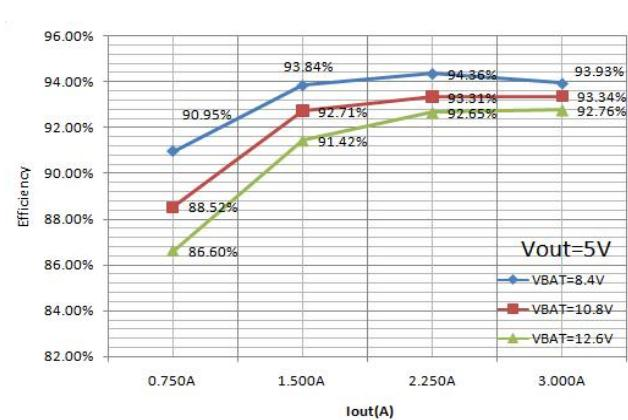

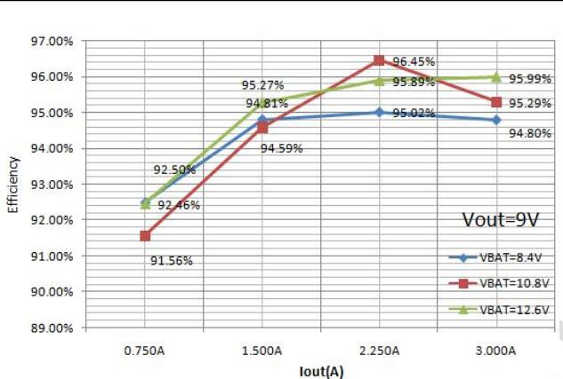

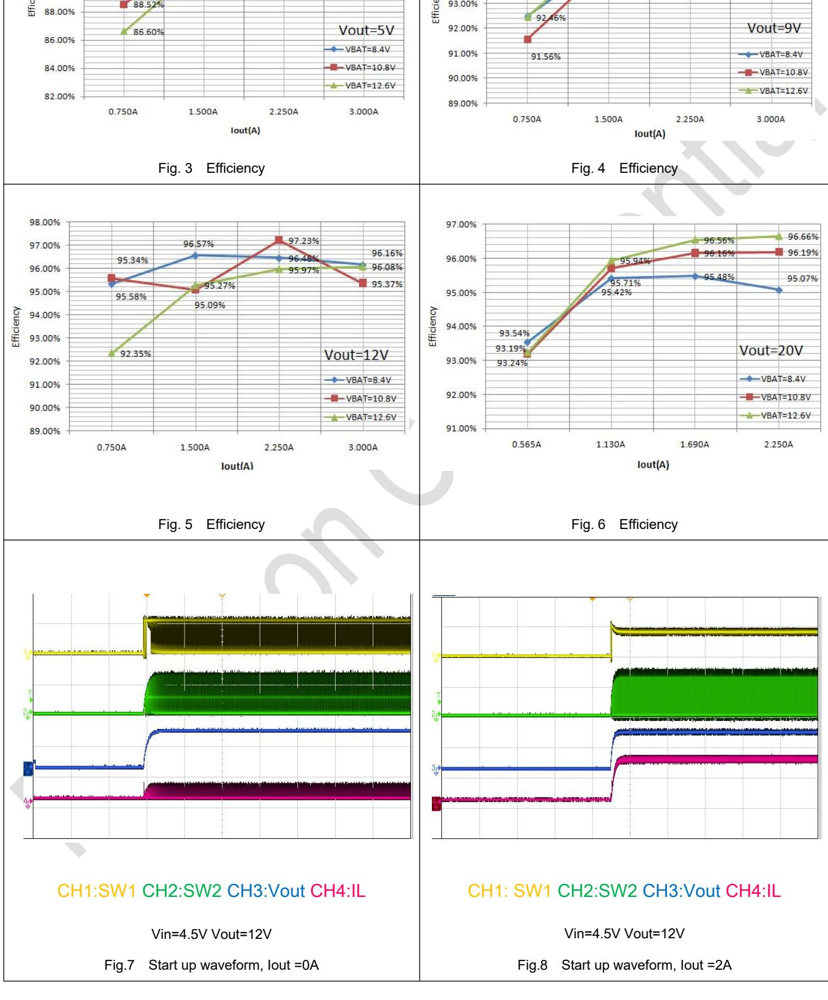

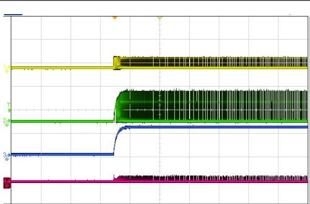

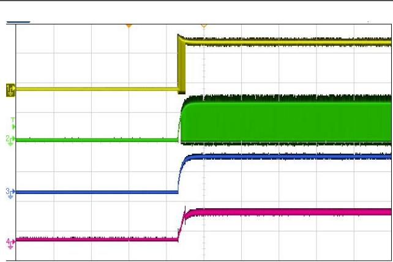

# CH1: SW1 CH2:SW2 CH3:Vout CH4:IL

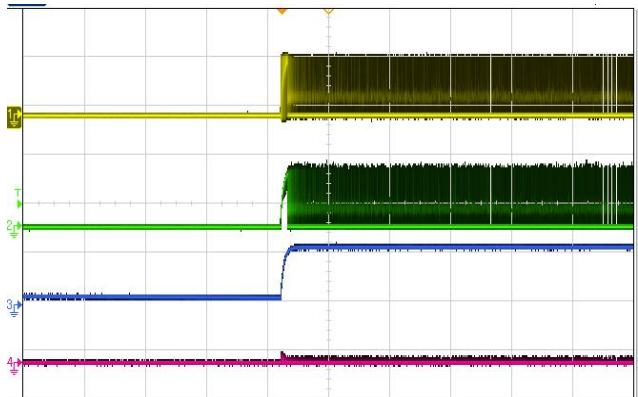  
Fig.9 Start up waveform, Iout $\mathtt { \Gamma = 0 A }$

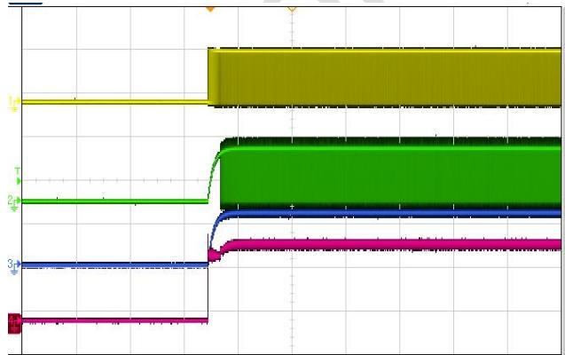  
Fig.10 Start up waveform, Iout =3A

# CH1: SW1 CH2:SW2 CH3:Vout CH4:IL

# CH1: SW1 CH2:SW2 CH3:Vout CH4:IL

Vin=12V Vout=12V

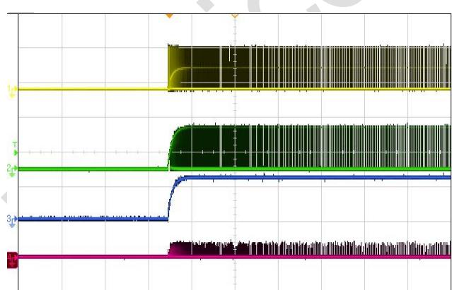  
Fig.11 Start up waveform, Iout =0A   
Fig.13 Start up waveform, Iout $\mathtt { \Gamma = 0 A }$

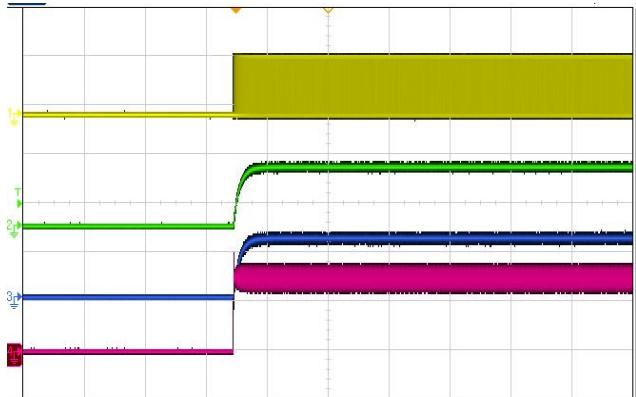  
Fig.12 Start up waveform, Iout $\mathtt { = 3 A }$   
Fig.14 Start up waveform, Iout $\mathtt { = 3 A }$

Vin=24V Vout=12V

Vin=24V Vout=12V

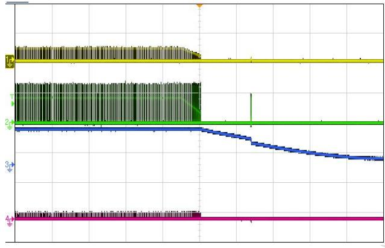  
Fig.15 Shut down waveform, Iout $\mathtt { \Gamma = 0 A }$

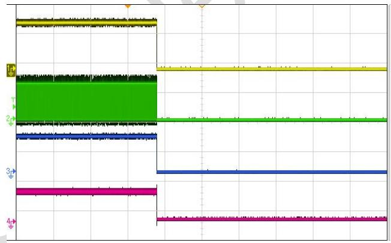  
Fig.16 Shut down waveform, Iout $= 2 A$

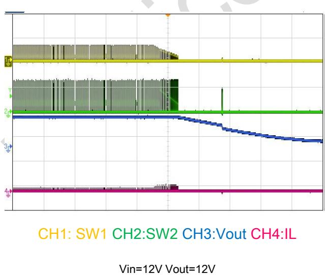  
Fig.17 Shut down waveform, Iout =0A   
Fig.19 Shut down waveform, Iout $\mathtt { \Gamma = 0 A }$

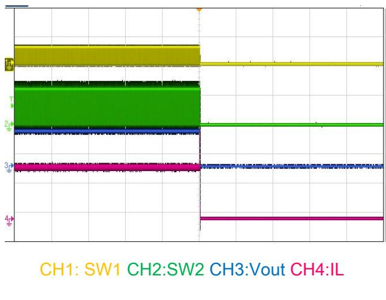  
Fig.18 Shut down waveform, Iout $\mathtt { = 3 A }$   
Fig.20 Shut down waveform, Iout $\mathtt { = 3 A }$

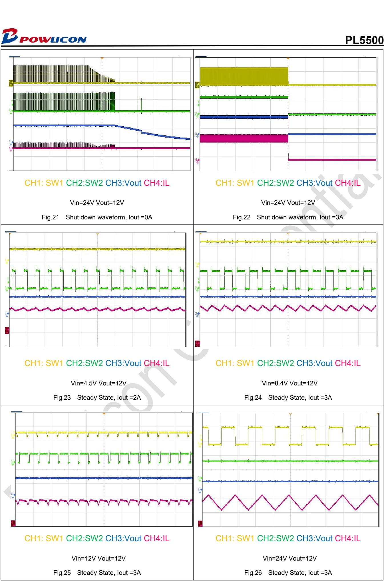

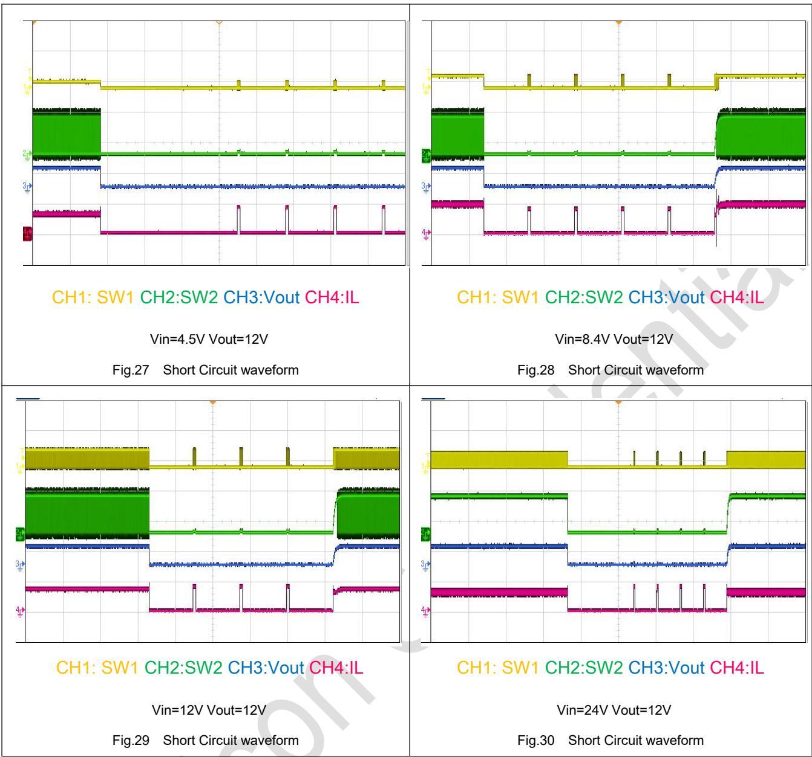

# 9 Detailed Descriptions

# 9.1 Overview

PL5500 is a synchronous 4-switch bidirectional Buck-Boost controller capable of regulating the output voltage at, above, or below the input voltage. PL5500 operates over a wide input voltage range of $3 . 6 \lor$ to $_ { 3 2 \vee }$ (36 V maximum) to support a variety of applications. PL5500 can operate at charger mode for 1, 2, 3, 4, 5 and 6 cells battery charge. It operates in buck mode when $\vee _ { \mathsf { I N } }$ is greater than VOUT and in the boost mode when $\vee _ { \mathsf { I N } }$ is less than VOUT. When $\vee _ { \mathbb { N } }$ is close to VOUT, the device operates in a proprietary buck-boost mode. The control scheme provides smooth operation for any input/output combination within the specified operating range. In discharging mode with OTG=high, $\vee _ { \mathbb { N } }$ is VBAT, VOUT is VBUS. In charging mode with $\ O \mathsf { T } \mathsf { G } \mathbf { = }$ low, $\vee _ { \mathbb { N } }$ is VBUS, VOUT is VBAT.

# 9.2 Functional Block Diagram

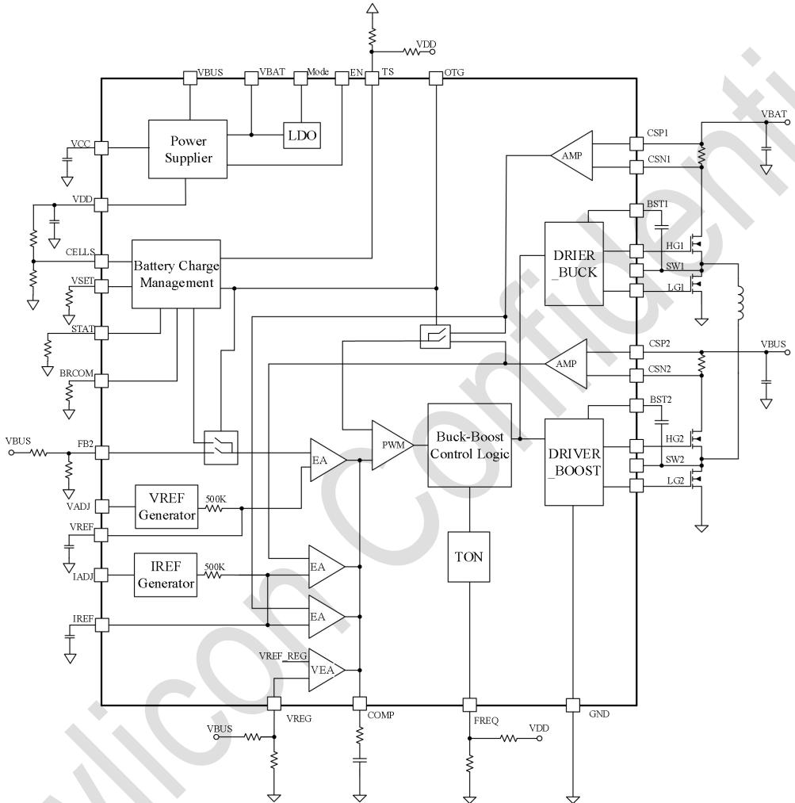  
Fig. 31 PL5500 Block Diagram

# 9.3 Enable/UVLO

When EN is greater than 1.2V operating threshold, the control loop starts to work and regulate output to target voltage. When EN pin is below the standby threshold (1.1V typical), PL5500 stops working . EN is pulled high to 4V internally using a 2Meg resistor.

# 9.4 Over current Protection and short circuit protection

PL5500 provides cycle-by-cycle current limit to protect against over current and short circuit conditions. When VOUT is drop to UV threshold, PL5500 will go into hiccup mode to lower down power consumption.

# 9.5 Average Input/Output Current Limiting

PL5500 provides optional average current limiting capability to limit either the input or the output current. The average current limiting circuit uses an additional current sense resistor connected in series with the input supply or output voltage of the converter. A current sense gm amplifier with inputs at the CSP1 and CSN1 pins monitors the voltage across the sensing resistor and compares it with an internal $4 0 ~ \mathsf { m V }$ reference. If the drop across the sense resistor is greater than 40 mV, the gm amplifier regulates COMP voltage to lower down input or output current. The target constant current is given by Equation 1:

$$
\begin{array} { r } { I _ { C L ( A V G ) } = \frac { 4 0 m V } { R _ { S N S } } } \end{array}
$$

The average current loop can be disabled by shorting CSP1 to CSN1 or CSP2 to CSN2.

# 9.6 Frequency Setting (FREQ) and frequency dithering

PL5500 switching frequency can be programmed at $1 5 0 ~ \mathsf { k H z }$ , $3 0 0 ~ \mathsf { k H z }$ or 600 kHz and 1200 kHz by voltage at FREQ pin to GND. When FREQ is connected to AGND, the switching frequency is set at $1 5 0 ~ \mathsf { k H z }$ . When FREQ is connected to VDD, the switching frequency is set at $3 0 0 ~ \mathsf { k H z }$ . A voltage divider between VDD and GND pin can be used to program switching frequency if $6 0 0 ~ \mathsf { k H z }$ or $1 2 0 0 ~ \mathsf { k H z }$ is required.

# 9.7 Integrated Gate Drivers

PL5500 provides four N-channel MOSFET gate drivers: two floating high-side gate drivers at the HG1 and HG2 pins, and two ground referenced low-side drivers at the LG1 and LG2 pins. Each driver is capable of sourcing 2 A and sinking 2 A peak current. In buck operation, LG1 and HG1 are switched by the PWM controller while HG2 remains continuously on. In boost operation, LG2 and HG2 are switched while HG1 remains continuously on. In DCM buck operation, LG1 and HG2 are turned off when the inductor current drops to zero (diode emulation).

The gate drive output HG2 remains off before the first high side switch is turned on to prevent reverse current flow from a pre-biased output..

# 9.8 Thermal Shutdown

PL5500 is protected by a thermal shutdown circuit that shuts down the device when the internal junction temperature exceeds $1 6 0 ^ { \circ } \mathsf { C }$ (typical). The soft-start capacitor is discharged when thermal shutdown is triggered and the gate drivers are disabled. The converter automatically restarts when the junction temperature drops by the thermal shutdown hysteresis of $1 5 ^ { \circ } \mathsf { C }$ below the thermal shutdown threshold.

# 9.9 Thermal sensing TS

PL5500 use TS pin to sense battery temperature. A voltage divider can be used at TS pin to program the protection trigger point in charging mode or discharging mode.

# 9.10 Battery internal resistor compensation

BRCOMP pin is used to compensate battery internal resistance during high current charging period. A resistor between BRCOMP pin and GND is used to program voltage compensation as the following equation:

$$
\begin{array} { r } { \Delta V b a t = \frac { R c s * I b a t * A i s e n s e * 8 k } { R b r c o m } } \end{array}
$$

∆???? is the compensated batter voltage change. Rcs is current sensing resistor at VBAT side. Ibat is battery charging current. Aisense is current sensing gain at VBAT side, which is normally around 50. Rbrcom is resistor value between BRCOM pin and GND.

# 9.11 Status display STAT and power good signal

PL5500 use STAT pin as charging status display in battery charging mode and power good signal in discharging mode. When single battery voltage is less than 3V, STAT will send out a PWM signal at 0.6s period with $50 \%$ duty cycle. When battery voltage is higher than 3V, STAT pin will be constant low to indicate high current charging status. When battery

voltage is higher than 4V and charging current is lower than the termination current level, STAT will send out constant high signal to indicate the battery is charged fully.

In discharging mode, STAT will act as a power good signal. STAT will be constant high when FB voltage is not in OV or UV status.

# 9.12 VREF and IREF

VREF pin is the final reference voltage used in the voltage regulation loop. When VADJ is connected to VDD, VREF will be 2V in discharging mode and 1.8V in charging mode. When VADJ is connected to a PWM signal, PWM signal will first be chopped to 2V and filter out using an internal resistor and external capacitor on VREF pin. The capacitor on VREF pin is also acting as soft-start capacitor at power up or in output voltage transition period. It is recommend using a relatively large capacitor such as 470nF for VREF pin and IREF pin.

The same mechanism works for IADJ and IREF pin.

# 10 Applications and Implementation

The typical application on the first page is a basic PL5500 application circuit. External component selection is driven by the load requirement, and begins with the selection of RS1, RS2 and the inductor value. Next, the power MOSFETs need to be selected. Finally, $\mathsf { C } _ { \mathsf { I N } }$ and ${ \mathsf { C o u r } }$ are selected. This circuit can be configured for operation up to an input voltage of 32V.

# $1 0 . 1 \mathrm { R c s }$ Selection

As shown in Figures 32, input/output current sense resistor RCS1/RCS2 should be placed between the bulk capacitor for VBAT/VBUS and the decoupling capacitor. A low pass filter formed by RF and CF is recommended to reduce the switching noise and stabilize the current loop. If input/output current limit is not desired, then CSP1/CSN1 and CSP2/CSN2 pins should be shorted to either VBAT or VBUS.Place CSP1/CSN1, CSP2/CSN2 symmetrically and keep them away switching signals such as BST1, BST2, SW1, SW2, VBAT, VBUS etc.

# 10.2 Inductor Selection

The operating frequency and inductor selection are interrelated in that higher operating frequencies allow the use of smaller inductor and capacitor values. The inductor value has a direct effect on ripple current. The inductor current ripple $\Delta { \sf l } _ { \sf L }$ is typically set to $20 \%$ to $40 \%$ of the maximum inductor current in the boost region at VIN(MIN).

For a given ripple, the inductance terms in continuous mode are as follows:

$$
\begin{array} { r l } & { \mathsf { L } _ { \mathsf { B O O S T } } > \frac { \mathsf { V } _ { \mathsf { I N } ( \mathsf { M I N } ) } \mathsf { \Lambda } ^ { 2 \star } ( \mathsf { V } _ { \mathsf { O U T } } - \mathsf { V } _ { \mathsf { I N } ( \mathsf { M I N } ) } ) \star 1 0 0 0 } { \mathsf { f } ^ { \star } \Delta \mathsf { I } _ { \mathsf { L } } \star \mathsf { V } _ { \mathsf { O U T } } } \mathsf { u } \mathsf { H } } \\ & { \mathsf { L } _ { \mathsf { B U C K } } > \frac { \mathsf { V } _ { \mathsf { O U T } } \star \bigl ( \mathsf { V } _ { \mathsf { I N } ( \mathsf { M A X } ) } - \mathsf { V } _ { \mathsf { O U T } } \bigr ) \star 1 0 0 0 } { \mathsf { f } ^ { \star } \Delta \mathsf { I } _ { \mathsf { L } } \star \mathsf { V } _ { \mathsf { I N } ( \mathsf { M A X } ) } } \mathsf { u } \mathsf { H } } \end{array}
$$

where: f is operating frequency, kHz

$\mathsf { V } _ { \mathsf { I N ( M I N ) } }$ is minimum input voltage, V

$\mathsf { V } _ { \mathsf { I N } ( \mathsf { M A X } ) }$ is maximum input voltage, V

$\mathsf { V o u r }$ is output voltage, V

$\Delta { \sf l } _ { \sf L }$ is maximum inductor ripple current, A, usually select $2 0 { \sim } 4 0 \%$ maximum output current.

For high efficiency, choose an inductor with low core loss, such as ferrite. Also, the inductor should have low DC resistance to reduce the I2R losses, and must be able to handle the peak inductor current without saturating. To minimize radiated noise, use a toroid, pot core or shielded bobbin inductor.

# $1 0 . 3 \complement _ { \textrm { I N } }$ and COUT Selection

In the boost region, input current is continuous. In the buck region, input current is discontinuous. In the buck region, the selection of input capacitor $\mathsf { C } _ { \mathsf { I N } }$ is driven by the need to filter the input square wave current. Use a low ESR capacitor sized to handle the maximum RMS current. For buck operation, the input RMS current is given by:

$$
\mathsf { I } _ { \mathsf { C I N } } { = } \mathsf { I } _ { \mathrm { O U T ( M A X ) } } \times \sqrt { \frac { \mathsf { V } _ { \mathrm { O U T } } } { \mathsf { V } _ { \mathsf { I N } } } \times \left( 1 - \frac { \mathsf { V } _ { \mathrm { O U T } } } { \mathsf { V } _ { \mathsf { I N } } } \right) }
$$

This input current has a maximum at $\nu _ { ^ { \mathrm { I N } } } = 2 \mathsf { V o u r } , \mathsf { l c u s } ( \mathsf { M A X } ) = \mathsf { l o u r } ( \mathsf { M A X } ) / 2 .$ .

In the boost region, COUT must be capable of reducing the output voltage ripple because of the discontinuous output current. The effects of ESR (equivalent series resistance) and the bulk capacitance must be considered when choosing the right capacitor for a given output ripple voltage. The steady ripple due to charging and discharging the bulk capacitance is given by:

$$
\begin{array} { r } { \Delta \mathsf { V } _ { ( \mathsf { B O O S T } , \mathsf { C a p } ) } { = } \frac { \mathsf { I _ { O U T ( M A X ) } } ^ { \star } \left( \mathsf { V _ { O U T } } - \mathsf { V _ { I N ( M I N ) } } \right) } { \mathsf { C _ { O U T } } ^ { \star } \mathsf { V _ { O U T } } ^ { \star } \mathsf { f } } \textsf { V } } \end{array}
$$

where COUT is the output filter capacitor.

The steady ripple due to the voltage drop across the ESR is given by:

$$
\Delta V _ { ( \mathsf { B O O S T } , \mathsf { E S R } ) } { = } | _ { \mathsf { O U T } ( \mathsf { M A X } , \mathsf { B O O S T } ) } { \star } \mathsf { E S R }
$$

In buck mode, VOUT ripple is given by:

$$
\Delta \mathsf { V } _ { \mathsf { O U T } } \leq \Delta \mathsf { I } _ { \mathsf { L } } ^ { \star } \left( \mathsf { E S R } + \frac { 1 } { 8 ^ { \star } \mathsf { f } ^ { \star } \mathsf { C } _ { \mathsf { O U T } } } \right)
$$

Multiple capacitors placed in parallel may be needed to meet the ESR and RMS current handling requirements.

# 10.4 Power MOSFET Selection and Efficiency Considerations

PL5500 requires four external N-channel power MOSFETs, two for the top switches (switches Q1 and Q3, shown in Figure 32) and two for the bottom switches (switches Q2 and Q4, shown in Figure 32). Important parameters for the power MOSFETs are the breakdown voltage VBR, DSS, threshold voltage $\mathsf { V } _ { \mathsf { G S } , \mathsf { T H } }$ , on-resistance RDS(ON), reverse transfer capacitance CRSS and maximum current IDS(MAX). The drive voltage is set by the 5.0V VCC supply to make the MOSFET’s selection more flexible.

# 10.5 Output voltage setting

The PL5500 output voltage is set by an external feedback resistive divider carefully placed across the output capacitor. The $1 \%$ resistance accuracy of this resistor divider is preferred. The resultant feedback signal is compared with the internal precision 2V voltage reference by the error amplifier. The output voltage is given by the equation:

$$
\begin{array} { r } { V _ { O U T } = 2 V * \left( 1 + \frac { R _ { 1 } } { R _ { 2 } } \right) } \end{array}
$$

Where $\mathsf { R } _ { 1 }$ is the upper resistor and ${ \sf R } _ { 2 }$ is the lower resistor in the feedback network.

# 11 PCB Layout

# 11.1 Guideline

Layout is a critical portion of good power supply design. The following guidelines will help users design a PCB with the best power conversion performance, thermal performance, and minimized generation of unwanted EMI.

1. The feedback network, resistor R1 and R2, should be kept close to the FB2 pin. Keep VBUS sensing path away from noisy nodes and preferably through a layer on the other side of shielding layer.   
2. The input /output bypass capacitor must be placed as close as possible to the VBAT/VBUS pin and ground. Grounding for both the input and output capacitors should consist of localized top side planes that connect to the GND pin and PAD. It is a good practice to place a ceramic cap near the VBAT and VBUS pin to reduce the high frequency injection current.   
3. The inductor L should be placed close to the SW1and SW2 pin to reduce magnetic and electrostatic noise.   
4. Current sensing pairs (CSP1,CSN1), (CSP2,CSN2) need to be placed carefully, Layout the lines symmetrically and keep them away from noisy nodes such as BST1,BST2, SW1, SW2, HG1,HG2, LG1,LG2 etc. Connect these nodes directly to the two terminals of current sensing resistors Rcs1, Rcs2 to form an accurate Kelvin connection.

# 11.2 Application Examples

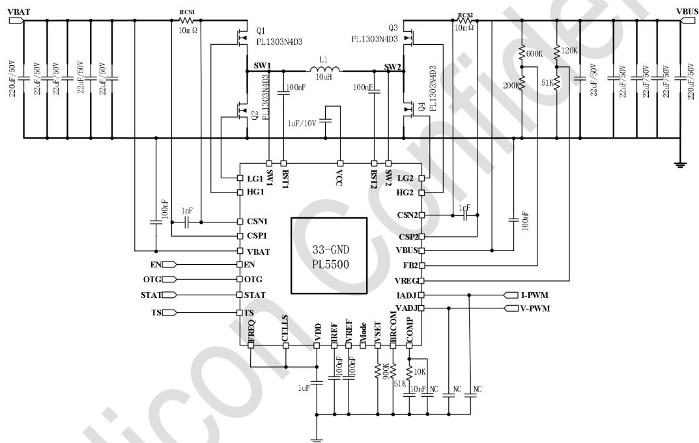  
Fig. 32 Schematic

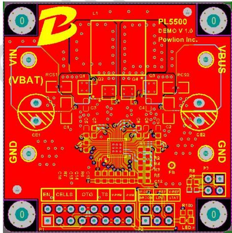  
Fig. 33 Top lay

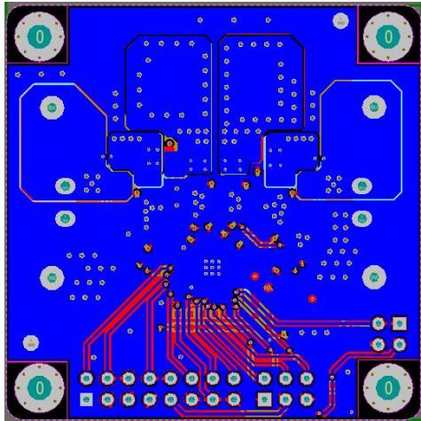  
Fig. 34 Bottom lay

# 12 Packaging Information

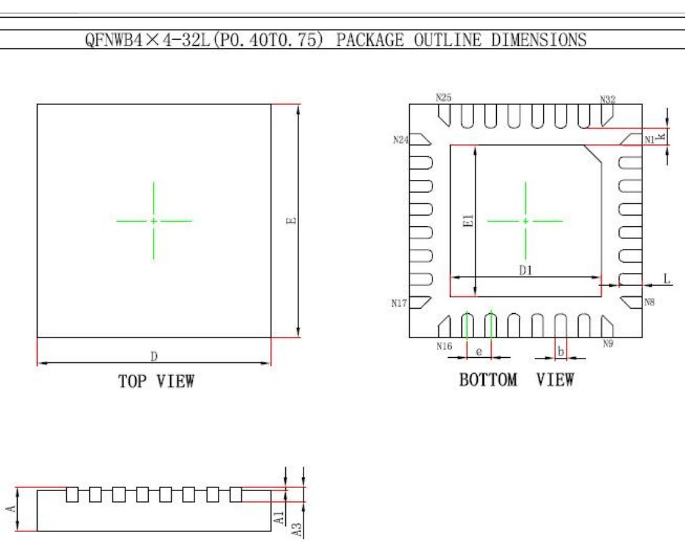  
SIDEVIEW

<table><tr><td rowspan=2 colspan=1>Symbol</td><td rowspan=1 colspan=2>DimensionsInMillimeters</td><td rowspan=1 colspan=2>Dimensions In Inches</td></tr><tr><td rowspan=1 colspan=1>Min.</td><td rowspan=1 colspan=1>Max.</td><td rowspan=1 colspan=1>Min.</td><td rowspan=1 colspan=1>Max.</td></tr><tr><td rowspan=1 colspan=1>A</td><td rowspan=1 colspan=1>0.700</td><td rowspan=1 colspan=1>0.800</td><td rowspan=1 colspan=1>0.028</td><td rowspan=1 colspan=1>0.031</td></tr><tr><td rowspan=1 colspan=1>A1</td><td rowspan=1 colspan=1>0.000</td><td rowspan=1 colspan=1>0.050</td><td rowspan=1 colspan=1>0.000</td><td rowspan=1 colspan=1>0.002</td></tr><tr><td rowspan=1 colspan=1>A3</td><td rowspan=1 colspan=2>0.203REF.</td><td rowspan=1 colspan=2>0.008REF.</td></tr><tr><td rowspan=1 colspan=1>D</td><td rowspan=1 colspan=1>3.900</td><td rowspan=1 colspan=1>4.100</td><td rowspan=1 colspan=1>0.154</td><td rowspan=1 colspan=1>0.161</td></tr><tr><td rowspan=1 colspan=1>E</td><td rowspan=1 colspan=1>3.900</td><td rowspan=1 colspan=1>4.100</td><td rowspan=1 colspan=1>0.154</td><td rowspan=1 colspan=1>0.161</td></tr><tr><td rowspan=1 colspan=1>D1</td><td rowspan=1 colspan=1>2.500</td><td rowspan=1 colspan=1>2.700</td><td rowspan=1 colspan=1>0.098</td><td rowspan=1 colspan=1>0.106</td></tr><tr><td rowspan=1 colspan=1>E1</td><td rowspan=1 colspan=1>2.500</td><td rowspan=1 colspan=1>2.700</td><td rowspan=1 colspan=1>0.098</td><td rowspan=1 colspan=1>0.106</td></tr><tr><td rowspan=1 colspan=1>k</td><td rowspan=1 colspan=2>0.300REF.</td><td rowspan=1 colspan=2>0.012REF.</td></tr><tr><td rowspan=1 colspan=1>b</td><td rowspan=1 colspan=1>0.150</td><td rowspan=1 colspan=1>0.250</td><td rowspan=1 colspan=1>0.006</td><td rowspan=1 colspan=1>0.010</td></tr><tr><td rowspan=1 colspan=1>e</td><td rowspan=1 colspan=2>0.400BSC.</td><td rowspan=1 colspan=2>0.016BSC.</td></tr><tr><td rowspan=1 colspan=1>L</td><td rowspan=1 colspan=1>0.300</td><td rowspan=1 colspan=1>0.500</td><td rowspan=1 colspan=1>0.012</td><td rowspan=1 colspan=1>0.020</td></tr></table>

# IMPORTANT NOTICE

Powlicon Inc. assumes no responsibility for any error which may appear in this document. Powlicon Inc. reserves the right to change devices or specifications detailed herein at any time without notice. Powlicon Inc. does not assume any liability arising out of the application or use of any product described herein; neither it does it convey any license under its patent rights, nor the rights of others. Powlicon Inc. products are not authorized for use as critical components in life support devices or systems without written approval letter from the Chief Executive Officer of Powlicon Inc. The use of products in such applications shall assume all risks of such use and will agree to not hold against Powlicon Inc. for any damage.