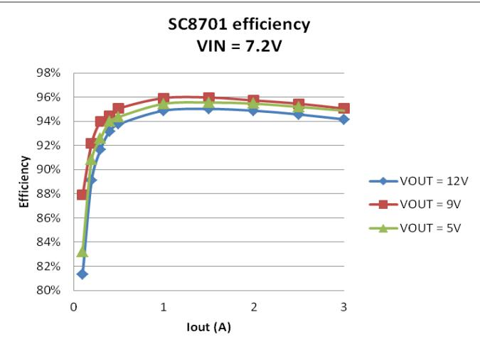
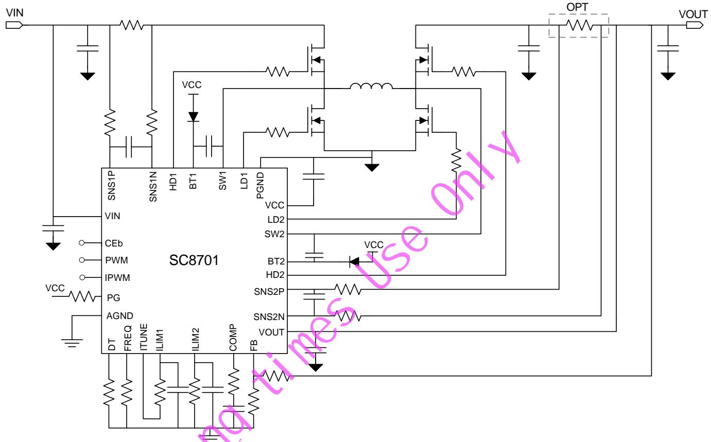
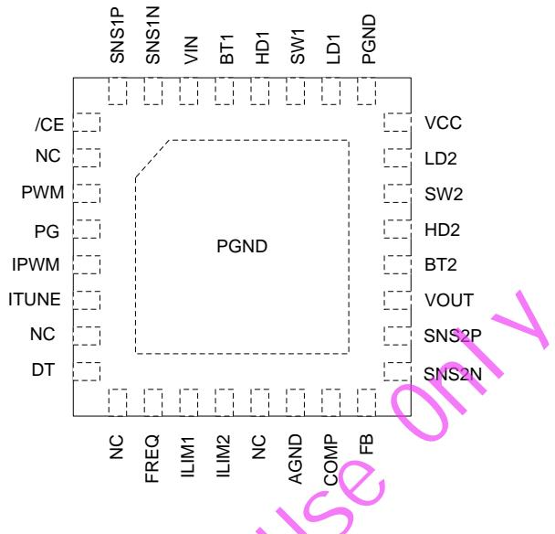
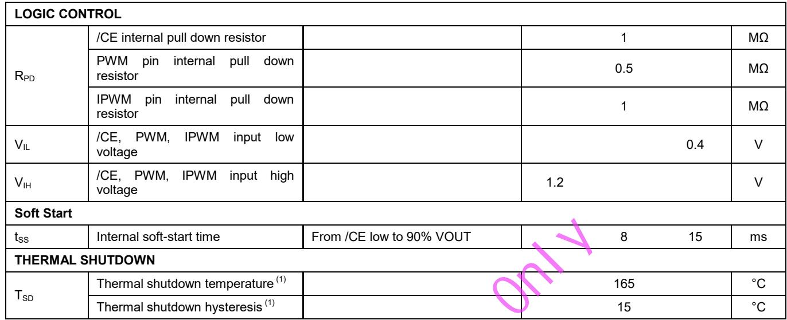
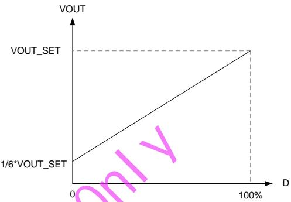
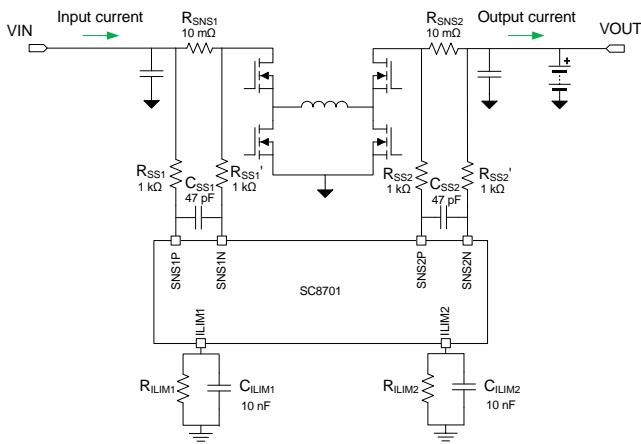
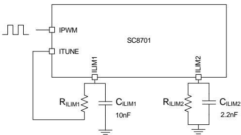
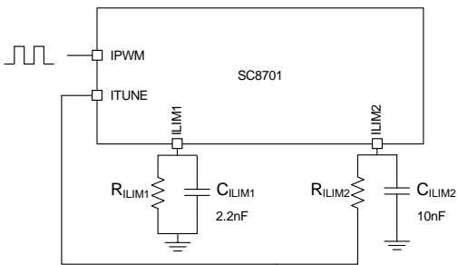
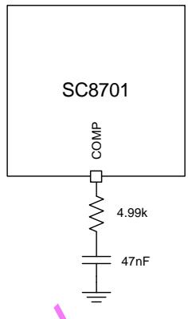
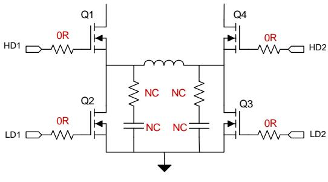

# SC8701 High Efficiency, Synchronous Buck-Boost Controller

# 1 Description

The SC8701 is a synchronous 4-switch buck-boost controller. It is able to effectively output voltage no matter it is higher, lower or equal to the input voltage.

The SC8701 supports very wide input and output voltage range. It can support applications from 2.7V to 36V input range and 2V to 36V output range. The driver voltage is set to $\mathsf { \Omega } ^ { 1 0 \mathsf { V } }$ to fully utilize external MOSFETs for highest efficiency.

The SC8701 supports input current limit, output current limit and over temperature protections to ensure safety under different abnormal conditions.

# 2 Features

High efficient buck-boost operation   
Dynamic adjustable output voltage   
Dynamic adjustable Input and Output current limit   
Wide input voltage range: 2.7 V to 36 V   
Wide output range: 2V to 36V   
Integrated d 10 1 , 2A gate driver   
Adjustable frequency 200kHz to 600kHz   
Under voltage protection   
QFN-32 Package

The SC8701 adopts 32 pin QFN 4x4 package.

# 3 Applications

 Power Bank   
 USB PD   
 Car Charger Industrial applications

# 4 Device Information

<table><tr><td rowspan=1 colspan=1> ORDER NUMBER</td><td rowspan=1 colspan=1>PACKAGE</td><td rowspan=1 colspan=1> BODY SIZE</td></tr><tr><td rowspan=1 colspan=1>SC8701QDER</td><td rowspan=1 colspan=1>32 pin QFN</td><td rowspan=1 colspan=1>4mmx4mmx0.75mm</td></tr></table>

# 5 Typical Application Circuit

# 6 Terminal Configuration and Functions

<table><tr><td colspan="2" rowspan="1">TERMINAL</td><td colspan="1" rowspan="2">/0</td><td colspan="1" rowspan="2">DESCRIPTION</td></tr><tr><td colspan="1" rowspan="1">NUMBER</td><td colspan="1" rowspan="1">NAME</td></tr><tr><td colspan="1" rowspan="1">1</td><td colspan="1" rowspan="1">/CE</td><td colspan="1" rowspan="1">一</td><td colspan="1" rowspan="1">ow,chip enable.Internal pull low</td></tr><tr><td colspan="1" rowspan="1">2</td><td colspan="1" rowspan="1">NC</td><td colspan="1" rowspan="1">一</td><td colspan="1" rowspan="1">Floating</td></tr><tr><td colspan="1" rowspan="1">3</td><td colspan="1" rowspan="1">PWM</td><td colspan="1" rowspan="1"></td><td colspan="1" rowspan="1">1.5VOUT = VoUT_SETX(6+</td></tr><tr><td colspan="1" rowspan="1">4</td><td colspan="1" rowspan="1"></td><td colspan="1" rowspan="1"></td><td colspan="1" rowspan="1">Open drain,active high when VOUT is within 90% to 110%*VOUT target.</td></tr><tr><td colspan="1" rowspan="1">For</td><td colspan="1" rowspan="1">IPWMFor</td><td colspan="1" rowspan="1">1</td><td colspan="1" rowspan="1">IPWM pin is used together with ITUNE pin to adjust the currentlimit value of either ILIM1 or ILIM2.The ITUNE pin is used to select the control object between ILIM1 and ILIM2,and IPWM signal is toadjust the limit value.IPWM pin accepts PWM waveform from 20kHz to 100kHz，and the current limit value isproportional to its duty cycle.For example,if ITUNE pin selects ILIM1, then the input current limit is set by:IN = ILIM1_SET×DIn the equation above,lum_sET is the current limit value set by the resistorat ILIM1 pin,D is the dutycycle of the IPWM signal.Similarly,if ITUNE pin selects ILIM2,then the output current limit is set by:lOuT = ILIM2_SET×D</td></tr><tr><td colspan="1" rowspan="1">6</td><td colspan="1" rowspan="1">ITUNE</td><td colspan="1" rowspan="1">I0</td><td colspan="1" rowspan="1">ITUNE pin selects the IPWM control object between ILIM1 and ILIM2.If ILIM1 current limit needs to be controlled,connect the ILIM1 resistor between ILIM1 pin andITUNE pin.If ILIM2 current limit is to be controlled,connect the ILIM2 resistor between ILiM2 pinand ITUNE pin.Only one current limit can be selected by ITUNE pin.If IPWM function is not needed,leave ITUNE pin and IPWM pin floating,and connect the ILIMxresistor from the ILIMx pin to AGND accordingly.</td></tr><tr><td></td><td></td><td></td><td></td></tr><tr><td>7</td><td>NC</td><td>一</td><td>Floating. Dead Time selection.</td></tr><tr><td>8</td><td>DT</td><td>一</td><td>Short to ground: 20ns; 68kΩ: 40ns; 270kΩ: 60ns; Open: 80ns</td></tr><tr><td>9</td><td>NC</td><td></td><td>Floating</td></tr><tr><td>10</td><td>FREQ</td><td>一</td><td>Frequency selection Short to ground: 200kHz; 68kΩ: 400kHz; Open: 600kHz</td></tr><tr><td>11</td><td></td><td></td><td>Connect a resistor to set the current limit value of input current. VREF Rss ILIM1_SET VREF is the internal reference voltage 1.21V;</td></tr><tr><td></td><td>ILIM1</td><td>recommended value is 1kΩ.</td><td></td></tr><tr><td></td><td></td><td>increase the capacitor V</td><td></td></tr><tr><td></td><td></td><td>ground.</td><td></td></tr><tr><td></td><td></td><td></td><td></td></tr><tr><td></td><td></td><td></td><td></td></tr><tr><td></td><td></td><td>Connectaresi</td><td>e current limit value of output current.</td></tr><tr><td></td><td></td><td></td><td></td></tr><tr><td></td><td></td><td></td><td>VREF Rss2 ILIM2_SET = RILIM2 RsNS2</td></tr><tr><td></td><td></td><td></td><td></td></tr><tr><td>12</td><td>ILIM2</td><td></td><td>M2 is the resistor from ILIM2 to ground or to ITUNE;</td></tr><tr><td></td><td></td><td></td><td>RsNs2 is current sensing resistor. Recommended 5mΩ-20mΩ，typical 10mΩ;</td></tr><tr><td></td><td></td><td></td><td>Rss2 are the resistors connected to SNS2P，SNS2N.The two resistors must be equal and the</td></tr><tr><td></td><td></td><td></td><td>recommended value is 1kΩ.</td></tr><tr><td>For</td><td></td><td></td><td>A 2.2nF capacitor to ground is needed to bypass noise.If IPWM function is applied to ILIM2, increase the capacitor value to 1OnF.If current limiting function is not needed,please short ILIM2 to</td></tr><tr><td></td><td></td><td>ground.</td><td></td></tr><tr><td></td><td>NC</td><td>一 Floating</td><td></td></tr><tr><td></td><td>AGND</td><td>10</td><td>Analog Ground</td></tr><tr><td>15</td><td>COMP</td><td>0</td><td>Compensation for the control loop.</td></tr><tr><td></td><td></td><td></td><td>Feedback for output voltage.</td></tr><tr><td>16</td><td></td><td></td><td>RuP</td></tr><tr><td></td><td>FB</td><td>一</td><td>VOUT = VREFX( (1+ RDowN)</td></tr><tr><td></td><td></td><td></td><td></td></tr><tr><td></td><td></td><td></td><td>VREF equals to 1.22V. Rup and RDowN are the value of voltage divider.</td></tr><tr><td></td><td></td><td></td><td></td></tr><tr><td></td><td></td><td></td><td></td></tr><tr><td></td><td></td><td></td><td></td></tr><tr><td></td><td></td><td></td><td></td></tr><tr><td></td><td></td><td></td><td></td></tr><tr><td></td><td></td><td></td><td></td></tr><tr><td></td><td></td><td></td><td></td></tr><tr><td></td><td></td><td></td><td></td></tr><tr><td></td><td></td><td></td><td></td></tr><tr><td></td><td></td><td></td><td></td></tr><tr><td></td><td></td><td></td><td></td></tr><tr><td></td><td></td><td></td><td></td></tr><tr><td></td><td></td><td></td><td></td></tr><tr><td></td><td></td><td></td><td></td></tr><tr><td></td><td></td><td></td><td></td></tr><tr><td></td><td></td><td></td><td></td></tr><tr><td></td><td></td><td></td><td></td></tr><tr><td></td><td></td><td></td><td></td></tr><tr><td></td><td></td><td></td><td></td></tr><tr><td></td><td></td><td></td><td></td></tr><tr><td></td><td></td><td></td><td></td></tr><tr><td></td><td></td><td></td><td></td></tr><tr><td></td><td></td><td></td><td></td></tr><tr><td></td><td></td><td></td><td></td></tr><tr><td></td><td></td><td></td><td></td></tr><tr><td></td><td></td><td></td><td></td></tr><tr><td></td><td></td><td></td><td></td></tr><tr><td></td><td></td><td></td><td></td></tr><tr><td></td><td></td><td></td><td></td></tr><tr><td></td><td></td><td></td><td></td></tr><tr><td></td><td></td><td></td><td></td></tr><tr><td></td><td></td><td></td><td></td></tr><tr><td></td><td></td><td></td><td></td></tr><tr><td></td><td></td><td></td><td></td></tr><tr><td></td><td></td><td></td><td></td></tr><tr><td></td><td></td><td></td><td></td></tr><tr><td></td><td></td><td></td><td></td></tr><tr><td></td><td></td><td></td><td></td></tr><tr><td></td><td></td><td></td><td></td></tr><tr><td></td><td></td><td></td><td></td></tr><tr><td></td><td></td><td></td><td></td></tr><tr><td></td><td></td><td></td><td></td></tr><tr><td></td><td></td><td></td><td></td></tr><tr><td></td><td></td><td></td><td>Negative input of current sense amplifier. Connect an external current sense resistor between</td></tr><tr><td></td><td></td><td></td><td></td></tr><tr><td></td><td></td><td></td><td></td></tr><tr><td></td><td></td><td></td><td></td></tr><tr><td></td><td></td><td></td><td></td></tr><tr><td></td><td></td><td></td><td></td></tr><tr><td></td><td></td><td></td><td></td></tr><tr><td></td><td></td><td>一</td><td></td></tr><tr><td></td><td></td><td></td><td></td></tr><tr><td></td><td></td><td></td><td></td></tr><tr><td>17</td><td>SNS2N</td><td></td><td></td></tr><tr><td colspan="1" rowspan="1">18</td><td colspan="1" rowspan="1">SNS2P</td><td colspan="1" rowspan="1">1</td><td colspan="1" rowspan="1">Positive input of current sense amplifier. Connect an external current sense resistor between SNS2Pand SNS2N.Current flows from SNS2P to SNS2N.</td></tr><tr><td colspan="1" rowspan="1">19</td><td colspan="1" rowspan="1">VOUT</td><td colspan="1" rowspan="1">一</td><td colspan="1" rowspan="1">Output node of the converter.</td></tr><tr><td colspan="1" rowspan="1">20</td><td colspan="1" rowspan="1">BT2</td><td colspan="1" rowspan="1">PWR</td><td colspan="1" rowspan="1">Connect a capacitor between BT2 pin and SW2 pin to bootstrap a voltage to provide the biasvoltage for high side MOSFET gate driver2.</td></tr><tr><td colspan="1" rowspan="1">21</td><td colspan="1" rowspan="1">HD2</td><td colspan="1" rowspan="1">PWR</td><td colspan="1" rowspan="1">High side MOSFET gate driver2 output</td></tr><tr><td colspan="1" rowspan="1">22</td><td colspan="1" rowspan="1">SW2</td><td colspan="1" rowspan="1">PWR</td><td colspan="1" rowspan="1">Switching Node 2</td></tr><tr><td colspan="1" rowspan="1">23</td><td colspan="1" rowspan="1">LD2</td><td colspan="1" rowspan="1">PWR</td><td colspan="1" rowspan="1">Low side MOSFET gate driver2 output</td></tr><tr><td colspan="1" rowspan="1">24</td><td colspan="1" rowspan="1">VCC</td><td colspan="1" rowspan="1">PWR</td><td colspan="1" rowspan="1"></td></tr><tr><td colspan="1" rowspan="1">25</td><td colspan="1" rowspan="1">PGND</td><td colspan="1" rowspan="1">PWR</td><td colspan="1" rowspan="1">Power Ground</td></tr><tr><td colspan="1" rowspan="1">26</td><td colspan="1" rowspan="1">LD1</td><td colspan="1" rowspan="1">PWR</td><td colspan="1" rowspan="1"></td></tr><tr><td colspan="1" rowspan="1">27</td><td colspan="1" rowspan="1">SW1</td><td colspan="1" rowspan="1">PWR</td><td colspan="1" rowspan="1">Switching Node 1</td></tr><tr><td colspan="1" rowspan="1">28</td><td colspan="1" rowspan="1">HD1</td><td colspan="1" rowspan="1">PWR</td><td colspan="1" rowspan="1">High side MOSFET gatedriver1 output</td></tr><tr><td colspan="1" rowspan="1">29</td><td colspan="1" rowspan="1">BT1</td><td colspan="1" rowspan="1">PWR</td><td colspan="1" rowspan="1">gatedriver1.</td></tr><tr><td colspan="1" rowspan="1">30</td><td colspan="1" rowspan="1">VIN</td><td colspan="1" rowspan="1">一</td><td colspan="1" rowspan="1">Input node the Converter</td></tr><tr><td colspan="1" rowspan="1">31</td><td colspan="1" rowspan="1">SNS1N</td><td colspan="1" rowspan="1">1</td><td colspan="1" rowspan="1"></td></tr><tr><td colspan="1" rowspan="1">32</td><td colspan="1" rowspan="1">SNS1P</td><td colspan="1" rowspan="1"></td><td colspan="1" rowspan="1"></td></tr><tr><td colspan="1" rowspan="1"></td><td colspan="1" rowspan="1">ThermalPad</td><td colspan="1" rowspan="1">S</td><td colspan="1" rowspan="1">For thermal dissipation. Connect to AGND or PGND.</td></tr></table>

# 7 Specifications

# 7.1 Absolute Maximum Ratings

Over operating free-air temperature range (unless otherwise noted) (1)

<table><tr><td></td><td></td><td rowspan=1 colspan=1> MIN       MAX</td><td rowspan=1 colspan=1> UNIT</td></tr><tr><td rowspan=8 colspan=1>Voltage range atterminals (2)</td><td rowspan=1 colspan=1>VIN,VOUT, SNS1P,SNS1N, SNS2P, SNS2N, /CE</td><td rowspan=1 colspan=1>-0.3         42</td><td rowspan=1 colspan=1>V</td></tr><tr><td rowspan=1 colspan=1>SW1, SW2</td><td rowspan=1 colspan=1>-1         42</td><td rowspan=1 colspan=1>V</td></tr><tr><td rowspan=1 colspan=1>VCC,PG,PWM, IPWM</td><td rowspan=1 colspan=1>-0.3        20</td><td rowspan=1 colspan=1>V</td></tr><tr><td rowspan=1 colspan=1>FREQ, ILIM1, ILIM2,COMP,DT,FB,ITUNE</td><td rowspan=1 colspan=1>-0.3        5.5</td><td rowspan=1 colspan=1>V</td></tr><tr><td rowspan=1 colspan=1>LD1, LD2</td><td rowspan=1 colspan=1>-0.3         12</td><td rowspan=1 colspan=1>V</td></tr><tr><td rowspan=1 colspan=1>BT1, HD1 to SW1</td><td rowspan=1 colspan=1>-0.3         12</td><td rowspan=1 colspan=1>V</td></tr><tr><td rowspan=1 colspan=1>BT2, HD2 to SW2</td><td rowspan=1 colspan=1>-0.3        12</td><td rowspan=1 colspan=1>V</td></tr><tr><td rowspan=1 colspan=1>BT1, BT2</td><td rowspan=1 colspan=1>-0.3        50</td><td rowspan=1 colspan=1>V</td></tr><tr><td rowspan=2 colspan=1>Temperature Range</td><td rowspan=1 colspan=1>Operating Junction,TJ</td><td rowspan=1 colspan=1>-40        150</td><td rowspan=1 colspan=1>℃</td></tr><tr><td rowspan=1 colspan=1>Storage temperature range,Tstg            ISR</td><td rowspan=1 colspan=1>-65         150</td><td rowspan=1 colspan=1>℃</td></tr></table>

(1) Stresses beyond those listed under absolute maximum ratings may cause permanent damage to the device. These are stress ratings only, and functional operation of the device at these or any other conditions beyond those indicated under recommended operating conditions is not implied. Exposure to absolute-maximum-rated conditions for extended periods may affect device reliability.

(2) All voltage values are with respect to network ground terminal.

# 7.2 Thermal Information

<table><tr><td rowspan=1 colspan=2>THERMAL RESISTANCE(1)</td><td rowspan=1 colspan=1>QFN-32 (4mm x 4mm)</td><td rowspan=1 colspan=1> UNIT</td></tr><tr><td rowspan=1 colspan=1>OJA</td><td rowspan=1 colspan=1>Junction to ambient thermal resistance</td><td rowspan=1 colspan=1>35</td><td rowspan=1 colspan=1>C/W</td></tr><tr><td rowspan=1 colspan=1>JC</td><td rowspan=1 colspan=1> Junction to case resistance</td><td rowspan=1 colspan=1>7</td><td rowspan=1 colspan=1>C/W</td></tr></table>

(1) Measured on JESD51-7, 4-layer PCB.

# 7.3 Handling Ratings

<table><tr><td>PARAMETER</td><td>DEFINITI TON</td><td>MIN</td><td>MAX</td><td> UNIT</td></tr><tr><td rowspan="2">ESD (1)</td><td> Human body model (HBM) ESD stress voltage (2)</td><td>-2</td><td>2</td><td>kV</td></tr><tr><td>Charged device model (CDM) ESD stress voltage ()</td><td>-750</td><td>750</td><td>V</td></tr></table>

(1) Electrostatic discharge (ESD) to measure device sensitivity and immunity to damage caused by assembly line electrostatic discharges into the device.   
(2) Level listed above is the passing level per ANSI, ESDA, and JEDEC JS-001. JEDEC document JEP155 states that 500-V HBM allows safe manufacturing with a standard ESD control process.   
(3) Level listed above is the passing level per EIA-JEDEC JESD22-C101. JEDEC document JEP157 states that 250-V CDM allows safe manufacturing with a standard ESD control process.

# 7.4 Recommended Operating Conditions

<table><tr><td colspan="1" rowspan="1"></td><td colspan="1" rowspan="1"></td><td colspan="1" rowspan="1"> MIN</td><td colspan="1" rowspan="1">TYP</td><td colspan="1" rowspan="1"> MAX</td><td colspan="1" rowspan="1"> UNIT</td></tr><tr><td colspan="1" rowspan="1">VIN</td><td colspan="1" rowspan="1">Input voltage range</td><td colspan="1" rowspan="1">2.7</td><td colspan="1" rowspan="1"></td><td colspan="1" rowspan="1">36</td><td colspan="1" rowspan="1">V</td></tr><tr><td colspan="1" rowspan="1">VoUT</td><td colspan="1" rowspan="1">Output voltage range</td><td colspan="1" rowspan="1">2</td><td colspan="1" rowspan="1"></td><td colspan="1" rowspan="1">36</td><td colspan="1" rowspan="1">V</td></tr><tr><td colspan="1" rowspan="1">CIN</td><td colspan="1" rowspan="1">Input Capacitance</td><td colspan="1" rowspan="1">30</td><td colspan="1" rowspan="1"></td><td colspan="1" rowspan="1"></td><td colspan="1" rowspan="1">μF</td></tr><tr><td colspan="1" rowspan="1">CouT</td><td colspan="1" rowspan="1"> Output capacitance</td><td colspan="1" rowspan="1">30</td><td colspan="1" rowspan="1"></td><td colspan="1" rowspan="1"></td><td colspan="1" rowspan="1">uF</td></tr><tr><td colspan="1" rowspan="1">L</td><td colspan="1" rowspan="1">Inductance</td><td colspan="1" rowspan="1">2.2</td><td colspan="1" rowspan="1"></td><td colspan="1" rowspan="1">10</td><td colspan="1" rowspan="1">H</td></tr><tr><td colspan="1" rowspan="1">RsNS1/2</td><td colspan="1" rowspan="1">Current Sensing Resistor</td><td colspan="1" rowspan="1">5</td><td colspan="1" rowspan="1"></td><td colspan="1" rowspan="1">20</td><td colspan="1" rowspan="1">mΩ</td></tr><tr><td colspan="1" rowspan="1">fsw</td><td colspan="1" rowspan="1">Operating frequency range</td><td colspan="1" rowspan="1">200</td><td colspan="1" rowspan="1"></td><td colspan="1" rowspan="1">600</td><td colspan="1" rowspan="1"> KHz</td></tr><tr><td colspan="1" rowspan="1">fpwM.fiPwM</td><td colspan="1" rowspan="1">PWM signal frequency range</td><td colspan="1" rowspan="1">20</td><td colspan="1" rowspan="1"></td><td colspan="1" rowspan="1">100</td><td colspan="1" rowspan="1">KHz</td></tr><tr><td colspan="1" rowspan="1">DpWM,DiPWM</td><td colspan="1" rowspan="1">PWM signal duty cycle range</td><td colspan="1" rowspan="1">0</td><td colspan="1" rowspan="1"></td><td colspan="1" rowspan="1">100</td><td colspan="1" rowspan="1">%</td></tr><tr><td colspan="1" rowspan="1">T</td><td colspan="1" rowspan="1">Operating junction temperature</td><td colspan="1" rowspan="1">-40</td><td colspan="1" rowspan="1"></td><td colspan="1" rowspan="1">125</td><td colspan="1" rowspan="1">C</td></tr></table>

# 7.5 Electrical Characteristic

<table><tr><td rowspan=1 colspan=2>PARAMETER</td><td rowspan=1 colspan=1> TEST CONDITIONS</td><td rowspan=1 colspan=1>MIN     TYP     MAX</td><td rowspan=1 colspan=1> UNIT</td></tr><tr><td rowspan=1 colspan=5>SUPPLY VOLTAGE (VIN, VOUT)</td></tr><tr><td rowspan=1 colspan=1>VIN</td><td rowspan=1 colspan=1>Operating voltage</td><td rowspan=1 colspan=1></td><td rowspan=1 colspan=1>2.7                   36</td><td rowspan=1 colspan=1>V</td></tr><tr><td rowspan=1 colspan=1>VouT</td><td rowspan=1 colspan=1>Operating voltage</td><td rowspan=1 colspan=1></td><td rowspan=1 colspan=1>2                    36</td><td rowspan=1 colspan=1>v</td></tr><tr><td rowspan=2 colspan=1>VuvLO</td><td rowspan=2 colspan=1>Input  under-voltage  lockoutthreshold</td><td rowspan=1 colspan=1>Rising edge</td><td rowspan=1 colspan=1>2.6      2.7</td><td rowspan=1 colspan=1>V</td></tr><tr><td rowspan=1 colspan=1>Hysteresis</td><td rowspan=1 colspan=1>160</td><td rowspan=1 colspan=1>mV</td></tr><tr><td rowspan=1 colspan=1>1Q</td><td rowspan=1 colspan=1>Standby current into VIN or VOUTpin (whichever is higher)</td><td rowspan=1 colspan=1>/CE = low,controller non-switching</td><td rowspan=1 colspan=1>0.7        2</td><td rowspan=1 colspan=1>mA</td></tr><tr><td rowspan=2 colspan=1>IsD</td><td rowspan=1 colspan=1>ShutdowncurrentintoVINorVOUT pin (which is higher)</td><td rowspan=1 colspan=1>/CE= high</td><td rowspan=1 colspan=1>6         10</td><td rowspan=1 colspan=1>uA</td></tr><tr><td rowspan=1 colspan=1>Shutdown currentinto VINorVOUT pin (which is lower)</td><td rowspan=1 colspan=1>/CE= high</td><td rowspan=1 colspan=1>2</td><td rowspan=1 colspan=1>uA</td></tr><tr><td rowspan=1 colspan=2>VCC AND DIRVER</td><td></td><td></td><td></td></tr><tr><td rowspan=1 colspan=1>Vcc</td><td rowspan=1 colspan=1>VCC clamp voltage</td><td rowspan=1 colspan=1></td><td rowspan=1 colspan=1>9.4       10       10.6</td><td rowspan=1 colspan=1>V</td></tr><tr><td rowspan=1 colspan=1>lvcc_LIM</td><td rowspan=1 colspan=1>VCC current limit</td><td rowspan=1 colspan=1>Vcc = 2V~10V</td><td rowspan=1 colspan=1>50       75       100</td><td rowspan=1 colspan=1>mA</td></tr><tr><td rowspan=1 colspan=1>RHvx_pu</td><td rowspan=1 colspan=1>High side driver pull up resistor</td><td rowspan=1 colspan=1></td><td rowspan=1 colspan=1>1.5</td><td rowspan=1 colspan=1></td></tr><tr><td rowspan=1 colspan=1>RHvx_pd</td><td rowspan=1 colspan=1>High side driver pull down resistor</td><td rowspan=1 colspan=1></td><td rowspan=1 colspan=1>1</td><td rowspan=1 colspan=1>Ω</td></tr><tr><td rowspan=1 colspan=1>RLvx_pu</td><td rowspan=1 colspan=1>Low side driver pull up resistor</td><td rowspan=1 colspan=1></td><td rowspan=1 colspan=1>1.5</td><td rowspan=1 colspan=1></td></tr><tr><td rowspan=1 colspan=1>RLvx_pd</td><td rowspan=1 colspan=1>Low side driver pull down resistor</td><td rowspan=1 colspan=1></td><td rowspan=1 colspan=1>1</td><td rowspan=1 colspan=1></td></tr><tr><td rowspan=1 colspan=2>ERROR AMPLIFIER</td><td></td><td></td><td></td></tr><tr><td rowspan=1 colspan=1>VFB_REF</td><td rowspan=1 colspan=1>FB reference voltage</td><td rowspan=1 colspan=1></td><td rowspan=1 colspan=1>1.214     1.22     1.226</td><td rowspan=1 colspan=1>V</td></tr><tr><td rowspan=1 colspan=1>VILIMx_REF</td><td rowspan=1 colspan=1>ILIMx reference voltage</td><td rowspan=1 colspan=1></td><td rowspan=1 colspan=1>1.196    1.212     1.228</td><td rowspan=1 colspan=1>V</td></tr><tr><td rowspan=1 colspan=1>GmEA</td><td rowspan=1 colspan=1>Error amplifier gm</td><td rowspan=1 colspan=1></td><td rowspan=1 colspan=1>0.16</td><td rowspan=1 colspan=1>mS</td></tr><tr><td rowspan=1 colspan=1>RouT</td><td rowspan=1 colspan=1>Error amplifier output resistance (1)</td><td rowspan=1 colspan=1></td><td rowspan=1 colspan=1>20</td><td rowspan=1 colspan=1>MΩ</td></tr><tr><td rowspan=1 colspan=1>IBIAS(FBx)</td><td rowspan=1 colspan=1>FBx pin input bias current</td><td rowspan=1 colspan=1>FBx in regulation</td><td rowspan=1 colspan=1>100</td><td rowspan=1 colspan=1>nA</td></tr><tr><td rowspan=1 colspan=5>CURRENT LIMIT</td></tr><tr><td rowspan=1 colspan=1>ILIMx</td><td rowspan=1 colspan=1>it accuracy</td><td rowspan=1 colspan=1>IN_LIM RsNS1≥ 30 mVloUT_LIM RsNS2 ≥ 30 mV</td><td rowspan=1 colspan=1>-10%                  10%</td><td rowspan=1 colspan=1></td></tr><tr><td rowspan=1 colspan=1>SWITCHING</td><td></td><td></td><td></td><td></td></tr><tr><td rowspan=3 colspan=1>fswcor</td><td rowspan=3 colspan=1>Switching frequencycor</td><td rowspan=1 colspan=1>RFREQ = 0Ω</td><td rowspan=1 colspan=1>180      210      240</td><td rowspan=1 colspan=1>KHz</td></tr><tr><td rowspan=1 colspan=1>RFREQ = 68kΩ (±10%)</td><td rowspan=1 colspan=1>360      410      460</td><td rowspan=1 colspan=1>kHz</td></tr><tr><td rowspan=1 colspan=1>RFREQ = 270kΩ (±10%)</td><td rowspan=1 colspan=1>540      600      660</td><td rowspan=1 colspan=1>kHz</td></tr><tr><td rowspan=1 colspan=5>INDICATION</td></tr><tr><td rowspan=1 colspan=1>tpG_degitch</td><td rowspan=1 colspan=1>PG signal deglitch time</td><td rowspan=1 colspan=1>fsw = 200kHz</td><td rowspan=1 colspan=1>27      38.5      50</td><td rowspan=1 colspan=1>ms</td></tr><tr><td rowspan=1 colspan=1>ISINK_PG</td><td rowspan=1 colspan=1>PG sink current</td><td rowspan=1 colspan=1>Vpg = 0.4 V</td><td rowspan=1 colspan=1>3.6      4.1       4.6</td><td rowspan=1 colspan=1>mA</td></tr><tr><td rowspan=4 colspan=1>VoUT_PG</td><td rowspan=4 colspan=1>VOUT power good threshold</td><td rowspan=1 colspan=1>High limit falling edge (PG from lowto high)</td><td rowspan=1 colspan=1>110%</td><td rowspan=1 colspan=1></td></tr><tr><td rowspan=1 colspan=1>High limit hysteresis (PG from highto low)</td><td rowspan=1 colspan=1>5%</td><td rowspan=1 colspan=1></td></tr><tr><td rowspan=1 colspan=1>Low limit rising edge (PG from lowto high)</td><td rowspan=1 colspan=1>90%</td><td rowspan=1 colspan=1></td></tr><tr><td rowspan=1 colspan=1>Low limit hysteresis (PG from highto low)</td><td rowspan=1 colspan=1>5%</td><td rowspan=1 colspan=1></td></tr></table>

(1) Guarantee by design

# 8 Detailed Description

The SC8701 is a synchronous four-switch buck-boost controller with a wide input/output voltage range. The SC8701 regulates the output at, above, below the input voltage.

The SC8701 features automatic buck, boost mode smooth transition and maximum input and output current limit capability using additional resistors. In addition, the SC8701 features output voltage dynamic change, input/output current limit dynamic change, and power MOSFETs dead time control.

# 8.1 Feature Description

# 8.1.1 Chip Enable (/CE)

The SC8701 turns on/off by /CE signal. When /CE input is “ ”, the C870 is turned on; when /C input is $\ " H \ "$ , the SC8701 is turned off.

# 8.1.2 VOUT voltage setting (FB)

The VOUT voltage is set by external resistor divider at FB pin and is calculated as:

Where:

VFB_REF $=$ Internal reference voltage 1.22V

${ \mathsf { R } } _ { \mathsf { U P } }$ and RDWON $=$ Resistor divider at FB connected to VOUT and AGND.

# 8.1.3 Output voltage POWER GOOD indicator (PG)

The PG signal indicates VOUT voltage status.

If VOUT voltage remains in between $9 0 \% \sim 1 1 0 \%$ of programmed voltage, PG pin becomes high impedance and due to the output pull-up resistor, PG out becomes $\ " H \ "$ to indicate the output voltage is good.

If VOUT is out of normal voltage range, PG out becomes “ ”.

If power good indication is not required, leave PG pin floating.

# 8.1.4 Real-time output voltage control (PWM)

The SC8701 supports VOUT voltage change by PWM signal at PWM pin.

The PWM pin accepts a PWM signal in the range of 20kHz to 100kHz, and its duty cycle can adjust the VOUT voltage. VOUT output voltage is calculated as:

VOUT_ $\mathfrak { s } \in \tau = 1$ VOUT voltage which is set by FB resistor divider;

$\mathsf { D } =$ Duty cycle of PWM signal.

The relationship between VOUT voltage and D is showed in Figure 1

  
Figure 1 VOUT voltage vs PWM duty cycle.

If PWM input signal is logic high, it means $100 \%$ of duty cycle, then the output voltage become the set value by FB1 resistor divider.

If PWM input signal is logic low, it means $0 \%$ of duty cycle, then the output voltage become the $1 / 6$ of the set value.

If PWM pin is left floating, due to the IC internal pull down circuit at PWM pin, VOUT voltage becomes the 1/6 of programmed voltage.

If real-time output voltage control is not required, connect PWM pin to VCC pin.

# 8.1.5 Input/output current setting (ILIMx)

The SC8701 can adjust the current limit of both input side and output side by resistors at ILIM1 and ILIM2 pins.

$$
{ \mathsf { V O U T } } = { \mathsf { V } } _ { \mathsf { O U T } } { \mathsf { \Omega } } _ { - } { \mathsf { S E T } } \times ( \frac { 1 } { 6 } + \frac { 5 } { 6 } \times \mathsf { D } )
$$

<table><tr><td rowspan=1 colspan=1>Control Pins</td><td rowspan=1 colspan=1>Description</td></tr><tr><td rowspan=1 colspan=1>ILM1</td><td rowspan=1 colspan=1>Set the input current limit (IN_LIM)</td></tr><tr><td rowspan=1 colspan=1>ILM2</td><td rowspan=1 colspan=1>Set the output current limit(loUT_LIM)</td></tr></table>

The SC8701 senses the input and output current by monitoring RSNS1 and RSNS2 respectively as below figure shows.

Where;

  
Figure 3 Input/output current monitoring circuit

RSNSX is the current sense resistor (x means 1 or 2) at input /output. The SC8701 monitors the voltage across the sense resistors RSNSx through RSSX and R X’ and calculates the input and output current. CSSX is the filter capacitor and typically 47pF is sufficient.

The ILIMx pin is used to set the current limit. Connect the RILIMX resistor between $1 1 1 \mathsf { M } _ { \mathsf { X } }$ pin and GND (or ITUNE pin if IPWM function is used).

The current limit is calculated as:

If both VIN and VOUT current limits are programmed, the SC8701 controls the current which reaches its current limit first.

If the input/output current limit is not required, connect ILIM1/ILIM2 pin to GND.

# 8.1.6 Real-Time current control (IPWM)

The SC8701 is able to control the input/output current dynamically by applying a PWM signal to IPWM pin.

The IPWM signal should be in the range of $2 0 \mathrm { k H } z \sim 1 0 0 \mathrm { k H } z ,$ , and the input/output current is proportional to its duty cycle as:

Where:

ILIMX_SET $=$ ILIMX Input or output current limit value $\scriptstyle ( \mathbf { x } = 1$ : input, $\scriptstyle \mathbf { x } = 2$ : output);

ILIMx = Target current limit of input/output current.

ITUNE pin selects the target which is controlled by IPWM. If input current should be controlled, the resistor at ILIM1 should be connected between ILIM1 and ITUNE pins; If output current should be controlled, the resistor at ILIM2 should be connected between ILIM2 and ITUNE pins.

Only one target can be selected by ITUNE pin.

Where:

VLIM_REF $=$ Internal reference voltage 1.21V;

$\mathsf { R } _ { \mathsf { I L I M x } } =$ Resistors at ILIMx pin;

RSNSx $=$ Current sense resistors;

$\mathsf { R s s } _ { \mathsf { x } } =$ Resistors between current sense resistor and the SC8701 pins (SNSxP, SNSxN).

RSNS1 should be placed between MOSFET and input capacitor. RSNS2 can be placed either between the MOSFET and output capacitor or behind the output capacitor.

$\mathsf { R } _ { \mathsf { S S } 1 }$ and $\mathsf { R } _ { \mathsf { S S } 1 }$ ’ should have the same value; ${ \mathsf { R } } { \mathsf { s s } } 2$ and R ’ also the same. Typically 1kΩ resistor is used.

If RSNSx is changed, RSSX/RSSX’ values need to be adjusted accordingly with below calculation:

$$
\frac { \mathsf { R } _ { \mathsf { S N S x } } } { \mathsf { R } _ { \mathsf { S S x } } } = \frac { 1 0 \mathsf { m } \Omega } { 1 \mathsf { k } \Omega }
$$

For example, If RSNSX is ${ 2 0 } \mathsf { m } \Omega$ , then RSSX/RSSX’ should be $2 \mathsf { k } \Omega$ ; if RSNSX is $\mathsf { 5 m } \Omega$ , then ${ \sf R s s } \times / { \sf R s s } \times$ should be 500Ω.

  
Refer to Figure 2. IPWM real-time input/output current control.   
a. IPWM controls input current, ILIM1 $=$ ILIM1_set $\tt { x D }$ ，as above

  
Figure 2. IPWM real-time input/output current control.

b. IPWM controls output current，ILIM2 $=$ ILIM2_set x D，as above

When the IPWM signal is logic high, which means the duty cycle is $100 \%$ , the current limit is then the ILIMx set value.

For the ILIMx pin which is controlled by IPWM signal, its filter capacitor should still be connected to ground. If the IPWM frequency is low, higher capacitance should be applied. For example, 22nF capacitor is suggested for 20kHz frequency.

If real-time current control is not required, connect ILIMx resistor to GND and float IPWM and ITUNE pins.

Do not leave IPWM pin float if the ITUNE pin is connected to one ILIMx resistor; otherwise, the SC8701 cannot operate normally.

It is not allowed to set any of the current limits to 0A. Keep the minimum current limit above 0.3A.

# 8.1.7 Dead time setting (DT)

The one of four dead times is selectable by resistor value at DT pin:

<table><tr><td rowspan=1 colspan=1>DT resistor</td><td rowspan=1 colspan=1>Dead time</td></tr><tr><td rowspan=1 colspan=1>oΩ</td><td rowspan=1 colspan=1>20ns</td></tr><tr><td rowspan=1 colspan=1>68kΩ(±10%）</td><td rowspan=1 colspan=1>40ns</td></tr><tr><td rowspan=1 colspan=1>270kΩ（±10%)</td><td rowspan=1 colspan=1>60ns</td></tr><tr><td rowspan=1 colspan=1>Open</td><td rowspan=1 colspan=1>80ns</td></tr></table>

The accuracy of the resistor at DT is allowed $\pm 1 0 \%$ . DT does not support the real-time change and new resistor value change will be applied in next turn on.

When driving large power MOSFET with high $\mathsf { C } _ { \mathsf { I S S } }$ value, or adding driver resistors at LDx or HDx to adjust the MOSFET turning on/off time, it is suggested to check and change the dead time to prevent MOSFET shoot-through.

# 8.1.8 Switching frequency setting (FREQ)

The one of three switching frequency is selectable by resistor value at FREQ pi

<table><tr><td rowspan=1 colspan=1>FREQresistor</td><td rowspan=1 colspan=1>Switching frequency fsw</td></tr><tr><td rowspan=1 colspan=1>oΩ</td><td rowspan=1 colspan=1>200kHz</td></tr><tr><td rowspan=1 colspan=1>68kΩ(±10%)</td><td rowspan=1 colspan=1>400kHz</td></tr><tr><td rowspan=1 colspan=1>Open</td><td rowspan=1 colspan=1>600kHz</td></tr></table>

The accuracy of the resistor at FREQ is allowed $\pm 1 0 \%$ . The real-time switching frequency change is not valid and new resistor value change will be applied in next turn on.

# 8.1.9 Feedback compensation (COMP)

The feedback loop can be compensated by adjusting the external components to the COMP pin. Typically, the values in Figure 4 are used. If faster loop response is required, user can increase the resistor to like $1 0 \mathsf { k O h m }$ or 20kOhm. After changing the compensation, check and make sure the loop is stable under the application operation conditions.

  
Figure 4 Feedback loop compensation setting

# 8.1.10 VCC driver voltage

The SC8701 generates driver voltage VCC internally. The VCC is selected higher voltage between VIN and VOUT, and clamped to 10V if it is higher than $\mathsf { \Omega } ^ { 1 0 \mathsf { V } }$ .

The driving signal LDx to drive low side MOSFET (Q2 and ) is directly supplied from VCC; the driving signal HDx to drive high side MOSFET (Q1 and Q4) is supplied from the diode in between VCC to BTx pin, which is generated by bootstrap circuit with bootstrap capacitor between BTx and SWx.

# 9 Application Information

# 9.1 Input and output capacitor selection

The switching frequency of the SC8701 is in the range of 200kHz \~ 600kHz. Since MLCC ceramic capacitor has good high frequency filtering with low ESR, above ${ \tt 6 0 upmu \sf F }$ X5R or X7R capacitors with higher voltage rating then operating voltage with margin is recommended. For example, if the highest operating Vin or Vout voltage is 12V, select at least 16V capacitor and to secure enough margin, 25V voltage rating capacitor is recommended.

The high capacitance electrolytic capacitor and tantalum capacitor can be used for stable input and output but capacitor voltage rating should be higher than the highest operating voltage. When the tantalum capacitor is used, at least $1 \mu \mathsf { F }$ ceramic capacitor is placed in parallel. If the electrolytic capacitor is used, much more ceramic capacitors are required. For example, if a $4 7 \mu \mathsf { F }$ electrolytic capacitor is used, the ceramic capacitors’ capacitance is allowed to reduce to $3 0 \mu \mathsf { F } \sim 4 0 \mu \mathsf { F }$ . Even higher capacitance electrolytic capacitor is used, at least $2 0 \mu \ F$ ceramic capacitor is required.

# 9.2 Inductor selection

For the SC8701 system stability, the inductance of $2 . 2 \mu \ H$ \~ $1 0 ~ \mu \mathsf { H }$ inductor is required. High inductance $( 4 . 7 \mu \mathsf { H } \sim 1 0 \mu \mathsf { H } )$ is used in the system where the input voltage and output voltage difference is big, such as 5V Vin and 20V Vout or the switching frequency is low; Low inductance $( 2 . 2 \mu \mathsf { H } )$ is used in the system which the input voltage and output voltage difference is small but high current is required. Typically, $3 . 3 \mu \ H$ inductor is recommended. The inductance can be adjusted for high efficiency and optimization in application.

The inductor DC resistance value (DCR) affects the conduction loss of switching regulator, so around $1 0 \mathsf { m } \Omega$ DCR is recommended for the first selection. If the power is relatively small, high DCR inductor can be selected. But if switch current is high, just like around 10A, then select the lowest DCR inductor as much as possible because $1 0 \mathsf { m } \Omega$ DCR also causes 1W power loss.

The inductor saturation current $\mathsf { I } _ { \mathsf { S A T } }$ should be higher than input / output current with sufficient margin.

# 9.3 Current sense resistor

The RSNS1 and RSNS2 are current sense resistors and $5 \mathrm { m } \Omega \sim 2 0 \mathrm { m } \Omega$ resistor value is recommended.

Higher resistor value leads to higher current limit accuracy but using higher resistor value in high current application causes higher conduction loss. Typically, $1 0 \mathsf { m } \Omega$ is recommended. Resistor value can be adjusted depending on current limit and target power efficiency. If $\mathsf { R } _ { \mathsf { S N S x } }$ valued is adjusted, related $\mathsf { R } _ { \mathsf { S S } \mathsf { x } }$ value should be adjusted simultaneously.

Please refer to 8.1.5 Input/output current setting (ILIMx) for proper RSNSx and $\mathsf { R s s } _ { \mathsf { X } }$ values. The resistor power rating and temperature coefficient should also be considered. The power dissipation is roughly calculated as ${ \mathsf { P } } { = } { \mathsf { I } } ^ { 2 } { \mathsf { R } }$ , and I is the highest current flowing through the resistor. The resistor power rating should be higher than roughly calculated power dissipation. The resistor value can be varied if the temperature increased and the variation is decided by temperature coefficient along with temperature change. If high accuracy of current limit is required, select lower temperature coefficient resistor as much as possible.

# 9.4 MOSFET selection

The $\mathtt { S C 8 7 0 1 }$ is a synchronous 4-switch buck-boost controller and it requires 4 NMOS for power switching circuit.

The VDS of MOSFET should be higher than the highest operating voltage with enough margin (recommend more than 10V higher). For example, if the highest operating voltage is ${ } ^ { 2 0 \vee }$ , at least 30V rated $\mathsf { V } _ { \mathsf { D } \mathsf { S } }$ MOSFET should be selected; If the highest operating voltage is 24V, 40V VDS voltage rating should be selected.

In the application, if the input and output voltage are higher than $\mathsf { 1 0 V }$ , driver circuit voltage can reach $\mathsf { \Omega } ^ { 1 0 \mathsf { V } }$ , and $\mathsf { V } _ { \mathsf { G S } }$ voltage rating of MOSFET should be selected higher than $\pm 1 0 \vee$ .

Considering PCB parasitic parameters during operation, driver voltage can be higher than VCC due to transient overshoot, and $\pm 2 0 \vee$ VGS is recommended to secure sufficient margin.

The MOSFET current ID should be higher than the highest input and output current with enough margin.

To ensure the sufficient current capability in relatively high temperature circumstance, the current rate at ${ \mathsf { T } } _ { \mathsf { A } } { = } 7 0 ^ { \circ } \mathsf { C }$ or ${ \sf T } _ { \sf C }$ $= \ 1 0 0 ^ { \circ } \mathsf C$ should be considered. In addition, the power dissipation value $\mathsf { P } _ { \mathsf { D } }$ should also be considered and higher $\mathsf { P } _ { \mathsf { D } }$ is better in applications. Make sure that MOSFET power consumption must not exceed $\mathsf { P } _ { \mathsf { D } }$ value.

The MOSFET ${ \mathsf { R } } _ { { \mathsf { D } } { \mathsf { S } } ( { \mathsf { O N } } ) }$ and input capacitor $\mathsf { C } _ { \mathsf { I S S } }$ impact power efficiency directly. Typically, lower RDS(ON) MOSFET has higher CISS. The ${ \mathsf { R o s } } ( { \mathsf { O N } } )$ is related to conduction loss. Higher RDS(ON) results in higher conduction loss, thus lower efficiency and higher thermal dissipation; the $\mathsf { C } _ { \mathsf { I S S } }$ is related to MOSFET switch on/off time, and longer on/off time results in higher switching loss and lower efficiency. The proper MOSEFT should be selected based on tradeoff between the RDS(ON) and CISS.

Normally, if the output power is around $2 0 \mathsf { W } \sim 3 0 \mathsf { W }$ , the MOSFET with around $1 0 \mathsf { m } \Omega$ of RDS(ON) and lower than

1000pF of CISS is recommended. If the output power is increased, the MOSFET with lower RDS(ON) and under 2000pF CISS is recommended. The highest CISS is suggested not to exceed 3000pF.

If high $\mathsf { C } _ { \mathsf { I S S } }$ MOSFET is selected, the switching on and off time become longer, then the dead time should be adjusted with DT pin to avoid simultaneous turn on for both high side and low side MOSFETs.

# 9.5 Driver resistor and SWx snubber circuit

For a convenient adjustment of MOSFET switching time and transient overshoot at EMI debugging, recommend to add 0603 series resistor between driver pins (LD1, LD2, HD1, HD2) and MOSFET Gate pins, and add RC snubber (0603) circuit at SW1 and SW2 (refer to Figure 5 Driver resistor and SWx snubber circuit)

The driver resistor should be placed near to MOSFET Gate pin. At first, add 0Ω and adjust the resistor value appropriately within $1 0 \Omega$ . After increasing the driver resistor value, the on time of high side and low side MOSFET should be monitored. If the dead time is insufficient, adjust dead time accordingly.

  
Figure 5 Driver resistor and SWx snubber circuit

The RC snubber circuit is required when the overshoot at SWx needs to suppressed. Leave RC snubber circuit as NC at the first time

  
Packaging Information