# SC8721 High Efficiency, Synchronous, Buck-Boost Converter with Four Integrated MOSFET

# 1 Descriptions

SC8721 is a synchronous 4-switch buck-boost converter with four integrated switches. It is able to effectively output voltage no matter it is higher, lower or equal to the input voltage.

SC8721 supports very wide input and output voltage range. It can support applications from 2.7V to 22V input range and 2.7V to 22V output range. Through its I2C interface, user can program the output voltage and output current limit and switching frequency. VINREG voltage can be adjusted by external resistor.

SC8721 employs current-mode control and supports output current limit, dynamic output voltage adjustment, internal current limit, output short protection and over temperature protections to ensure safety under different abnormal conditions.

The IC is in a 21 pin 4x4 QFN package.

# 2 Features

High Efficiency Buck-Boost Conversion   
Integrated Switches, $1 0 { \mathsf { m } } \Omega$ for Q1/4, 20 mΩ for Q2/3   
Wide VIN Range: 2.7 V to 22 V, 25V sustainable   
Wide VOUT Range: 2.7 V to 22 V, 25V sustainable   
Dynamic Output Voltage Control   
Adjustable Switching Frequency   
Output Voltage Cable Drop Compensation   
I2C Programmable Output Voltage   
I2C Programmable Output Current Limit   
Output Current Monitor   
Under Voltage Protection, Over Voltage Protection,   
Over Current Protection   
Short Protection   
Thermal Shutdown Protection   
QFN-21 4 x 4 Package

# 3 Applications

USB Power Delivery   
• Wall Adapter   
• Type C Hub Industry Power Supplies

# 4 Device Information

<table><tr><td rowspan=1 colspan=1>Part Number</td><td rowspan=1 colspan=1> Package</td><td rowspan=1 colspan=1>Dimension</td></tr><tr><td rowspan=1 colspan=1>SC8721QFER</td><td rowspan=1 colspan=1>21 pin QFN</td><td rowspan=1 colspan=1>4.0mmx4.0mmx 0.75mm</td></tr></table>

# 5 Typical Application Circuit

Typical application circuit 1. current sense at VOUT

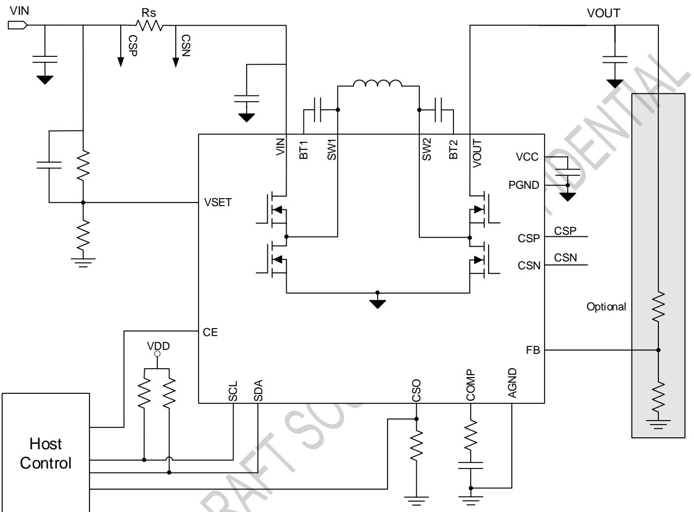  
Typical application circuit 2. current sense at VIN

Note: User can place current sense resistor at VIN or VOUT according to application requirement. SC8721 constantly regulates the sense resistor current at setting value, which is decided by internal register and CSO resistor. Please refer to Output Current Limit for current setting specification.

# 6 Terminal Configuration and Functions

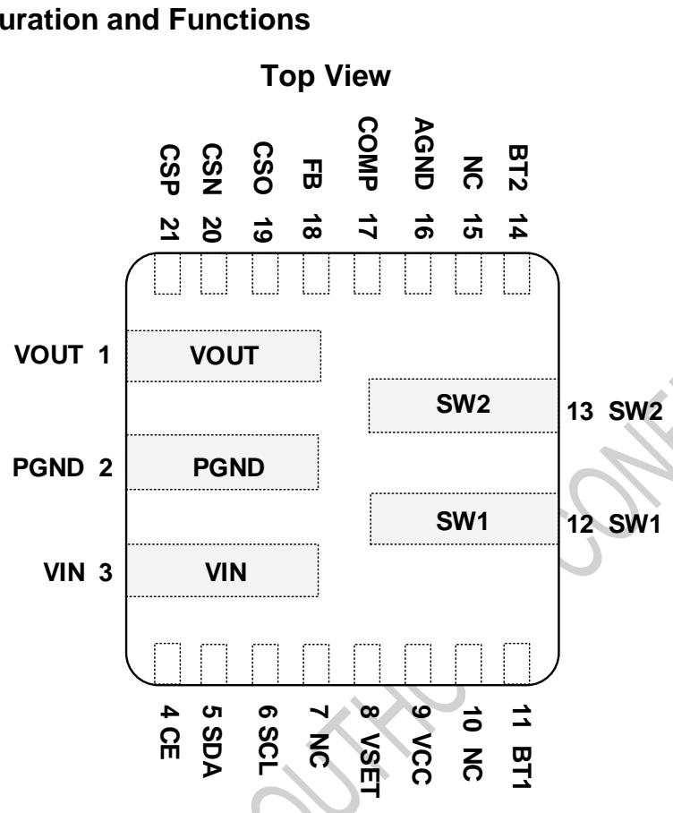

<table><tr><td colspan="2" rowspan="1">TERMINAL</td><td colspan="1" rowspan="2"> /o</td><td colspan="1" rowspan="2">DESCRIPTION</td></tr><tr><td colspan="1" rowspan="1">NUMBER</td><td colspan="1" rowspan="1">NAME</td></tr><tr><td colspan="1" rowspan="1">1</td><td colspan="1" rowspan="1">VOUT</td><td colspan="1" rowspan="1">/0</td><td colspan="1" rowspan="1">The power output node of the converter.</td></tr><tr><td colspan="1" rowspan="1">2</td><td colspan="1" rowspan="1">PGND</td><td colspan="1" rowspan="1">1/0</td><td colspan="1" rowspan="1">Power ground. User shall connect PGND and AGND together on PCB.</td></tr><tr><td colspan="1" rowspan="1">3</td><td colspan="1" rowspan="1">VIN</td><td colspan="1" rowspan="1"></td><td colspan="1" rowspan="1">the power input node of the converter.</td></tr><tr><td colspan="1" rowspan="1">4</td><td colspan="1" rowspan="1">CE</td><td colspan="1" rowspan="1"></td><td colspan="1" rowspan="1">Chip enable pin,active high:pullthis pin to logic low to disable the chip.This pin is internally pulled high.</td></tr><tr><td colspan="1" rowspan="1">5</td><td colspan="1" rowspan="1"></td><td colspan="1" rowspan="1">/0</td><td colspan="1" rowspan="1">I2C interface data. Connect SDA to the logic rail through a pull up resistor (typical 10 kΩ).</td></tr><tr><td colspan="1" rowspan="1">6</td><td colspan="1" rowspan="1"></td><td colspan="1" rowspan="1">一</td><td colspan="1" rowspan="1">I2C interface clock. Connect SCL to the logic rail through a pull up resistor (typical 10 kΩ).</td></tr><tr><td colspan="1" rowspan="1"></td><td colspan="1" rowspan="1">NC</td><td colspan="1" rowspan="1"></td><td colspan="1" rowspan="1">Must be floating</td></tr><tr><td colspan="1" rowspan="1">8</td><td colspan="1" rowspan="1">VSET</td><td colspan="1" rowspan="1">I0</td><td colspan="1" rowspan="1">VINREG internal 1.2V voltage reference. Set the VINREG voltage by resistor divider from to thispin</td></tr><tr><td colspan="1" rowspan="1">9</td><td colspan="1" rowspan="1">vCC</td><td colspan="1" rowspan="1">0</td><td colspan="1" rowspan="1">Output of an internal regulator.Connect a 2.2 μF ceramic capacitor from VCC to PGND pin closeto the IC.The regulator provides supply for internal gate drivers.</td></tr><tr><td colspan="1" rowspan="1">10</td><td colspan="1" rowspan="1">NC</td><td colspan="1" rowspan="1"></td><td colspan="1" rowspan="1">Must be floating</td></tr><tr><td colspan="1" rowspan="1">11</td><td colspan="1" rowspan="1">BT1</td><td colspan="1" rowspan="1">一</td><td colspan="1" rowspan="1">Connect a 100nF ceramic capacitor between BT1 pin and SW1 pin to provide the boosted biasvoltage for high side gate driver.</td></tr><tr><td colspan="1" rowspan="1">12</td><td colspan="1" rowspan="1">SW1</td><td colspan="1" rowspan="1">/0</td><td colspan="1" rowspan="1">Switching Node 1.Connect to inductor.</td></tr><tr><td colspan="1" rowspan="1">13</td><td colspan="1" rowspan="1">SW2</td><td colspan="1" rowspan="1">/0</td><td colspan="1" rowspan="1">Switching Node 2. Connect to inductor.</td></tr><tr><td colspan="1" rowspan="1">14</td><td colspan="1" rowspan="1">BT2</td><td colspan="1" rowspan="1">一</td><td colspan="1" rowspan="1">voltage for high side gate driver.</td></tr><tr><td colspan="1" rowspan="1">15</td><td colspan="1" rowspan="1">NC</td><td colspan="1" rowspan="1"></td><td colspan="1" rowspan="1"></td></tr><tr><td colspan="1" rowspan="1">16</td><td colspan="1" rowspan="1">AGND</td><td colspan="1" rowspan="1">/0</td><td colspan="1" rowspan="1">Analg ground. UsershallconetPGND and AGNDtgether on PCB</td></tr><tr><td colspan="1" rowspan="1">17</td><td colspan="1" rowspan="1">COMP</td><td colspan="1" rowspan="1">1</td><td colspan="1" rowspan="1">Connecta RC networktocompensate thecontrolop.</td></tr><tr><td colspan="1" rowspan="1">18</td><td colspan="1" rowspan="1">FB</td><td colspan="1" rowspan="1">一</td><td colspan="1" rowspan="1">connected at this pin.</td></tr><tr><td colspan="1" rowspan="1">19</td><td colspan="1" rowspan="1">CSO</td><td colspan="1" rowspan="1">0</td><td colspan="1" rowspan="1">proportional to the sense current.C</td></tr><tr><td colspan="1" rowspan="1">20</td><td colspan="1" rowspan="1">CSN</td><td colspan="1" rowspan="1">一</td><td colspan="1" rowspan="1">Negative input of an internal current sense amplifier. Connect a current sense resistor (typical 10mΩ) between CSP and CSN to sense the current.</td></tr><tr><td colspan="1" rowspan="1">21</td><td colspan="1" rowspan="1">CSP</td><td colspan="1" rowspan="1"></td><td colspan="1" rowspan="1">Positive input of an internal current sense amplifier. Connect a current sense resistor (typical 10mΩ) between CSP and CSN to sense the current.</td></tr></table>

# 7 Specifications

# 7.1 Absolute Maximum Ratings

over operating free-air temperature range (unless otherwise noted) (1)

<table><tr><td></td><td></td><td rowspan=1 colspan=1>MIN        MAX</td><td rowspan=1 colspan=1> Unit</td></tr><tr><td rowspan=7 colspan=1>Voltage range atterminals(2)</td><td rowspan=1 colspan=1>CE,SDA,SCL,CSEL,VSET,COMP,CSO, FB</td><td rowspan=1 colspan=1>-0.3        5.5</td><td rowspan=1 colspan=1>V</td></tr><tr><td rowspan=1 colspan=1>VCC</td><td rowspan=1 colspan=1>-0.3        6.5</td><td rowspan=1 colspan=1>V</td></tr><tr><td rowspan=1 colspan=1>VIN, VOUT, CSP, CSN</td><td rowspan=1 colspan=1>-0.3         25</td><td rowspan=1 colspan=1>V</td></tr><tr><td rowspan=1 colspan=1> SW1, SW2</td><td rowspan=1 colspan=1>-0.3        25</td><td rowspan=1 colspan=1>V</td></tr><tr><td rowspan=1 colspan=1>BT1, BT2</td><td rowspan=1 colspan=1>0.3        32</td><td rowspan=1 colspan=1>V</td></tr><tr><td rowspan=1 colspan=1>CSP to CSN</td><td rowspan=1 colspan=1>10</td><td rowspan=1 colspan=1>V</td></tr><tr><td rowspan=1 colspan=1>BT1 to SW1,BT2 to SW2</td><td rowspan=1 colspan=1>-0.3        6.5</td><td rowspan=1 colspan=1>V</td></tr><tr><td rowspan=1 colspan=1>TJ</td><td rowspan=1 colspan=1>Operating junction temperature range</td><td rowspan=1 colspan=1>-40         150</td><td rowspan=1 colspan=1>℃</td></tr><tr><td rowspan=1 colspan=1>Tstg</td><td rowspan=1 colspan=1>Storage temperature range</td><td rowspan=1 colspan=1>-65         150</td><td rowspan=1 colspan=1>°℃</td></tr></table>

(1) Stresses beyond those listed under absolute maximum ratings may cause permanent damage to the device. These are stress ratings only, and functional operation of the device at these or any other conditions beyond those indicated under recommended operating conditions is not implied. Exposure to absolute-maximum-rated conditions for extended periods may affect device reliability. (2) All voltage values are with respect to network ground terminal.

# 7.2 Thermal Information(TBD)

<table><tr><td rowspan=1 colspan=2>THERMAL RESISTANCE(1)</td><td rowspan=1 colspan=1> QFN-21 (4mmX4mm)</td><td rowspan=1 colspan=1>UNIT</td></tr><tr><td rowspan=1 colspan=1>0JA</td><td rowspan=1 colspan=1>Junction to ambient thermal resistance</td><td rowspan=1 colspan=1>TBD</td><td rowspan=1 colspan=1>CM</td></tr><tr><td rowspan=1 colspan=1>0JC</td><td rowspan=1 colspan=1>Junction to case resistance</td><td rowspan=1 colspan=1>TBD</td><td rowspan=1 colspan=1>CW</td></tr></table>

(1) Measured on JESD51-7, 4-layer PCB.

# 7.3 Handling Ratings

<table><tr><td> PARAMETER</td><td>DEFINITION</td><td> MIN</td><td> MAX</td><td> UNIT</td></tr><tr><td rowspan="2">ESD(1)</td><td>Human body model (HBM) ESD stress voltage(2)</td><td>-2</td><td>2</td><td>kV</td></tr><tr><td>Charged device model (CDM) ESD stress voltage(3)</td><td>-750</td><td>750</td><td>V</td></tr></table>

(1) Electrostatic discharge (ESD) to measure device sensitivity and immunity to damage caused by assembly line electrostatic discharges into the device.   
(2) Level listed above is the passing level per ANSI, ESDA, and JEDEC JS-001. JEDEC document JEP155 states that 500-V HBM allows safe manufacturing with a standard ESD control process.   
(3) Level listed above is the passing level per EIA-JEDEC JESD22-C101. JEDEC document JEP157 states that 250-V CDM allows safe manufacturing with a standard ESD control process.

# 7.4 Recommended Operating Conditions

<table><tr><td colspan="1" rowspan="1"></td><td colspan="1" rowspan="1"></td><td colspan="1" rowspan="1">MIN</td><td colspan="1" rowspan="1"> MAX</td><td colspan="1" rowspan="1">UNIT</td></tr><tr><td colspan="1" rowspan="1">VIN</td><td colspan="1" rowspan="1">VIN voltage range</td><td colspan="1" rowspan="1">2.7</td><td colspan="1" rowspan="1">22</td><td colspan="1" rowspan="1">V</td></tr><tr><td colspan="1" rowspan="1">VOUT</td><td colspan="1" rowspan="1">VOUT voltage range</td><td colspan="1" rowspan="1">2.7</td><td colspan="1" rowspan="1">22</td><td colspan="1" rowspan="1">V</td></tr><tr><td colspan="1" rowspan="1">CIN, Cout</td><td colspan="1" rowspan="1">VIN Capacitance, VOUT capacitance</td><td colspan="1" rowspan="1">30</td><td colspan="1" rowspan="1"></td><td colspan="1" rowspan="1">uF</td></tr><tr><td colspan="1" rowspan="1">L</td><td colspan="1" rowspan="1">Inductance</td><td colspan="1" rowspan="1">2.2</td><td colspan="1" rowspan="1">10</td><td colspan="1" rowspan="1">H</td></tr><tr><td colspan="1" rowspan="1">Rs</td><td colspan="1" rowspan="1">Current Sense Resistor</td><td colspan="1" rowspan="1">5</td><td colspan="1" rowspan="1">10</td><td colspan="1" rowspan="1">mΩ</td></tr><tr><td colspan="1" rowspan="1">Rcso</td><td colspan="1" rowspan="1">Current Limit setting resistor</td><td colspan="1" rowspan="1"></td><td colspan="1" rowspan="1">64</td><td colspan="1" rowspan="1">K</td></tr><tr><td colspan="2" rowspan="1"> PARAMETER</td><td colspan="1" rowspan="1">TEST CONDITIONS</td><td colspan="1" rowspan="1"> MIN      TYP      MAX</td><td colspan="1" rowspan="1"> UNIT</td></tr><tr><td colspan="5" rowspan="1">SUPPLYVOLTAGE</td></tr><tr><td colspan="1" rowspan="2">VUvLO</td><td colspan="1" rowspan="2">VIN   under-voltage   lockoutthreshold</td><td colspan="1" rowspan="1">Rising edge</td><td colspan="1" rowspan="1">2.5</td><td colspan="1" rowspan="1">V</td></tr><tr><td colspan="1" rowspan="1">Hysteresis</td><td colspan="1" rowspan="1">160</td><td colspan="1" rowspan="1">mV</td></tr><tr><td colspan="1" rowspan="1">lQ</td><td colspan="1" rowspan="1">Quiescent current into VIN</td><td colspan="1" rowspan="1">VIN = 8V,VOUT = 5VCE= H, non-switching</td><td colspan="1" rowspan="1">1.5</td><td colspan="1" rowspan="1">mA</td></tr><tr><td colspan="1" rowspan="1">ISHUTDOWN</td><td colspan="1" rowspan="1">Shutdown current VIN</td><td colspan="1" rowspan="1">VIN = 8V,CE = L</td><td colspan="1" rowspan="1">5.5</td><td colspan="1" rowspan="1">uA</td></tr><tr><td colspan="1" rowspan="1">ISTANDBY</td><td colspan="1" rowspan="1">Standby current from VIN</td><td colspan="1" rowspan="1">Standby mode (Reg0x05&lt;2&gt;=1),VIN=8V,CE=H</td><td colspan="1" rowspan="1"></td><td colspan="1" rowspan="1">uA</td></tr><tr><td colspan="5" rowspan="1">VCC, DIRVER AND POWER SWITCH</td></tr><tr><td colspan="1" rowspan="3">Vcc</td><td colspan="1" rowspan="3">VCC regulation voltage</td><td colspan="1" rowspan="1">VIN = 9V</td><td colspan="1" rowspan="1">5.5</td><td colspan="1" rowspan="1">V</td></tr><tr><td colspan="1" rowspan="1">VIN= 5V, ICC = 30mA</td><td colspan="1" rowspan="1"></td><td colspan="1" rowspan="1">V</td></tr><tr><td colspan="1" rowspan="1">VIN= 6V, ICC = 1mA,(Reg0x05&lt;2&gt;=1)</td><td colspan="1" rowspan="1"></td><td colspan="1" rowspan="1">V</td></tr><tr><td colspan="1" rowspan="1">IvcC_LIM</td><td colspan="1" rowspan="1">VCC current limit</td><td colspan="1" rowspan="1">VIN = 9V, VCC = 4V</td><td colspan="1" rowspan="1">80</td><td colspan="1" rowspan="1">mA</td></tr><tr><td colspan="1" rowspan="1">RDSon_HS</td><td colspan="1" rowspan="1">High side MOS on resistance</td><td colspan="1" rowspan="1"></td><td colspan="1" rowspan="1">10</td><td colspan="1" rowspan="1">m</td></tr><tr><td colspan="1" rowspan="1">RDSon_LS</td><td colspan="1" rowspan="1">Low side MOS on resistance</td><td colspan="1" rowspan="1"></td><td colspan="1" rowspan="1">20</td><td colspan="1" rowspan="1">mΩ</td></tr><tr><td colspan="5" rowspan="1">REFERENCEVOLTAGE FOR VOUT</td></tr><tr><td colspan="1" rowspan="1">VFB</td><td colspan="1" rowspan="1">FB reference voltage</td><td colspan="1" rowspan="1"></td><td colspan="1" rowspan="1">0.99       1       1.01</td><td colspan="1" rowspan="1">V</td></tr><tr><td colspan="1" rowspan="2">VFB_OVP</td><td colspan="1" rowspan="2">FB OVP threshold,over FB target</td><td colspan="1" rowspan="1">Rising edge</td><td colspan="1" rowspan="1">110%</td><td colspan="1" rowspan="1"></td></tr><tr><td colspan="1" rowspan="1"></td><td colspan="1" rowspan="1">2%</td><td colspan="1" rowspan="1"></td></tr><tr><td colspan="1" rowspan="1">VINOVP</td><td colspan="1" rowspan="1">Absolute OVP threshold for VIN</td><td colspan="1" rowspan="1"></td><td colspan="1" rowspan="1">23</td><td colspan="1" rowspan="1">V</td></tr><tr><td colspan="1" rowspan="1">VSHORT</td><td colspan="1" rowspan="1">Short circuit detection threshold</td><td colspan="1" rowspan="1"></td><td colspan="1" rowspan="1">2.4</td><td colspan="1" rowspan="1">V</td></tr><tr><td colspan="1" rowspan="1">VINREG_REF</td><td colspan="1" rowspan="1">VSET reference voltage</td><td colspan="1" rowspan="1"></td><td colspan="1" rowspan="1">1.2</td><td colspan="1" rowspan="1">V</td></tr><tr><td colspan="5" rowspan="1">CURRENT LIMIT</td></tr><tr><td colspan="1" rowspan="1">lLIM</td><td colspan="1" rowspan="1">Output current limit accuracy</td><td colspan="1" rowspan="1">louT Rs ≥20mV</td><td colspan="1" rowspan="1">-5%                   5%</td><td colspan="1" rowspan="1"></td></tr><tr><td colspan="1" rowspan="1">locP</td><td colspan="1" rowspan="1"> Internal current limit</td><td colspan="1" rowspan="1"></td><td colspan="1" rowspan="1">10</td><td colspan="1" rowspan="1">A</td></tr><tr><td colspan="5" rowspan="1">ERROR AMPLIFIER</td></tr><tr><td colspan="1" rowspan="1">GmEA</td><td colspan="1" rowspan="1">Error amplifier gm</td><td colspan="1" rowspan="1"></td><td colspan="1" rowspan="1">0.16</td><td colspan="1" rowspan="1">mS</td></tr><tr><td colspan="1" rowspan="1">RouT</td><td colspan="1" rowspan="1">Error amplifier output resistance</td><td colspan="1" rowspan="1"></td><td colspan="1" rowspan="1">20</td><td colspan="1" rowspan="1">MΩ</td></tr><tr><td colspan="1" rowspan="1">IsINK_COMP</td><td colspan="1" rowspan="1">COMP sink current</td><td colspan="1" rowspan="1"></td><td colspan="1" rowspan="1">27</td><td colspan="1" rowspan="1">uA</td></tr><tr><td colspan="1" rowspan="1">IsRC_COMP</td><td colspan="1" rowspan="1">COMP source current</td><td colspan="1" rowspan="1"></td><td colspan="1" rowspan="1">16</td><td colspan="1" rowspan="1">uA</td></tr><tr><td colspan="1" rowspan="1">IBIAS_FB</td><td colspan="1" rowspan="1">FB pin input bias current</td><td colspan="1" rowspan="1">FB in regulation</td><td colspan="1" rowspan="1">50</td><td colspan="1" rowspan="1">nA</td></tr><tr><td colspan="5" rowspan="1">LOGIC CONTROL</td></tr><tr><td colspan="1" rowspan="1">RPH</td><td colspan="1" rowspan="1">CE pin internal pull high resistor</td><td colspan="1" rowspan="1"></td><td colspan="1" rowspan="1">2</td><td colspan="1" rowspan="1">MΩ</td></tr><tr><td colspan="1" rowspan="1">VIL</td><td colspan="1" rowspan="1">CE pin input low voltage</td><td colspan="1" rowspan="1"></td><td colspan="1" rowspan="1">0.4</td><td colspan="1" rowspan="1">V</td></tr><tr><td colspan="1" rowspan="1">VIH</td><td colspan="1" rowspan="1">CE pin input high voltage</td><td colspan="1" rowspan="1"></td><td colspan="1" rowspan="1">1.2</td><td colspan="1" rowspan="1">V</td></tr><tr><td colspan="5" rowspan="1">Frequency</td></tr><tr><td colspan="1" rowspan="4">Fsw</td><td colspan="1" rowspan="4">Switching frequency</td><td colspan="1" rowspan="1">REG08 = 0x00</td><td colspan="1" rowspan="1">260</td><td colspan="1" rowspan="1"> KHz</td></tr><tr><td colspan="1" rowspan="1">REG08= Ox01(default)</td><td colspan="1" rowspan="1">500</td><td colspan="1" rowspan="1">kHz</td></tr><tr><td colspan="1" rowspan="1">REG08 = 0x02</td><td colspan="1" rowspan="1">720</td><td colspan="1" rowspan="1">KHz</td></tr><tr><td colspan="1" rowspan="1">REG08 = 0x03</td><td colspan="1" rowspan="1">920</td><td colspan="1" rowspan="1">KHZ</td></tr><tr><td colspan="3" rowspan="1">SOFTSTART</td><td colspan="2" rowspan="1"></td></tr><tr><td colspan="1" rowspan="1">tss</td><td colspan="1" rowspan="1">Internal soft-start time</td><td colspan="1" rowspan="1">From 10% to 90%VOUT</td><td colspan="1" rowspan="1">15</td><td colspan="1" rowspan="1">ms</td></tr><tr><td colspan="2" rowspan="1">I2C INTERFACE (SDA, SCL)</td><td colspan="1" rowspan="1"></td><td colspan="2" rowspan="1"></td></tr><tr><td colspan="1" rowspan="1">ViL</td><td colspan="1" rowspan="1">SDA/SCL logic low input voltagelevel</td><td colspan="1" rowspan="1">VPULL_UP = 3V</td><td colspan="1" rowspan="1">0.4</td><td colspan="1" rowspan="1">V</td></tr><tr><td colspan="1" rowspan="1">VIH</td><td colspan="1" rowspan="1">SDA/SCL logic high input voltagelevel</td><td colspan="1" rowspan="1">VPULL_UP = 3V</td><td colspan="1" rowspan="1"></td><td colspan="1" rowspan="1">V</td></tr><tr><td colspan="1" rowspan="1">ISINK_SDA</td><td colspan="1" rowspan="1">SDA sink current</td><td colspan="1" rowspan="1">VsDA = 0.4 V</td><td colspan="1" rowspan="1">20</td><td colspan="1" rowspan="1">mA</td></tr><tr><td colspan="1" rowspan="1">fsCL</td><td colspan="1" rowspan="1">I2C clock frequency</td><td colspan="1" rowspan="1"></td><td colspan="1" rowspan="1">400</td><td colspan="1" rowspan="1"> KHz</td></tr><tr><td colspan="2" rowspan="1">THERMAL SHUTDOWN</td><td colspan="2" rowspan="1"></td><td colspan="1" rowspan="1"></td></tr><tr><td colspan="1" rowspan="2">TsD</td><td colspan="1" rowspan="1">Thermal shutdown temperature (1)</td><td colspan="1" rowspan="1"></td><td colspan="1" rowspan="1">160</td><td colspan="1" rowspan="1">℃</td></tr><tr><td colspan="1" rowspan="1">Thermal shutdown hysteresis (1)</td><td colspan="1" rowspan="1"></td><td colspan="1" rowspan="1">30</td><td colspan="1" rowspan="1">℃</td></tr></table>

# 8 Feature Description

# 8.1 Chip Enable

The IC is enabled or disabled by CE signal. When CE input is logic high, the IC is enabled; when CE input is logic low, the IC is disabled. The CE pin is pulled high by 2 MΩ resistor internally.

# 8.2 Soft Start

The IC implements soft start feature to prevent inrush current during startup in discharging mode. After the discharging mode is enabled, the IC ramps up the internal reference voltage in around 15ms. The output voltage follows the reference, so it starts up slowly. Meantime, the IC ramps up the current limits during the startup. If a heavy load is applied before the output voltage is established, the IC may fail to start up due to the current limit.

# 8.3 Output Voltage Setting

# 8.3.1 External Setting method

When FB_SEL signal is 0, the output voltage is set by the resistor divider connected at FB pin and can be calculated as below.

# 8.3.3 Dynamic Output Control

In discharging mode, output voltage can be set via IIC. In IIC, there’s a load function, after Load is set to 1, VOUT starts to ramp at the speed of 1mV/us.

# 8.3.4 Cable drop compensation

VOUT has a cable drop compensation. The slope can be programmed via I2C registers. If external feedback resistor is applied, Rup must be 100K to have the designed slope.

# 8.4 Output Current Limit

The output current limit can be set by internal register and external resistor.

where

CSO_SET is reference voltage, set by $\mathsf { R e g 0 x 0 1 { < } 7 : 0 > }$

$\mathsf { R } _ { \mathsf { C S O } } =$ Resistors at CSO pin;

$\mathsf { R } _ { \mathbb { S } } =$ Current sense resistor value to sense output current;

When output is overload, the IC regulates the output current at setting current limit value and output voltage decreases automatically.

$$
{ \mathsf { V O U T } } = { \mathsf { V F B \_ R E F } } \times ( 1 + { \frac { \mathsf { R U P } } { { \mathsf { R D O W N } } } } )
$$

Where:

VFB_REF is the internal reference voltage 1V, RUP and RDOWN are the resistors connected from VOUT to FB and to AGND.

# 8.3.2 Internal Setting method

When FB_SEL signal is 1, the out voltage can be programmed internally via IIC. VOUT offset voltage is decided by 10-bit register $( \mathsf { R e g 0 3 { < } 7 : } 0 >$ and $\scriptstyle { \mathsf { R e g } } 0 4 < 1 : 0 > )$ , a 20mV/step resolution is given.

$$
\mathsf { O F F S E F } = [ \mathsf { R e g 0 3 < 7 : 0 > \times 4 } + \mathsf { R e g 0 4 < 1 : 0 > } ] \times 2 0 \mathsf { m V }
$$

FB_ON is the mask control bit of VOUT_REF register. Only when FB_ON=1, the VOUT_REF register value is valid, the VOUT voltage is 5V default. FB_DIR is the direction control bit.

If FB_DIR=0, the VOUT voltage is:

If FB_DIR $^ { = 1 }$ , the VOUT voltage is:

# 8.5 Output Current Monitor

In discharging mode, the output current can be monitored in real time through CSO pin.

$$
1 0 \mathsf { U T } = \frac { \mathsf { V C s o } * 2 \mathsf { k } \Omega } { \mathsf { R s } ^ { \star } \mathsf { R c s o } }
$$

where

$\mathsf { V } _ { \mathsf { C S O } }$ is voltage of CSO pin;

$\mathsf { R c s o } =$ Resistors at CSO pin;

$\mathsf { R s } =$ Current sense resistor value to sense IOUT current;

# 8.6 Self-adaptive Input Voltage Regulation

The IC features dynamic VIN power management. The allowed minimum VIN operation voltage is VINREG threshold, which can be set by resistor divider at the VSET pin. During charging, if the output current is higher than VIN’s current capability, the input source will be overloaded, and the VIN voltage is pulled low. Once the VIN voltage drops at VINREG threshold, the IC reduces the output voltage automatically and regulates the VIN voltage at VINREG threshold. the VINREG voltage is set by the resistor divider connected at VSET pin and can be calculated as below.

# Where:

VSET_REF is the internal reference voltage 1.2V, ${ \mathsf { R } } _ { \mathsf { U P } }$ and RDOWN are the resistors connected from VIN to VSET and to AGND.

Connect VSET pin with $1 0 \boldsymbol { \mathrm { k } } \Omega$ pull-up resistor to VCC, or set $\scriptstyle { \mathsf { R e g } } 0 6 < 4 >$ to 0, VINREG function is disabled.

# 8.7 Register Load function

When output current limit and output voltage register value is set via I2C, Load bit $( \mathsf { R e g 0 } \times 0 . 5 { < } 1 > )$ must be set to 1, then value can be loaded to corresponding registers.

# 8.8 PWM/PFM Operation

The IC supports two operation modes: PWM mode and PFM mode.

In PWM mode, the IC always works with constant switching frequency for the whole load range. This helps achieve the best output voltage performance, but the efficiency is low at light load condition because of the high switching loss.

In PFM mode, the IC still works with constant switching frequency under heavy load condition, but under light load condition, it changes to pulse frequency modulation operation to reduce the switching loss. The efficiency can be improved under light load condition while output voltage ripple will be a little larger compared with PWM operation. Below figure shows the output voltage behavior of PFM mode.

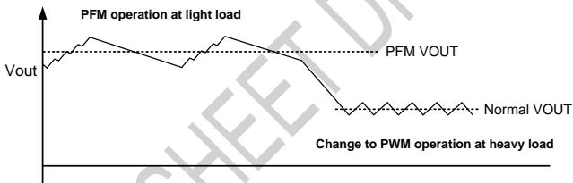  
Figure 1 PFM operation

# 8.9 Switching Frequency

The SC8721 provides four switching frequency selection from 230kHz/500kHz/690kHz/920kHz.

# 8.10 VCC Driver Voltage

The IC integrates a VCC regulator so to generate the driver voltage for internal driver circuit. The VCC is supplied by VIN

and is clamped to 5V. Connect a $2 . 2 \mu \ F$ ceramic capacitor from VCC to PGND pin close to the IC.

# 8.11 Loop Compensation

The internal control loop should be compensated by the resistor and capacitor connected at COMP pin. $1 0 ~ \mathsf { \mathsf { k } } \Omega$ resistor and 22 nF capacitor are suggested for most applications. If faster response is required, the user can increase the resistor value but should $\mathsf { k e e p } \ \mathsf { R } ^ { \star } \mathsf { C }$ value unchanged. After changing the compensation, check and make sure the loop is stable under target conditions.

# 8.9 Standby Mode

When CE signal is high and DIS_DCDC bit is 1, the IC enters into Standby mode. In this mode, the IC stops switching to save the quiescent current. The other functions are still valid, and the MCU can still control the IC through I2C.

# 8.10 Shutdown Mode

When CE signal is low, the IC enters into Shutdown mode. In this mode, the IC stops working and disables the I2C interface to save the power.

# 8.12 Protections

# 8.12.1 Over Voltage Protection

The IC supports three mechanisms for over voltage protection.

The first is once the IC detects the VIN voltage is higher than typical 23V, the IC stops switching until the voltage drops below the threshold.

The second is once the IC detects the VOUT voltage is higher than the setting target by typical $1 0 \% ( \mathsf { F B \_ S E L } = 0 )$ , the IC stops switching until the voltage drops below the threshold.

The third is once the IC detects the VOUT voltage is $5 0 0 \mathsf { m } \mathsf { V }$ higher than the setting target $( \mathsf { F B } _ { - } \mathsf { S E L } = 1 _ { . }$ ), the IC stops switching until the voltage drops below the threshold.

# 8.12.2 Over Current Protection

The IC implements internal current limit at 10A. Once the IC detects the inductor current is higher than 10A, it reduces the switching duty cycle, and keeps the inductor current from increasing.

# 8.12.3 Output Short Circuit Protection

The IC supports FB pin short circuit protection when external divider resistor is applied to adjust voltage in discharging mode. During power on, the IC monitors the FB pin status. Once it detects the FB pin is short to ground, it still starts up and limits the VOUT voltage at 5V fixed voltage. This helps protect the circuits connected at VOUT pin from over voltage stress.

Besides FB short circuit protection, the IC also monitors the VOUT voltage all the time. Once it detects the VOUT voltage drops below short circuit protection threshold, typical 2.4V, the IC begins to hiccup.

# 8.12.4 Over Temperature Protection

Once the IC detects the chip junction temperature exceeds the threshold ( $1 6 0 ^ { \circ } \mathsf { C }$ typical), the IC goes into thermal shutdown and stops switching. When the junction temperature falls below typical $1 3 0 ^ { \circ } \mathrm { C }$ , the IC resumes operation.

# 8.13 I2C and Registers

# 8.13.1 I2C Interface

The IC features I2C interface, so the MCU or controller can control the IC flexibly. The 7-bit I2C address of the chip is 0x62 (8-bit address is $\scriptstyle 0 \times 0 . 4$ for write command, 0xC5 for read command). The SDA and SCL pins are open drain and must be connected to the positive supply voltage via a current source or pull-up resistor. When the bus is free, both lines are HIGH. The I2C interface supports both standard mode (up to 100kbits) and fast mode (up to 400k bits with 5 kΩ pull up resistor at SCL pin and SDA pin respectively).

# 8.13.1.1 Data Validity

The data on the SDA line must be stable during the HIGH period of the clock. The HIGH or LOW state of the data line can only change when the clock signal on the SCL line is LOW. One clock pulse is generated for each data bit transferred.

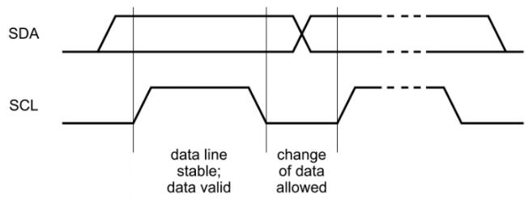  
Figure 2 Bit transfer on the I2C bus

# 8.13.1.2 START and STOP Conditions

All transactions begin with a START (S) and are terminated by a STOP (P). A HIGH to LOW transition on the SDA line while SCL is HIGH defines a START condition. A LOW to HIGH transition on the SDA line while SCL is HIGH defines a STOP condition.

START and STOP conditions are always generated by the master. The bus is considered to be busy after the START condition. The bus is considered to be free again a certain time after the STOP condition.

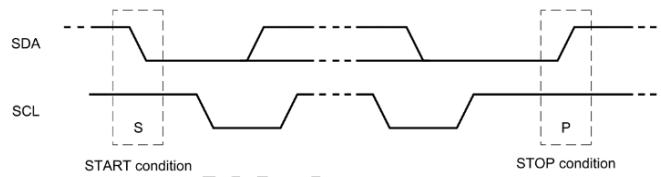  
Figure 3 START and STOP conditions

# 8.13.1.3 Byte Format

Every byte put on the SDA line must be eight bits long. The number of bytes that can be transmitted per transfer is unrestricted. Each byte must be followed by an Acknowledge bit. Data is transferred with the Most Significant Bit (MSB) first. If a slave cannot receive or transmit another complete byte of data until it has performed some other function, for example servicing an internal interrupt, it can hold the clock line SCL LOW to force the master into a wait state. Data transfer then continues when the slave is ready for another byte of data and releases clock line SCL.

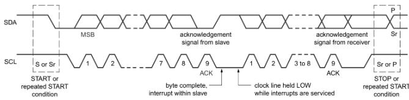  
Figure 4 Data transfer on the I2C bus

# 8.13.1.4 Acknowledge (ACK) and Not Acknowledge (NACK)

The acknowledge takes place after every byte. The acknowledge bit allows the receiver to signal the transmitter that the byte was successfully received and another byte may be sent. During data is transferred, the master can either be the transmitter or the receiver. No matter what it is, the master generates all clock pulses, including the acknowledge ninth clock pulse.

The transmitter releases the SDA line during the acknowledge clock pulse so the receiver can pull the SDA line LOW and it remains stable LOW during the HIGH period of this clock pulse.

When SDA remains HIGH during this ninth clock pulse, this is defined as the Not Acknowledge signal. The master can then generate either a STOP condition to abort the transfer, or a repeated START condition to start a new transfer.

# 8.13.1.5 The slave address and R/W bit

Data transfers follow the format shown in below. After the START condition (S), a slave address is sent. This address is seven bits long followed by an eighth bit which is a data direction bit (R/W) — a ‘zero’ indicates a transmission (WRITE), a ‘one’ indicates a request for data (READ). A data transfer is always terminated by a STOP condition (P) generated by the master. However, if a master still wishes to communicate on the bus, it can generate a repeated START condition (Sr) and address another slave without first generating a STOP condition.

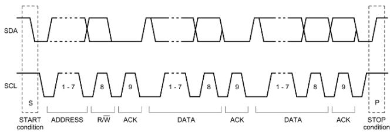  
Figure 5 A complete data transfer

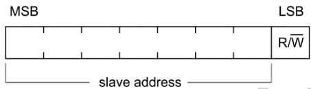  
Figure 6 The first byte after the START procedure

# 8.13.1.6 Single Read and Write

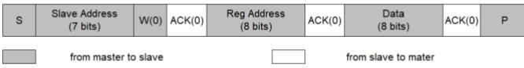  
Figure 7 Single Wite

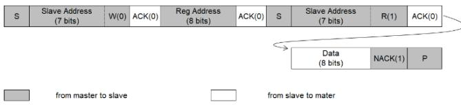  
Figure 8 Single Read

If the register address is not defined, the charger IC send back NACK and go back to the idle state.

# 8.13.1.7 Multi-Read and Multi-Write

The IC supports multi-read and multi-write for continuous registers.

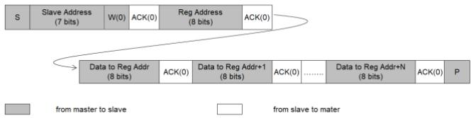  
Figure 9 Multi-Write

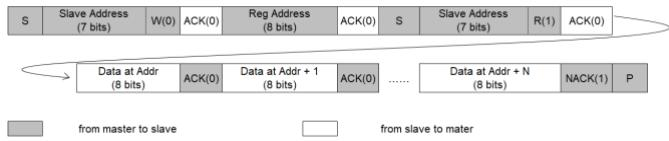  
Figure 10 Multi-Read

# 9 Application Information (TBD)

# 9.1 Input and Output Capacitor Selection

Since MLCC ceramic capacitor has good high frequency filtering and low ESR, X5R or X7R capacitors are recommended for input and output capacitors. Typically, three $2 2 \ \mu \mathsf { F }$ ceramic input capacitors and three $2 2 \ \mu \mathsf { F }$ ceramic output capacitors work for most applications. The input / output capacitors should be places as close to VIN / CSN pins as possible, and they should be also near the PGND pins or thermal pad.

Capacitors’ derating effect under DC bias should be taken into account when selecting the capacitors. Ceramic capacitor normally loses its most capacitance at the rated voltage, so leave margin on voltage rating to ensure adequate effective capacitance. For example, if the highest operating voltage is 12V, select 16V or 25V capacitor.

Besides this, high value electrolytic capacitor or tantalum capacitor is recommended to place in parallel with the ceramic capacitors at output to improve the load transient response.

# 9.2 Inductor Selection

Because the selection of inductor affects the loop stability and the power efficiency, inductor is one of the most important components for the DCDC design.

The IC can work with inductors between $2 . 2 ~ \mu \mathsf { H } \ t 0 ~ 1 0 ~ \mu \mathsf { H }$ range for most applications. A higher value is suggested to keep the inductor current ripple $\leq 3 0 \%$ of the DC current.

Compared with high value inductor in the same package size, a lower value inductor normally has smaller DC resistance (DCR), so can reduce the conduction power loss, which can be calculated roughly as

IL is the average value of inductor current, and it equals to IIN or IOUT.

However, besides DCR, the core loss or AC loss of an inductor also affects the power efficiency a lot. The low value inductor causes large inductor current ripple, thus high core loss or AC loss, so it is not always the low value inductor supports the higher efficiency.

Since the core loss is related to the inductor material type, and normally the inductor vendors don’t provide the core loss data, it is very difficult to suggest what inductor value can result in higher efficiency. As a rule of thumb, high value inductor like $4 . 7 \ \mu \mathsf { H }$ to $1 0 ~ \mu \mathsf { H }$ is recommended for applications where the difference between input voltage and output voltage is big, such as 5V to ${ } ^ { 2 0 \vee }$ ; while for those applications where input voltage is close to output voltage but large current is on power path, low value inductor like $2 . 2 \mu \mathsf { H }$ is suggested.

For applications where efficiency or thermal dissipation is very important, it is highly suggested that the user chooses the inductor in larger package size for lower DCR, and also tests the efficiency with different inductor values, so to find the best combination to achieve the highest efficiency.

The saturation current is another important parameter when selecting the inductor. The inductance can decrease $20 \%$ to $3 5 \%$ when the current approaches saturation level, so the user should make sure the saturation current is higher than the inductor peak current during the operation.

The inductor peak current can be calculated by below formula.

?? is the power conversion efficiency. User can use $90 \%$ for calculation.

fsw is the switching frequency

L is the inductor value

When selecting inductor, the inductor saturation current must be higher than the peak inductor current with enough margin $2 0 \%$ margin is recommended). The rating current of the inductor must be higher than the output current.

# 9.3 Current Sense Resistor

The $\mathsf { R s }$ in the typical application circuit are current sense resistors for current limit functions.

A high resistor value can result in high current limit / monitor accuracy but causes high conductor loss. Typically, $1 0 ~ \mathsf { m } \Omega$ is recommended. But for applications where efficiency is more important than accuracy, lower value is suggested.

When selecting the current sense resistor, its power rating and temperature coefficient should also be considered.

The power dissipation can be roughly calculated as ${ \mathsf { P } } { = } { \mathsf { I } } ^ { 2 } { \mathsf { R } }$ , where I is the highest current flowing through it. The power rating should be higher than the calculated value.

The resistor value varies with temperature and the variation is decided by its temperature coefficient. If high accuracy of limit or monitor is required, select as lower temperature coefficient as possible.

# 9.4 Snubber Circuit

The RC snubber circuits at SWx nodes as shown below can be used to suppress the switching spike so to improve the EMC performance. A typical snubber circuit is composed by a 2.2Ω resistor and 1nF capacitor. The user can reduce the resistance and increase the capacitance further to improve the EMC. However, because it often causes higher switching loss and results in lower efficiency, it is suggested not to add snubber circuits unless necessary.

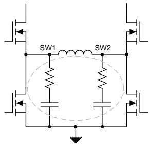  
Figure 15 Snubber circuit at SWx nodes

The IC also allows user adding a driver resistor for the low side MOSFET at VOUT side to slow down the switching, thus to reduce the switching spike improve the EMC performance. However, because the driver resistor also causes higher switching loss and thus lower efficiency, it is suggested not to add the driver resistor unless necessary.

If the driver resistor is needed, a 0603 resistor should be used, and it should be placed near the IC.

# 10 Register Map

<table><tr><td rowspan=1 colspan=1>Addr</td><td rowspan=1 colspan=1>Register</td><td rowspan=1 colspan=1>Type</td><td rowspan=1 colspan=1>Default value@POR</td><td rowspan=1 colspan=1>Bit7</td><td rowspan=1 colspan=1>Bit 6</td><td rowspan=1 colspan=1>Bit 5</td><td rowspan=1 colspan=1>Bit 4</td><td rowspan=1 colspan=1>Bit 3</td><td rowspan=1 colspan=1>Bit 2</td><td rowspan=1 colspan=1>Bit 1</td><td rowspan=1 colspan=1>Bit 0</td></tr><tr><td rowspan=1 colspan=1>01H</td><td rowspan=1 colspan=1>CSO</td><td rowspan=1 colspan=1>RW</td><td rowspan=1 colspan=1>1111 0000</td><td rowspan=1 colspan=8>CSO_SET</td></tr><tr><td rowspan=1 colspan=1>02H</td><td rowspan=1 colspan=1>SLOPE_COMP</td><td rowspan=1 colspan=1>RW</td><td rowspan=1 colspan=1>xxxx xx00</td><td rowspan=1 colspan=6>RESERVED</td><td rowspan=1 colspan=2>SLOP_COMP</td></tr><tr><td rowspan=1 colspan=1>03H</td><td rowspan=1 colspan=1>VOUT_SET_MSB</td><td rowspan=1 colspan=1>RW</td><td rowspan=1 colspan=1>0000 0000</td><td rowspan=1 colspan=8>VOUT_SET_MSB</td></tr><tr><td rowspan=1 colspan=1>04H</td><td rowspan=1 colspan=1>VOUT_SET_LSB</td><td rowspan=1 colspan=1>RM</td><td rowspan=1 colspan=1>xxx0 0000</td><td rowspan=1 colspan=3>RESERVED</td><td rowspan=1 colspan=1>FB_SEL</td><td rowspan=1 colspan=1>（FB_ON</td><td rowspan=1 colspan=1>FB_DIR</td><td rowspan=1 colspan=2>VOUT_SET_LSB</td></tr><tr><td rowspan=1 colspan=1>05H</td><td rowspan=1 colspan=1>GLOBAL_CTRL</td><td rowspan=1 colspan=1>RM</td><td rowspan=1 colspan=1>xxxx x000</td><td rowspan=1 colspan=5>RESERVED</td><td rowspan=1 colspan=1>DIS_DCDC</td><td rowspan=1 colspan=1>REG_LOAD</td><td rowspan=1 colspan=1>RESERVED</td></tr><tr><td rowspan=1 colspan=1>06H</td><td rowspan=1 colspan=1>SYS_SET</td><td rowspan=1 colspan=1>RW</td><td rowspan=1 colspan=1>00x1 xxxX</td><td rowspan=1 colspan=1>EN_PWM</td><td rowspan=1 colspan=1>EXT_DT</td><td rowspan=1 colspan=1>RESERVED</td><td rowspan=1 colspan=1>EN_VINREG</td><td rowspan=1 colspan=4>RESERVED</td></tr><tr><td rowspan=1 colspan=1>07H</td><td rowspan=1 colspan=1>RESERVED</td><td rowspan=1 colspan=1>RW</td><td rowspan=1 colspan=1>XXXX XXXX</td><td rowspan=1 colspan=8>RESERVED</td></tr><tr><td rowspan=1 colspan=1>08H</td><td rowspan=1 colspan=1>FREQ_SET</td><td rowspan=1 colspan=1>RM</td><td rowspan=1 colspan=1>0000 0001</td><td rowspan=1 colspan=6>RESERVED</td><td rowspan=1 colspan=2>FREQ_SET</td></tr><tr><td rowspan=1 colspan=1>09H</td><td rowspan=1 colspan=1>STATUS_1</td><td rowspan=1 colspan=1>R</td><td rowspan=1 colspan=1>0000 0000</td><td rowspan=1 colspan=1>VOUT_SHORT</td><td rowspan=1 colspan=1>VOUT_VIN_H</td><td rowspan=1 colspan=1>RESERVED</td><td rowspan=1 colspan=1>RESERVED</td><td rowspan=1 colspan=1>THD</td><td rowspan=1 colspan=1>RESERVED</td><td rowspan=1 colspan=1>RESERVED</td><td rowspan=1 colspan=1>OCP</td></tr><tr><td rowspan=1 colspan=1>0AH</td><td rowspan=1 colspan=1>STATUS_2</td><td rowspan=1 colspan=1>R</td><td rowspan=1 colspan=1>0000 0000</td><td rowspan=1 colspan=1>VINOVP</td><td rowspan=1 colspan=1>RESERVED</td><td rowspan=1 colspan=1>RESERVED</td><td rowspan=1 colspan=1>RESERVED</td><td rowspan=1 colspan=1>RESERVED</td><td rowspan=1 colspan=1>VINREG_FLAG</td><td rowspan=1 colspan=1>IBUS_FLAG</td><td rowspan=1 colspan=1>RESERVED</td></tr></table>

Table 1 0x01H CSO_SET Register   

<table><tr><td rowspan="2">Bit</td><td rowspan="2">Mode</td><td rowspan="2">Bit Name</td><td rowspan="2">Default value @POR</td><td colspan="2">Description</td><td rowspan="2">Notes</td></tr><tr><td></td></tr><tr><td>7-0</td><td>RW</td><td>CSO voltage setting</td><td>1111 0000</td><td>CSO_SET used to set VOUT current reference limit The output current limit is calculated as:</td><td>UPCONFIDENT</td><td>CSO_SET is clamped to</td></tr><tr><td></td><td></td><td></td><td></td><td>IOUT_ILIM =</td><td>(CSO_SET+1)*4mV*2kΩ</td><td>be higher than Ox08</td></tr><tr><td></td><td></td><td></td><td></td><td></td><td>Rs*Rcso</td><td></td></tr><tr><td></td><td></td><td></td><td></td><td>CSO_SET range:0~255</td><td></td><td></td></tr><tr><td></td><td></td><td></td><td></td><td>0000 0000: 0</td><td></td><td></td></tr><tr><td></td><td></td><td></td><td></td><td>0000 0001: 1</td><td></td><td></td></tr><tr><td></td><td></td><td></td><td></td><td>0000 0010: 2</td><td></td><td></td></tr><tr><td></td><td></td><td></td><td></td><td>… 1111 0000: 240 (default)</td><td></td><td></td></tr><tr><td></td><td></td><td></td><td></td><td></td><td></td><td></td></tr><tr><td></td><td></td><td></td><td></td><td>· 1111 1111:255</td><td></td><td></td></tr></table>

Table 2 0x02H SLOPE_COMP Register   

<table><tr><td rowspan=1 colspan=1>Bit</td><td rowspan=1 colspan=1>Mode</td><td rowspan=1 colspan=1>Bit Name</td><td rowspan=1 colspan=1>Default value@POR</td><td rowspan=1 colspan=1>Description</td><td rowspan=1 colspan=1>Notes</td></tr><tr><td rowspan=1 colspan=1>7-2</td><td rowspan=1 colspan=1>RW</td><td rowspan=1 colspan=1>Reserved</td><td rowspan=1 colspan=1>000000</td><td rowspan=1 colspan=1>Internal use. Don&#x27;t overwrite this bit.</td><td rowspan=1 colspan=1></td></tr><tr><td rowspan=1 colspan=1>1-0</td><td rowspan=1 colspan=1>RW</td><td rowspan=1 colspan=1>SLOPE_COMP</td><td rowspan=1 colspan=1></td><td rowspan=1 colspan=1> SLOPE_COMP is used to set VOUT cable dropcompensation00: no slope compensation (default)01: 50mV/A10: 100mV/A11:150mV/A</td><td rowspan=1 colspan=1></td></tr></table>

Table 3 0x03H VOUT _SET_MSB Register   

<table><tr><td>Bit</td><td>Mode</td><td>Bit Name</td><td>Default value @POR</td><td>Description</td><td>Notes</td></tr><tr><td>7-0</td><td>DAA</td><td>VOUT_SET_MSB</td><td>000000</td><td>The highest 8-bit of the VOUT_SET.</td><td></td></tr><tr><td rowspan="3"></td><td></td><td></td><td></td><td>VOUT_SET_MSB and VOUT_SET_LSB are used to set VOUT_SET</td><td></td></tr><tr><td></td><td></td><td></td><td>The VOUT_SET is calculated as:</td><td></td></tr><tr><td></td><td></td><td></td><td>VOUT_SET=VOUT_SET_MSB x4+VOUT_SET_LSB)×20mV</td><td></td></tr></table>

Table 4 0x04H VOUT_SET Register   

<table><tr><td rowspan=1 colspan=1>Bit</td><td rowspan=1 colspan=1>Mode</td><td rowspan=1 colspan=1>Bit Name</td><td rowspan=1 colspan=1>Default value@POR</td><td rowspan=1 colspan=1>Description</td><td rowspan=1 colspan=1>Notes</td></tr><tr><td rowspan=1 colspan=1>7-5</td><td rowspan=1 colspan=1>R</td><td rowspan=1 colspan=1>Reserved</td><td rowspan=1 colspan=1>000</td><td rowspan=1 colspan=1>Internal use.Don&#x27;t overwrite this bit</td><td rowspan=1 colspan=1></td></tr><tr><td rowspan=1 colspan=1>4</td><td rowspan=1 colspan=1>RW</td><td rowspan=1 colspan=1>FB_SEL</td><td rowspan=1 colspan=1>0</td><td rowspan=1 colspan=1>VOUT voltage setting control,only for discharging mode:O: External VOUT setting, VOUT output voltage is set byresistor dividerat FB pin1: Internal VOUT setting, VOUT output voltage is setVOUT_SET_MSB,VOUT_SET_LSBandFB_DIR</td><td rowspan=1 colspan=1></td></tr><tr><td rowspan=1 colspan=1>3</td><td rowspan=1 colspan=1>RW</td><td rowspan=1 colspan=1>FB_ON</td><td rowspan=1 colspan=1>0</td><td rowspan=1 colspan=1>VOUT_SET mask bit0: VOUT voltage is not allowed to be revis1: VOUT voltage isallowed to be revise</td><td rowspan=1 colspan=1></td></tr><tr><td rowspan=1 colspan=1>2</td><td rowspan=1 colspan=1>RW</td><td rowspan=1 colspan=1>FB_DIR</td><td rowspan=1 colspan=1>0</td><td rowspan=1 colspan=1>VOUT_SET_direction:O: Increment(default)1: Decrement</td><td rowspan=1 colspan=1></td></tr><tr><td rowspan=1 colspan=1>1-0</td><td rowspan=1 colspan=1>RW</td><td rowspan=1 colspan=1>VOUT_SET_LSB</td><td rowspan=1 colspan=1>00</td><td rowspan=1 colspan=1>The lowest 2-bit of the VOUT_SET</td><td rowspan=1 colspan=1></td></tr></table>

Table 5 0x05H GLOBAL_CTRL Register   

<table><tr><td rowspan=1 colspan=1>Bit</td><td rowspan=1 colspan=1>Mode</td><td rowspan=1 colspan=1> Bit Name</td><td rowspan=1 colspan=1>Default value@POR</td><td rowspan=1 colspan=1>Description</td><td rowspan=1 colspan=1>Notes</td></tr><tr><td rowspan=1 colspan=1>7-3</td><td rowspan=1 colspan=1>RW</td><td rowspan=1 colspan=1>Reserved</td><td rowspan=1 colspan=1>0000</td><td rowspan=1 colspan=1>Internal use. Don't overwriethis bit</td><td rowspan=1 colspan=1></td></tr><tr><td rowspan=1 colspan=1>2</td><td rowspan=1 colspan=1>RW</td><td rowspan=1 colspan=1>DIS_DCDC</td><td rowspan=1 colspan=1></td><td rowspan=1 colspan=1>DCDC switching control:O: enable(default)1: disable</td><td rowspan=1 colspan=1></td></tr><tr><td rowspan=1 colspan=1>1</td><td rowspan=1 colspan=1>RW</td><td rowspan=1 colspan=1>Load</td><td rowspan=1 colspan=1>0</td><td rowspan=1 colspan=1>Write 1to load register (CSO_SET/VOUT_SET /FB_DIR)and clear to O automaticallyafter read</td><td rowspan=1 colspan=1></td></tr><tr><td rowspan=1 colspan=1>0</td><td rowspan=1 colspan=1>RW</td><td rowspan=1 colspan=1>Reserved bit</td><td rowspan=1 colspan=1>0</td><td rowspan=1 colspan=1>Internal use.Don&#x27;t overwrite this bit</td><td rowspan=1 colspan=1></td></tr></table>

Table 6 0x06H SYS_SET Register   

<table><tr><td colspan="1" rowspan="1">Bit</td><td colspan="1" rowspan="1">Mode</td><td colspan="1" rowspan="1">Bit Name</td><td colspan="1" rowspan="1">Default value@POR</td><td colspan="1" rowspan="1">Description</td><td colspan="1" rowspan="1">Notes</td></tr><tr><td colspan="1" rowspan="1">7</td><td colspan="1" rowspan="1">RW</td><td colspan="1" rowspan="1">EN_PWM</td><td colspan="1" rowspan="1">1</td><td colspan="1" rowspan="1">EN_PWM:O: disable,auto pwm mode1: enable, force pwm mode(default)</td><td colspan="1" rowspan="1"></td></tr><tr><td colspan="1" rowspan="1">6</td><td colspan="1" rowspan="1">RW</td><td colspan="1" rowspan="1">EXT_DT</td><td colspan="1" rowspan="1">0</td><td colspan="1" rowspan="1">Switching dead time setting:0: 20ns(default)1: 40ns</td><td colspan="1" rowspan="1"></td></tr><tr><td>5</td><td>RW RW</td><td>Reserved bit</td><td>0</td><td>Internal use. Don't overwrite this bit</td></tr><tr><td rowspan="3">4</td><td rowspan="3"></td><td rowspan="3">EN_VINREG</td><td>1 VINREG enable control:</td><td></td></tr><tr><td></td><td>0: disable</td></tr><tr><td>1: enable (default)</td><td></td></tr><tr><td>3-0</td><td>RW</td><td>Reserved bit</td><td>0000</td><td>Internal use. Don't overwrite this bit</td><td></td></tr></table>

Table 7 0x07H TERM_SET Register   

<table><tr><td rowspan=1 colspan=1>Bit</td><td rowspan=1 colspan=1>Mode</td><td rowspan=1 colspan=1>Bit Name</td><td rowspan=1 colspan=1>Default value@POR</td><td rowspan=1 colspan=1>Description</td><td rowspan=1 colspan=1>Notes</td></tr><tr><td rowspan=1 colspan=1>7-0</td><td rowspan=1 colspan=1>RW</td><td rowspan=1 colspan=1>Reserved bit</td><td rowspan=1 colspan=1>00000000</td><td rowspan=1 colspan=1>Internal use.Don&#x27;t overwrite this bit</td><td rowspan=1 colspan=1></td></tr></table>

Table 8 0x08H FREQ_SET Register   

<table><tr><td>Bit</td><td>Mode</td><td>Bit Name</td><td>Default value @POR</td><td>Description</td><td>Notes</td></tr><tr><td>7-2</td><td>RW</td><td>Reserved bit</td><td>000000</td><td>Internal use. Don&#x27;t overwrite this bit</td><td></td></tr><tr><td>1-0</td><td>RW</td><td>Frequency set</td><td>01 00: 260kHz</td><td>Switching frequency setting: 01: 500kHz(default) 10:720kHz</td><td></td></tr></table>

Table 9 0x09H STATUS_1 Register   

<table><tr><td rowspan=1 colspan=1>Bit</td><td rowspan=1 colspan=1>Mode</td><td rowspan=1 colspan=1>Bit Name</td><td rowspan=1 colspan=1>Default value@POR</td><td rowspan=1 colspan=1>Description</td><td rowspan=1 colspan=1>Notes</td></tr><tr><td rowspan=1 colspan=1>7</td><td rowspan=1 colspan=1>R</td><td rowspan=1 colspan=1>VOUT SHORT</td><td rowspan=1 colspan=1>0</td><td rowspan=1 colspan=1>1: VOUT&lt;0.7V happens</td><td rowspan=1 colspan=1></td></tr><tr><td rowspan=1 colspan=1>6</td><td rowspan=1 colspan=1>R</td><td rowspan=1 colspan=1></td><td rowspan=1 colspan=1>0</td><td rowspan=1 colspan=1>0: VOUT &lt; VIN1: VOUT &gt; VIN</td><td rowspan=1 colspan=1></td></tr><tr><td rowspan=1 colspan=1>5</td><td rowspan=1 colspan=1></td><td rowspan=1 colspan=1>Reserved bit</td><td rowspan=1 colspan=1>0</td><td rowspan=1 colspan=1>Internal use. Don&#x27;t overwrite this bit</td><td rowspan=1 colspan=1></td></tr><tr><td rowspan=1 colspan=1></td><td rowspan=1 colspan=1></td><td rowspan=1 colspan=1>Reserved bit</td><td rowspan=1 colspan=1>0</td><td rowspan=1 colspan=1>Internal use.Don&#x27;t overwrite this bit</td><td rowspan=1 colspan=1></td></tr><tr><td rowspan=1 colspan=1>3</td><td rowspan=1 colspan=1>R</td><td rowspan=1 colspan=1>THD</td><td rowspan=1 colspan=1>0</td><td rowspan=1 colspan=1>1:Thermal shutdown</td><td rowspan=1 colspan=1></td></tr><tr><td rowspan=1 colspan=1>2</td><td rowspan=1 colspan=1>R</td><td rowspan=1 colspan=1>Reserved bit</td><td rowspan=1 colspan=1>0</td><td rowspan=1 colspan=1>Internal use.Don&#x27;t overwrite this bit</td><td rowspan=1 colspan=1></td></tr><tr><td rowspan=1 colspan=1>1</td><td rowspan=1 colspan=1>R</td><td rowspan=1 colspan=1>Reserved bit</td><td rowspan=1 colspan=1>0</td><td rowspan=1 colspan=1>Internal use.Don&#x27;t overwrite this bit</td><td rowspan=1 colspan=1></td></tr></table>

<table><tr><td rowspan=1 colspan=1>0</td><td rowspan=1 colspan=1>R</td><td rowspan=1 colspan=1>OCP</td><td rowspan=1 colspan=1>0</td><td rowspan=1 colspan=1>1: Internal over current protection happens</td></tr></table>

Table 10 0x0AH STATUS_2 Register   

<table><tr><td rowspan=1 colspan=1>Bit</td><td rowspan=1 colspan=1>Mode</td><td rowspan=1 colspan=1>Bit Name</td><td rowspan=1 colspan=1>Default value@POR</td><td rowspan=1 colspan=1>Description</td><td rowspan=1 colspan=1>Notes</td></tr><tr><td rowspan=1 colspan=1>7</td><td rowspan=1 colspan=1>R</td><td rowspan=1 colspan=1>VINOVP</td><td rowspan=1 colspan=1>0</td><td rowspan=1 colspan=1>1: VIN higher than absolute voltage threshold (22V) happens</td><td rowspan=1 colspan=1></td></tr><tr><td rowspan=1 colspan=1>6</td><td rowspan=1 colspan=1>R</td><td rowspan=1 colspan=1>Reserved bit</td><td rowspan=1 colspan=1>0</td><td rowspan=1 colspan=1>Internal use.Don&#x27;t overwrite this bit</td><td rowspan=1 colspan=1></td></tr><tr><td rowspan=1 colspan=1>5</td><td rowspan=1 colspan=1>R</td><td rowspan=1 colspan=1>Reserved bit</td><td rowspan=1 colspan=1>0</td><td rowspan=1 colspan=1>Internal use.Don&#x27;t overwrite this bit</td><td rowspan=1 colspan=1></td></tr><tr><td rowspan=1 colspan=1>4</td><td rowspan=1 colspan=1>R</td><td rowspan=1 colspan=1>Reserved bit</td><td rowspan=1 colspan=1>0</td><td rowspan=1 colspan=1>Internal use. Don&#x27;t overwrite this bit</td><td rowspan=1 colspan=1></td></tr><tr><td rowspan=1 colspan=1>3</td><td rowspan=1 colspan=1>R</td><td rowspan=1 colspan=1>Reserved bit</td><td rowspan=1 colspan=1>0</td><td rowspan=1 colspan=1>Internal use. Don'toverwrite this bit</td><td rowspan=1 colspan=1></td></tr><tr><td rowspan=1 colspan=1>2</td><td rowspan=1 colspan=1>R</td><td rowspan=1 colspan=1>VINREG_FLAG</td><td rowspan=1 colspan=1>0</td><td rowspan=1 colspan=1>1: IC working in VINREG loop</td><td rowspan=1 colspan=1></td></tr><tr><td rowspan=1 colspan=1>1</td><td rowspan=1 colspan=1>R</td><td rowspan=1 colspan=1>IBUS_FLAG</td><td rowspan=1 colspan=1>0</td><td rowspan=1 colspan=1>1: IC working in current limit loop</td><td rowspan=1 colspan=1></td></tr><tr><td rowspan=1 colspan=1>0</td><td rowspan=1 colspan=1>R</td><td rowspan=1 colspan=1>Reserved bit</td><td rowspan=1 colspan=1>0</td><td rowspan=1 colspan=1>Internal use. Don&#x27;t overwrite this bit</td><td rowspan=1 colspan=1></td></tr></table>

# MECHANICAL DATA

QFN-21 (4x4x0.75)

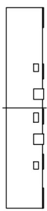

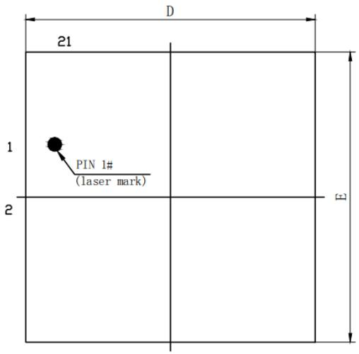  
TOP VIEW

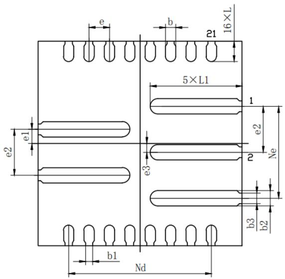  
BOTTOW VIEW

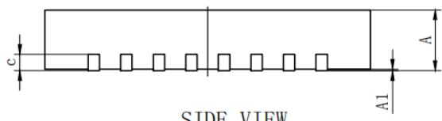  
SIDE VIEW

<table><tr><td rowspan=2 colspan=1>SYMBOL</td><td rowspan=1 colspan=3>MILLIMETER</td></tr><tr><td rowspan=1 colspan=1>MIN</td><td rowspan=1 colspan=1>NOM</td><td rowspan=1 colspan=1>MAX</td></tr><tr><td rowspan=1 colspan=1>A</td><td rowspan=1 colspan=1>0.70</td><td rowspan=1 colspan=1>0.75</td><td rowspan=1 colspan=1>0.80</td></tr><tr><td rowspan=1 colspan=1>A1</td><td rowspan=1 colspan=1>0</td><td rowspan=1 colspan=1>0.02</td><td rowspan=1 colspan=1>0.05</td></tr><tr><td rowspan=1 colspan=1>b</td><td rowspan=1 colspan=1>0.15</td><td rowspan=1 colspan=1>0.20</td><td rowspan=1 colspan=1>0.25</td></tr><tr><td rowspan=1 colspan=1>b1</td><td rowspan=1 colspan=1></td><td rowspan=1 colspan=1>0.14REF</td><td rowspan=1 colspan=1></td></tr><tr><td rowspan=1 colspan=1>b2</td><td rowspan=1 colspan=1>0.25</td><td rowspan=1 colspan=1>0.30</td><td rowspan=1 colspan=1>0.35</td></tr><tr><td rowspan=1 colspan=1>b3</td><td rowspan=1 colspan=3>0.21REF</td></tr><tr><td rowspan=1 colspan=1>C</td><td rowspan=1 colspan=3>0.203REF</td></tr><tr><td rowspan=1 colspan=1>D</td><td rowspan=1 colspan=3>3.90 4.00 4. 10</td></tr><tr><td rowspan=1 colspan=1>e</td><td rowspan=1 colspan=3>0.40BSC</td></tr><tr><td rowspan=1 colspan=1>e1</td><td rowspan=1 colspan=3>0.275BSC</td></tr><tr><td rowspan=1 colspan=1>e2</td><td rowspan=1 colspan=3>0.90BSC</td></tr><tr><td rowspan=1 colspan=1>e3</td><td rowspan=1 colspan=3>0. 175BSC</td></tr><tr><td rowspan=1 colspan=1>E</td><td rowspan=1 colspan=3>3.90 4.00 4.10</td></tr><tr><td rowspan=1 colspan=1>Nd</td><td rowspan=1 colspan=3>2.80BSC</td></tr><tr><td rowspan=1 colspan=1>Ne</td><td rowspan=1 colspan=3>1. 80BSC</td></tr><tr><td rowspan=1 colspan=1>L</td><td rowspan=1 colspan=1>0.35</td><td rowspan=1 colspan=1>0.40</td><td rowspan=1 colspan=1>0.45</td></tr><tr><td rowspan=1 colspan=1>L1</td><td rowspan=1 colspan=1>1.75</td><td rowspan=1 colspan=1>1.80</td><td rowspan=1 colspan=1>1.85</td></tr></table>

# RECOMMENDED FOOTPRINT QFN-21 $( 4 \times 4 \times 0 . 7 5 )$ (Unit: mm)

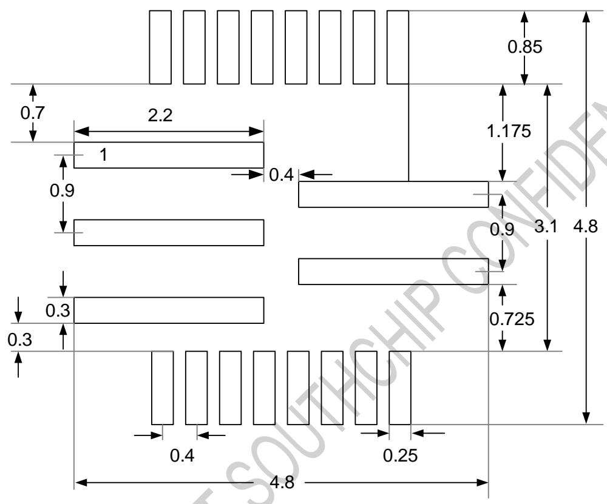