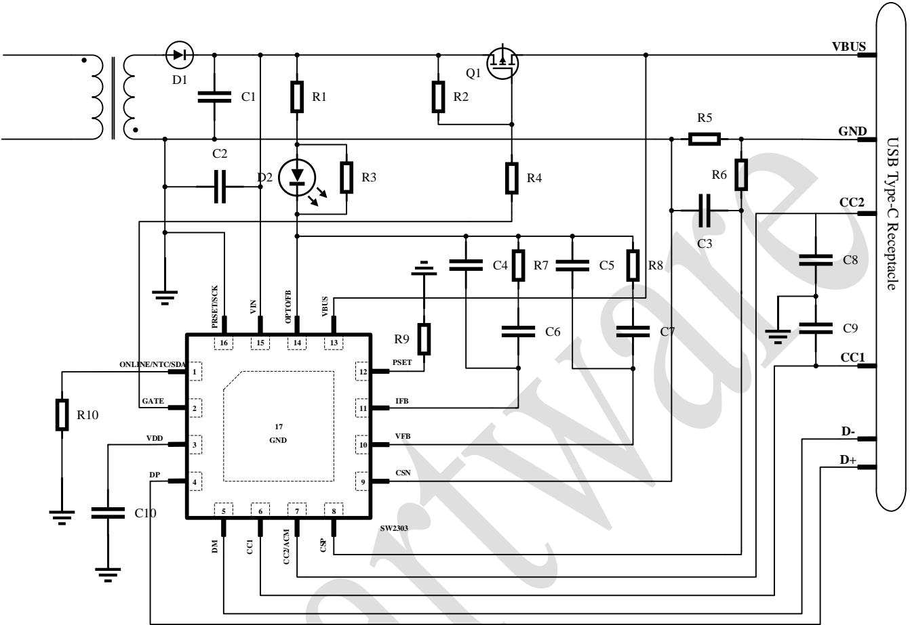

# SW2303 USB PD And QC Protocols Controller

> Source: [docs/datasheets/source/SW2303_Datasheet_Release_DS077_v1.6.pdf](../source/SW2303_Datasheet_Release_DS077_v1.6.pdf)

# 1. General Description

The SW2303 is a highly integrated Type-C/Type-A port fast charging protocol controller. It supports BC1.2/PD3.0+PPS/QC4 $^ +$ /AFC/FCP/SCP/SFCP/PE charging protocols. It integrates an optocoupler driver and a FB feedback output for CC and CV loop control. With ACDC or DCDC and a few external components, the SW2303 provides a complete high-performance Type-C port/Type-A port fast charging solution.

# 2. Applications

• Car charger • Adapter • Power strip

# 3. Features

# • Power Management

➢ Wide input voltage range $3 . 0 { \sim } 2 5 \mathrm { V }$ ➢ Optocoupler drive and FB output CC/CV Mode ➢ VIN and VBUS fast discharge ➢ Cable voltage drop compensation

# • Fast Charge Protocol

➢ Support QC5/QC4.0+/QC3.0/QC2.0 QC5 Report Number:QC20210413228 QC4+ Report Number:QC20201216209 Support PD3.0 with PPS PD TID:4847 Support AFC Support FCP and SCP Support SFCP Support PE1.1 and PE2.0

# • Type-C Interface

➢ Support USB Type-C Specification ➢ Support DFP Role   
➢ Support VCONN   
➢ CC/CC2/DP/DM Pin BV > 25V

# BC1.2 Module

➢ ➢ Support BC1.2 DCP Support Apple & Samsung Device

# • System Control

➢ External blocking PMOS/NMOS   
➢ I2C interface   
➢ Flexible configuration of power and voltage profile   
Dynamic power allocation

# • Protection

➢ Softstart   
➢ Output over voltage protection   
Output under voltage protection Output over current protection Input under voltage protection NTC over temperature protection Over temperature protection   
➢ DPDM and CC/CC2 over voltage protection

• QFN-16(4x4mm)Package • >±4KV ESD HBM

# 4. Block Diagram

# 5. Pin Configuration and Function

# 5.1. Pin Configuration

# 5.2. Pin Descriptions

<table><tr><td colspan="1" rowspan="1"> Pin</td><td colspan="1" rowspan="1"> Name</td><td colspan="1" rowspan="1">Function Description</td></tr><tr><td colspan="1" rowspan="1">1   +</td><td colspan="1" rowspan="1">ONLINE/NTC/SDA</td><td colspan="1" rowspan="1"> Online detect, NTC detect, I2C SDA pin.</td></tr><tr><td colspan="1" rowspan="1">2</td><td colspan="1" rowspan="1">GATE</td><td colspan="1" rowspan="1">Power path control pin, supporting NMOS and PMOS.</td></tr><tr><td colspan="1" rowspan="1">3</td><td colspan="1" rowspan="1">VDD</td><td colspan="1" rowspan="1">Internal power.</td></tr><tr><td colspan="1" rowspan="1">4</td><td colspan="1" rowspan="1">DP</td><td colspan="1" rowspan="1">USB port DP pin.</td></tr><tr><td colspan="1" rowspan="1">5</td><td colspan="1" rowspan="1">DM</td><td colspan="1" rowspan="1">USB port DM pin.</td></tr><tr><td colspan="1" rowspan="1">6</td><td colspan="1" rowspan="1">CC1</td><td colspan="1" rowspan="1">Type-C port CC1 pin.</td></tr><tr><td colspan="1" rowspan="1">7</td><td colspan="1" rowspan="1">CC2/ACM</td><td colspan="1" rowspan="1">Type-C port CC2, or Port A and port C mode detect pin.</td></tr><tr><td colspan="1" rowspan="1">8</td><td colspan="1" rowspan="1">CSP</td><td colspan="1" rowspan="1">Current sense positive pin.</td></tr><tr><td colspan="1" rowspan="1">9</td><td colspan="1" rowspan="1">CSN</td><td colspan="1" rowspan="1">Current sense negative pin.</td></tr><tr><td colspan="1" rowspan="1">10</td><td colspan="1" rowspan="1">VFB</td><td colspan="1" rowspan="1">Voltage loop feedback pin.</td></tr><tr><td colspan="1" rowspan="1">11</td><td colspan="1" rowspan="1">IFB</td><td colspan="1" rowspan="1">Current loop feedback pin.</td></tr><tr><td colspan="1" rowspan="1">12</td><td colspan="1" rowspan="1">PSET</td><td colspan="1" rowspan="1">Power set pin.</td></tr><tr><td colspan="1" rowspan="1">13</td><td colspan="1" rowspan="1">VBUS</td><td colspan="1" rowspan="1">VBUS detect and discharge pin.</td></tr><tr><td colspan="1" rowspan="1">14</td><td colspan="1" rowspan="1">OPTO/FB</td><td colspan="1" rowspan="1">OPTP driver, or FB output pin</td></tr><tr><td colspan="1" rowspan="1">15</td><td colspan="1" rowspan="1">VIN</td><td colspan="1" rowspan="1"> Input power</td></tr><tr><td colspan="1" rowspan="1">16</td><td colspan="1" rowspan="1">PRSET/SCK</td><td colspan="1" rowspan="1">Power reduction set, or I2C SCK pin.</td></tr><tr><td colspan="1" rowspan="1">EPAD</td><td colspan="1" rowspan="1">GND</td><td colspan="1" rowspan="1">Power ground</td></tr></table>

# 6. Absolute Maximum Ratings

<table><tr><td rowspan=1 colspan=1> Parameters</td><td rowspan=1 colspan=1> Symbol</td><td rowspan=1 colspan=1>MIN</td><td rowspan=1 colspan=1>MAX</td><td rowspan=1 colspan=1>UNIT</td></tr><tr><td rowspan=1 colspan=1>Input Voltage</td><td rowspan=1 colspan=1>VIN</td><td rowspan=1 colspan=1>-0.3</td><td rowspan=1 colspan=1>44</td><td rowspan=1 colspan=1>V</td></tr><tr><td rowspan=1 colspan=1> Output Voltage</td><td rowspan=1 colspan=1>VBUS</td><td rowspan=1 colspan=1>-0.3</td><td rowspan=1 colspan=1>44</td><td rowspan=1 colspan=1>V</td></tr><tr><td rowspan=1 colspan=1>Power Path Control</td><td rowspan=1 colspan=1>GATE</td><td rowspan=1 colspan=1>-0.3</td><td rowspan=1 colspan=1>44</td><td rowspan=1 colspan=1>V</td></tr><tr><td rowspan=1 colspan=1>OPTO Driver</td><td rowspan=1 colspan=1>OPTO</td><td rowspan=1 colspan=1>-0.3</td><td rowspan=1 colspan=1>40</td><td rowspan=1 colspan=1>V</td></tr><tr><td rowspan=1 colspan=1>Internal Power</td><td rowspan=1 colspan=1>VDD</td><td rowspan=1 colspan=1>-0.3</td><td rowspan=1 colspan=1>5.5</td><td rowspan=1 colspan=1>V</td></tr><tr><td rowspan=1 colspan=1>Communication Pins</td><td rowspan=1 colspan=1>CC1/CC2/DP/DM</td><td rowspan=1 colspan=1>-0.3</td><td rowspan=1 colspan=1>40</td><td rowspan=1 colspan=1>V</td></tr><tr><td rowspan=1 colspan=1> Other Pins</td><td rowspan=1 colspan=1>/</td><td rowspan=1 colspan=1>-0.3</td><td rowspan=1 colspan=1>6</td><td rowspan=1 colspan=1>V</td></tr><tr><td rowspan=1 colspan=1> Junction Temperature</td><td rowspan=1 colspan=1></td><td rowspan=1 colspan=1>-40</td><td rowspan=1 colspan=1>+150</td><td rowspan=1 colspan=1>℃</td></tr><tr><td rowspan=1 colspan=1> Storage Temperature Range</td><td rowspan=1 colspan=1></td><td rowspan=1 colspan=1>-60</td><td rowspan=1 colspan=1>+150</td><td rowspan=1 colspan=1>℃</td></tr><tr><td rowspan=1 colspan=1>ESD（HBM)</td><td rowspan=1 colspan=1></td><td rowspan=1 colspan=1>-4</td><td rowspan=1 colspan=1>+4</td><td rowspan=1 colspan=1>KV</td></tr></table>

【 Notice 】 Stresses beyond those listed under absolute maximum ratings may cause permanent damage to the device. These are stress ratings only, and functional operation of the device at these or any other conditions beyond those indicated under recommended operating conditions is not implied. Exposure to absolute-maximum-rated conditions for extended periods may affect device reliability.

# 7. Recommended Operating Conditions

<table><tr><td rowspan=1 colspan=1>Parameters</td><td rowspan=1 colspan=1>Symbol</td><td rowspan=1 colspan=1>MIN</td><td rowspan=1 colspan=1> Typical</td><td rowspan=1 colspan=1>MAX</td><td rowspan=1 colspan=1>UNIT</td></tr><tr><td rowspan=1 colspan=1>Input Voltage</td><td rowspan=1 colspan=1>VIN</td><td rowspan=1 colspan=1>3.0</td><td rowspan=1 colspan=1></td><td rowspan=1 colspan=1>25</td><td rowspan=1 colspan=1>V</td></tr></table>

# 8. Electrical Characteristics

（ $( \mathrm { T _ { A } } = 2 5 ^ { \circ } \mathrm { C }$ , unless otherwise specified.）

<table><tr><td colspan="1" rowspan="1"> Parameters</td><td colspan="1" rowspan="1"> Symbol</td><td colspan="1" rowspan="1"> Test Conditions</td><td colspan="1" rowspan="1"> MIN</td><td colspan="1" rowspan="1"> TYP</td><td colspan="1" rowspan="1"> MAX</td><td colspan="1" rowspan="1"> UNIT</td></tr><tr><td colspan="7" rowspan="1">Power Supply</td></tr><tr><td colspan="1" rowspan="1">VIN Input Voltage</td><td colspan="1" rowspan="1">VIN</td><td colspan="1" rowspan="1"></td><td colspan="1" rowspan="1">3.0</td><td colspan="1" rowspan="1"></td><td colspan="1" rowspan="1">30</td><td colspan="1" rowspan="1">V</td></tr><tr><td colspan="1" rowspan="1">VIN Input UVLO Threshold</td><td colspan="1" rowspan="1">VIN_UVLO</td><td colspan="1" rowspan="1">VIN Voltage Falling</td><td colspan="1" rowspan="1">2.70</td><td colspan="1" rowspan="1">2.75</td><td colspan="1" rowspan="1">2.80</td><td colspan="1" rowspan="1">V</td></tr><tr><td colspan="1" rowspan="1">VIN Input UVLO Hysteresis</td><td colspan="1" rowspan="1">VIN_UVL0_HYS</td><td colspan="1" rowspan="1">VIN Voltage Rising</td><td colspan="1" rowspan="1">0.20</td><td colspan="1" rowspan="1">0.25</td><td colspan="1" rowspan="1">0.30</td><td colspan="1" rowspan="1">V</td></tr><tr><td colspan="1" rowspan="1">VDD Output Voltage</td><td colspan="1" rowspan="1">VDD</td><td colspan="1" rowspan="1">VIN=5V</td><td colspan="1" rowspan="1">4.90</td><td colspan="1" rowspan="1">4.95</td><td colspan="1" rowspan="1">5.0</td><td colspan="1" rowspan="1">V</td></tr><tr><td colspan="1" rowspan="1">VDD Output Current</td><td colspan="1" rowspan="1">IDD</td><td colspan="1" rowspan="1">ViN=5V</td><td colspan="1" rowspan="1">70</td><td colspan="1" rowspan="1">80</td><td colspan="1" rowspan="1">90</td><td colspan="1" rowspan="1">mA</td></tr><tr><td colspan="1" rowspan="1">Quiescent Current</td><td colspan="1" rowspan="1">IQ</td><td colspan="1" rowspan="1">VIN=5V, IoUT=0mA</td><td colspan="1" rowspan="1">0.5</td><td colspan="1" rowspan="1">0.6</td><td colspan="1" rowspan="1">0.8</td><td colspan="1" rowspan="1">mA</td></tr><tr><td colspan="7" rowspan="1">Type-C Interface</td></tr><tr><td colspan="1" rowspan="2">CC Pins Output Current</td><td colspan="1" rowspan="1">IcC_SOURCE</td><td colspan="1" rowspan="1">Power Level=1.5A</td><td colspan="1" rowspan="1">170</td><td colspan="1" rowspan="1">180</td><td colspan="1" rowspan="1">190</td><td colspan="1" rowspan="1">uA</td></tr><tr><td colspan="1" rowspan="1">IcC_sOURCE</td><td colspan="1" rowspan="1">Power Level=3.0A</td><td colspan="1" rowspan="1">315</td><td colspan="1" rowspan="1">330</td><td colspan="1" rowspan="1">345</td><td colspan="1" rowspan="1">uA</td></tr><tr><td colspan="1" rowspan="1">BMC Bit Rate</td><td colspan="1" rowspan="1">fBitRate</td><td colspan="1" rowspan="1"></td><td colspan="1" rowspan="1">270</td><td colspan="1" rowspan="1">300</td><td colspan="1" rowspan="1">330</td><td colspan="1" rowspan="1">Kbps</td></tr><tr><td colspan="1" rowspan="1">BMC Level</td><td colspan="1" rowspan="1">Vswing</td><td colspan="1" rowspan="1"></td><td colspan="1" rowspan="1">1.050</td><td colspan="1" rowspan="1">1.125</td><td colspan="1" rowspan="1">1.200</td><td colspan="1" rowspan="1">V</td></tr><tr><td colspan="1" rowspan="1">TX Output impedance</td><td colspan="1" rowspan="1">ZDriver</td><td colspan="1" rowspan="1"></td><td colspan="1" rowspan="1">30</td><td colspan="1" rowspan="1">54</td><td colspan="1" rowspan="1">70</td><td colspan="1" rowspan="1">0</td></tr><tr><td colspan="7" rowspan="1">BC1.2 DCP</td></tr><tr><td colspan="1" rowspan="2">Apple 2.4A mode</td><td colspan="1" rowspan="1">VDp/VDM</td><td colspan="1" rowspan="1">Apple 2.4A Voltage</td><td colspan="1" rowspan="1">2.65</td><td colspan="1" rowspan="1">2.7</td><td colspan="1" rowspan="1">2.75</td><td colspan="1" rowspan="1">V</td></tr><tr><td colspan="1" rowspan="1">RDp/RDM</td><td colspan="1" rowspan="1"> Apple 2.4A impedance</td><td colspan="1" rowspan="1">27</td><td colspan="1" rowspan="1">30</td><td colspan="1" rowspan="1">33</td><td colspan="1" rowspan="1">k</td></tr><tr><td colspan="1" rowspan="2">Samsung 2A mode</td><td colspan="1" rowspan="1">VDp/VDM</td><td colspan="1" rowspan="1"> Samsung 2A Voltage</td><td colspan="1" rowspan="1">1.15</td><td colspan="1" rowspan="1">1.2</td><td colspan="1" rowspan="1">1.25</td><td colspan="1" rowspan="1">V</td></tr><tr><td colspan="1" rowspan="1">RDp/RDM</td><td colspan="1" rowspan="1"> Samsung 2A impedance</td><td colspan="1" rowspan="1">90</td><td colspan="1" rowspan="1">100</td><td colspan="1" rowspan="1">110</td><td colspan="1" rowspan="1">k</td></tr><tr><td colspan="7" rowspan="1">HVDCP</td></tr><tr><td colspan="1" rowspan="1">DATA Detect Voltage Reference</td><td colspan="1" rowspan="1">VDATA_REF</td><td colspan="1" rowspan="1"></td><td colspan="1" rowspan="1">0.3</td><td colspan="1" rowspan="1">0.325</td><td colspan="1" rowspan="1">0.35</td><td colspan="1" rowspan="1">V</td></tr><tr><td colspan="1" rowspan="1">DP High Glitch Filter Time</td><td colspan="1" rowspan="1">TGLITCH_DP_H</td><td colspan="1" rowspan="1"></td><td colspan="1" rowspan="1">1000</td><td colspan="1" rowspan="1">1250</td><td colspan="1" rowspan="1">1500</td><td colspan="1" rowspan="1">ms</td></tr><tr><td colspan="1" rowspan="1">DM Low Glitch Filter Time</td><td colspan="1" rowspan="1">TGLITCH_DM_L</td><td colspan="1" rowspan="1"></td><td colspan="1" rowspan="1">1.5</td><td colspan="1" rowspan="1">2</td><td colspan="1" rowspan="1">2.5</td><td colspan="1" rowspan="1">ms</td></tr><tr><td colspan="1" rowspan="1">Output Voltage Glitch Filter Time</td><td colspan="1" rowspan="1">TGLITCH_CHANGE</td><td colspan="1" rowspan="1"></td><td colspan="1" rowspan="1">20</td><td colspan="1" rowspan="1">40</td><td colspan="1" rowspan="1">60</td><td colspan="1" rowspan="1">ms</td></tr><tr><td colspan="1" rowspan="1">Glitch Filter Time For2Continuous Change</td><td colspan="1" rowspan="1">TGLITCH CONT_CHANGE</td><td colspan="1" rowspan="1"></td><td colspan="1" rowspan="1">100</td><td colspan="1" rowspan="1">150</td><td colspan="1" rowspan="1">200</td><td colspan="1" rowspan="1">us</td></tr><tr><td colspan="1" rowspan="1">DP Pulldown Resistance</td><td colspan="1" rowspan="1">RDAT_LKG</td><td colspan="1" rowspan="1">VDP=0.6V</td><td colspan="1" rowspan="1">300</td><td colspan="1" rowspan="1">900</td><td colspan="1" rowspan="1">1500</td><td colspan="1" rowspan="1">k</td></tr><tr><td colspan="1" rowspan="1">DM Pulldown Resistance  </td><td colspan="1" rowspan="1">RDM_DOWN</td><td colspan="1" rowspan="1">VDM=0.6V</td><td colspan="1" rowspan="1">18</td><td colspan="1" rowspan="1">20</td><td colspan="1" rowspan="1">22</td><td colspan="1" rowspan="1">k</td></tr><tr><td colspan="7" rowspan="1">OVP Protections</td></tr><tr><td colspan="1" rowspan="1">VBUS OVP Threshold</td><td colspan="1" rowspan="1">Vbus_oVP</td><td colspan="1" rowspan="1">Respect to Target</td><td colspan="1" rowspan="1">+1.8</td><td colspan="1" rowspan="1">+2</td><td colspan="1" rowspan="1">+2.2</td><td colspan="1" rowspan="1">V</td></tr><tr><td colspan="1" rowspan="1">VBUS UVP Threshold</td><td colspan="1" rowspan="1">Vbus_UvP</td><td colspan="1" rowspan="1">Respect to Target</td><td colspan="1" rowspan="1">-1.8</td><td colspan="1" rowspan="1">-2</td><td colspan="1" rowspan="1">-2.2</td><td colspan="1" rowspan="1">V</td></tr><tr><td colspan="7" rowspan="1">Thermal Shutdown</td></tr><tr><td colspan="1" rowspan="1">Thermal Shutdown Threshold</td><td colspan="1" rowspan="1">TSHDT</td><td colspan="1" rowspan="1"> Temperature Rising</td><td colspan="1" rowspan="1">120</td><td colspan="1" rowspan="1">130</td><td colspan="1" rowspan="1">140</td><td colspan="1" rowspan="1">℃</td></tr><tr><td colspan="1" rowspan="1">Thermal Shutdown Hysteresis</td><td colspan="1" rowspan="1">TSHDT_HYS</td><td colspan="1" rowspan="1"> Temperature Falling</td><td colspan="1" rowspan="1">45</td><td colspan="1" rowspan="1">50</td><td colspan="1" rowspan="1">55</td><td colspan="1" rowspan="1">℃</td></tr></table>

# 9. Functional Description

# 9.1. Power System

VIN is the power supply input pin of SW2303. It is connected to the output of AC-DC or DC-DC to supply power to SW2303 and the sink device, and its integrated a discharge path is used for quick discharge under specific conditions.

VDD is the 5.0V output voltage by the internal LDO, which is mainly used for the power supply of the circuit inside the SW2303.

# 9.2. Feedback Mode

When the VFB pin is connected to the compensation network to the OPTO/FB pin, it configures to optocoupler feedback mode, and the OPTO/FB pin is used to drive the optocoupler diode.

When the VFB pin is connected to ground , it configures to FB feedback mode. The OPTO/FB pin is connected to the AC-DC or DC-DC resistor feedback node.

# 9.3. Loop Control

In optocoupler feedback mode, SW2303 internally integrates a constant voltage control loop (CV) and a constant current control loop (CC). The output of the two loops is connected to the OPTO/FB pin and used to drive the optocoupler, similar to the function of TL431.

The CV loop compensation is achieved through the compensation circuit between the VFB pin and the OPTO/FB pin, and the CC loop compensation is achieved through the compensation circuit between the IFB pin and the OPTO/FB pin. In actual applications, device parameters can be adjusted to improve loop stability and response speed.

# 9.4. Interface Mode

The SW2303 supports Type-C and Type-A interfaces. If the CC2/ACM pin is connected to VDD, it is configured as Type-A port; otherwise, it is configured as Type-C port.

# 9.5. Type C Interface

The SW2303 integrates a Type-C logic controller and supports DFP/Source role. When UFP is attached,

the Type-C port will automatically turn on to supply device. When UFP is detached, the Type-C port will automatically turn off.

When Sink is attached ,the Type-C port will turn on and the SW2303 will broadcast power level of 3A.

# 9.6. Power Path Control

The SW2303 internal integrates a power path control circuit, supporting NMOS and PMOS. The SW2303 will automatically detect the type of external MOS and then switch to the corresponding drive mode.

# 9.7. BC1.2 Module

The SW2303 integrates a BC1.2 controller, and automatically detects apple and samsung devices:

Apple 2.4A mode: DP $\mathrm { \Omega } ^ { \bullet } { = } 2 . 7 \mathrm { V }$ , $\mathrm { D M } { = } 2 . 7 \mathrm { V }$ ;

Samsung 2A mode: $) \mathrm { P } { = } 1 . 2 \mathrm { V } _ { \mathrm { \Omega } }$ , $\mathrm { D M } { = } 1 . 2 \mathrm { V }$ ;

# 9.8. PD Fast Charge

The SW2303 integrates PPS/PD3.0/PD2.0 fast charging protocols, and supports up to 5 FPDOs and 4 APDOs, with 5V/9V/12V/15V/20V, 3.3\~5.9V/3.3\~11V/3.3 \~16V/3.3\~21V respectively. The maximum output current is 5A.

# 9.9. QC Fast Charge

The SW2303 integrates $\mathrm { Q C } 4 . 0 / \mathrm { Q C } 3 . 0 / \mathrm { Q C } 2 . 0$ fast charge protocols. It supports Class A/Class B, while QC2.0 supports 5V/9V/12V/20V output voltage and QC3.0 supports $3 . 6 \mathrm { V } { \sim } 2 0 \mathrm { V }$ output voltage, 200mV/Step.

QC2.0/QC3.0 will output voltage base on DP/DM voltage:

<table><tr><td colspan="2" rowspan="1">Device</td><td colspan="2" rowspan="1">SW2303</td></tr><tr><td colspan="1" rowspan="1">DP</td><td colspan="1" rowspan="1">DM</td><td colspan="1" rowspan="1">VOUT</td><td colspan="1" rowspan="1">Note</td></tr><tr><td colspan="1" rowspan="1">3.3V</td><td colspan="1" rowspan="1">3.3V</td><td colspan="1" rowspan="1">20V</td><td colspan="1" rowspan="1"></td></tr><tr><td colspan="1" rowspan="1">0.6V</td><td colspan="1" rowspan="1">0.6V</td><td colspan="1" rowspan="1">12V</td><td colspan="1" rowspan="1"></td></tr><tr><td colspan="1" rowspan="1">3.3V</td><td colspan="1" rowspan="1">0.6V</td><td colspan="1" rowspan="1">9V</td><td colspan="1" rowspan="1"></td></tr><tr><td colspan="1" rowspan="1">0.6V</td><td colspan="1" rowspan="1">3.3V</td><td colspan="1" rowspan="1">continuous mode</td><td colspan="1" rowspan="1">200mV/Step</td></tr><tr><td colspan="1" rowspan="1">0.6V</td><td colspan="1" rowspan="1">GND</td><td colspan="1" rowspan="1">5V</td><td colspan="1" rowspan="1"></td></tr></table>

# 9.10. AFC Fast Charge

The SW2303 integrates AFC fast charge protocol, and supports 5V/9V/12V output voltage.

# 9.11. FCP Fast Charge

The SW2303 integrates FCP fast charge protocol, and supports 5V/9V/12V output voltage.

# 9.12. SCP Fast Charge

The SW2303 integrates SCP fast charge protocol, and supports 5V@4.5A/4.5V@5A or 10V@2A.

# 9.13. PE Fast Charge

The SW2303 integrates PE 1.1 and PE2.0 fast charge protocols. PE1.1 supports 5V/7V/9V/12V output voltage, PE2.0 supports $5 \mathrm { V } { \sim } 2 0 \mathrm { V }$ output voltage with 500mV/Step

# 9.14. SFCP Fast Charge

The SW2303 integrates SFCP fast charge protocol, and supports 5V/9V/12V output voltage.

# 9.15. ADC

The SW2303 integrates a 12-bit ADC, which can sample VIN, VBUS, output current and NTC. The resistance of the current-sense resistor can be configured as $5 \mathrm { m } \Omega / 1 0 \mathrm { m } \Omega$ . It is recommended to use an alloy resistor with $1 \%$ accuracy and 1206 package. In order to filter out ripple interference, it is recommended to use an RC filter network composed of $5 1 0 ~ \Omega$ and $1 \mu \mathrm { F } .$ . The filtered signal is connected to the CSP and CSN pins in a differential form. The sampling range and accuracy of each

ADC channel are as follows:

<table><tr><td rowspan=1 colspan=1>ADC Channel</td><td rowspan=1 colspan=1>Range</td><td rowspan=1 colspan=1>Step</td></tr><tr><td rowspan=1 colspan=1>VIN</td><td rowspan=1 colspan=1>0~30.72V</td><td rowspan=1 colspan=1>7.5mV</td></tr><tr><td rowspan=1 colspan=1>VBUS</td><td rowspan=1 colspan=1>0~30.72V</td><td rowspan=1 colspan=1>7.5mV</td></tr><tr><td rowspan=1 colspan=1>Iout</td><td rowspan=1 colspan=1>0~8.533A@10 mΩ0~12.8A@5 mΩ</td><td rowspan=1 colspan=1>25/12mA@10 mΩ 25/8mA@5 mΩ</td></tr><tr><td rowspan=1 colspan=1>NTC Voltage</td><td rowspan=1 colspan=1>0~2.048V</td><td rowspan=1 colspan=1>0.5mV</td></tr></table>

# 9.16. Power configuration and dynamic allocation

The SW2303 supports output power configuration for all applications and dynamic power allocation for two chip application, through three pins: PRSET/SCK, PSET, ONLINE/NTC/SDA, as shown in the following table:

<table><tr><td rowspan=1 colspan=1>PRSET/SCK</td><td rowspan=1 colspan=1>PSET</td><td rowspan=1 colspan=1>ONLINE/NTC/SDA</td><td rowspan=1 colspan=1> dynamic power allocation</td></tr><tr><td rowspan=1 colspan=1>SCK pull-up resistor</td><td rowspan=1 colspan=1>X</td><td rowspan=1 colspan=1> SDA</td><td rowspan=1 colspan=1>12C</td></tr><tr><td rowspan=1 colspan=1>GND</td><td rowspan=1 colspan=1> Resistor set total power</td><td rowspan=1 colspan=1>NTC</td><td rowspan=1 colspan=1>Not Support</td></tr><tr><td rowspan=1 colspan=1>Resistor set total power</td><td rowspan=1 colspan=1>GND</td><td rowspan=1 colspan=1>ONLINE</td><td rowspan=1 colspan=1>No power reduction</td></tr><tr><td rowspan=1 colspan=1>Resistor set reduced power</td><td rowspan=1 colspan=1>Resistor set total power</td><td rowspan=1 colspan=1>ONLINE</td><td rowspan=1 colspan=1>Support</td></tr></table>

The corresponding relationship between resistance and power is shown in the following table:

<table><tr><td rowspan=1 colspan=1>Configure power</td><td rowspan=1 colspan=1>Resistance（1%）</td></tr><tr><td rowspan=1 colspan=1>100W</td><td rowspan=1 colspan=1>Floating</td></tr><tr><td rowspan=1 colspan=1>65W</td><td rowspan=1 colspan=1>36.5k Ω</td></tr><tr><td rowspan=1 colspan=1>60W</td><td rowspan=1 colspan=1>27kΩ</td></tr><tr><td rowspan=1 colspan=1>45W</td><td rowspan=1 colspan=1>19.6k Ω</td></tr><tr><td rowspan=1 colspan=1>30W</td><td rowspan=1 colspan=1>13k Ω</td></tr><tr><td rowspan=1 colspan=1>25W</td><td rowspan=1 colspan=1>7.5k Ω</td></tr><tr><td rowspan=1 colspan=1>18W</td><td rowspan=1 colspan=1>3kΩ</td></tr></table>

# 9.17. I2C Interface

The SW2303 integrates a I2C interface, and supports 100K/400K rate.

Read Timing:

Slave address ：0x3CRegister address： 0xB0

Write Timing:

Slave address ：0x3CRegister address： 0xB0

# 10. Typical Application Circuit

  
Reference 1 (port C, optocoupler feedback, PMOS)

  
Reference 2 (port A, FB feedback, NMOS)

# 11. Mechanical and Packaging

# 11.1. Package Summary

<table><tr><td rowspan=2 colspan=1>SYMBOL</td><td rowspan=1 colspan=3>MILLIMETER</td></tr><tr><td rowspan=1 colspan=1>MIN</td><td rowspan=1 colspan=1>NOM</td><td rowspan=1 colspan=1>MAX</td></tr><tr><td rowspan=1 colspan=1>A</td><td rowspan=1 colspan=1>0.70</td><td rowspan=1 colspan=1>0.75</td><td rowspan=1 colspan=1>0.80</td></tr><tr><td rowspan=1 colspan=1>A1</td><td rowspan=1 colspan=1>1</td><td rowspan=1 colspan=1>0.02</td><td rowspan=1 colspan=1>0.05</td></tr><tr><td rowspan=1 colspan=1>b</td><td rowspan=1 colspan=1>0.25</td><td rowspan=1 colspan=1>0.30</td><td rowspan=1 colspan=1>0.35</td></tr><tr><td rowspan=1 colspan=1>C</td><td rowspan=1 colspan=1>0.18</td><td rowspan=1 colspan=1>0.20</td><td rowspan=1 colspan=1>0.25</td></tr><tr><td rowspan=1 colspan=1>D</td><td rowspan=1 colspan=1>3.90</td><td rowspan=1 colspan=1>4. 00</td><td rowspan=1 colspan=1>4. 10</td></tr><tr><td rowspan=1 colspan=1>D2</td><td rowspan=1 colspan=1>2.10</td><td rowspan=1 colspan=1>2.20</td><td rowspan=1 colspan=1>2.30</td></tr><tr><td rowspan=1 colspan=1>e</td><td rowspan=1 colspan=3>0. 650BSC</td></tr><tr><td rowspan=1 colspan=1>Ne</td><td rowspan=1 colspan=3>1. 95BSC</td></tr><tr><td rowspan=1 colspan=1>Nd</td><td rowspan=1 colspan=3>1. 95BSC</td></tr><tr><td rowspan=1 colspan=1>E</td><td rowspan=1 colspan=1>3.90</td><td rowspan=1 colspan=1>4.00</td><td rowspan=1 colspan=1>4.10</td></tr><tr><td rowspan=1 colspan=1>E2</td><td rowspan=1 colspan=1>2.10</td><td rowspan=1 colspan=1>2.20</td><td rowspan=1 colspan=1>2.30</td></tr><tr><td rowspan=1 colspan=1>L</td><td rowspan=1 colspan=1>0.45</td><td rowspan=1 colspan=1>0.55</td><td rowspan=1 colspan=1>0.65</td></tr><tr><td rowspan=1 colspan=1>h</td><td rowspan=1 colspan=1>0.30</td><td rowspan=1 colspan=1>0.35</td><td rowspan=1 colspan=1>0.40</td></tr><tr><td rowspan=1 colspan=1>UF载体尺寸</td><td rowspan=1 colspan=3>98*98</td></tr></table>

# 12. Revision History

V0.1 Initial version.   
V1.1 Update Electrical Characteristics V1.2 Update The Logo   
V1.3 Add QC5 Report Number   
V1.4 Modify RSET 24W to 25W   
V1.5 Update Electrical Characteristics V1.6 Modify Document Templates

# Disclaimer

Zhuhai iSmartWare Technology Co., Ltd. (hereinafter referred to as "iSmartWare") may modify or update the products, services and this document provided at any time without prior notice. Customers should obtain the latest relevant information before placing an order and confirm that such information is complete and up-to-date.

The information contained in this document is for your convenience only, and iSmartWare makes no representations or warranties, express or implied, written or oral, statutory or otherwise, for such information, including but not limited to the purpose, characteristics, conditions of use, merchantability of the product. etc. iSmartWare does not assume any responsibility for this information and the consequences caused by the unreasonable use of this information.

iSmartWare assumes no obligation for application assistance or customer product design. Customers are solely responsible for their products and applications using iSmartWare. Customers should provide sufficient design and operation security verification, and guarantee that when integrating iSmartWare products into any application, they will not infringe third-party intellectual property rights, and iSmartWare will not be responsible for any infringements.

When resale of iSmartWare products, if there are differences or false components compared with the product parameters and their statements, all express or implied authorizations of iSmartWare related products will be automatically lost, and this is unfair and fraudulent. For business behavior, iSmartWare reserves the right to protect its rights in all legal ways. iSmartWare assumes no responsibility or liability for any such misrepresentation.

This document is only allowed to be reproduced without any tampering with the content and with relevant authorizations, conditions, restrictions and statements, otherwise iSmartWare has the right to pursue its legal responsibility. iSmartWare assumes no responsibility or liability for such tampered documents. Reproduction of information involving third parties is subject to additional restrictions.