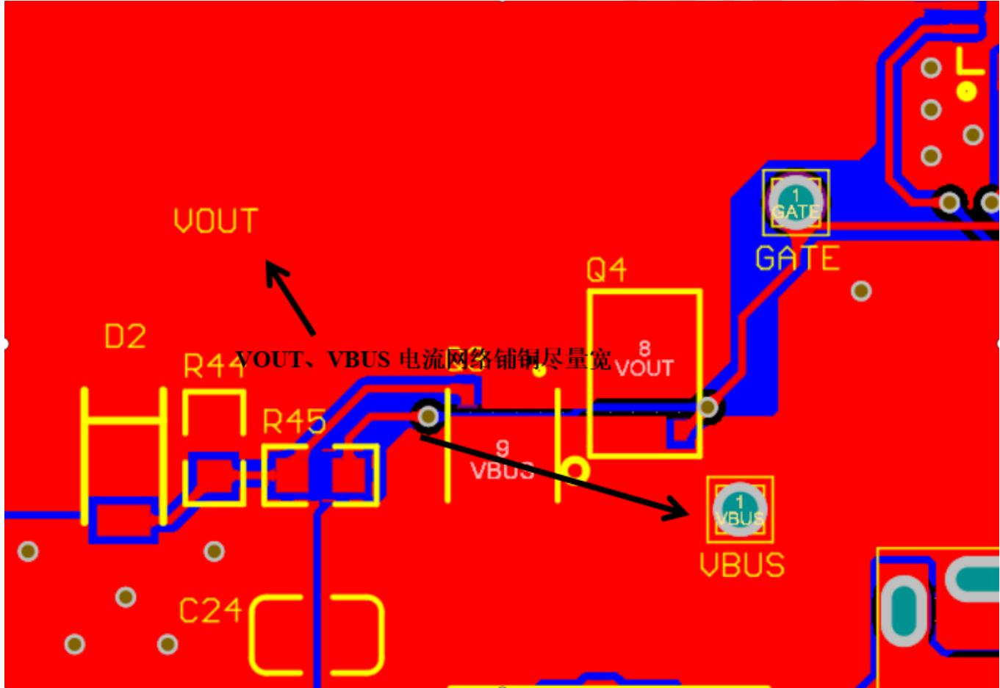
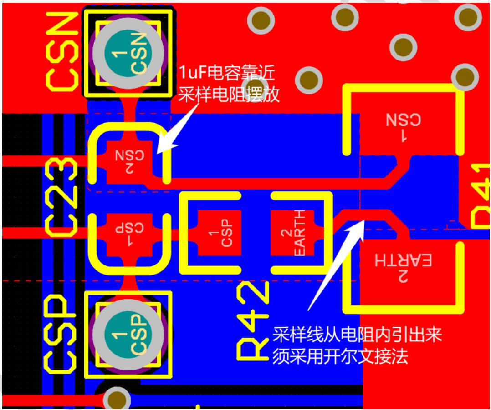

# SW2303 PCB 设计指南

> Source: [docs/datasheets/source/SW2303_PCB设计指南__Release_PCB030_v1.2.pdf](../source/SW2303_PCB设计指南__Release_PCB030_v1.2.pdf)

# 1. 版本历史

V1.0 初始版本；  
V1.1 更新文档图标；  
V1.2 更换文档模板；

# 2. PCB 布局

# 2.1. 器件整体布局规划

根据 PCB 结构，元器件合理规划，均匀布局，不要让 PCB 某些部位太挤，某些部位太松，同时要保证走线顺畅；USB 接口按照结构要求可以伸出板边外，其他元器件尽量不要靠近板边摆放；元器件尽量并排排列，方便贴片机操作。

# 2.2. SW2303 摆放位置

SW2303 属于核心器件，一般放置于 PCB 的中部，便于布局走线，注意调整 SW2303 的朝向，便于VOUT、VBUS 铺铜；

# 2.3. 电容布局

SW2303 补偿网络的电容靠近 SW2303 引脚摆放，尽量与 SW2303 摆同一层。  
SW2303 的 VDD 电容靠近 SW2303 引脚摆放，尽量与 SW2303 摆同一层。  
与电流采样电阻并联的 1uF 电容靠近采样电阻摆放；

# 2.4. 电流采样电阻摆放位置

电流采样电阻靠近母座和 SW2303 摆放，尽量与 SW2303 摆同一层。

# 2.5. PCB 固定孔周边

PCB 固定孔用来卡位或固定 PCB，有的还要锁螺丝，注意周边元器件与固定孔的距离，以免造成干涉或短路。

# 3. 铺铜与走线

# 3.1. 一般信号走线

一般信号走线（不走大电流）建议线宽 $0 . 2 5 4 \mathrm { m m }$ （ $1 0 \mathrm { { m i l } }$ ）。如果芯片出 PIN 时走不了$1 0 \mathrm { { m i l } }$ ，建议出PIN时先走8mil，然后转成 $1 0 \mathrm { { m i l } }$ 完成后续走线。

# 3.2. 大电流网络走线

VOUT、VBUS、GND 走线尽量宽，最好铺铜，宽度不小于 $8 0 \mathrm { m i l }$ ，走线要尽可能短，尽量不要换层。大电流网络走线换层时至少 9个过孔，尽量多打过孔，但要同时考虑底层地的完整性，方便散热。

# 3.3. 输入输出电容 GND回路

输入输出电容的GND 要以最短回路接入 SW2303 的EPAD，优先级高于其他走线，换层时尽量多打过孔。

# 3.4. 电流采样电阻回路走线

电流采样电阻到CSP/CSN 的引线须采用开尔文接法，从电阻焊盘向里拉出，单独引线到SW2303 的CSP/CSN引脚，中间不要引线到其他地方，线宽为 8mil，与采样电阻并联的 1uF电容靠近采样电阻摆放。

# 3.5. 其他

（1）、PCB 铺铜不能有多余的死铜、毛刺、突出尖端等；

（2）、过孔、焊盘等必须加泪滴；

（3）、贴片电容、贴片电阻两端铜箔尽量大小相符，两端受热均匀；

（4）、固定接口等受力元器件的焊盘周围需要增加铜箔固定；

# 4. 过孔与开窗

# 4.1. 过孔尺寸

过孔的尺寸大小要根据板厂的制造能力和板子上元器件的拥挤程度而定，一般建议使用内径为 $0 . 3 \mathrm { m m }$ 外径为 $0 . 5 \mathrm { m m }$ 过孔，或 $0 . 4 \mathrm { m m }$ 外径 $0 . 6 \mathrm { m m }$ 过孔。

# 4.2. 过孔数量

过孔的数量根据换层时过电流大小、散热 PAD的大小而定。VOUT、VBUS、GND换层时一般推荐打 6个以上过孔；芯片的 EPAD建议打 2排 2列4个过孔；电容 GND 换层时，0402封装与 0603 封装建议打 1 个或以上过孔，0805 与 1206 封装建议打 2 个或以上过孔；其他空余空间建议多打过孔，加强底层与顶层的连接，帮助散热。

# 4.3. 过孔位置

过孔位置靠近器件 PAD，但不要打在 PAD 上（EPAD 除外），以免造成器件焊锡脱节；过孔之间要预留一定的安全距离，不要重叠。

# 4.4. 开窗建议

VOUT需要开窗，帮助散热；开窗位置注意不能和丝印层重叠，否则丝印将无效。

# 4.5. 散热建议

由于 A 口、C 口都是金属外壳，并且固定引脚也是直接连接到金属外壳，可以将这些固定引脚直接连到 PGND网络，方便散热。

# 5. 丝印

# 5.1. 元器件位号

建议元件丝印高度 $0 . 6 \mathrm { m m }$ ，宽度 $0 . 1 \mathrm { m m }$ ，元器件标号的丝印位置先不考虑，最后整个板子布局布线完之后，再统一摆放元器件丝印，丝印能放在元器件旁边尽量放在元器件旁边，不能放旁边时可以放远一点，然后拉一根丝印表示关联标注即可。

# 免责声明

珠海智融科技股份有限公司（以下简称“智融科技”）可能随时对所提供的产品、服务及本文件作出修改或更新，且不另行通知。客户应在下订单前获取最新的相关信息，并确认这些信息是否完整且是最新的。

本文件所含信息仅为您提供便利，智融科技不对这些信息作任何明示或暗示、书面或口头、法定或其他形式的声明或保证，包括不但限于产品的用途、特性、使用情况、适销性等方面。智融科技对这些信息及不合理使用这些信息而引起的后果不承担任何责任。

智融科技对应用帮助或客户产品设计不承担任何义务。客户应对其使用智融科技的产品和应用自行负责。客户应提供充分的设计与操作安全验证，且保证在将智融产品集成到任何应用程序中时不会侵犯第三方知识产权，如发生侵权行为智融科技对此概不承担任何责任。

在转售智融科技产品时，如果对该产品参数及其陈述相比存在差异或虚假成分，则会自动丧失智融科技相关产品的所有明示或暗示授权，且对此不正当的、欺诈性商业行为，智融科技保留采取一切合法方式维权。智融科技对任何此类虚假陈述均不承担任何责任或义务。

本文件仅在没有对内容进行任何篡改且带有相关授权、条件、限制和声明的情况下才允许进行复制，否则智融科技有权追究其法律责任。智融科技对此类篡改过的文件不承担任何责任或义务。复制如涉及第三方的信息应当服从额外的限制条件。