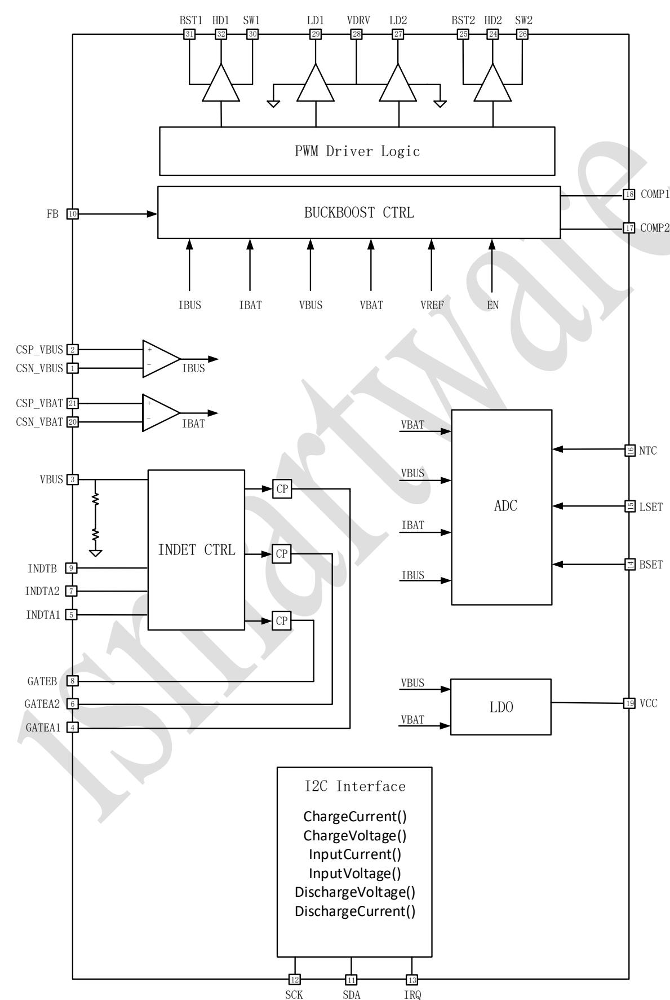
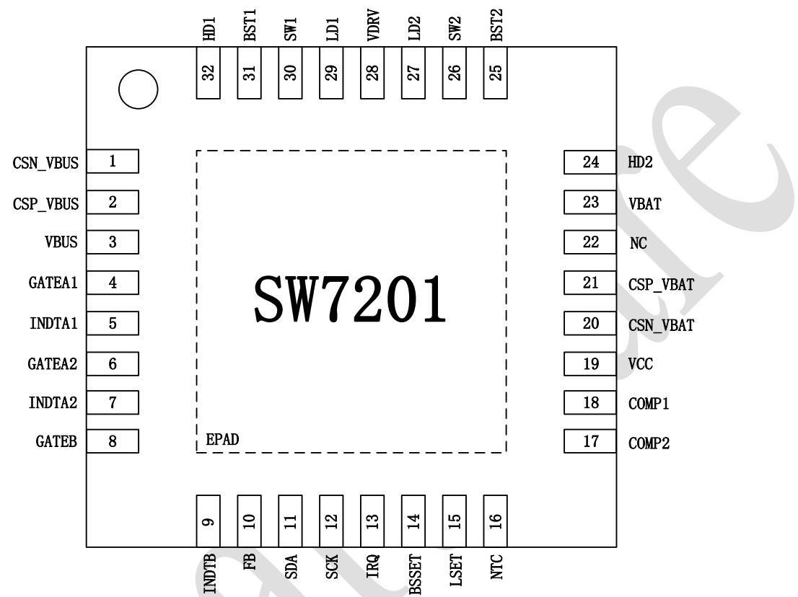
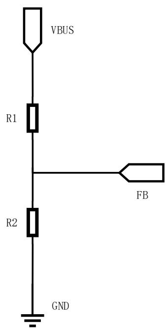
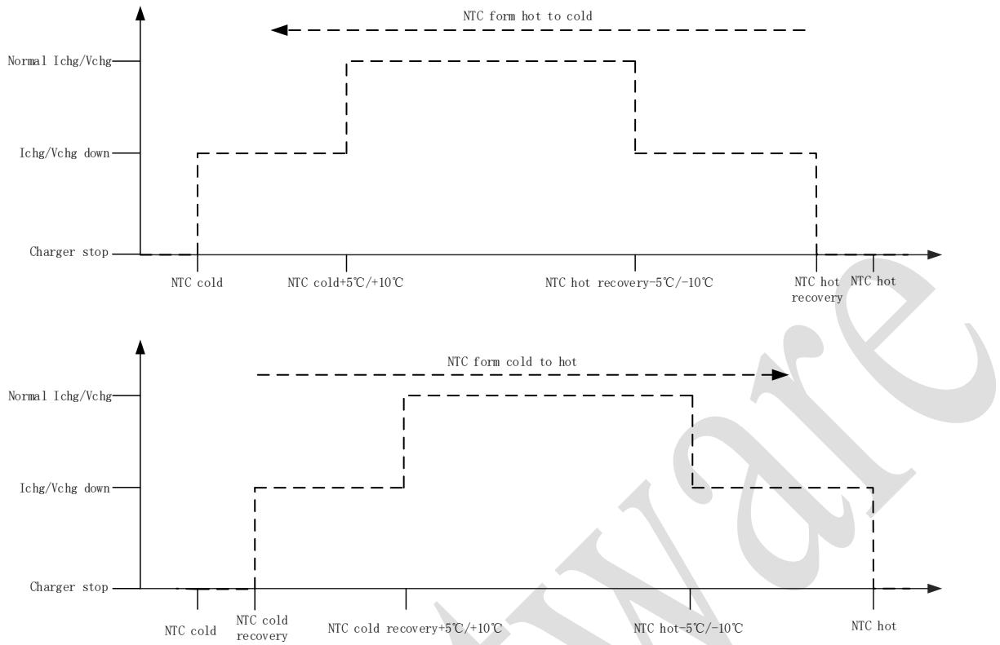
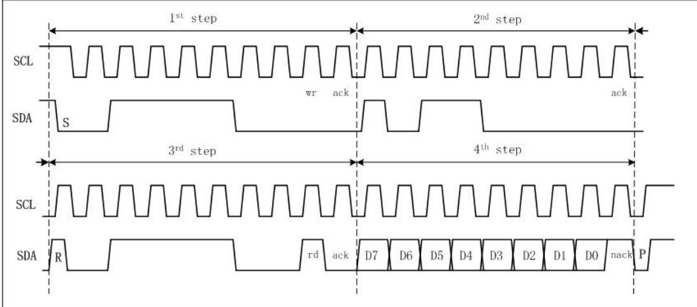
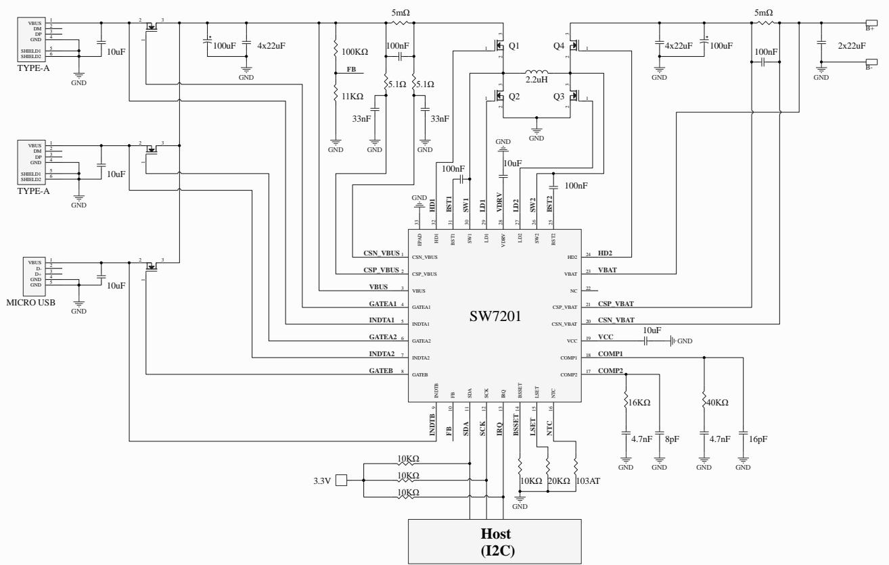
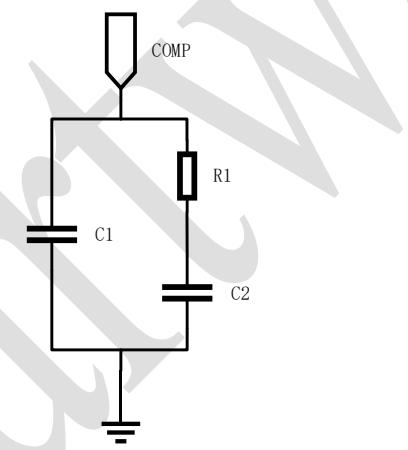
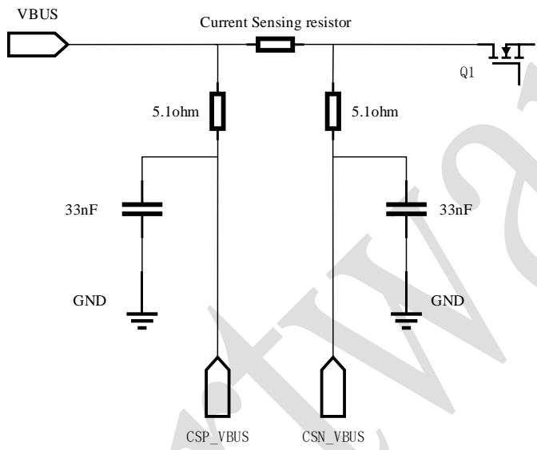
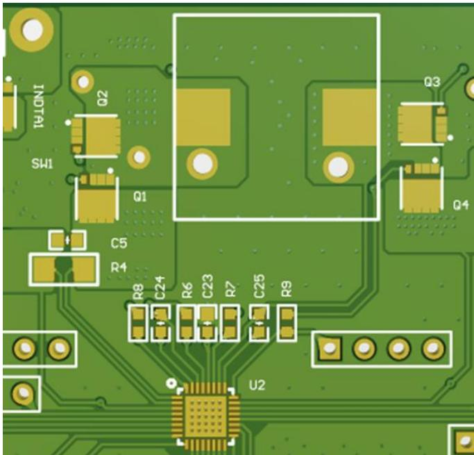
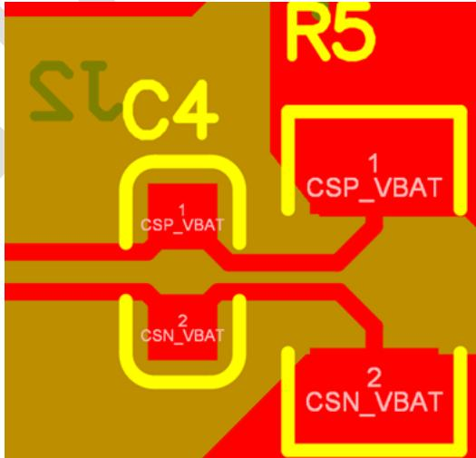

# I2C High-efficiency Bidirectional Buck-Boost Charge-Discharge Controller

> Source: [docs/datasheets/source/SW7201_Datasheet_Release_DS107_2_V1.0.pdf](../source/SW7201_Datasheet_Release_DS107_2_V1.0.pdf)

# 1. Description

SW7201 is a high-efficiency synchronous 4-transistor bidirectional buck-boost chargedischarge controller that supports the charge-discharge management of 1-4 cells. It can provide up to 100W output power and support multiple input and output detection and path drive. It can form a simple and complete bidirectional fast charging solution with an MCU and a protocol chip.

# 2. Applications

• Power Banks   
• Power Tools   
• Industrial Equipment   
• Equipment with Rechargeable Batteries

# 3. Features

# • High-efficiency Buck-boost Charger

➢ Support buck-boost charging of 1 to 4 cells battery Support 3V-19.2V charging target voltage setting Support 100W input power Support 4V-24V input voltage Support I2C programming to control input/battery current limit Seamless switching between boost and buck

# • Reverse Buck-boost Discharge

➢ Support 100W output power   
➢ Support 3V-22V output voltage Flexible selection of FB/I2C voltage regulation mode Support I2C programming to control Output current limit   
➢ Automatic PFM/PWM mode

• 12bit High Precision ADC

# • Port Connect Detection

➢ 1 adapter inserting detection point ➢ 2 load inserting detection points • Low Quiescent Input Current ➢ Shutdown current down to $4 0 \mathrm { u A }$ • Path MOS Driver ➢ 3 NMOS drivers integrated

# • NTC Detection

➢ Support battery high and low temperature protection ➢ Support IEC 62368 standard

# • Protection

➢ Input Over Voltage Protection ➢ Output Over Voltage Protection Output Over Current Protection ➢ Output Short Protection ➢ Thermal shutdown protection • I2C Interface • QFN-32(4x4mm) Package

# 4. Device Comparison Table

<table><tr><td rowspan=1 colspan=1></td><td rowspan=1 colspan=1>SW7201</td><td rowspan=1 colspan=1>SW7203</td></tr><tr><td rowspan=1 colspan=1>Interface</td><td rowspan=1 colspan=1>I2C</td><td rowspan=1 colspan=1>I2C</td></tr><tr><td rowspan=1 colspan=1>Device Address</td><td rowspan=1 colspan=1>0x3C/0x38/0x1C/0x18</td><td rowspan=1 colspan=1>0x3C/0x38/0x1C/0x18</td></tr><tr><td rowspan=1 colspan=1>DCDC Topology</td><td rowspan=1 colspan=1>Buck-Boost</td><td rowspan=1 colspan=1>Buck-Boost</td></tr><tr><td rowspan=1 colspan=1>BATFET Power Path</td><td rowspan=1 colspan=1>No</td><td rowspan=1 colspan=1>Yes</td></tr><tr><td rowspan=1 colspan=1>Switching Frequency (Hz)</td><td rowspan=1 colspan=1>200K/300K/400K/800K</td><td rowspan=1 colspan=1>200K/300K/400K/800K</td></tr><tr><td rowspan=1 colspan=1>Cell Count</td><td rowspan=1 colspan=1>1s-4s</td><td rowspan=1 colspan=1>1s-4s</td></tr><tr><td rowspan=1 colspan=1>Charging Target Voltage Range</td><td rowspan=1 colspan=1>3V-19.2V</td><td rowspan=1 colspan=1>3V-19.2V</td></tr><tr><td rowspan=1 colspan=1>Input Voltage Range</td><td rowspan=1 colspan=1>4V-24V</td><td rowspan=1 colspan=1>4V-24V</td></tr><tr><td rowspan=1 colspan=1>Discharge Voltage Range</td><td rowspan=1 colspan=1>3V-22V</td><td rowspan=1 colspan=1>3V-22V</td></tr></table>

# 5. Functional Block Diagram

# 6. Pin Configuration and Functions

# 6.1. Pin Configuration

# 6.2. Pin Functions

<table><tr><td colspan="1" rowspan="1">Pin</td><td colspan="1" rowspan="1">Name</td><td colspan="1" rowspan="1">Function Description</td></tr><tr><td colspan="1" rowspan="1"></td><td colspan="1" rowspan="1">CSN_VBUS</td><td colspan="1" rowspan="1">The current sensing negative pole on the VBUS side. In orderto avoid the influence of high-frequency noise on the currentsensing signal and to stabilize the current sensing, a 100nFcapacitor needs to be added in parallel with the VBUS currentsensing resistor, and a low-pass filter needs to be addedbetween the current sensing resistor and CSN_VBUS. For thedesign of the low-pass filter, please refer to "11.2.4 VBUScurrent sensing low-pass filter parameter selection".</td></tr><tr><td colspan="1" rowspan="1">2</td><td colspan="1" rowspan="1">CSP_VBUS</td><td colspan="1" rowspan="1">The current sensing positive pole on the VBUS side. In orderto avoid the influence of high-frequency noise on the currentsensing signal and to stabilize the current sensing, a 100nFcapacitor needs to be added in parallel with the VBUS currentsensing resistor, and a low-pass filter needs to be addedbetween the current sensing resistor and CSP_VBUS. For the</td></tr><tr><td colspan="1" rowspan="1"></td><td colspan="1" rowspan="1"></td><td colspan="1" rowspan="1">design of the low-pass filter, please refer to "11.2.4 VBUScurrent sensing low-pass filter parameter selection".</td></tr><tr><td colspan="1" rowspan="1">3</td><td colspan="1" rowspan="1">VBUS</td><td colspan="1" rowspan="1">Chip power supply and VBUS voltage sensing.</td></tr><tr><td colspan="1" rowspan="1">4</td><td colspan="1" rowspan="1">GATEA1</td><td colspan="1" rowspan="1">NMOS power path transistor driver 1. This driver is enabledby a charge pump, which is weak in driving capability. Whenthe path transistor drive is used, it is recommended to use anNMOs with gate source leakage current no greater than100nA. The GATEA1 can remain floating without using thepower path transistor drive.</td></tr><tr><td colspan="1" rowspan="1">5</td><td colspan="1" rowspan="1">INDTA1</td><td colspan="1" rowspan="1">Load inserting detection 1. When this function is used todetect load inserting, a ground capacitor of no less than 4.7uFmust be set on INDTA1, and the recommended value of thiscapacitor is 10uF.</td></tr><tr><td colspan="1" rowspan="1">6</td><td colspan="1" rowspan="1">GATEA2</td><td colspan="1" rowspan="1">NMOS power path transistor driver 2. This driver is enabledby a charge pump, which is weak in driving capability. Whenthe path transistor driver is used, an NMOS with gate sourceleakage current no greater than 100nA is recommended. TheGATEA2 can remain floating without using the passtransistor drive.</td></tr><tr><td colspan="1" rowspan="1">7</td><td colspan="1" rowspan="1">INDTA2</td><td colspan="1" rowspan="1">Load inserting detection 2. When this function is used todetect load inserting, a grounded capacitor of no less than4.7uF must be set on INDTA2, and the recommended valueof this capacitor is 10uF.</td></tr><tr><td colspan="1" rowspan="1">8</td><td colspan="1" rowspan="1">GATEB</td><td colspan="1" rowspan="1">NMOS power path transistor driver 3. This driver is enabledby a charge pump, which is weak in driving capability. Whenthe power path transistor driver is used, an NMOS with gatesource leakage current no greater than 100nA isrecommended. The GATEB can remain floating withoutusing the power path transistor drive.</td></tr><tr><td colspan="1" rowspan="1">9</td><td colspan="1" rowspan="1">INDTB</td><td colspan="1" rowspan="1">Adapter inserting detection. When the external power supplyand the VBUS are isolated by the power path transistor, theINDTB needs to be connected to the external power inputport; when the external power supply and the VBUS are notisolated by the power path transistor, the INDTB needs to beshorted to the VBUS.</td></tr><tr><td colspan="1" rowspan="1">10</td><td colspan="1" rowspan="1">FB</td><td colspan="1" rowspan="1">External feedback of VBUS output voltage. The voltage of theFB is fixed at 0.5V. When the output voltage is not set withexternal feedback, the FB is floating.</td></tr><tr><td colspan="1" rowspan="1">11</td><td colspan="1" rowspan="1">SDA</td><td colspan="1" rowspan="1">I2C Data. Please connect SDA to the host controller or smartbattery. 10KΩ pull-up resistors are recommended for SDAlines.</td></tr><tr><td colspan="1" rowspan="1">12</td><td colspan="1" rowspan="1">SCK</td><td colspan="1" rowspan="1">I2C Clock. Please connect SCL to the host controller or smartbattery. 10KΩ pull-up resistors are recommended for SCLlines.</td></tr><tr><td colspan="1" rowspan="1">13</td><td colspan="1" rowspan="1">IRQ</td><td colspan="1" rowspan="1">I2C Interrupt. IRQ is for open-drain output. 10KΩ resistorsare recommended. When the event interrupt is triggered, theIRQ output goes low until the event interrupt flag bit iscleared.</td></tr><tr><td colspan="1" rowspan="1">14</td><td colspan="1" rowspan="1">BSSET</td><td colspan="1" rowspan="1">Number of battery cells: 1-4 cells can be set: 1 cell for 10KΩ,2 cells for 20KΩ, 3 cells for 30KΩ, and 4 cells for 43KΩ.</td></tr><tr><td colspan="1" rowspan="1">15</td><td colspan="1" rowspan="1">LSET</td><td colspan="1" rowspan="1">Inductance value setting: 4 different inductance values can beset: 1uH for 10KΩ, 2.2uH for 20KΩ, 3.3uH for 30KΩ, and4.7uH for 43KΩ. This setting must be consistent with theexternal inductance value; otherwise the buck-boost cannotwork normally.</td></tr><tr><td colspan="1" rowspan="1">16</td><td colspan="1" rowspan="1">NTC</td><td colspan="1" rowspan="1">Battery temperature sensing. The NTC thermistor must be a103 resistor with a B value of 3435. For the specific protectionthreshold, please refer to " 10.5.2 Battery over-temperatureprotection". If the NTC over-temperature protection functionis not needed, the NTC resistor can be replaced with a fixed10KΩ resistor or the NTC protection can be turned offthrough a register.</td></tr><tr><td colspan="1" rowspan="1">17</td><td colspan="1" rowspan="1">COMP2</td><td colspan="1" rowspan="1">CC loop compensation. For the specific RC compensationnetwork of COMP2, please refer to "11.2.3 COMP RCparameter selection".</td></tr><tr><td colspan="1" rowspan="1">18</td><td colspan="1" rowspan="1">COMP1</td><td colspan="1" rowspan="1">CV loop compensation. For the specific RC compensationnetwork of COMP1, please refer to "11.2.3 COMP RCparameter selection"</td></tr><tr><td colspan="1" rowspan="1">19</td><td colspan="1" rowspan="1">VCC</td><td colspan="1" rowspan="1">5V linear regulator output provided by VBUS or VBAT. The5V linear regulator is activated when the buck-boost isoperating. VCC needs a 10uF ground capacitor near the VCCpin of the chip.</td></tr><tr><td colspan="1" rowspan="1"></td><td colspan="1" rowspan="1">CSN_VBAT</td><td colspan="1" rowspan="1">The current sensing negative pole on the VBAT side; VBATvoltage sensing. In order to ensure the stability of currentsensing, a 100nF capacitor needs to be added in parallel withthe VBAT current sensing resistor.</td></tr><tr><td colspan="1" rowspan="1">21</td><td colspan="1" rowspan="1">CSP_VBAT</td><td colspan="1" rowspan="1">The current sensing positive pole on the VBAT side. In orderto ensure the stability of current sensing, a 100nF capacitorneeds to be added in parallel with the VBAT current sensingresistor.</td></tr><tr><td colspan="1" rowspan="1">22</td><td colspan="1" rowspan="1">NC</td><td colspan="1" rowspan="1">Floating.</td></tr><tr><td colspan="1" rowspan="1">23</td><td colspan="1" rowspan="1">VBAT</td><td colspan="1" rowspan="1">Chip power supply; VBAT voltage sensing.</td></tr><tr><td colspan="1" rowspan="1">24</td><td colspan="1" rowspan="1">HD2</td><td colspan="1" rowspan="1">VBAT side upper transistor gate drive. It needs to beconnected to the gate of the high-side NMOS (Q4) of the half-bridge on the VBAT side.</td></tr><tr><td colspan="1" rowspan="1">25</td><td colspan="1" rowspan="1">BST2</td><td colspan="1" rowspan="1">VBAT side upper transistor bootstrap. A 100nF capacitorneeds to be connected between SW2 and BST2. The bootstrapdiodes of VDRV and BST2 are integrated inside the chip.</td></tr><tr><td colspan="1" rowspan="1">26</td><td colspan="1" rowspan="1">SW2</td><td colspan="1" rowspan="1">VBAT side switching point. SW2 needs to be connected tothe source of the high-side NMOS (Q4) of the half-bridge onthe VBAT side.</td></tr><tr><td colspan="1" rowspan="1">27</td><td colspan="1" rowspan="1">LD2</td><td colspan="1" rowspan="1">VBAT side lower transistor gate drive. It needs to beconnected to the gate of the low-side NMOS (Q3) of the half-bridge on the VBAT side.</td></tr><tr><td colspan="1" rowspan="1">28</td><td colspan="1" rowspan="1">VDRV</td><td colspan="1" rowspan="1">5.5V linear regulator output provided by VBUS or VBAT.The 5.5V linear regulator is activated in standby mode andbuck-boost operating mode. vDRV needs a 10uF groundcapacitor near the VDRV pin of the chip.</td></tr><tr><td colspan="1" rowspan="1">29</td><td colspan="1" rowspan="1">LD1</td><td colspan="1" rowspan="1">VBUS side lower transistor gate drive. It needs to beconnected to the gate of the low-side NMOS (Q2) of the half-bridge on the VBUS side</td></tr><tr><td colspan="1" rowspan="1">30</td><td colspan="1" rowspan="1">SW1</td><td colspan="1" rowspan="1">VBUS side switching point. SW1 needs to be connected to thesource of the high-side NMOs (Q1) of the half-bridge on theVBUS side.</td></tr><tr><td colspan="1" rowspan="1">31</td><td colspan="1" rowspan="1">BST1</td><td colspan="1" rowspan="1">VBUS side upper transistor bootstrap. A 100nF capacitorneeds to be connected between SW1 and BST1. The bootstrapdiodes of VDRV and BST1 are integrated inside the chip.</td></tr><tr><td colspan="1" rowspan="1">32</td><td colspan="1" rowspan="1">HD1</td><td colspan="1" rowspan="1">VBUS side upper transistor gate. It needs to be connected tothe gate of the high-side NMOS (Q1) of the half-bridge on theVBUS side.</td></tr><tr><td colspan="1" rowspan="1"></td><td colspan="1" rowspan="1">EPAD</td><td colspan="1" rowspan="1">The grounded pad of the chip needs to be connected to thepower ground plane to maintain proper connection betweenthe EPAD and the PCB, thus ensuring its workingperformance and good heat dissipation.</td></tr></table>

# 7. Absolute Maximum Ratings

<table><tr><td rowspan=1 colspan=1>Parameters</td><td rowspan=1 colspan=1>Symbol</td><td rowspan=1 colspan=1>MIN</td><td rowspan=1 colspan=1>MAX</td><td rowspan=1 colspan=1>UNIT</td></tr><tr><td rowspan=1 colspan=1>VBUS Port Voltage</td><td rowspan=1 colspan=1>VBUS/FB/CSN_VBUS/CSP_VBUS</td><td rowspan=1 colspan=1>-0.3</td><td rowspan=1 colspan=1>35</td><td rowspan=1 colspan=1>V</td></tr><tr><td rowspan=1 colspan=1>VBAT Port Voltage</td><td rowspan=1 colspan=1>CSN_VBAT/CSP_VBAT/VBAT</td><td rowspan=1 colspan=1>-0.3</td><td rowspan=1 colspan=1>35</td><td rowspan=1 colspan=1>V</td></tr><tr><td rowspan=1 colspan=1>Switch Driver Voltage</td><td rowspan=1 colspan=1>HD1/HD2/BST1/BST2</td><td rowspan=1 colspan=1>-0.3</td><td rowspan=1 colspan=1>40</td><td rowspan=1 colspan=1>V</td></tr><tr><td rowspan=1 colspan=1>Switch Port Voltage</td><td rowspan=1 colspan=1>SW1/SW2</td><td rowspan=1 colspan=1>-0.3</td><td rowspan=1 colspan=1>35</td><td rowspan=1 colspan=1>V</td></tr><tr><td rowspan=1 colspan=1>Port Voltage</td><td rowspan=1 colspan=1>INDTB/INDTA1/INDTA2</td><td rowspan=1 colspan=1>-0.3</td><td rowspan=1 colspan=1>35</td><td rowspan=1 colspan=1>V</td></tr><tr><td rowspan=1 colspan=1>Path Control Voltage</td><td rowspan=1 colspan=1>GATEB/GATEA1/GATEA2</td><td rowspan=1 colspan=1>-0.3</td><td rowspan=1 colspan=1>40</td><td rowspan=1 colspan=1>V</td></tr><tr><td rowspan=1 colspan=1>Another pin voltages</td><td rowspan=1 colspan=1></td><td rowspan=1 colspan=1>-0.3</td><td rowspan=1 colspan=1>7</td><td rowspan=1 colspan=1>V</td></tr><tr><td rowspan=1 colspan=1>Junction temperature</td><td rowspan=1 colspan=1></td><td rowspan=1 colspan=1>-40</td><td rowspan=1 colspan=1>+150</td><td rowspan=1 colspan=1>°C</td></tr><tr><td rowspan=1 colspan=1>Storage temperature</td><td rowspan=1 colspan=1></td><td rowspan=1 colspan=1>-60</td><td rowspan=1 colspan=1>+150</td><td rowspan=1 colspan=1>C</td></tr><tr><td rowspan=1 colspan=1>ESD(HBM)</td><td rowspan=1 colspan=1></td><td rowspan=1 colspan=1>-4</td><td rowspan=1 colspan=1>+4</td><td rowspan=1 colspan=1>KV</td></tr></table>

【Notice】Stresses beyond those listed under absolute maximum ratings may cause permanent damage to the device. These are stress ratings only, and functional operation of the device at these or any other conditions beyond those indicated under recommended operating conditions is not implied. Exposure to absolute maxi mum rated conditions for extended periods my affect device reliability.

# 8. Recommended Operating Conditions

<table><tr><td rowspan=1 colspan=1>Parameters</td><td rowspan=1 colspan=1>Symbol</td><td rowspan=1 colspan=1>MIN</td><td rowspan=1 colspan=1>Typical</td><td rowspan=1 colspan=1>MAX</td><td rowspan=1 colspan=1>UNIT</td></tr><tr><td rowspan=1 colspan=1>Input Voltage Range</td><td rowspan=1 colspan=1>VBUS</td><td rowspan=1 colspan=1>4</td><td rowspan=1 colspan=1></td><td rowspan=1 colspan=1>24</td><td rowspan=1 colspan=1>V</td></tr><tr><td rowspan=1 colspan=1>Battery Voltage Range</td><td rowspan=1 colspan=1>CSN VBAT</td><td rowspan=1 colspan=1>3</td><td rowspan=1 colspan=1></td><td rowspan=1 colspan=1>19.2</td><td rowspan=1 colspan=1>V</td></tr><tr><td rowspan=1 colspan=1>Output Voltage Range</td><td rowspan=1 colspan=1>VBUS</td><td rowspan=1 colspan=1>3</td><td rowspan=1 colspan=1></td><td rowspan=1 colspan=1>22</td><td rowspan=1 colspan=1>V</td></tr></table>

# 9. Electrical Characteristics

（VBUS = 12V, VBAT = 10V, $\mathrm { T _ { A } } { = } 2 5 ^ { \circ } \mathrm { C }$ , unless otherwise specified.）

<table><tr><td colspan="1" rowspan="1">Parameters</td><td colspan="1" rowspan="1">Symbol</td><td colspan="1" rowspan="1">Test Conditions</td><td colspan="1" rowspan="1">MIN</td><td colspan="1" rowspan="1">TYP</td><td colspan="1" rowspan="1">MAX</td><td colspan="1" rowspan="1">UNIT</td></tr><tr><td colspan="7" rowspan="1">Power Supply</td></tr><tr><td colspan="1" rowspan="1">VBUS input voltage</td><td colspan="1" rowspan="1">VindTB</td><td colspan="1" rowspan="1"></td><td colspan="1" rowspan="1">4.4</td><td colspan="1" rowspan="1"></td><td colspan="1" rowspan="1">24</td><td colspan="1" rowspan="1">V</td></tr><tr><td colspan="1" rowspan="1">VBUS input undervoltagethreshold</td><td colspan="1" rowspan="1">VindtB_UVLO</td><td colspan="1" rowspan="1">INDTB voltage falling</td><td colspan="1" rowspan="1"></td><td colspan="1" rowspan="1">4</td><td colspan="1" rowspan="1">→</td><td colspan="1" rowspan="1">V</td></tr><tr><td colspan="1" rowspan="1">VBUS input undervoltagehysteresis</td><td colspan="1" rowspan="1">VindtB_UVLO_HYS</td><td colspan="1" rowspan="1">INDTB voltage rising</td><td colspan="1" rowspan="1"></td><td colspan="1" rowspan="1">400</td><td colspan="1" rowspan="1">−</td><td colspan="1" rowspan="1">mV</td></tr><tr><td colspan="1" rowspan="1">VDRV output voltage</td><td colspan="1" rowspan="1">VDRV</td><td colspan="1" rowspan="1">Buck-Boost operatingStandby</td><td colspan="1" rowspan="1">5.3</td><td colspan="1" rowspan="1">5.5</td><td colspan="1" rowspan="1">5.7</td><td colspan="1" rowspan="1">V</td></tr><tr><td colspan="7" rowspan="1">ISMARTWARE           I²C Buck-Boost Charge-DischargeController</td></tr><tr><td colspan="1" rowspan="1"></td><td colspan="1" rowspan="1"></td><td colspan="1" rowspan="1">Shutdown</td><td colspan="1" rowspan="1"></td><td colspan="1" rowspan="1">0</td><td colspan="1" rowspan="1"></td><td colspan="1" rowspan="1">V</td></tr><tr><td colspan="1" rowspan="2">VDRV current limit</td><td colspan="1" rowspan="2">IvDrV</td><td colspan="1" rowspan="1">Buck-Boost operatingStandby</td><td colspan="1" rowspan="1">35</td><td colspan="1" rowspan="1">50</td><td colspan="1" rowspan="1"></td><td colspan="1" rowspan="1">mA</td></tr><tr><td colspan="1" rowspan="1">Shutdown</td><td colspan="1" rowspan="1"></td><td colspan="1" rowspan="1">0</td><td colspan="1" rowspan="1"></td><td colspan="1" rowspan="1">mA</td></tr><tr><td colspan="1" rowspan="2">VCC output voltage</td><td colspan="1" rowspan="2">Vcc</td><td colspan="1" rowspan="1">Buck-Boost operating</td><td colspan="1" rowspan="1">4.8</td><td colspan="1" rowspan="1">5</td><td colspan="1" rowspan="1">5.2</td><td colspan="1" rowspan="1">V</td></tr><tr><td colspan="1" rowspan="1">StandbyShutdown</td><td colspan="1" rowspan="1"></td><td colspan="1" rowspan="1">3.9</td><td colspan="1" rowspan="1"></td><td colspan="1" rowspan="1">V</td></tr><tr><td colspan="1" rowspan="2">VCC current limit</td><td colspan="1" rowspan="2">Ivcc</td><td colspan="1" rowspan="1">Buck-Boost operating</td><td colspan="1" rowspan="1">90</td><td colspan="1" rowspan="1">120</td><td colspan="1" rowspan="1"></td><td colspan="1" rowspan="1">mA</td></tr><tr><td colspan="1" rowspan="1">StandbyShutdown</td><td colspan="1" rowspan="1"></td><td colspan="1" rowspan="1">10</td><td colspan="1" rowspan="1"></td><td colspan="1" rowspan="1">mA</td></tr><tr><td colspan="6" rowspan="1">Charge Mode                                                                                    </td><td colspan="1" rowspan="1"></td></tr><tr><td colspan="1" rowspan="1">Trickle charge voltage range</td><td colspan="1" rowspan="1">Vrc</td><td colspan="1" rowspan="1">VBAT risingtrickle_vol=0x00~0x6b</td><td colspan="1" rowspan="1">2.5</td><td colspan="1" rowspan="1"></td><td colspan="1" rowspan="1">13.2</td><td colspan="1" rowspan="1">V</td></tr><tr><td colspan="1" rowspan="4">Trickle charge voltage</td><td colspan="1" rowspan="4">VTc</td><td colspan="1" rowspan="1">trickle_vol=0x04</td><td colspan="1" rowspan="1">2.7</td><td colspan="1" rowspan="1">2.9</td><td colspan="1" rowspan="1">3</td><td colspan="1" rowspan="1">V</td></tr><tr><td colspan="1" rowspan="1">trickle_vol=0x21</td><td colspan="1" rowspan="1">5.6</td><td colspan="1" rowspan="1">5.8</td><td colspan="1" rowspan="1">5.9</td><td colspan="1" rowspan="1">V</td></tr><tr><td colspan="1" rowspan="1">trickle_yol=0x3E</td><td colspan="1" rowspan="1">8.5</td><td colspan="1" rowspan="1">8.7</td><td colspan="1" rowspan="1">8.8</td><td colspan="1" rowspan="1">V</td></tr><tr><td colspan="1" rowspan="1">trickle_vol=0x5B</td><td colspan="1" rowspan="1">11.35</td><td colspan="1" rowspan="1">11.6</td><td colspan="1" rowspan="1">11.75</td><td colspan="1" rowspan="1">V</td></tr><tr><td colspan="1" rowspan="4">Trickle charge voltagehysteresis</td><td colspan="1" rowspan="4">Vtc_HYS</td><td colspan="1" rowspan="1">trickle_vol_hys=0x0</td><td colspan="1" rowspan="1"></td><td colspan="1" rowspan="1">100</td><td colspan="1" rowspan="1"></td><td colspan="1" rowspan="1">mV</td></tr><tr><td colspan="1" rowspan="1">trickle_vol_hys=0x1</td><td colspan="1" rowspan="1"></td><td colspan="1" rowspan="1">200</td><td colspan="1" rowspan="1"></td><td colspan="1" rowspan="1">mV</td></tr><tr><td colspan="1" rowspan="1">trickle_vol_hys=0x2</td><td colspan="1" rowspan="1"></td><td colspan="1" rowspan="1">300</td><td colspan="1" rowspan="1"></td><td colspan="1" rowspan="1">mV</td></tr><tr><td colspan="1" rowspan="1">trickle_vol_hys=0x3</td><td colspan="1" rowspan="1"></td><td colspan="1" rowspan="1">400</td><td colspan="1" rowspan="1"></td><td colspan="1" rowspan="1">mV</td></tr><tr><td colspan="1" rowspan="4">Trickle charge current</td><td colspan="1" rowspan="4"></td><td colspan="1" rowspan="1">trickle_cur=0x0</td><td colspan="1" rowspan="1">50</td><td colspan="1" rowspan="1">100</td><td colspan="1" rowspan="1">250</td><td colspan="1" rowspan="1">mA</td></tr><tr><td colspan="1" rowspan="1">trickle_cur=0x1</td><td colspan="1" rowspan="1">100</td><td colspan="1" rowspan="1">200</td><td colspan="1" rowspan="1">350</td><td colspan="1" rowspan="1">mA</td></tr><tr><td colspan="1" rowspan="1">trickle_cur=0x2</td><td colspan="1" rowspan="1">200</td><td colspan="1" rowspan="1">300</td><td colspan="1" rowspan="1">450</td><td colspan="1" rowspan="1">mA</td></tr><tr><td colspan="1" rowspan="1">trickle_cur=0x3</td><td colspan="1" rowspan="1">300</td><td colspan="1" rowspan="1">400</td><td colspan="1" rowspan="1">550</td><td colspan="1" rowspan="1">mA</td></tr><tr><td colspan="1" rowspan="1">range</td><td colspan="1" rowspan="1">Ic Cn VUS</td><td colspan="1" rowspan="1">chg_ibus_limit=0x00~0x7f</td><td colspan="1" rowspan="1">0.5</td><td colspan="1" rowspan="1"></td><td colspan="1" rowspan="1">6.85</td><td colspan="1" rowspan="1">A</td></tr><tr><td colspan="1" rowspan="5">MVBUS constant charge current</td><td colspan="1" rowspan="5">I cc_cHG_vBUS</td><td colspan="1" rowspan="1">chg_ibus_limit=0x00</td><td colspan="1" rowspan="1">0.35</td><td colspan="1" rowspan="1">0.5</td><td colspan="1" rowspan="1">0.75</td><td colspan="1" rowspan="1">A</td></tr><tr><td colspan="1" rowspan="1">chg_ibus_limit=0x0A</td><td colspan="1" rowspan="1">0.9</td><td colspan="1" rowspan="1">1</td><td colspan="1" rowspan="1">1.3</td><td colspan="1" rowspan="1">A</td></tr><tr><td colspan="1" rowspan="1">chg_ibus_limit=0x32</td><td colspan="1" rowspan="1">2.8</td><td colspan="1" rowspan="1">3</td><td colspan="1" rowspan="1">3.4</td><td colspan="1" rowspan="1">A</td></tr><tr><td colspan="1" rowspan="1">chg_ibus_limit=0x5A</td><td colspan="1" rowspan="1">4.8</td><td colspan="1" rowspan="1">5</td><td colspan="1" rowspan="1">5.5</td><td colspan="1" rowspan="1">A</td></tr><tr><td colspan="1" rowspan="1">chg_ibus_limit=0x78</td><td colspan="1" rowspan="1">6.3</td><td colspan="1" rowspan="1">6.5</td><td colspan="1" rowspan="1">7.1</td><td colspan="1" rowspan="1">A</td></tr><tr><td colspan="1" rowspan="1">VBAT constant charge currentrange</td><td colspan="1" rowspan="1">Icc_CHG_VBaT</td><td colspan="1" rowspan="1">chg_ibat_limit=0x00~0x77</td><td colspan="1" rowspan="1">0.1</td><td colspan="1" rowspan="1"></td><td colspan="1" rowspan="1">12</td><td colspan="1" rowspan="1">A</td></tr><tr><td colspan="1" rowspan="1"></td><td colspan="1" rowspan="1">Icc_ChG_VBAT</td><td colspan="1" rowspan="1">chg_ibat_limit=0x04</td><td colspan="1" rowspan="1">0.45</td><td colspan="1" rowspan="1">0.5</td><td colspan="1" rowspan="1">0.65</td><td colspan="1" rowspan="1">A</td></tr><tr><td colspan="1" rowspan="4">VBAT constant charge current</td><td colspan="1" rowspan="4"></td><td colspan="1" rowspan="1">chg_ibat_limit=0x13</td><td colspan="1" rowspan="1">1.9</td><td colspan="1" rowspan="1">2</td><td colspan="1" rowspan="1">2.2</td><td colspan="1" rowspan="1">A</td></tr><tr><td colspan="1" rowspan="1">chg_ibat_limit=0x31</td><td colspan="1" rowspan="1">4.8</td><td colspan="1" rowspan="1">5</td><td colspan="1" rowspan="1">5.3</td><td colspan="1" rowspan="1">A</td></tr><tr><td colspan="1" rowspan="1">chg_ibat_limit=0x4A</td><td colspan="1" rowspan="1">7.3</td><td colspan="1" rowspan="1">7.5</td><td colspan="1" rowspan="1">7.8</td><td colspan="1" rowspan="1">A</td></tr><tr><td colspan="1" rowspan="1">chg_ibat_limit=0x63</td><td colspan="1" rowspan="1">9.7</td><td colspan="1" rowspan="1">10</td><td colspan="1" rowspan="1">10.4</td><td colspan="1" rowspan="1">A</td></tr><tr><td colspan="1" rowspan="4">Termination charge current</td><td colspan="1" rowspan="4">Iend</td><td colspan="1" rowspan="1">chg_end_cur=0x0</td><td colspan="1" rowspan="1">50</td><td colspan="1" rowspan="1">100</td><td colspan="1" rowspan="1">200</td><td colspan="1" rowspan="1">mA</td></tr><tr><td colspan="1" rowspan="1">chg_end_cur=0x1</td><td colspan="1" rowspan="1">100</td><td colspan="1" rowspan="1">200</td><td colspan="1" rowspan="1">300</td><td colspan="1" rowspan="1">mA</td></tr><tr><td colspan="1" rowspan="1">chg_end_cur=0x2</td><td colspan="1" rowspan="1">200</td><td colspan="1" rowspan="1">300</td><td colspan="1" rowspan="1">400</td><td colspan="1" rowspan="1">mA</td></tr><tr><td colspan="1" rowspan="1">chg_end_cur=0x3</td><td colspan="1" rowspan="1">300</td><td colspan="1" rowspan="1">400</td><td colspan="1" rowspan="1">500</td><td colspan="1" rowspan="1">mA</td></tr><tr><td colspan="1" rowspan="1">Target charge voltage range</td><td colspan="1" rowspan="1">VcHG_VOL</td><td colspan="1" rowspan="1">chg_vol=0x000~0x7ff</td><td colspan="1" rowspan="1">3</td><td colspan="1" rowspan="1"></td><td colspan="1" rowspan="1">19.2</td><td colspan="1" rowspan="1">V</td></tr><tr><td colspan="1" rowspan="4">Target charge voltage</td><td colspan="1" rowspan="4">VcHG_VOL</td><td colspan="1" rowspan="1">chg_vol=0x078</td><td colspan="1" rowspan="1">-1.2%</td><td colspan="1" rowspan="1">4.2</td><td colspan="1" rowspan="1">+1.2%</td><td colspan="1" rowspan="1">V</td></tr><tr><td colspan="1" rowspan="1">chg_vol=0x21C</td><td colspan="1" rowspan="1">-1%</td><td colspan="1" rowspan="1">8.4</td><td colspan="1" rowspan="1">+1%</td><td colspan="1" rowspan="1">V</td></tr><tr><td colspan="1" rowspan="1">chg_vol=0x3C0</td><td colspan="1" rowspan="1">-0.8%</td><td colspan="1" rowspan="1">12.6</td><td colspan="1" rowspan="1">+0.8%</td><td colspan="1" rowspan="1">V</td></tr><tr><td colspan="1" rowspan="1">chg_vol=0x564</td><td colspan="1" rowspan="1">-0.8%</td><td colspan="1" rowspan="1">16.8</td><td colspan="1" rowspan="1">+0.8%</td><td colspan="1" rowspan="1">V</td></tr><tr><td colspan="1" rowspan="1">Recharge threshold</td><td colspan="1" rowspan="1">VRCHG</td><td colspan="1" rowspan="1"></td><td colspan="1" rowspan="1"></td><td colspan="1" rowspan="1">CG_L*97.3%</td><td colspan="1" rowspan="1"></td><td colspan="1" rowspan="1">V</td></tr><tr><td colspan="1" rowspan="4">Trickle charge over time</td><td colspan="1" rowspan="4"></td><td colspan="1" rowspan="1">chg_trk_overtime_set=0x0</td><td colspan="1" rowspan="1"></td><td colspan="1" rowspan="1">0.5</td><td colspan="1" rowspan="1"></td><td colspan="1" rowspan="1">H</td></tr><tr><td colspan="1" rowspan="1">chg_trk_overtime_set=0x1</td><td colspan="1" rowspan="1"></td><td colspan="1" rowspan="1">1</td><td colspan="1" rowspan="1"></td><td colspan="1" rowspan="1">H</td></tr><tr><td colspan="1" rowspan="1">chg_trk_overtime_set=0x2</td><td colspan="1" rowspan="1"></td><td colspan="1" rowspan="1">2</td><td colspan="1" rowspan="1"></td><td colspan="1" rowspan="1">H</td></tr><tr><td colspan="1" rowspan="1">chg_trk_overtime_set=0x3</td><td colspan="1" rowspan="1"></td><td colspan="1" rowspan="1">4</td><td colspan="1" rowspan="1"></td><td colspan="1" rowspan="1">H</td></tr><tr><td colspan="1" rowspan="4">0</td><td colspan="1" rowspan="4"></td><td colspan="1" rowspan="1">chg_cc_overtime_set=0x0</td><td colspan="1" rowspan="1"></td><td colspan="1" rowspan="1">12</td><td colspan="1" rowspan="1"></td><td colspan="1" rowspan="1">H</td></tr><tr><td colspan="1" rowspan="1">chg_cc_overtime_set=0x1</td><td colspan="1" rowspan="1"></td><td colspan="1" rowspan="1">24</td><td colspan="1" rowspan="1"></td><td colspan="1" rowspan="1">H</td></tr><tr><td colspan="1" rowspan="1">chg_cc_overtime_set=0x2</td><td colspan="1" rowspan="1"></td><td colspan="1" rowspan="1">48</td><td colspan="1" rowspan="1"></td><td colspan="1" rowspan="1">H</td></tr><tr><td colspan="1" rowspan="1">chg_cc_overtime_set=0x3</td><td colspan="1" rowspan="1"></td><td colspan="1" rowspan="1">72</td><td colspan="1" rowspan="1"></td><td colspan="1" rowspan="1">H</td></tr><tr><td colspan="1" rowspan="1">Charging VBUS voltage limitprotection threshold range</td><td colspan="1" rowspan="1">VHOLD</td><td colspan="1" rowspan="1">chg_hold=0x00~0xff</td><td colspan="1" rowspan="1">4</td><td colspan="1" rowspan="1"></td><td colspan="1" rowspan="1">20</td><td colspan="1" rowspan="1">V</td></tr><tr><td colspan="1" rowspan="4">Charging VBUS voltage limitprotection threshold</td><td colspan="1" rowspan="4">VHOLD</td><td colspan="1" rowspan="1">chg_hold=0x06</td><td colspan="1" rowspan="1">-2%</td><td colspan="1" rowspan="1">4.6</td><td colspan="1" rowspan="1">+2%</td><td colspan="1" rowspan="1">V</td></tr><tr><td colspan="1" rowspan="1">chg_hold=0x2A</td><td colspan="1" rowspan="1">-2%</td><td colspan="1" rowspan="1">8.1</td><td colspan="1" rowspan="1">+2%</td><td colspan="1" rowspan="1">V</td></tr><tr><td colspan="1" rowspan="1">chg_hold=0x46</td><td colspan="1" rowspan="1">-2%</td><td colspan="1" rowspan="1">11</td><td colspan="1" rowspan="1">+2%</td><td colspan="1" rowspan="1">V</td></tr><tr><td colspan="1" rowspan="1">chg_hold=0x90</td><td colspan="1" rowspan="1">-2%</td><td colspan="1" rowspan="1">18.4</td><td colspan="1" rowspan="1">+2%</td><td colspan="1" rowspan="1">V</td></tr><tr><td colspan="7" rowspan="1">Discharge Mode</td></tr><tr><td colspan="1" rowspan="1">VBUS output voltage range</td><td colspan="1" rowspan="1">VDISHG_VOL</td><td colspan="1" rowspan="1">I2C voltage regulation modedischg_vbus=0x000~0x7ff</td><td colspan="1" rowspan="1">3</td><td colspan="1" rowspan="1"></td><td colspan="1" rowspan="1">22</td><td colspan="1" rowspan="1">V</td></tr><tr><td colspan="1" rowspan="3">VBUS output voltage</td><td colspan="1" rowspan="3">VDISCHG_VOL</td><td colspan="1" rowspan="1">I2C voltage regulation modedischg_vbus=0x0C8</td><td colspan="1" rowspan="1">-3%</td><td colspan="1" rowspan="1">5</td><td colspan="1" rowspan="1">+3%</td><td colspan="1" rowspan="1">V</td></tr><tr><td colspan="1" rowspan="1">I2C voltage regulation modedischg_vbus=0x2BC</td><td colspan="1" rowspan="1">-2%</td><td colspan="1" rowspan="1">10</td><td colspan="1" rowspan="1">+2%</td><td colspan="1" rowspan="1">V</td></tr><tr><td colspan="1" rowspan="1">I2C voltage regulation modedischg_vbus=0x6A4</td><td colspan="1" rowspan="1">-2%</td><td colspan="1" rowspan="1">20</td><td colspan="1" rowspan="1">+2%</td><td colspan="1" rowspan="1">V</td></tr><tr><td colspan="1" rowspan="1">FB voltage</td><td colspan="1" rowspan="1">VFB</td><td colspan="1" rowspan="1">FB voltage regulation mode</td><td colspan="1" rowspan="1">-2%</td><td colspan="1" rowspan="1">0.5</td><td colspan="1" rowspan="1">+2%</td><td colspan="1" rowspan="1">V</td></tr><tr><td colspan="1" rowspan="1">VBUS discharge current limitrange</td><td colspan="1" rowspan="1">I cc_DIscHG_VBUS</td><td colspan="1" rowspan="1">dischg_ibus_limit=0x00~0xff</td><td colspan="1" rowspan="1">0.5</td><td colspan="1" rowspan="1">C</td><td colspan="1" rowspan="1">6.85</td><td colspan="1" rowspan="1">A</td></tr><tr><td colspan="1" rowspan="5">VBUS discharge current limit</td><td colspan="1" rowspan="5">I cc_DIscHG_VBUS</td><td colspan="1" rowspan="1">dischg_ibus_limit=0x00</td><td colspan="1" rowspan="1">0.4</td><td colspan="1" rowspan="1">0.5</td><td colspan="1" rowspan="1">0.7</td><td colspan="1" rowspan="1">A</td></tr><tr><td colspan="1" rowspan="1">dischg_ibus_limit=0x0A</td><td colspan="1" rowspan="1">0.9</td><td colspan="1" rowspan="1">1</td><td colspan="1" rowspan="1">1.25</td><td colspan="1" rowspan="1">A</td></tr><tr><td colspan="1" rowspan="1">dischg_ibus_limit=0x32</td><td colspan="1" rowspan="1">2.85</td><td colspan="1" rowspan="1">3</td><td colspan="1" rowspan="1">3.35</td><td colspan="1" rowspan="1">A</td></tr><tr><td colspan="1" rowspan="1">dischg_ibus_limit=0x5A</td><td colspan="1" rowspan="1">4.8</td><td colspan="1" rowspan="1">P5</td><td colspan="1" rowspan="1">5.4</td><td colspan="1" rowspan="1">A</td></tr><tr><td colspan="1" rowspan="1">dischg_ibus_limit=0x78</td><td colspan="1" rowspan="1">6.3</td><td colspan="1" rowspan="1">6.5</td><td colspan="1" rowspan="1">7</td><td colspan="1" rowspan="1">A</td></tr><tr><td colspan="1" rowspan="1">VBAT discharge current limitrange</td><td colspan="1" rowspan="1">I cc _DIScHG_VBAT</td><td colspan="1" rowspan="1">dischg_ibat_limit=0x00~0x77</td><td colspan="1" rowspan="1">0.1</td><td colspan="1" rowspan="1"></td><td colspan="1" rowspan="1">12</td><td colspan="1" rowspan="1">A</td></tr><tr><td colspan="1" rowspan="5">VBAT discharge current limit</td><td colspan="1" rowspan="5">I cc _DIscHG</td><td colspan="1" rowspan="1">dischg_ibat_limit=0x04</td><td colspan="1" rowspan="1">0.3</td><td colspan="1" rowspan="1">0.5</td><td colspan="1" rowspan="1">0.7</td><td colspan="1" rowspan="1">A</td></tr><tr><td colspan="1" rowspan="1">dischg_ibat_limit=0x13</td><td colspan="1" rowspan="1">1.8</td><td colspan="1" rowspan="1">2</td><td colspan="1" rowspan="1">2.2</td><td colspan="1" rowspan="1">A</td></tr><tr><td colspan="1" rowspan="1">dischg_ibat_limit=0x31</td><td colspan="1" rowspan="1">4.7</td><td colspan="1" rowspan="1">5</td><td colspan="1" rowspan="1">5.3</td><td colspan="1" rowspan="1">A</td></tr><tr><td colspan="1" rowspan="1">dischg_ibat_limit=0x4A</td><td colspan="1" rowspan="1">7.1</td><td colspan="1" rowspan="1">7.5</td><td colspan="1" rowspan="1">7.9</td><td colspan="1" rowspan="1">A</td></tr><tr><td colspan="1" rowspan="1">dischg_ibat_limit=0x63</td><td colspan="1" rowspan="1">9.5</td><td colspan="1" rowspan="1">10</td><td colspan="1" rowspan="1">10.5</td><td colspan="1" rowspan="1">A</td></tr><tr><td colspan="1" rowspan="1">VBAT input undervoltagethreshold range</td><td colspan="1" rowspan="1">VBAT UVLO</td><td colspan="1" rowspan="1">bat_uvlo=0x00~0x77</td><td colspan="1" rowspan="1">2.7</td><td colspan="1" rowspan="1"></td><td colspan="1" rowspan="1">13.2</td><td colspan="1" rowspan="1">V</td></tr><tr><td colspan="1" rowspan="4">OVBAT input undervoltagethreshold     </td><td colspan="1" rowspan="4"></td><td colspan="1" rowspan="1">bat_uvlo=0x02</td><td colspan="1" rowspan="1">2.7</td><td colspan="1" rowspan="1">2.9</td><td colspan="1" rowspan="1">3.1</td><td colspan="1" rowspan="1">V</td></tr><tr><td colspan="1" rowspan="1">bat_uvlo=0x1F</td><td colspan="1" rowspan="1">5.6</td><td colspan="1" rowspan="1">5.8</td><td colspan="1" rowspan="1">6</td><td colspan="1" rowspan="1">V</td></tr><tr><td colspan="1" rowspan="1">bat_uvlo=0x3C</td><td colspan="1" rowspan="1">8.5</td><td colspan="1" rowspan="1">8.7</td><td colspan="1" rowspan="1">8.9</td><td colspan="1" rowspan="1">V</td></tr><tr><td colspan="1" rowspan="1">bat_uvlo=0x59</td><td colspan="1" rowspan="1">11.4</td><td colspan="1" rowspan="1">11.6</td><td colspan="1" rowspan="1">11.8</td><td colspan="1" rowspan="1">V</td></tr><tr><td colspan="1" rowspan="1">VBAT input undervoltagehysteresis range</td><td colspan="1" rowspan="1">VBAT_UVLO_HYS</td><td colspan="1" rowspan="1">bat_uvlo_hys=0x00~0x10</td><td colspan="1" rowspan="1">0.4</td><td colspan="1" rowspan="1"></td><td colspan="1" rowspan="1">2</td><td colspan="1" rowspan="1">V</td></tr><tr><td colspan="1" rowspan="4">VBAT input undervoltagehysteresis</td><td colspan="1" rowspan="4">VBAT_UVLO_HYS</td><td colspan="1" rowspan="1">bat_uvlo_hys=0x00</td><td colspan="1" rowspan="1"></td><td colspan="1" rowspan="1">0.4</td><td colspan="1" rowspan="1"></td><td colspan="1" rowspan="1">V</td></tr><tr><td colspan="1" rowspan="1">bat_uvlo_hys=0x04</td><td colspan="1" rowspan="1"></td><td colspan="1" rowspan="1">0.8</td><td colspan="1" rowspan="1"></td><td colspan="1" rowspan="1">V</td></tr><tr><td colspan="1" rowspan="1">bat_uvlo_hys=0x08</td><td colspan="1" rowspan="1"></td><td colspan="1" rowspan="1">1.2</td><td colspan="1" rowspan="1"></td><td colspan="1" rowspan="1">V</td></tr><tr><td colspan="1" rowspan="1">bat_uvlo_hys=0x0C</td><td colspan="1" rowspan="1"></td><td colspan="1" rowspan="1">1.6</td><td colspan="1" rowspan="1"></td><td colspan="1" rowspan="1">V</td></tr><tr><td colspan="7" rowspan="1">Power On Reset</td></tr><tr><td colspan="1" rowspan="1">VBUS power-up threshold</td><td colspan="1" rowspan="1">V vBUS_INIT</td><td colspan="1" rowspan="1">INDTB short to VBUS</td><td colspan="1" rowspan="1"></td><td colspan="1" rowspan="1">2.7</td><td colspan="1" rowspan="1"></td><td colspan="1" rowspan="1">V</td></tr><tr><td colspan="1" rowspan="1">VBAT power-up threshold</td><td colspan="1" rowspan="1">V vBat _INIT</td><td colspan="1" rowspan="1"></td><td colspan="1" rowspan="1"></td><td colspan="1" rowspan="1">2.7</td><td colspan="1" rowspan="1"></td><td colspan="1" rowspan="1">V</td></tr></table>

# Quiescent Current

Switching   

<table><tr><td rowspan=2 colspan=1>Shutdown current</td><td rowspan=2 colspan=1>IQ_SHUTDOWN</td><td rowspan=1 colspan=1>Disable Load InsertingdetectionDisable standbymode</td><td rowspan=1 colspan=1></td><td rowspan=1 colspan=1>40</td><td rowspan=1 colspan=1>80</td><td rowspan=1 colspan=1>uA</td></tr><tr><td rowspan=1 colspan=1>Enable Load InsertingdetectionDisable standbymode</td><td rowspan=1 colspan=1></td><td rowspan=1 colspan=1>50</td><td rowspan=1 colspan=1>100</td><td rowspan=1 colspan=1>uA</td></tr><tr><td rowspan=2 colspan=1>Standby current</td><td rowspan=2 colspan=1>IQ_STANDBY</td><td rowspan=1 colspan=1>Disable Load InsertingdetectionEaable standby mode</td><td rowspan=1 colspan=1></td><td rowspan=1 colspan=1>520</td><td rowspan=1 colspan=1>900</td><td rowspan=1 colspan=1>uA</td></tr><tr><td rowspan=1 colspan=1>Enable Load InsertingdetectionEaable standby mode</td><td rowspan=1 colspan=1></td><td rowspan=1 colspan=1>530</td><td rowspan=1 colspan=1>920</td><td rowspan=1 colspan=1>uA</td></tr><tr><td rowspan=3 colspan=1>Quiescent current without loadin discharge mode</td><td rowspan=3 colspan=1>IDISchG_NOLOaD</td><td rowspan=1 colspan=1>VBAT=12VVBUS=5V800KHzQg=5.5nC</td><td rowspan=1 colspan=1></td><td rowspan=1 colspan=1>1.9</td><td rowspan=1 colspan=1></td><td rowspan=1 colspan=1>mA</td></tr><tr><td rowspan=1 colspan=1>VBAT=12VVBUS=12V800KHzQg=5.5nC</td><td rowspan=1 colspan=1></td><td rowspan=1 colspan=1>2.3</td><td rowspan=1 colspan=1></td><td rowspan=1 colspan=1>mA</td></tr><tr><td rowspan=1 colspan=1>VBAT=12VVBUS=20V.800KHzQg=5.5nC</td><td rowspan=1 colspan=1></td><td rowspan=1 colspan=1>3.4</td><td rowspan=1 colspan=1>−</td><td rowspan=1 colspan=1>mA</td></tr></table>

<table><tr><td rowspan=4 colspan=1>Switching frequency</td><td rowspan=4 colspan=1>Fsw</td><td rowspan=1 colspan=1>Buck-Boost operatingreq=0x1</td><td rowspan=1 colspan=1>150</td><td rowspan=1 colspan=1>200</td><td rowspan=1 colspan=1>250</td><td rowspan=1 colspan=1>kHz</td></tr><tr><td rowspan=1 colspan=1>Buck-Boost operatingfreq=0x0</td><td rowspan=1 colspan=1>230</td><td rowspan=1 colspan=1>300</td><td rowspan=1 colspan=1>370</td><td rowspan=1 colspan=1>kHz</td></tr><tr><td rowspan=1 colspan=1>Buck-Boost operatingfreq=0x2</td><td rowspan=1 colspan=1>300</td><td rowspan=1 colspan=1>400</td><td rowspan=1 colspan=1>500</td><td rowspan=1 colspan=1>kHz</td></tr><tr><td rowspan=1 colspan=1>Buck-Boost operatingfreq=0x3</td><td rowspan=1 colspan=1>650</td><td rowspan=1 colspan=1>800</td><td rowspan=1 colspan=1>900</td><td rowspan=1 colspan=1>kHz</td></tr></table>

# Abnormality protection

<table><tr><td colspan="1" rowspan="4">Discharging VBUSovervoltage protection</td><td colspan="1" rowspan="4">VvBUS_DISCHG_0VP</td><td colspan="1" rowspan="1">VBUS risingI2C voltage regulation mode</td><td colspan="1" rowspan="1">VDISCHG_VoL*109.5%</td><td colspan="1" rowspan="1">VDISCHG_VL*112.5%</td><td colspan="1" rowspan="1">VDISCHG_VOL*115.5%</td><td colspan="1" rowspan="1">V</td></tr><tr><td colspan="1" rowspan="1">VBUS fallingI2C voltage regulation mode</td><td colspan="1" rowspan="1"></td><td colspan="1" rowspan="1">VDISCHG_VoL*106%</td><td colspan="1" rowspan="1"></td><td colspan="1" rowspan="1">V</td></tr><tr><td colspan="1" rowspan="1">VBUS risingFB voltage regulation mode</td><td colspan="1" rowspan="1">23.2</td><td colspan="1" rowspan="1">24</td><td colspan="1" rowspan="1">24.8</td><td colspan="1" rowspan="1">V</td></tr><tr><td colspan="1" rowspan="1">VBUS fallingFB voltage regulation mode</td><td colspan="1" rowspan="1"></td><td colspan="1" rowspan="1">22.7</td><td colspan="1" rowspan="1"></td><td colspan="1" rowspan="1">V</td></tr><tr><td colspan="1" rowspan="1">Discharging VBUS overloadprotection</td><td colspan="1" rowspan="1">VvBUS_DISCHG_0LP</td><td colspan="1" rowspan="1">VBUS fallingI2C voltage regulation mode</td><td colspan="1" rowspan="1"></td><td colspan="1" rowspan="1">VDISCHG_VOL*80%</td><td colspan="1" rowspan="1"></td><td colspan="1" rowspan="1">V</td></tr><tr><td colspan="1" rowspan="1"></td><td colspan="1" rowspan="1"></td><td colspan="1" rowspan="1">VBUS fallingFB voltage regulation mode</td><td colspan="1" rowspan="1"></td><td colspan="1" rowspan="1">1.76</td><td colspan="1" rowspan="1"></td><td colspan="1" rowspan="1">V</td></tr><tr><td colspan="1" rowspan="1">Discharging VBUS short-circuit protection</td><td colspan="1" rowspan="1">VvBUS_DISCHG_SCP</td><td colspan="1" rowspan="1">VBUS falling</td><td colspan="1" rowspan="1"></td><td colspan="1" rowspan="1">1.76</td><td colspan="1" rowspan="1"></td><td colspan="1" rowspan="1">V</td></tr><tr><td colspan="1" rowspan="2">Discharging VBATovervoltage protection</td><td colspan="1" rowspan="2">VvBaT_DISCHG_0VP</td><td colspan="1" rowspan="1">VBAT rising</td><td colspan="1" rowspan="1">25.2</td><td colspan="1" rowspan="1">26</td><td colspan="1" rowspan="1">26.8</td><td colspan="1" rowspan="1">V</td></tr><tr><td colspan="1" rowspan="1">VBAT falling</td><td colspan="1" rowspan="1"></td><td colspan="1" rowspan="1">24.6</td><td colspan="1" rowspan="1"></td><td colspan="1" rowspan="1">V</td></tr><tr><td colspan="1" rowspan="2">Charging VBUS overvoltageprotection</td><td colspan="1" rowspan="2">VvBUS_CHG_OVP</td><td colspan="1" rowspan="1">VBUS rising</td><td colspan="1" rowspan="1">25.2</td><td colspan="1" rowspan="1">26</td><td colspan="1" rowspan="1">26.8</td><td colspan="1" rowspan="1">V</td></tr><tr><td colspan="1" rowspan="1">VBUS falling</td><td colspan="1" rowspan="1"></td><td colspan="1" rowspan="1">24.6</td><td colspan="1" rowspan="1"></td><td colspan="1" rowspan="1">V</td></tr><tr><td colspan="1" rowspan="2">Charging VBAT overvoltageprotection</td><td colspan="1" rowspan="2">VBAT_CHG_OVP</td><td colspan="1" rowspan="1">VBAT rising</td><td colspan="1" rowspan="1">VCHG_voL*102 %</td><td colspan="1" rowspan="1">VcHG_VoL*104%</td><td colspan="1" rowspan="1">VcHG_voL*106%</td><td colspan="1" rowspan="1">V</td></tr><tr><td colspan="1" rowspan="1">VBAT falling</td><td colspan="1" rowspan="1">7</td><td colspan="1" rowspan="1">VCHG_VOL*102%</td><td colspan="1" rowspan="1"></td><td colspan="1" rowspan="1">V</td></tr><tr><td colspan="1" rowspan="4">Battery high temperatureprotection in discharge mode</td><td colspan="1" rowspan="4">T ntC _DISCHG_H</td><td colspan="1" rowspan="1">Discharge modedischg_ntc_h=0</td><td colspan="1" rowspan="1"></td><td colspan="1" rowspan="1">50</td><td colspan="1" rowspan="1"></td><td colspan="1" rowspan="1">C</td></tr><tr><td colspan="1" rowspan="1">Discharge mode.Battery temperature rising.dischg_ntc_h=1</td><td colspan="1" rowspan="1"></td><td colspan="1" rowspan="1">55</td><td colspan="1" rowspan="1"></td><td colspan="1" rowspan="1">C</td></tr><tr><td colspan="1" rowspan="1">Discharge modeBattery temperature risingdischg_ntc_h=2</td><td colspan="1" rowspan="1"></td><td colspan="1" rowspan="1">60</td><td colspan="1" rowspan="1"></td><td colspan="1" rowspan="1">C</td></tr><tr><td colspan="1" rowspan="1">Discharge modeBattery temperature risingdischg_ntc_h=3</td><td colspan="1" rowspan="1"></td><td colspan="1" rowspan="1">65</td><td colspan="1" rowspan="1"></td><td colspan="1" rowspan="1">C</td></tr><tr><td colspan="1" rowspan="4">0Battery low temperatureprotection in discharge mode</td><td colspan="1" rowspan="4">T NtC _DISCHG_L</td><td colspan="1" rowspan="1">Discharge modeBattery temperature fallingdischg_ntc_l=0</td><td colspan="1" rowspan="1"></td><td colspan="1" rowspan="1">-10</td><td colspan="1" rowspan="1"></td><td colspan="1" rowspan="1">C</td></tr><tr><td colspan="1" rowspan="1">Discharge modeBattery temperature fallingdischg_ntc_l=1</td><td colspan="1" rowspan="1"></td><td colspan="1" rowspan="1">-5</td><td colspan="1" rowspan="1"></td><td colspan="1" rowspan="1">C</td></tr><tr><td colspan="1" rowspan="1">Discharge modeBattery temperature fallingdischg_ntc_1=2</td><td colspan="1" rowspan="1"></td><td colspan="1" rowspan="1">0</td><td colspan="1" rowspan="1"></td><td colspan="1" rowspan="1">C</td></tr><tr><td colspan="1" rowspan="1">Discharge modeBattery temperature fallingdischg_ntc_l=3</td><td colspan="1" rowspan="1"></td><td colspan="1" rowspan="1">-20</td><td colspan="1" rowspan="1"></td><td colspan="1" rowspan="1">C</td></tr><tr><td colspan="1" rowspan="1">Battery high temperature</td><td colspan="1" rowspan="1">T ntc _CHG_H</td><td colspan="1" rowspan="1">Charge mode</td><td colspan="1" rowspan="1"></td><td colspan="1" rowspan="1">45</td><td colspan="1" rowspan="1"></td><td colspan="1" rowspan="1">C</td></tr><tr><td colspan="1" rowspan="4">protection in charge mode</td><td colspan="1" rowspan="4"></td><td colspan="1" rowspan="1">Battery temperature risingchg_ntc_h=0</td><td colspan="1" rowspan="1"></td><td colspan="1" rowspan="1"></td><td colspan="1" rowspan="1"></td><td colspan="1" rowspan="1"></td></tr><tr><td colspan="1" rowspan="1">Charge modeBattery temperature risingchg_ntc_h=1</td><td colspan="1" rowspan="1"></td><td colspan="1" rowspan="1">40</td><td colspan="1" rowspan="1"></td><td colspan="1" rowspan="1">C</td></tr><tr><td colspan="1" rowspan="1">Charge modeBattery temperature risingchg_ntc_h=2</td><td colspan="1" rowspan="1"></td><td colspan="1" rowspan="1">50</td><td colspan="1" rowspan="1"></td><td colspan="1" rowspan="1">C</td></tr><tr><td colspan="1" rowspan="1">Charge modeBattery temperature risingchg_ntc_h=3</td><td colspan="1" rowspan="1"></td><td colspan="1" rowspan="1">55</td><td colspan="1" rowspan="1"></td><td colspan="1" rowspan="1">C</td></tr><tr><td colspan="1" rowspan="4">Battery low temperatureprotection in charge mode</td><td colspan="1" rowspan="4">T NtC_cHG_LS</td><td colspan="1" rowspan="1">Charge modeBattery temperature fallingchg_ntc_l=0</td><td colspan="1" rowspan="1"></td><td colspan="1" rowspan="1"></td><td colspan="1" rowspan="1"></td><td colspan="1" rowspan="1">C</td></tr><tr><td colspan="1" rowspan="1">Charge modechg_ntc_l=1</td><td colspan="1" rowspan="1"></td><td colspan="1" rowspan="1">10</td><td colspan="1" rowspan="1"></td><td colspan="1" rowspan="1">°C</td></tr><tr><td colspan="1" rowspan="1">Charge modeBattery temperature fallingchg_ntc_l=2</td><td colspan="1" rowspan="1"></td><td colspan="1" rowspan="1">5</td><td colspan="1" rowspan="1"></td><td colspan="1" rowspan="1">C</td></tr><tr><td colspan="1" rowspan="1">Charge modeBattery temperature fallingchg_ntc_l=3</td><td colspan="1" rowspan="1"></td><td colspan="1" rowspan="1">-5</td><td colspan="1" rowspan="1"></td><td colspan="1" rowspan="1">C</td></tr><tr><td colspan="1" rowspan="2">NTC voltage detectionaccuracy</td><td colspan="1" rowspan="2"></td><td colspan="1" rowspan="1">VNtc &gt;0.5V</td><td colspan="1" rowspan="1">-4%</td><td colspan="1" rowspan="1"></td><td colspan="1" rowspan="1">+4%</td><td colspan="1" rowspan="1">V</td></tr><tr><td colspan="1" rowspan="1">VNtc≤0.5V</td><td colspan="1" rowspan="1">20</td><td colspan="1" rowspan="1"></td><td colspan="1" rowspan="1">20</td><td colspan="1" rowspan="1">mV</td></tr><tr><td colspan="1" rowspan="1">Thermal shutdown threshold</td><td colspan="1" rowspan="1">TDIE_OTP</td><td colspan="1" rowspan="1">Chip temperature rising</td><td colspan="1" rowspan="1"></td><td colspan="1" rowspan="1">150</td><td colspan="1" rowspan="1"></td><td colspan="1" rowspan="1">°C</td></tr><tr><td colspan="1" rowspan="1">Thermal shutdown hysteresis</td><td colspan="1" rowspan="1">TDIE OTP HyS</td><td colspan="1" rowspan="1">Chip temperature falling</td><td colspan="1" rowspan="1"></td><td colspan="1" rowspan="1">20</td><td colspan="1" rowspan="1"></td><td colspan="1" rowspan="1">C</td></tr><tr><td colspan="7" rowspan="1">Automatic Detection (BSSET&amp;LSET</td></tr><tr><td colspan="1" rowspan="1">Detection threshold of 4batteries</td><td colspan="1" rowspan="1">VBSsET_4s</td><td colspan="1" rowspan="1"></td><td colspan="1" rowspan="1">1.75</td><td colspan="1" rowspan="1"></td><td colspan="1" rowspan="1">2.5</td><td colspan="1" rowspan="1">V</td></tr><tr><td colspan="1" rowspan="1">Detection threshold of 3batteries</td><td colspan="1" rowspan="1">VBsSET_3S</td><td colspan="1" rowspan="1"></td><td colspan="1" rowspan="1">1.25</td><td colspan="1" rowspan="1"></td><td colspan="1" rowspan="1">1.75</td><td colspan="1" rowspan="1">V</td></tr><tr><td colspan="1" rowspan="1">Detection threshold of 2batteries</td><td colspan="1" rowspan="1">VBSSET_2s</td><td colspan="1" rowspan="1"></td><td colspan="1" rowspan="1">0.75</td><td colspan="1" rowspan="1"></td><td colspan="1" rowspan="1">1.25</td><td colspan="1" rowspan="1">V</td></tr><tr><td colspan="1" rowspan="1">Detection threshold of 1batteries</td><td colspan="1" rowspan="1">VBSSET_ISs</td><td colspan="1" rowspan="1"></td><td colspan="1" rowspan="1">0.25</td><td colspan="1" rowspan="1"></td><td colspan="1" rowspan="1">0.75</td><td colspan="1" rowspan="1">V</td></tr><tr><td colspan="1" rowspan="1">Detection threshold of 4.7UHinductance</td><td colspan="1" rowspan="1">VLsET_4.7UH</td><td colspan="1" rowspan="1"></td><td colspan="1" rowspan="1">1.75</td><td colspan="1" rowspan="1"></td><td colspan="1" rowspan="1">2.5</td><td colspan="1" rowspan="1">V</td></tr><tr><td colspan="1" rowspan="1">Detection threshold of 3.3UHinductance</td><td colspan="1" rowspan="1">VLSET_3.3UH</td><td colspan="1" rowspan="1"></td><td colspan="1" rowspan="1">1.25</td><td colspan="1" rowspan="1"></td><td colspan="1" rowspan="1">1.75</td><td colspan="1" rowspan="1">V</td></tr><tr><td colspan="1" rowspan="1">Detection threshold of 2.2UHinductance</td><td colspan="1" rowspan="1">VLsET_2.2UH</td><td colspan="1" rowspan="1"></td><td colspan="1" rowspan="1">0.75</td><td colspan="1" rowspan="1"></td><td colspan="1" rowspan="1">1.25</td><td colspan="1" rowspan="1">V</td></tr><tr><td colspan="1" rowspan="1">Detection threshold of 1UHinductance</td><td colspan="1" rowspan="1">VLseT_IUH</td><td colspan="1" rowspan="1"></td><td colspan="1" rowspan="1">0.25</td><td colspan="1" rowspan="1"></td><td colspan="1" rowspan="1">0.75</td><td colspan="1" rowspan="1">V</td></tr><tr><td colspan="7" rowspan="1">I2C                                                                                                                          </td></tr><tr><td colspan="1" rowspan="1">I2C Clock frequency</td><td colspan="1" rowspan="1">F12c_CLK</td><td colspan="1" rowspan="1"></td><td colspan="1" rowspan="1"></td><td colspan="1" rowspan="1">100</td><td colspan="1" rowspan="1">400</td><td colspan="1" rowspan="1">kHz</td></tr><tr><td colspan="1" rowspan="1">I2C pulse width low</td><td colspan="1" rowspan="1">VIL</td><td colspan="1" rowspan="1"></td><td colspan="1" rowspan="1"></td><td colspan="1" rowspan="1"></td><td colspan="1" rowspan="1">0.75</td><td colspan="1" rowspan="1">V</td></tr><tr><td colspan="1" rowspan="1">I2C pulse width high</td><td colspan="1" rowspan="1">VIH</td><td colspan="1" rowspan="1"></td><td colspan="1" rowspan="1">1.2</td><td colspan="1" rowspan="1"></td><td colspan="1" rowspan="1"></td><td colspan="1" rowspan="1">V</td></tr></table>

# 10. Function Description

SW7201 is a high-efficiency synchronous 4-transistor bidirectional buck-boost chargedischarge controller that supports the charge-discharge management of 1-4 cells. It can provide up to 100W output power.

# 10.1. Power-Up Sequence

# 10.1.1. Power up sequence from VBAT

In the case that the battery is connected without external power supply, the SW7201 draws power from VBAT, and starts power-on initialization. After the power-on initialization is completed, the SW7201 works in a low-power mode by default, and enters the shutdown state soon after. Low power mode can be turned off through registers.

# 10.1.2. Power up sequence from VBUS

When the battery is in dead battery state and INDTB and VBUS are shorted, the external power is supplied to VBUS. The SW7201 draws power from VBUS and starts power-on initialization. When there is external power supplied to VBUS, the SW7201 will not enter the shutdown state even if it is in the low-power mode.

If INDTB is not shorted with VBUS, the INDTB and VBUS shall be greater than VINIT_VBUS at the same time for the SW7201 to be powered on and started.

# 10.2. Buck-Boost

Under different VBUS and VBAT voltages, the SW7201 will automatically work in three modes: buck, buck-boost, and boost. The three modes can be switched seamlessly, and there will be no sudden change in VBUS or VBAT voltage in the switching process. In addition, the SW7201 supports PFM/PWM. Under light load, it works in the PFM mode; under heavy load, it works in the PWM mode. At the same time, SW7201 supports 4 inductance values $( \mathrm { 1 u H } , 2 . 2 \mathrm { u H } , 3 . 3 \mathrm { u H }$ and $4 . 7 \mathrm { u H }$ ) and 4 switching frequencies (200K, 300K, 400K and 800K), which can be flexibly adjusted according to the performance needs in actual applications.

# 10.2.1. Pulse frequency modulation (PFM)

In order to improve the efficiency at light load, the SW7201 will work in the PFM mode. The actual switching frequency will decrease when the charging power and discharging power decrease. When the average inductor current reaches the PWM mode set value, the SW7201 will switch from PFM to PWM.

In addition, although working in the PFM mode improves the light-load efficiency, the output ripple will increase accordingly. For applications that are sensitive to output ripple, the forced PWM mode can be set through the register. In the forced PWM mode, the SW7201 will not enter PFM even when operating at light load.

# 10.2.2. Pulse width modulation (PWM)

When operating in the PWM mode, at the beginning of a cycle, when the output of the error amplifier is higher than the ramp voltage, the high-side NMOS of the half-bridge will be turned on; and when the output of the error amplifier falls below the ramp voltage, the low-side NMOS of the half-bridge will be turned on. At the end of the cycle, the ramp voltage is reset and ready to start the next cycle. In the process of switching on the MOS, the principle of “turning off before turning on” must be always followed to avoid the dangerous situation that high-side and low-side NMOS transistors are both on. With both the high-side and low-side NMOS transistors off, the inductor current is maintained by the body diodes of the high-side or low-side NMOS transistors.

The following table shows the operating states of the four power MOS transistors Q1-Q4 in the PWM mode.

<table><tr><td rowspan=1 colspan=4>Charge Mode</td></tr><tr><td rowspan=1 colspan=1>Mode</td><td rowspan=1 colspan=1>Buck</td><td rowspan=1 colspan=1>Buck-Boost</td><td rowspan=1 colspan=1>Boost</td></tr><tr><td rowspan=1 colspan=1>Q1</td><td rowspan=1 colspan=1>Switching</td><td rowspan=1 colspan=1>Switching</td><td rowspan=1 colspan=1>On</td></tr><tr><td rowspan=1 colspan=1>Q2</td><td rowspan=1 colspan=1>Switching</td><td rowspan=1 colspan=1>Switching</td><td rowspan=1 colspan=1>Off</td></tr><tr><td rowspan=1 colspan=1>Q3</td><td rowspan=1 colspan=1>Off</td><td rowspan=1 colspan=1>Switching</td><td rowspan=1 colspan=1>Switching</td></tr><tr><td rowspan=1 colspan=1>Q4</td><td rowspan=1 colspan=1>On</td><td rowspan=1 colspan=1>Switching</td><td rowspan=1 colspan=1>Switching</td></tr></table>

<table><tr><td rowspan=1 colspan=4>Discharge Mode</td></tr><tr><td rowspan=1 colspan=1>Mode</td><td rowspan=1 colspan=1>Buck</td><td rowspan=1 colspan=1>Buck-Boost</td><td rowspan=1 colspan=1>Boost</td></tr><tr><td rowspan=1 colspan=1>Q1</td><td rowspan=1 colspan=1>On</td><td rowspan=1 colspan=1>Switching</td><td rowspan=1 colspan=1>Switching</td></tr><tr><td rowspan=1 colspan=1>Q2</td><td rowspan=1 colspan=1>Off</td><td rowspan=1 colspan=1>Switching</td><td rowspan=1 colspan=1>Switching</td></tr><tr><td rowspan=1 colspan=1>Q3</td><td rowspan=1 colspan=1>Switching</td><td rowspan=1 colspan=1>Switching</td><td rowspan=1 colspan=1>Off</td></tr><tr><td rowspan=1 colspan=1>Q4</td><td rowspan=1 colspan=1>Switching</td><td rowspan=1 colspan=1>Switching</td><td rowspan=1 colspan=1>On</td></tr></table>

# 10.3. Charge settings

The SW7201 supports charging target voltage setting in the range of 3V-19.2V, and trickle charging setting in the range of 2.5V-13.2V. Therefore, it can support many different types of batteries.

Meanwhile, the SW7201 can be set to two modes (auto stop charging and continuous charging), to be compatible with the needs of more applications. It supports both dead battery start and no-battery working modes.

# 10.3.1. Start charging

When external power is connected, you can set and enter the charging state by the following sequence:

(1) Set the charging target voltage and the constant current charging current on the VBUS/VBAT side. (2) Set the trickle charging threshold and trickle charging current. (3) Set the input voltage limiting threshold. (4) Make sure INDTB and VBUS are shorted. (5) Enable the charging.

# 10.3.2. Trickle charging

When the battery voltage is lower than the trickle charging voltage threshold, it enters the trickle charging state. The charging current is controlled by the trickle charging current threshold.

The trickle charging threshold can be set through the register trickle_vol[6:0] in the range of 2.5V-13.2V (0.1V/step). When trickle_vol[6:0]=0x00, the trickle charging threshold is 2.5V. When the set value is greater than 13.2V, the trickle charging threshold remains unchanged at 13.2V. When the chip is powered on, it will automatically set the trickle charging threshold to the number of battery cells $\ast 2 . 9 \mathrm { V }$ by detecting the setting result of the BSSET pin.

The trickle charging hysteresis can be set through the register trickle_vol_hys[1:0], and the value can be set to $0 . 1 \mathrm { V } / 0 . 2 \mathrm { V } / 0 . 3 \mathrm { V } / 0 . 4 \mathrm { V } .$ . When the chip is powered on, it will automatically set the trickle charging hysteresis to the number of battery cells $^ { * } 0 . 1 \mathrm { V }$ by detecting the setting result of the BSSET pin.

The trickle charging current can be set through the register trickle_cur[1:0], and the value can be set to $1 0 0 \mathrm { { m A } } / 2 0 0 \mathrm { { m A } } / 3 0 0 \mathrm { { m A } } / 4 0 0 \mathrm { { m A } }$ .

# 10.3.3. Constant current charging mode

When the battery voltage is higher than the trickle charging threshold at the same time, it enters the constant current charging mode. At this time, the charging current is limited by the VBUS/VBAT constant current charging current.

In the constant current charging mode, the charging current limit on the VBUS side and that on the VBAT side take effect at the same time. After the charging parameters are set and the charging enable bit is turned on, the soft-start of the charging current begins. After the charging current increases to the charging current threshold on the VBUS side or that on the VBAT side, the charging currents will no longer increase. The trickle charging current limit only limit the VBAT charging current, while the VBUS current is not limited at this time.

The VBUS constant current charging current can be set through the register chg_ibus_limit[6:0] in the range of 0.5A-6.85A (50mA/step). When chg_ibus_limit[6:0 $\scriptstyle \mathbf { \mu } ] = 0 \mathbf { x } 0 0$ , the VBUS constant current charging current is set to 0.5A.

The VBAT constant current charging current can be set through the register chg_ibat_limit[6:0] in the range of 0.1A-12A (100mA/step). When chg_ibat_limit[6:0] $\scriptstyle \left| = 0 \mathrm { x } 0 0 \right|$ , the VBAT constant current charging current is set to 0.1A. When the set value of the register is greater than 12A, the VBAT constant current charging current remains unchanged at 12A.

# 10.3.4. Constant voltage charging mode

During the constant current charging process, the VBAT voltage continues to rise, and when the VBAT voltage rises to the charging target voltage, it enters the constant voltage charging mode. At this time, the VBAT voltage remains constant, and as the battery voltage continues to rise, the charging current will gradually decrease.

If the charger done function is enabled, when the VBAT charging current is lower than the charging terminate current threshold, the charger done will be triggered and the charging will be turned off. As the external power supply stays on, if the battery voltage gradually falls back below the recharge threshold, it will be turned back on for charging.

If the charger done function is disabled, then the charging loop will control the VBAT voltage to stay at the charging target voltage and keep charging, and will no longer judge whether the VBAT charging current is lower than the charging terminate current threshold.

The charging target voltage can be set through the register chg_vol[10:0] in the range of 3V-19.2V (10mV/step). When chg_vol[10:0] $\scriptstyle \mathbf { \mu } = 0 \mathbf { x } 0 0 0$ , the charging target voltage is set to 3V. When the set value is greater than $1 9 . 2 \mathrm { V } ,$ , the charging target voltage remains unchanged at 19.2V. When the chip is powered on, it will automatically set the charging target voltage to the number of battery cells $\ast 4 . 2 \mathrm { V }$ by detecting the setting result of the BSSET pin.

The charge terminate current can be set through the register chg_end_cur[1:0], and the value can be set to $1 0 0 \mathrm { m A } / 2 0 0 \mathrm { m A } / 3 0 0 \mathrm { m A } / 4 0 0 \mathrm { m A }$ .

The recharge threshold is fixed at $9 7 \%$ of the charge target voltage.。

# 10.4. Discharge settings

The SW7201 supports the external FB voltage regulation and internal I2C voltage regulation, and it is compatible with different protocol chips.

# 10.4.1. Start discharging

You can start discharging by following the steps below:

(1) Set the output voltage. (This step can be ignored in the case of external FB voltage regulation) (2) Set the VBUS/VBAT output current limit value.   
(3) Set the battery undervoltage threshold and battery undervoltage hysteresis.   
(4) Enable the discharge.

# 10.4.2. FB voltage regulation

In the external FB voltage regulation mode, the voltage of the FB pin is fixed at 0.5V, and an appropriate voltage divider can be selected according to the required output voltage. 100K is recommended for R1. After setting the output current limit and battery undervoltage threshold, the output can be turned on by enabling the discharge enable bit.

In the FB mode, the output voltage is calculated as follows：

For the settings of output current limit and battery undervoltage threshold, please refer to "10.4.3

I2C voltage regulation" for details.

# 10.4.3. I2C voltage regulation

In the internal I2C voltage regulation mode, the FB pin is in the floating state, and there is no need to add an FB resistor. After setting the output voltage, output current limit and battery undervoltage threshold, the output can be turned on by enabling the discharge enable bit.

The VBUS output voltage can be set through the register discchg_vbus[10:0] in the range of 3V22V (10mV/step). When discchg_vbus[10:0] $\scriptstyle  = 0 \mathrm { x } 0 0 0$ , the VBUS output voltage is set to 3V. When the set value of the register is greater than 22V, the VBUS output voltage remains unchanged at 22V.

The VBUS current limit can be set through the register discchg_ibus_limit[6:0] in the range of 0.5A-6.85A (50mA/step). When dischg_ibus_ $\operatorname* { l i m i t } [ 6 { : } 0 ] { = } 0 \mathrm { x } 0 0$ , the VBUS current limit is set to 0.5A.

The VBAT current limit can be set through the register discchg_ibat_limit[6:0] in the range of 0.1A-12A (100mA/step). When dischg_ibat_limit[6:0]=0x00, the VBAT current limit is set to 0.1A. When the set value of the register is greater than 12A, the VBAT current limit remains unchanged at 12A.

The battery undervoltage threshold can be set through the register bat_uvlo[6:0] in the range of 2.7V-13.2V, 0.1V/step. When bat_uvlo[6:0 $\scriptstyle \mathbf { \mu } ] = 0 \mathbf { x } 0 0$ , the battery undervoltage threshold is set to 2.5V. When the set value of the register is greater than 13.2V, the battery undervoltage threshold remains unchanged at 13.2V. When the chip is powered on, the battery undervoltage threshold is automatically set to 3.0V.

The battery undervoltage hysteresis can be set through the register bat_uvlo_hys[1:0], and the settable value is 0.4V-2V (0.1V/step) . When bat_uvlo_hys[1:0 $\scriptstyle 1 = 0 \mathrm { x } 0 0$ , the battery undervoltage hysteresis is set to 0.4V.

# 10.5. Abnormality protection

The SW7201 is designed with effective protection measures, including thermal shutdown protection, Battery over-temperature protection, output/input VBUS overvoltage protection, VBAT overvoltage protection, cycle-by-cycle peak overcurrent protection, charging VBUS undervoltage protection, discharging VBAT undervoltage protection, discharging VBUS short-circuit protection, discharging overcurrent protection, trickle charging timeout protection and constant current charging timeout protection, etc., to ensure the safety of charging and discharging equipment to the greatest extent.

# 10.5.1. Thermal shutdown protection

The SW7201 supports thermal shutdown protection. When its temperature rises to the thermal shutdown protection threshold and lasts for more than 16ms, it is considered that the chip overtemperature abnormality is triggered and the buck-boost will be turned off. There are 4 levels of chip over-temperature temperature for selection: $1 2 0 ^ { \circ } \mathrm { C } / 1 3 0 ^ { \circ } \mathrm { C } / 1 4 0 ^ { \circ } \mathrm { C } / 1 5 0 ^ { \circ } \mathrm { C }$ . After the chip overtemperature protection is triggered, as long as the chip temperature drops to the thermal shutdown threshold ${ \bf - 2 0 ^ { \circ } C }$ and lasts for more than $1 6 \mathrm { m S }$ , the chip will exit the thermal shutdown and the buckboost will restart.

# 10.5.2. Battery over-temperature protection

The SW7201 supports battery over-temperature protection. It can monitor the battery temperature in real time, and triggers protection when the temperature is abnormal. The NTC Pin calculates the current battery temperature by discharging a certain amount of current to the NTC resistor and then collecting the NTC voltage. The NTC function supports 103AT resistors. When the resistance value of NTC resistor is low, 80uA is discharged, when the resistance value of NTC resistor is medium, 40uA is discharged, and when the resistance value of NTC resistor is high, $2 0 \mathrm { u A }$ is discharged to ensure sufficient detection range and accuracy.

In the charging state, when he battery temperature is detected to be lower than the charging lowtemperature protection threshold or higher than the charging high-temperature protection threshold and lasts for more than 16ms, it is considered that the charging NTC over-temperature abnormality is triggered and the charger will be turned off. After the NTC over-temperature abnormality occurs, if the battery temperature returns to the charging low-temperature protection threshold $+ 5 { } ^ { \circ } \mathrm { C }$ or the charging high-temperature protection threshold $- 5 ^ { \circ } \mathrm { C }$ and lasts for more than $1 6 \mathrm { m s }$ , the Battery over-temperature protection will be exited and the charger will be resumed.

In the discharging state, when the battery temperature is detected to be lower than the discharging low-temperature protection threshold or higher than the discharging high-temperature protection threshold and lasts for more than $1 6 \mathrm { m s }$ , it is considered that the discharging NTC over-temperature abnormality is triggered, the discharging will be turned off. After the NTC over-temperature abnormality occurs, if the battery temperature returns to the discharging low-temperature protection threshold $+ 5 ^ { \circ } \mathrm { C }$ or the discharging high-temperature protection threshold $- 5 ^ { \circ } \mathrm { C }$ and lasts for more than 16ms, the battery over-temperature protection will be exited and the discharging will resume operation.

The following protection thresholds are optional:

(1) Charging low temperature protection threshold: $1 0 \mathrm { { ^ \circ C } }$ , $5 \mathrm { { } ^ { \circ } C }$ , $0 \%$ , $- 5 \mathrm { { } ^ { \circ } C }$ .   
(2) Charging high temperature protection threshold: $4 0 \%$ , $4 5 \mathrm { { ^ \circ C } }$ , $5 0 \mathrm { { } ^ { \circ } C }$ , $5 5 \mathrm { { ^ \circ C } }$ .   
(3) Discharging low temperature protection threshold: $- 2 0 \mathrm { { } ^ { \circ } C }$ , $- 1 0 \mathrm { { } ^ { \circ } C }$ , $- 5 \mathrm { { } ^ { \circ } C }$ , $0 \%$ .   
(4) Discharging high temperature protection threshold: $5 0 \mathrm { { } ^ { \circ } C }$ , $5 5 \mathrm { { ^ \circ C } }$ , $6 0 \mathrm { { } ^ { \circ } C }$ , $6 5 \mathrm { { ^ \circ C } }$ .

If the NTC protection is not needed, please replace the 103AT with a 10K resistor or turn off the NTC protection function through the register. When the NTC function is turned off through the register, the 62368 temperature protection needs to be turned off at the same time.

The NTC resistance value and NTC voltage corresponding to the specific temperature are as follows:

<table><tr><td colspan="1" rowspan="1">temperature /</td><td colspan="1" rowspan="1">NTC resistance /k</td><td colspan="1" rowspan="1">NTC voltage/V</td><td colspan="1" rowspan="1">NTC current/uA</td></tr><tr><td colspan="1" rowspan="1">      -25</td><td colspan="1" rowspan="1">86.43</td><td colspan="1" rowspan="1">1.728</td><td colspan="1" rowspan="1">20</td></tr><tr><td colspan="1" rowspan="1">-20</td><td colspan="1" rowspan="1">67.77</td><td colspan="1" rowspan="1">1.355</td><td colspan="1" rowspan="1">20</td></tr><tr><td colspan="1" rowspan="1">-15</td><td colspan="1" rowspan="1">53.41</td><td colspan="1" rowspan="1">1.068</td><td colspan="1" rowspan="1">20</td></tr><tr><td colspan="1" rowspan="1">-10     </td><td colspan="1" rowspan="1">42.47</td><td colspan="1" rowspan="1">1.698</td><td colspan="1" rowspan="1">40</td></tr><tr><td colspan="1" rowspan="1">-5</td><td colspan="1" rowspan="1">33.9</td><td colspan="1" rowspan="1">1.356</td><td colspan="1" rowspan="1">40</td></tr><tr><td colspan="1" rowspan="1">0</td><td colspan="1" rowspan="1">27.28</td><td colspan="1" rowspan="1">1.091</td><td colspan="1" rowspan="1">40</td></tr><tr><td colspan="1" rowspan="1">5</td><td colspan="1" rowspan="1">22.05</td><td colspan="1" rowspan="1">1.764</td><td colspan="1" rowspan="1">80</td></tr><tr><td colspan="1" rowspan="1">10</td><td colspan="1" rowspan="1">17.96</td><td colspan="1" rowspan="1">1.436</td><td colspan="1" rowspan="1">80</td></tr><tr><td colspan="1" rowspan="1">15</td><td colspan="1" rowspan="1">14.69</td><td colspan="1" rowspan="1">1.175</td><td colspan="1" rowspan="1">80</td></tr><tr><td colspan="1" rowspan="1">20</td><td colspan="1" rowspan="1">12.09</td><td colspan="1" rowspan="1">0.967</td><td colspan="1" rowspan="1">80</td></tr><tr><td colspan="1" rowspan="1">25</td><td colspan="1" rowspan="1">10.00</td><td colspan="1" rowspan="1">0.800</td><td colspan="1" rowspan="1">80</td></tr><tr><td colspan="1" rowspan="1">30</td><td colspan="1" rowspan="1">8.313</td><td colspan="1" rowspan="1">0.665</td><td colspan="1" rowspan="1">80</td></tr><tr><td colspan="1" rowspan="1">35</td><td colspan="1" rowspan="1">6.940</td><td colspan="1" rowspan="1">0.555</td><td colspan="1" rowspan="1">80</td></tr><tr><td colspan="1" rowspan="1">40</td><td colspan="1" rowspan="1">5.827</td><td colspan="1" rowspan="1">0.466</td><td colspan="1" rowspan="1">80</td></tr><tr><td colspan="1" rowspan="1">45</td><td colspan="1" rowspan="1">4.911</td><td colspan="1" rowspan="1">0.392</td><td colspan="1" rowspan="1">80</td></tr><tr><td colspan="1" rowspan="1">50</td><td colspan="1" rowspan="1">4.160</td><td colspan="1" rowspan="1">0.332</td><td colspan="1" rowspan="1">80</td></tr><tr><td colspan="1" rowspan="1">55</td><td colspan="1" rowspan="1">3.536</td><td colspan="1" rowspan="1">0.282</td><td colspan="1" rowspan="1">80</td></tr><tr><td colspan="1" rowspan="1">60</td><td colspan="1" rowspan="1">3.020</td><td colspan="1" rowspan="1">0.241</td><td colspan="1" rowspan="1">80</td></tr><tr><td colspan="1" rowspan="1">65</td><td colspan="1" rowspan="1">2.588</td><td colspan="1" rowspan="1">0.207</td><td colspan="1" rowspan="1">80</td></tr></table>

# 10.5.3. Discharging VBUS overvoltage protection

The SW7201 supports discharging VBUS overvoltage protection. When the output voltage exceeds the discharging VBUS overvoltage protection threshold and lasts for more than 16ms, it is considered that the discharging VBUS overvoltage abnormality is triggered, and the discharge will be turned off. After triggering the discharging VBUS overvoltage abnormality, when the output voltage is lower than the discharging VBUS overvoltage exit threshold for more than 16ms, the discharging VBUS overvoltage abnormality will be exited and the discharge will be resumed.

In the FB voltage regulation mode, the discharging VBUS overvoltage protection threshold is 24V, and the discharging VBUS overvoltage exit threshold is 22.74V.

In the I2C voltage regulation mode, the discharging VBUS overvoltage protection threshold is $1 1 2 \%$ of the set output voltage, and the discharging VBUS overvoltage exit threshold is $106 \%$ of the set output voltage.

# 10.5.4. Discharging VBUS overload protection

The SW7201 supports VBUS overload protection in discharge mode, which can turn off the output when the output is overloaded. When the VBUS discharging voltage is lower than the discharging VBUS overcurrent protection threshold and lasts for $3 2 \mathrm { m s }$ , it is considered that the discharging VBUS overcurrent abnormality is triggered and the discharge will be turned off.

In the FB voltage regulation mode, the discharging VBUS overcurrent protection threshold is consistent with the short-circuit protection threshold, i.e., 1.76V.

In the I2C voltage regulation mode, the discharging VBUS overcurrent protection threshold is $80 \%$ of the set output voltage.

# 10.5.5. Discharging VBUS short-circuit protection

The SW7201 supports discharging VBUS short-circuit protection, which can turn off the buckboost output when a short circuit occurs at the output. When the VBUS output voltage is lower than the output VBUS short-circuit protection threshold and lasts for more than 4ms, it is considered that the discharging VBUS short-circuit abnormality is triggered, and the discharge will be turned off.

The output VBUS short-circuit protection threshold is 1.76V.

# 10.5.6. Discharging VBAT undervoltage protection

The SW7201 supports discharging VBAT undervoltage protection, which can turn off the buckboost output and stop external discharge when the battery is low. When the battery voltage is lower than the VBAT undervoltage protection threshold and lasts for more than $3 2 \mathrm { m s }$ , it is considered that the discharging VBAT undervoltage abnormality is triggered and the discharge will be turned off. When the battery voltage is higher than the VBAT undervoltage protection threshold plus the VBAT undervoltage protection hysteresis and lasts for more than $6 4 \mathrm { m s }$ , the discharging VBAT undervoltage abnormality will be terminated and the discharge will be resumed.

The VBAT undervoltage protection threshold can be set through the register in the range of $2 . 7 \mathrm { V } { \sim } 1 3 . 2 \mathrm { V }$ (0.1V/step), and the default value is 3V. The VBAT undervoltage protection hysteresis can be set in the range of $0 . 4 \mathrm { V } { \sim } 2 \mathrm { V }$ (0.1V/step), and the default value is 0.4V.

# 10.5.7. Discharging VBAT overvoltage protection

The SW7201 supports discharging VBAT overvoltage protection, which can prohibit the discharge in the case of overvoltage at the VBAT input. When the battery voltage is higher than the discharging VBAT overvoltage protection threshold and lasts for more than 100us, it is considered that the discharging VBAT overvoltage abnormality is triggered and the discharge will be turned off. After triggering the discharging VBAT overvoltage protection, when the battery voltage is lower than the discharging VBAT overvoltage recovery threshold and lasts for more than 36ms, it is considered that the discharging VBAT overvoltage abnormality is terminated.

The discharging VBAT overvoltage protection threshold is 26V, while the discharging VBAT overvoltage recovery threshold is 24.63V.

# 10.5.8. Cycle-by-cycle peak overcurrent protection

The SW7201 supports cycle-by-cycle peak overcurrent protection. During the operation of the buck-boost, if the peak inductor current exceeds 12A/14A/16A/18A, the active transistor in the current mode will be turned off in advance to limit the peak inductor current.

When working in the discharging boost mode, the SW7201 detects the peak current of the inductor with the Vds of Q2 and complete the cycle-by-cycle peak overcurrent protection. It is required to set the register of the on-resistance of Q2 according to the actual on-resistance of Q2 to ensure the actual detected peak current limit of the inductor to be closer to the inductor peak current value set by the register. The register of the on-resistance of Q2 can be set to $2 . 5 \mathrm { m } \Omega / 5 \mathrm { m } \Omega / 7 . 5 \mathrm { m } \Omega / 1 0 \mathrm { m } \Omega$ . The actual peak current limit value in the discharging boost mode is as follows.

$$
I _ { O C P \_ A C T } = { \frac { R _ { D S O N \_ Q 2 \_ S E T } } { R _ { D S O N \_ Q 2 \_ A C T } } } \times I _ { O C P \_ S E T }
$$

wherein IOCP_ACT is the actual peak current limit value, $\mathrm { R _ { D S O N \_ Q 2 \_ A C T } }$ is the actual on-resistance of Q2, RDSON_Q2_SET is the on-resistance of Q2 set by the register, and IOCP_SET is the peak current limit value set by the register.

The inductor peak current is set for both charging and discharging. If charging and discharging require different peak overcurrent protection thresholds, please set the corresponding value before enabling the discharge/charge mode.

# 10.5.9. Charging VBUS overvoltage protection

The SW7201 supports charging VBUS overvoltage protection, which can prohibit the charge in case of overvoltage at the VBUS input. When the VBUS voltage is higher than the charging VBUS overvoltage protection threshold for 100us, it is considered that the charging VBUS overvoltage abnormality is triggered. After triggering the charging VBUS overvoltage abnormality, when the VBUS voltage is lower than the charging VBUS overvoltage exit threshold for 4ms, it is considered that the charging VBUS overvoltage abnormality is exited.

The charging VBUS overvoltage protection threshold is 26V, while the charging VBUS overvoltage exit threshold is 24.63V.

# 10.5.10. Charging VBUS voltage limit protection

The SW7201 supports charging VBUS voltage limit protection. When the input voltage drops to the charging VBUS voltage limit protection threshold due to insufficient load capacity of the external power supply, the SW7201 will automatically decrease the charging current to ensure that the charge can continue.

The charging VBUS voltage limit protection threshold can be set through the register in the range of 4V-20V (0.1V/step).

# 10.5.11. Charging VBAT overvoltage protection

The SW7201 supports charging VBAT overvoltage protection, which can prohibit the charge when the battery voltage is too high. When the battery voltage exceeds $104 \%$ of the charging target voltage and lasts for more than 16ms, it is considered that the charging VBAT overvoltage abnormality is triggered, the buck-boost will be turned off, and the $2 0 \mathrm { m A }$ drain path from VBAT to GND will be opened for 16ms for every $6 4 \mathrm { m s } .$ . After the charging VBAT overvoltage abnormality is triggered, when the battery voltage is lower than $102 \%$ of the charging target voltage and lasts for more than 16ms, it is considered that the charging VBAT overvoltage abnormality is exited.

For the setting of the charging target voltage, please refer to "10.3.4 Constant voltage charging mode".

# 10.5.12. Charge timeout protection

The SW7201 supports charge timeout protection, which can prohibit the charge in the case of charge timeout. The charge timeout is divided into trickle charging timeout and constant current charging timeout, and different thresholds can be set respectively:

(1) Trickle charging timeout threshold: $3 0 \mathrm { { m i n } / 1 \mathrm { { h } } / 2 \mathrm { { h } } / 4 \mathrm { { h } } }$ .   
(2) Constant current charge timeout threshold: $1 2 \mathrm { h } / 2 4 \mathrm { h } / 4 8 \mathrm { h } / 7 2 \mathrm { h }$ .   
The charge timeout protection function can be turned off through the register.

# 10.6. ADC

The SW7201 has a built-in 12bit ADC, which can collect data such as VBUS/VBAT/IBUS/IBAT. The specific calculation formula is as follows.

<table><tr><td rowspan=1 colspan=1>Channel</td><td rowspan=1 colspan=1>Description</td><td rowspan=1 colspan=1>Dynamic range</td><td rowspan=1 colspan=1>Calculation formula(N is the ADC output code value)</td></tr><tr><td rowspan=1 colspan=1>Vbat</td><td rowspan=1 colspan=1>VBAT voltage</td><td rowspan=1 colspan=1>0V-30.72V</td><td rowspan=1 colspan=1>Vbat=N*7.5mV</td></tr><tr><td rowspan=1 colspan=1>Vbus</td><td rowspan=1 colspan=1>VBUS voltage</td><td rowspan=1 colspan=1>0V-30.72V</td><td rowspan=1 colspan=1>Vout=N*7.5mV</td></tr><tr><td rowspan=1 colspan=1>Ibat_chg</td><td rowspan=1 colspan=1>VBAT charging current</td><td rowspan=1 colspan=1>0A-20.48A</td><td rowspan=1 colspan=1>Ibat_chg=N*5mA</td></tr><tr><td rowspan=1 colspan=1>Ibat_dischg</td><td rowspan=1 colspan=1>VBAT discharging current</td><td rowspan=1 colspan=1>0A-20.48A</td><td rowspan=1 colspan=1>Ibat_dischg=N*5mA</td></tr><tr><td rowspan=1 colspan=1>Ibus_chg</td><td rowspan=1 colspan=1>VBUS charging current</td><td rowspan=1 colspan=1>0A-20.48A</td><td rowspan=1 colspan=1>Iout_chg=N*5mA</td></tr><tr><td rowspan=1 colspan=1>Ibus_dischg</td><td rowspan=1 colspan=1>VBUS discharging current</td><td rowspan=1 colspan=1>0A-20.48A</td><td rowspan=1 colspan=1>Iout_dischg=N*5mA</td></tr><tr><td rowspan=1 colspan=1>Tdie</td><td rowspan=1 colspan=1>On-chip temperature</td><td rowspan=1 colspan=1>-100°C~200</td><td rowspan=1 colspan=1>Tdiet=(N-1839)/6.82°C</td></tr><tr><td rowspan=1 colspan=1>Vntc</td><td rowspan=1 colspan=1>NTC voltage</td><td rowspan=1 colspan=1>-25°C~65°</td><td rowspan=1 colspan=1>Refer to &quot;9.6.2 NTC over-temperatureprotection&quot;</td></tr></table>

# 10.7. 62368 battery temperature protection

The SW7201 integrates the 62368 battery temperature protection function, which can be activated during charging. The specific methods are as follows:

(1) Room temperature $\mathrm { . > }$ Low temperature: When the battery temperature decreases to the charger’s low temperature protection threshold $+ 5 ^ { \circ } \mathrm { C } / + 1 0 ^ { \circ } \mathrm { C }$ (can be set to 2 levels: $+ 5 ^ { \circ } \mathrm { C } / + 1 0 ^ { \circ } \mathrm { C } .$ , through the register), the charging current is reduced to $50 \% / 2 5 \%$ of the set current limit (can be set to 3 levels: $5 0 ~ \% / 2 5 \% / \mathrm { n o }$ reduction, through the register). At the same time, the charging target voltage is reduced by $0 . 1 \mathrm { V } ^ { \ast }$ the number of battery cells (can be set to 2 levels: 0.1V/no reduction); when the battery temperature decreases to the charger’s low temperature protection threshold, the charger will be turned off.

(2) Low temperature $\ r { \to } \ \ r { R o o m }$ temperature: After NTC turns off the charger due to low temperature, when the battery temperature rises to the charger’s low temperature protection threshold $+ 5 ^ { \circ } \mathrm { C }$ , the charge will be resumed. However, the charging current is $50 \% / 2 5 \%$ of the set current limit, and the charging target voltage is reduced by 0.1V; when the battery temperature rises to the charger’s low temperature recovery threshold $+ 5 ^ { \circ } \mathrm { C } / + 1 0 ^ { \circ } \mathrm { C }$ , the charging current and charging target voltage will both recover to the set value.

(3) Room temperature $\mathrm { . > }$ High temperature: When the battery temperature rises to the charger’s high temperature protection threshold - ${ \cdot } 5 ^ { \circ } \mathrm { C } / { - } 1 0 ^ { \circ } \mathrm { C }$ (can be set to 2 levels: $- 5 ^ { \circ } \mathrm { C } / - 1 0 ^ { \circ } \mathrm { C }$ through the register), the charging target voltage will be reduced by $0 . 1 \mathrm { V }$ (can be set to 2 levels: 0.1V/no reduction); when the battery temperature rises to the charger’s high temperature protection threshold, the charger will be turned off.

(4) High temperature $\mathrm { . > }$ Room temperature: After NTC turns off the charger due to high temperature, when the battery temperature drops to the charger’s high temperature protection threshold - $- 5 \mathrm { { } ^ { \circ } C }$ , the charge will be resumed, and the charging target voltage will be reduced by $0 . 1 \mathrm { V } ^ { \ast }$ the number of battery cells; when the battery temperature drops to the charger’s high temperature recovery threshold $- 5 ^ { \circ } \mathrm { C } / - 1 0 ^ { \circ } \mathrm { C }$ , the charging target voltage will recover to the set value.

# 10.8. IRQ

The SW7201 integrates the external interrupt pin IRQ in an open-drain structure. When it is used, a 10K resistor is recommended to pull up. When an event that needs to be monitored occurs, the IRQ will pull low and remain low until the flag bit of the corresponding event is cleared.

The events that can be monitored include adapter input pull-out, load detection trigger and operation abnormality. Each event can be individually set through registers.

# 10.9. Inserting detection

The SW7201 integrates two-channel load inserting detection, so that it can automatically identify external load inserting when it is turned on, which simplifies the solution design.

When inserting detection is turned on, the voltage on the corresponding port will be established above the detection threshold, and the load inserting will pull down this voltage to below the identification threshold, thereby identifying the device inserting.

After each inserting detection is triggered, if you want to continue to identify the external load inserting, you need to turn off the inserting detection and then turn it on again to take effect.

# 10.10. Power path transistor driver

The SW7201 integrates 3 NMOS power path transistor drivers, each of which can be turned on and off independently without adding any external circuit, which simplifies the design.

# 10.11. I2C

The SW7201 supports I2C interface and 100K-400K transmission rate. The master can read the status information of the chip through the I2C interface. And the SW7201 supports 4 different I2C addresses: $0 \mathrm { x } 3 \mathrm { C } / 0 \mathrm { x } 3 8 / 0 \mathrm { x } 1 \mathrm { C } / 0 \mathrm { x } 1 8$ .

I2C does not support continuous read/write. Read:   
Slave address: 0x3C (read 0x79, write 0x78) Register address: $0 \mathrm { x B 0 }$   
Write:   
Slave address: $\mathrm { 0 } \mathrm { x } 3 \mathrm { C }$ (read 0x79, write 0x78)   
Register address: $0 \mathrm { x B 0 }$

# 11. Application and Implementation

# 11.1. Typical Application

# 11.2. Parameter configuration

# 11.2.1. Battery cell configuration

The BSSET is connected to ground with different resistors for configuring the number of battery TitleSize: Number:A2 cells. Please refer to the table below for specific resistor settings.2 3 4 5

<table><tr><td rowspan=1 colspan=1>BSSET resistor</td><td rowspan=1 colspan=1>Number of battery cells</td></tr><tr><td rowspan=1 colspan=1>10K</td><td rowspan=1 colspan=1>1</td></tr><tr><td rowspan=1 colspan=1>20K</td><td rowspan=1 colspan=1>2</td></tr><tr><td rowspan=1 colspan=1>30K</td><td rowspan=1 colspan=1>3</td></tr><tr><td rowspan=1 colspan=1>43K</td><td rowspan=1 colspan=1>4</td></tr></table>

# 11.2.2. Inductor value selection

LSET is connected to ground with different resistors for configuring the inductors. When the switching frequency is 800K, 1uH or $2 . 2 \mathrm { u H }$ inductors can be selected and $1 0 0 \mathrm { u F }$ solid state capacitors are recommended for CSP_VBAT and VBUS. When the switching frequency is $2 0 0 \mathrm { K } / 3 0 0 \mathrm { K } / 4 0 0 \mathrm { K }$ ,

$3 . 3 \mathrm { u H }$ or $4 . 7 \mathrm { u H }$ inductors are recommended and the solid state capacitors for CSP_VBAT and VBUS should be increased to $2 2 0 \mathrm { u F }$ .

Please refer to the table below for specific resistor settings of the LSET.

<table><tr><td rowspan=1 colspan=1>LSET resistor</td><td rowspan=1 colspan=1>Inductor value</td></tr><tr><td rowspan=1 colspan=1>10K</td><td rowspan=1 colspan=1>1uH</td></tr><tr><td rowspan=1 colspan=1>20K</td><td rowspan=1 colspan=1>2.2 uH</td></tr><tr><td rowspan=1 colspan=1>30K</td><td rowspan=1 colspan=1>3.3 uH</td></tr><tr><td rowspan=1 colspan=1>43K</td><td rowspan=1 colspan=1>4.7 uH</td></tr></table>

# 11.2.3. COMP RC parameter selection

Different resistance and capacitance parameters should be selected for the COMP1 and COMP2 pins according to different inductances. COMP1 is the CV loop compensation pin, while COMP2 is the CC loop compensation pin.

COMP compensation circuit:

Specific settings of COMP1:   

<table><tr><td rowspan=1 colspan=1>Inductor value</td><td rowspan=1 colspan=1>R1</td><td rowspan=1 colspan=1>C1</td><td rowspan=1 colspan=1>C2</td></tr><tr><td rowspan=1 colspan=1>1uH</td><td rowspan=1 colspan=1>60K</td><td rowspan=1 colspan=1>16pF</td><td rowspan=1 colspan=1>4.7nF</td></tr><tr><td rowspan=1 colspan=1>2.2 uH</td><td rowspan=1 colspan=1>40K</td><td rowspan=1 colspan=1>16pF</td><td rowspan=1 colspan=1>4.7nF</td></tr><tr><td rowspan=1 colspan=1>3.3 uH</td><td rowspan=1 colspan=1>30K</td><td rowspan=1 colspan=1>16pF</td><td rowspan=1 colspan=1>4.7nF</td></tr><tr><td rowspan=1 colspan=1>4.7 uH</td><td rowspan=1 colspan=1>20K</td><td rowspan=1 colspan=1>16pF</td><td rowspan=1 colspan=1>4.7nF</td></tr></table>

Specific settings of COMP2:   

<table><tr><td rowspan=1 colspan=1>Inductor value</td><td rowspan=1 colspan=1>R1</td><td rowspan=1 colspan=1>C1</td><td rowspan=1 colspan=1>C2</td></tr><tr><td rowspan=1 colspan=1>1uH</td><td rowspan=1 colspan=1>8K</td><td rowspan=1 colspan=1>8pF</td><td rowspan=1 colspan=1>4.7nF</td></tr><tr><td rowspan=1 colspan=1>2.2 uH</td><td rowspan=1 colspan=1>16K</td><td rowspan=1 colspan=1>8pF</td><td rowspan=1 colspan=1>4.7nF</td></tr><tr><td rowspan=1 colspan=1>3.3 uH</td><td rowspan=1 colspan=1>24K</td><td rowspan=1 colspan=1>8pF</td><td rowspan=1 colspan=1>4.7nF</td></tr><tr><td rowspan=1 colspan=1>4.7 uH</td><td rowspan=1 colspan=1>32K</td><td rowspan=1 colspan=1>8pF</td><td rowspan=1 colspan=1>4.7nF</td></tr></table>

# 11.2.4. VBUS current sensing low-pass filter parameter selection

The SW7201 is designed based on the average current mode and it monitors the inductor current through the VBUS current sensing resistors. The parasitic inductance on the PCB leads to highfrequency noise on CSN_VBUS-CSP_VBUS, which affects the current sensing. When the time constant of the low-pass filter is between 47ns and 200ns, it can filter out high-frequency noise sufficiently, and will not cause too much delay to the current sensing signal, thus ensuring stable operation. The filter circuit shown in the figure below is recommended to be added on CSN_VBUS and CSP_VBUS.

# 12. PCB Layout Reference

1. Power MOS transistors and inductors, as the main heat generating devices, should be kept away from each other and heat dissipation measures should be taken; $\mathrm { Q l } { \sim } \mathrm { Q } 4$ power MOS transistors are recommended to be placed on the same side of the chip.

2. Kelvin connection should be used to arranging the current sensing traces, pulling them inward from the resistor pad and leading to the CSP_VBAT and CSN_VBAT pins separately, without leading to other places in the route. Similarly, traces on the VBUS side, with a width of $8 \mathrm { m i l }$ or $1 0 \mathrm { m i l }$ , should be directly connected to the CSP_VBUS and CSN_VBUS pins through the sensing resistors; the $0 . 1 \mathrm { u F }$ capacitor in parallel with the sensing resistor is placed near the sensing resistor.

3. General signal traces (not carrying high currents) should have a width of $0 . 2 \mathrm { m m }$ (8mil) or $0 . 2 5 \mathrm { m m }$ $( \mathrm { 1 0 m i l } )$ , and other traces from the chip’s HD1, LD1, SW1, HD2, LD2, and SW2 pins to the power components should be at least $0 . 2 5 \mathrm { m m }$ (10mil) or more in width.

4. Since the high frequency of signal flip at the inductor may affect other signal lines, traces should not be arranged below the bottom of the inductors if possible.

5. The VCC/VDRV capacitors and COMP1/COMP2 compensation networks should be placed near the IC pins.

6. The input capacitors should be as close as possible to the power supply of the power MOS transistors and ground connection, with the shortest possible path;

7. The feedback resistors need to be placed near the FB pins and away from noise sources.

8. The traces of VBUS, SW1, SW2, ${ \mathrm { B ^ { + } } } { \mathrm { , } }$ , and GND should be as wide as possible, copper pours are recommended, and the width should not be less than $8 0 \mathrm { m i l }$ ; the traces of SW should be as short as possible, without change layers. At least 12 vias are needed when high-current network traces change layers. Make as many vias as possible, while considering the integrity of the underlying ground and heat dissipation.

9. The number of vias should be determined based on the size of the overcurrent and the size of the heat dissipation pad when changing layers. More than 12 vias are recommended for VBUS, SW1, ${ \mathrm { S W } } 2 { \mathrm { , B + } }$ and GND to change layers; more vias are recommended in other spare spaces to strengthen the connection between the bottom layer and the top layer and to facilitate heat dissipation.

# 13. Mechanical and Packaging

# 13.1. Package Summary

# 13.2. Package Outline and Dimensions

<table><tr><td rowspan=2 colspan=1>Symbol</td><td rowspan=1 colspan=3>Dimension in Millimeters</td></tr><tr><td rowspan=1 colspan=1>MIN</td><td rowspan=1 colspan=1>NOM</td><td rowspan=1 colspan=1>MAX</td></tr><tr><td rowspan=1 colspan=1>A</td><td rowspan=1 colspan=1>0.70</td><td rowspan=1 colspan=1>0.75</td><td rowspan=1 colspan=1>0.80</td></tr><tr><td rowspan=1 colspan=1>A1</td><td rowspan=1 colspan=1>0   </td><td rowspan=1 colspan=1>0.02</td><td rowspan=1 colspan=1>0.05</td></tr><tr><td rowspan=1 colspan=1>b</td><td rowspan=1 colspan=1>      0.15</td><td rowspan=1 colspan=1>0.20</td><td rowspan=1 colspan=1>0.25</td></tr><tr><td rowspan=1 colspan=1>C</td><td rowspan=1 colspan=1>0.18</td><td rowspan=1 colspan=1>0.20</td><td rowspan=1 colspan=1>0.23</td></tr><tr><td rowspan=1 colspan=1>D</td><td rowspan=1 colspan=1>3.90</td><td rowspan=1 colspan=1>4.00</td><td rowspan=1 colspan=1>4.10</td></tr><tr><td rowspan=1 colspan=1>D2</td><td rowspan=1 colspan=1>2.60</td><td rowspan=1 colspan=1>2.65</td><td rowspan=1 colspan=1>2.70</td></tr><tr><td rowspan=1 colspan=1>e</td><td rowspan=1 colspan=3>0.40BSC</td></tr><tr><td rowspan=1 colspan=1>Ne</td><td rowspan=1 colspan=3>2.80BSC</td></tr><tr><td rowspan=1 colspan=1>Nd</td><td rowspan=1 colspan=3>2.80BSC</td></tr><tr><td rowspan=1 colspan=1>E</td><td rowspan=1 colspan=1>3.90</td><td rowspan=1 colspan=1>4.00</td><td rowspan=1 colspan=1>4.10</td></tr><tr><td rowspan=1 colspan=1>E2</td><td rowspan=1 colspan=1>2.60</td><td rowspan=1 colspan=1>2.65</td><td rowspan=1 colspan=1>2.70</td></tr><tr><td rowspan=1 colspan=1>L</td><td rowspan=1 colspan=1>0.35</td><td rowspan=1 colspan=1>0.40</td><td rowspan=1 colspan=1>0.45</td></tr><tr><td rowspan=1 colspan=1>L1</td><td rowspan=1 colspan=1>0.30</td><td rowspan=1 colspan=1>0.35</td><td rowspan=1 colspan=1>0.40</td></tr><tr><td rowspan=1 colspan=1>L2</td><td rowspan=1 colspan=1>0.15</td><td rowspan=1 colspan=1>0.20</td><td rowspan=1 colspan=1>0.25</td></tr><tr><td rowspan=1 colspan=1>h</td><td rowspan=1 colspan=1>0.30</td><td rowspan=1 colspan=1>0.35</td><td rowspan=1 colspan=1>0.40</td></tr></table>

# 14. Revision History

V1.0 Initial version.

# Disclaimer

Zhuhai iSmartWare Technology Co., Ltd. (hereinafter referred to as "ISmartWare") may modify or update the products, services and this document at any time without sending a notice. Customers are responsible for obtaining the latest information before placing an order and confirming that such information is complete and up-to-date.

The information contained in this document is for your convenience only. ISmartWare makes no representations or warranties, whether express or implied, written or oral, statutory or otherwise, with respect to such information, including but not limited to the purpose, characteristics, usage, and merchantability of the product. ISmartWare assumes no liability for such information and the consequences arising from unreasonable use of such information.

ISmartWare assumes no obligation for application assistance or customers’ product design. Customers are solely responsible for their use of ISmartWare’s products and applications. Customers should perform adequate design and operation security verification, and guarantee that they will not infringe third-party intellectual property rights when integrating ISmartWare’s products into any application, and ISmartWare will not be held responsible for such infringements.

When customers resell ISmartWare’s products, if there are discrepancies or false information compared with the product parameters and statements, all express or implied authorizations given by ISmartWare for related products will be automatically forfeited, and ISmartWare reserves the right to take all legal measures to protect its rights against such improper and fraudulent business practices. ISmartWare assumes no responsibility or liability for any such misrepresentation.

This document is allowed to be reproduced only without any tampering with the content and with relevant authorizations, conditions, restrictions and statements, otherwise ISmartWare has the right to pursue legal responsibility of the reproducer. ISmartWare assumes no responsibility or liability for such tampered documents. Reproduction of information involving third parties should be subject to additional restrictions.