# 8.2.3 Application Curves

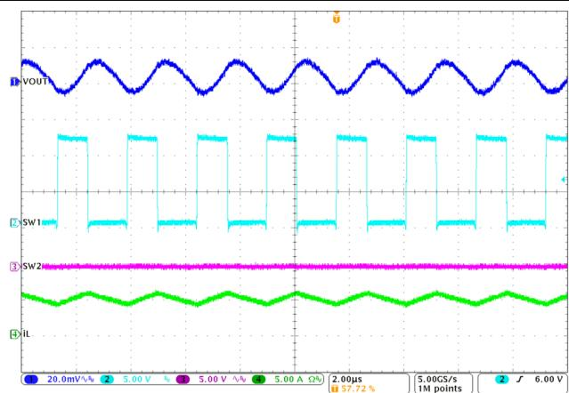  
Figure 8-2. Switching Waveforms in $\mathsf { V } _ { \mathsf { I N } } = \mathsf { I } 2 \mathsf { V } ,$ $\mathsf { V } _ { 0 \mathsf { U T } } = \mathsf { 5 } \mathsf { V } _ { : }$ , $1 0 = 5$ A, FPWM

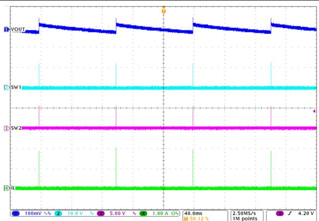  
Figure 8-3. Switching Waveforms in $\mathsf { V } _ { \mathsf { I N } } = \mathsf { I } 2 \mathsf { V } ,$ $\mathsf { v } _ { 0 \mathsf { u } \tau } = 5 \mathsf { v } _ { \tau }$ , $\mathbf { l } _ { \mathbf { O } } = \mathbf { 0 }$ A, PFM

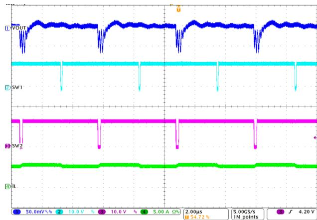  
Figure 8-4. Switching Waveforms in $\mathsf { V } _ { \mathsf { I N } } = \mathsf { I } 2 \mathsf { V } _ { : }$ , $\mathsf { V } _ { 0 \mathsf { U T } } = \mathsf { 1 2 V }$ , $\boldsymbol { \mathbf { \rho } } _ { 0 } = \boldsymbol { \mathbf { \mathit { 5 } } }$ A, FPWM

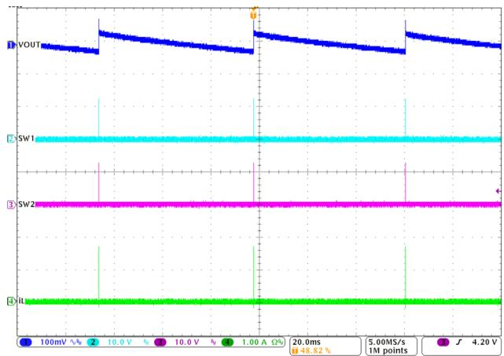  
Figure 8-5. Switching Waveforms in $\mathsf { V } _ { \mathsf { I N } } = \mathsf { I } 2 \mathsf { V } ,$ $\mathsf { V } _ { 0 \mathsf { U T } } = 1 2 \mathsf { V } _ { : }$ , $\mathbf { l } _ { 0 } = \mathbf { 0 }$ A, PFM

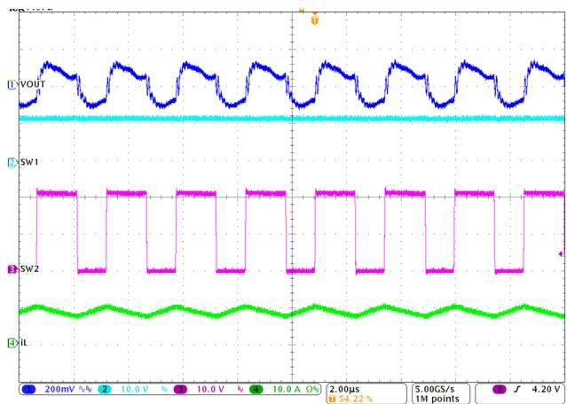  
Figure 8-6. Switching Waveforms in $\mathsf { V } _ { \mathsf { I N } } = \mathsf { I } 2 \mathsf { V } ,$ $\mathsf { V } _ { \mathsf { O U T } } = 2 \mathsf { 0 } \mathsf { V } _ { \mathrm { i } }$ $1 0 = 5$ A, FPWM

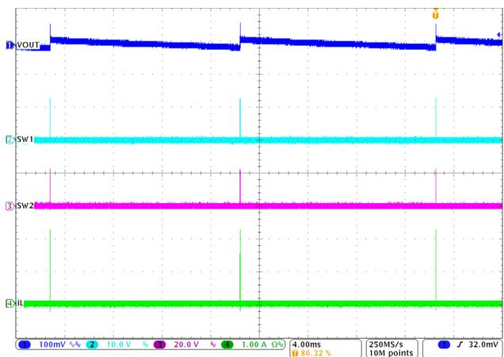  
Figure 8-7. Switching Waveforms in $\mathsf { V } _ { \mathsf { I N } } = \mathsf { I } 2 \mathsf { V } ,$ $\mathsf { V } _ { \mathsf { O U T } } = 2 \mathsf { 0 } \mathsf { V } _ { \mathrm { i } }$ ， $\mathbf { l } _ { 0 } = \mathbf { 0 }$ A, PFM

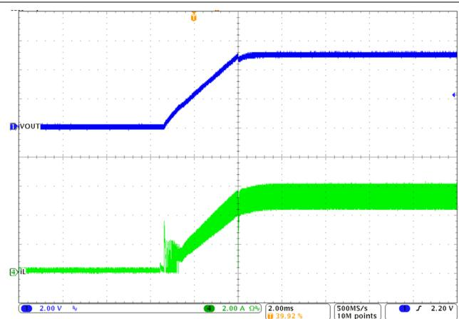  
Figure 8-8. Start-up Waveforms in $\mathsf { V } _ { \mathsf { I N } } = \mathsf { I } 2 \mathsf { V } _ { : }$ , VOUT $\mathbf { \varepsilon } = \mathbf { 5 } \mathbf { \sqrt { \varepsilon } } ,$ , $1 0 = 5$ A, FPWM

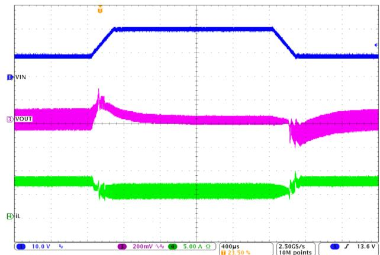  
Figure 8-10. Line Transient Waveforms in $\mathsf { V } _ { \mathsf { I N } } = \mathsf { \mathsf { S } } \mathsf { V }$ to 20 V, $\mathsf { V } _ { \mathsf { O U T } } = \mathsf { 1 2 V }$ , $1 0 = 5$ A with 200-μs Slew Rate, FPWM

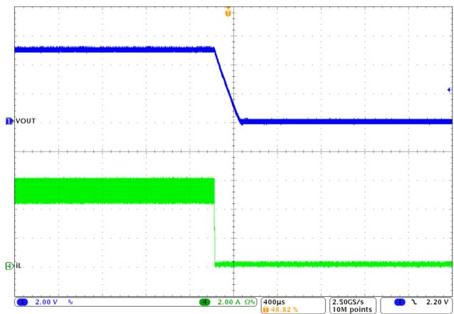  
Figure 8-9. Shutdown Waveforms in $\mathsf { V } _ { \mathsf { I N } } = \mathsf { I } 2 \mathsf { V } ,$ $\mathsf { V } _ { 0 \mathsf { U T } } = 5 \mathsf { V } _ { \mathrm { i } }$ , IOUT = 5 A, FPWM

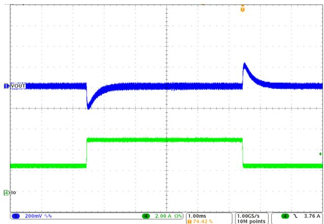  
Figure 8-11. Load Transient Waveforms in $\mathsf { V } _ { \mathsf { I N } } = 1 2$ V, $\mathsf { V } _ { 0 \mathsf { U T } } = 5 \mathsf { V } _ { \mathrm { i } }$ , $1 0 = 2 . 5$ A to 5 A with $2 0 - \mu \leq$ Slew Rate, FPWM

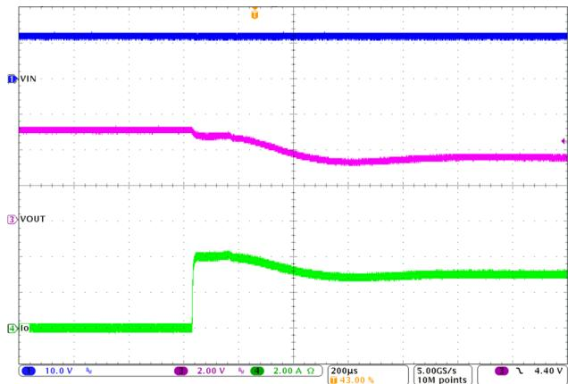  
Figure 8-12. 3-A Output Current Limit Waveforms in $\mathsf { V } _ { | \mathsf { N } } = \mathsf { 1 } \mathsf { 2 } \mathsf { V } _ { | }$ , $\mathsf { V } _ { 0 \mathsf { U T } } = 5 \mathsf { V }$ , $\mathsf { R } _ { \mathsf { L O A D } } = 1 . 2 \Omega _ { \mathrm { i } }$ , FPWM

# 9 Power Supply Recommendations

The device is designed to operate from an input voltage supply range between $2 . 7 \times$ to $3 6 \ \mathsf { V } .$ This input supply must be well regulated. If the input supply is located more than a few inches from the converter, additional bulk capacitance can be required in addition to the ceramic bypass capacitors. A typical choice is an aluminum electrolytic capacitor with a value of $1 0 0 \mu \mathsf { F } .$ .

# 10 Layout 10.1 Layout Guidelines

As for all switching power supplies, especially those running at high switching frequency and high currents, layout is an important design step. If layout is not carefully done, the regulator can suffer from instability and noise problems. To maximize efficiency, switching rise time and fall time are very fast. To prevent radiation of high-frequency noise (for example, EMI), proper layout of the high-frequency switching path is essential. Minimize the length and area of all traces connected to the SW1 and SW2 pins, and always use a ground plane under the switching regulator to minimize interplane coupling. The input capacitor needs to be close to the VIN pin and the PGND to reduce the input supply current ripple.

The most critical current path for buck converter portion is from the switching FET at the buck side, through the rectifier FET at the buck side to the PGND, then the input capacitors, and back to the input of the switching FET. This high current path contains nanosecond rise time and fall time, and should be kept as short as possible. Therefore, the input capacitor for power stage must be close to the input of the switching FET and the PGND terminal of the rectifier FET.

The most critical current path for boost converter portion is from the switching FET at the boost side, through the rectifier FET at boost side, then the output capacitors, and back to ground of the switching FET. This high current path contains nanosecond rise time and fall time, and should be kept as short as possible. Therefore, the output capacitor needs not only to be close to the VOUT pin, but also to the PGND pin to reduce the overshoot at the SW2 pin and the VOUT pin.

The traces from the output current sensing resistor to the ISP pin and the ISN pin must be in parallel and close to each other to avoid noise coupling.

The PGND plane and the AGND plane are connected at the terminal of the capacitor at the VCC pin. Thus the noise caused by the MOSFET driver and parasitic inductance does not interfere with the AGND and internal control circuit.

To get good thermal performance, it is recommended to use thermal vias beneath the TPS55288 connecting the PGND pin to the PGND plane, and the VOUT pin to a large VOUT area separately.

# 10.2 Layout Example

trace on bottom layer AGND plane on an inner layer

The first inner layer is the PGND plane

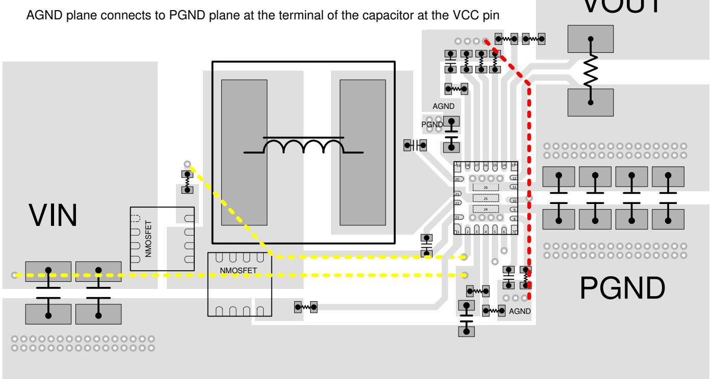  
Figure 10-1. Layout Example

# 11 Device and Documentation Support 11.1 Device Support

11.1.1 Third-Party Products Disclaimer

TI'S PUBLICATION OF INFORMATION REGARDING THIRD-PARTY PRODUCTS OR SERVICES DOES NOT CONSTITUTE AN ENDORSEMENT REGARDING THE SUITABILITY OF SUCH PRODUCTS OR SERVICES OR A WARRANTY, REPRESENTATION OR ENDORSEMENT OF SUCH PRODUCTS OR SERVICES, EITHER ALONE OR IN COMBINATION WITH ANY TI PRODUCT OR SERVICE.

# 11.2 Receiving Notification of Documentation Updates

To receive notification of documentation updates, navigate to the device product folder on ti.com. Click on Subscribe to updates to register and receive a weekly digest of any product information that has changed. For change details, review the revision history included in any revised document.

# 11.3 Support Resources

TI E2E™ support forums are an engineer's go-to source for fast, verified answers and design help — straight from the experts. Search existing answers or ask your own question to get the quick design help you need.

Linked content is provided "AS IS" by the respective contributors. They do not constitute TI specifications and do not necessarily reflect TI's views; see TI's Terms of Use.

# 11.4 Trademarks

Hotrod™ and TI E2E™ are trademarks of Texas Instruments.   
WEBENCH® is a registered trademark of Texas Instruments.   
All trademarks are the property of their respective owners.

# 11.5 Electrostatic Discharge Caution

This integrated circuit can be damaged by ESD. Texas Instruments recommends that all integrated circuits be handled with appropriate precautions. Failure to observe proper handling and installation procedures can cause damage.

ESD damage can range from subtle performance degradation to complete device failure. Precision integrated circuits may be more susceptible to damage because very small parametric changes could cause the device not to meet its published specifications.

# 11.6 Glossary

TI Glossary This glossary lists and explains terms, acronyms, and definitions.

# 12 Mechanical, Packaging, and Orderable Information

The following pages include mechanical, packaging, and orderable information. This information is the most current data available for the designated devices. This data is subject to change without notice and revision of this document. For browser-based versions of this data sheet, refer to the left-hand navigation.

# PACKAGING INFORMATION

<table><tr><td> Orderable part number</td><td>Status (1)</td><td>Material type (2)</td><td> Package | Pins</td><td>Package qty | Carrier</td><td>RoHS (3)</td><td>Lead finish/ Ball material</td><td>MSL rating/ Peak reflow</td><td>Op temp(℃)</td><td>Part marking (6)</td></tr><tr><td>TPS55288RPMR</td><td>Active</td><td>Production</td><td>VQFN-HR (RPM)|26</td><td>3000|LARGET&amp;R</td><td>Yes</td><td>（4) Call TII Sn</td><td>(5) Level-2-260C-1 YEAR</td><td>-40 to 150</td><td>55288</td></tr><tr><td>TPS55288RPMR.A</td><td>Active</td><td>Production</td><td>VQFN-HR (RPM)|26</td><td>3000|LARGET&amp;R</td><td>Yes</td><td>SN</td><td>Level-2-260C-1 YEAR</td><td>-40 to 150</td><td>55288</td></tr><tr><td>TPS55288RPMR.B</td><td>Active</td><td>Production</td><td>VQFN-HR (RPM)|263000|LARGET&amp;R</td><td></td><td>Yes</td><td>SN</td><td>Level-2-260C-1 YEAR</td><td>-40 to 150</td><td>55288</td></tr></table>

(1) Status: For more details on status, see our product life cycle.

(2) Material type: When designated, preproduction parts are prototypes/experimental devices, and are not yet approved or released for full production. Testing and final process, including without limitation quality assurance, reliability performance testing, and/or process qualification, may not yet be complete, and this item is subject to further changes or possible discontinuation. If available for ordering, purchases will be subject to an additional waiver at checkout, and are intended for early internal evaluation purposes only. These items are sold without warranties of any kind.

(3) RoHS values: Yes, No, RoHS Exempt. See the TI RoHS Statement for additional information and value definition.

(4) Lead finish/Ball material: Parts may have multiple material finish options. Finish options are separated by a vertical ruled line. Lead finish/Ball material values may wrap to two lines if the finish value exceeds the maximumcolumn width.

low: The moisture sensitivity level ratings and peak solder (reflow) temperatures. In the event that a part has multiple moisture sensitivity ratings, only the lowest level per JEDEC standards is shown.   
el for the actual reflow temperature that will be used to mount the part to the printed circuit board.

(6) Part marking: There may be an additional marking, which relates to the logo, the lot trace code information, or the environmental category of the part.

Multiple part markings will be inside parentheses. Only one part marking contained in parentheses and separated by a "\~" will appear on a part. If a line is indented then it is a continuation of the previous line and the two combined represent the entire part marking for that device.

Important Information and Disclaimer:The information provided on this page represents TI's knowledge and belief as of the date that it is provided. TI bases its knowledge and belief on information provided by third parties, and makes no representation or warranty as to the accuracy of such information. Efforts are underway to better integrate information from third parties. TI has taken and continues to take reasonable steps to provide representative and accurate information but may not have conducted destructive testing or chemical analysis on incoming materials and chemicals. TI and TI suppliers consider certain information to be proprietary, and thus CAS numbers and other limited information may not be available for release.

no event shall TI's liability arising out of such information exceed the total purchase price of the TI part(s) at issue in this document sold by TI to Customer on an annual basis.

# OTHER QUALIFIED VERSIONS OF TPS55288 :

Automotive : TPS55288-Q1

NOTE: Qualified Version Definitions:

• Automotive - Q100 devices qualified for high-reliability automotive applications targeting zero defects

# TAPE AND REEL INFORMATION

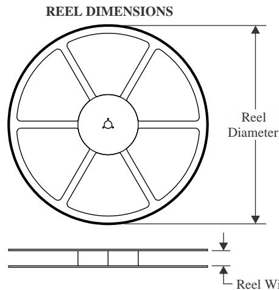

<table><tr><td rowspan=1 colspan=1>A0</td><td rowspan=1 colspan=1>A0Dimension designed to accommodate the component width</td></tr><tr><td rowspan=1 colspan=1>B0</td><td rowspan=1 colspan=1>Dimension designed to accommodate the component length</td></tr><tr><td rowspan=1 colspan=1>K0</td><td rowspan=1 colspan=1>Dimension designed to accommodate the component thickness</td></tr><tr><td rowspan=1 colspan=1>W</td><td rowspan=1 colspan=1>Overall width of the carrier tape</td></tr><tr><td rowspan=1 colspan=1>P1</td><td rowspan=1 colspan=1>Pitch between successive cavity centers</td></tr></table>

# QUADRANT ASSIGNMENTS FOR PIN 1 ORIENTATION IN TAPE

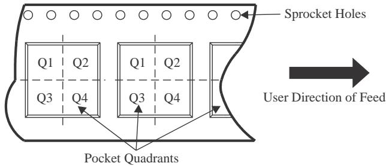

\*All dimensions are nominal   

<table><tr><td rowspan=1 colspan=1>Device</td><td rowspan=1 colspan=1>PackageType</td><td rowspan=1 colspan=1>PackageDrawing</td><td rowspan=1 colspan=1>Pins</td><td rowspan=1 colspan=1>SPQ</td><td rowspan=1 colspan=1>ReelDiameter(mm)</td><td rowspan=1 colspan=1>ReelWidthw1 (mm)</td><td rowspan=1 colspan=1>A0(mm)</td><td rowspan=1 colspan=1>B0(mm)</td><td rowspan=1 colspan=1>K0(mm)</td><td rowspan=1 colspan=1>P1(mm)</td><td rowspan=1 colspan=1>w(mm)</td><td rowspan=1 colspan=1>Pin1Quadrant</td></tr><tr><td rowspan=1 colspan=1>TPS55288RPMR</td><td rowspan=1 colspan=1>VQFN-HR</td><td rowspan=1 colspan=1>RPM</td><td rowspan=1 colspan=1>26</td><td rowspan=1 colspan=1>3000</td><td rowspan=1 colspan=1>330.0</td><td rowspan=1 colspan=1>12.4</td><td rowspan=1 colspan=1>3.8</td><td rowspan=1 colspan=1>4.3</td><td rowspan=1 colspan=1>1.5</td><td rowspan=1 colspan=1>8.0</td><td rowspan=1 colspan=1>12.0</td><td rowspan=1 colspan=1>Q2</td></tr><tr><td rowspan=1 colspan=1>TPS55288RPMR</td><td rowspan=1 colspan=1>VQFN-HR</td><td rowspan=1 colspan=1>RPM</td><td rowspan=1 colspan=1>26</td><td rowspan=1 colspan=1>3000</td><td rowspan=1 colspan=1>330.0</td><td rowspan=1 colspan=1>12.4</td><td rowspan=1 colspan=1>3.8</td><td rowspan=1 colspan=1>4.3</td><td rowspan=1 colspan=1>1.5</td><td rowspan=1 colspan=1>8.0</td><td rowspan=1 colspan=1>12.0</td><td rowspan=1 colspan=1>Q2</td></tr></table>

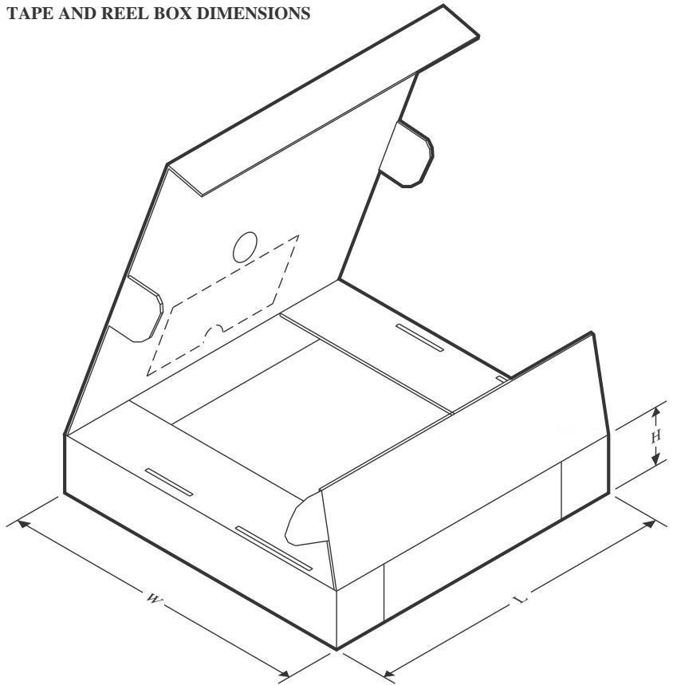

\*All dimensions are nominal   

<table><tr><td rowspan=1 colspan=1>Device</td><td rowspan=1 colspan=1>Package Type</td><td rowspan=1 colspan=1>Package Drawing</td><td rowspan=1 colspan=1>Pins</td><td rowspan=1 colspan=1>SPQ</td><td rowspan=1 colspan=1> Length (mm)</td><td rowspan=1 colspan=1>Width (mm)</td><td rowspan=1 colspan=1>Height (mm)</td></tr><tr><td rowspan=1 colspan=1>TPS55288RPMR</td><td rowspan=1 colspan=1>VQFN-HR</td><td rowspan=1 colspan=1>RPM</td><td rowspan=1 colspan=1>26</td><td rowspan=1 colspan=1>3000</td><td rowspan=1 colspan=1>367.0</td><td rowspan=1 colspan=1>367.0</td><td rowspan=1 colspan=1>35.0</td></tr><tr><td rowspan=1 colspan=1>TPS55288RPMR</td><td rowspan=1 colspan=1>VQFN-HR</td><td rowspan=1 colspan=1>RPM</td><td rowspan=1 colspan=1>26</td><td rowspan=1 colspan=1>3000</td><td rowspan=1 colspan=1>367.0</td><td rowspan=1 colspan=1>367.0</td><td rowspan=1 colspan=1>35.0</td></tr></table>

# 3.5 x 4, 0.5 mm pitch

This image is a representation of the package family, actual package may vary. Refer to the product data sheet for package details.

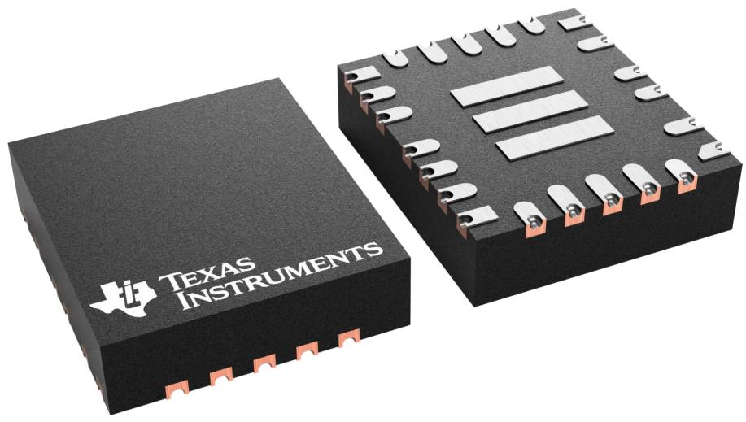

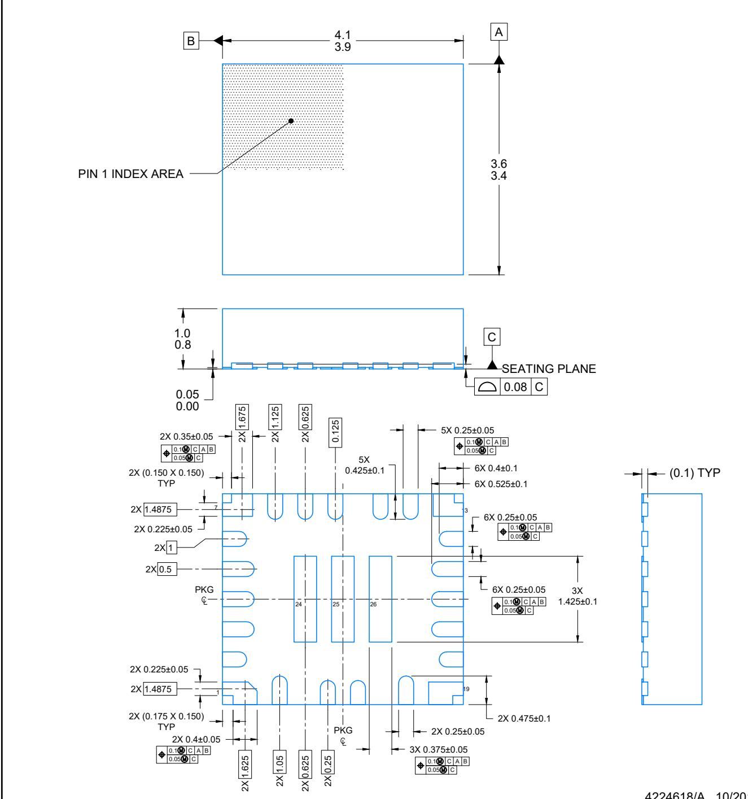  
PLASTIC QUAD FLATPACK-NO LEAD   
NOTES:

1. All linear dimensions are in millimeters. Any dimensions in parenthesis are for reference only. Dimensioning and tolerancing per ASME Y14.5M.   
2. This drawing is subject to change without notice.

  
NOTES: (continued)

3. For more information, see Texas Instruments literature number SLUA271 (www.ti.com/lit/slua271) .

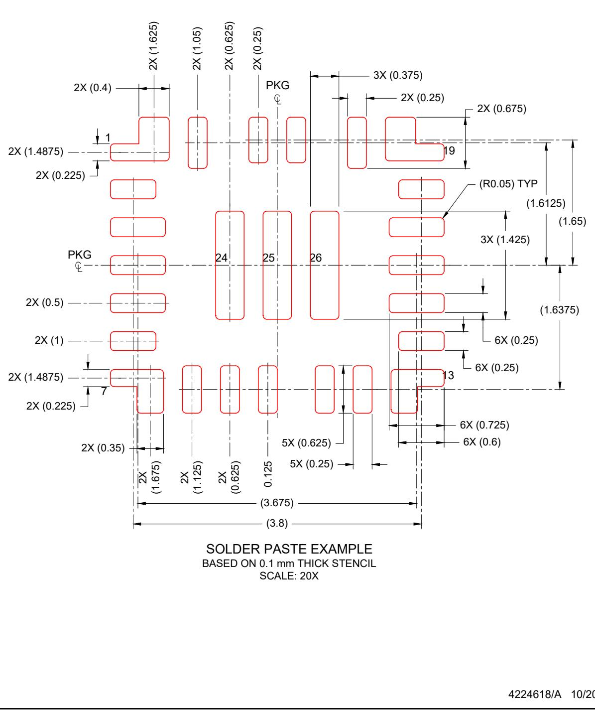  
NOTES: (continued)

4. Laser cutting apertures with trapezoidal walls and rounded corners may offer better paste release. IPC-7525 may have alternate design recommendations.

# IMPORTANT NOTICE AND DISCLAIMER

TI PROVIDES TECHNICAL AND RELIABILITY DATA (INCLUDING DATA SHEETS), DESIGN RESOURCES (INCLUDING REFERENCE DESIGNS), APPLICATION OR OTHER DESIGN ADVICE, WEB TOOLS, SAFETY INFORMATION, AND OTHER RESOURCES “AS IS” AND WITH ALL FAULTS, AND DISCLAIMS ALL WARRANTIES, EXPRESS AND IMPLIED, INCLUDING WITHOUT LIMITATION ANY IMPLIED WARRANTIES OF MERCHANTABILITY, FITNESS FOR A PARTICULAR PURPOSE OR NON-INFRINGEMENT OF THIRD PARTY INTELLECTUAL PROPERTY RIGHTS.

These resources are intended for skilled developers designing with TI products. You are solely responsible for (1) selecting the appropriate TI products for your application, (2) designing, validating and testing your application, and (3) ensuring your application meets applicable standards, and any other safety, security, regulatory or other requirements.

These resources are subject to change without notice. TI grants you permission to use these resources only for development of an application that uses the TI products described in the resource. Other reproduction and display of these resources is prohibited. No license is granted to any other TI intellectual property right or to any third party intellectual property right. TI disclaims responsibility for, and you will fully indemnify TI and its representatives against, any claims, damages, costs, losses, and liabilities arising out of your use of these resources.

TI’s products are provided subject to TI’s Terms of Sale or other applicable terms available either on ti.com or provided in conjunction with such TI products. TI’s provision of these resources does not expand or otherwise alter TI’s applicable warranties or warranty disclaimers for TI products.

TI objects to and rejects any additional or different terms you may have proposed.

Mailing Address: Texas Instruments, Post Office Box 655303, Dallas, Texas 75265 Copyright $\circledcirc$ 2025, Texas Instruments Incorporated

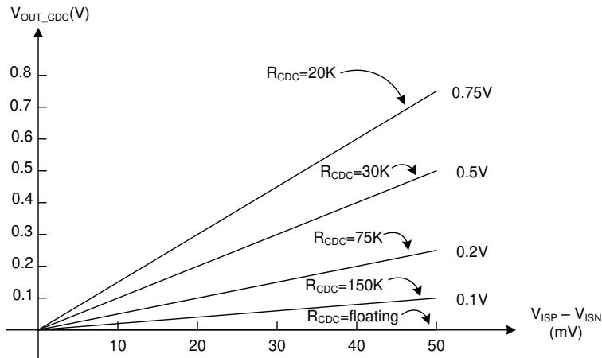  
Figure 7-6. Output Voltage Rise vs Output Current

# 7.3.13 Integrated Gate Drivers

The TPS55288 provides two N-channel MOSFET gate drivers for buck side. Each driver is capable of sourcing 1-A and sinking 1.8-A peak current. In buck operation, the DR1H pin and the DR1L pin are switched by the PWM controller. In boost mode, the DR1H pin remains at continuously high voltage to turn on the high-side MOSFET of the buck side, and the DR1L pin remains at continuously low voltage to turn off the low-side MOSFET of the buck side.

In DCM buck mode operation, the DR1L turns off the low-side FET when the inductor current drops to zero.

The low-side gate driver is powered from the VCC pin, and the high-side gate driver is powered from th bootstrap capacitor $\mathsf { C } _ { \mathsf { B O O T } 1 }$ , which is between the BOOT1 pin and the SW1 pin.

# 7.3.14 Output Current Limit

The output current limit is programmable from 0 A to 6.35 A by placing a $1 0 \cdot \mathsf { m } \Omega$ current sensing resistor between the ISP pin and the ISN pin. Smaller resistance results in a higher current limit and bigger resistance results in a lower current limit. An internal register sets the current sense voltage across the ISP pin and the ISN pin. The programmable voltage step between the ISP pin and the ISN pin is $0 . 5 \mathsf { m V } .$

Connecting the ISP and the ISN pin together to the VOUT pin disables the output current limit because the sensed voltage is always zero. The output current limit can also be disabled by reset the Current_Limit_EN bit in the Current_Limit register to 0.

When the OE bit or the Current_Limit_EN bit is changed from 0 to 1, the OCP_MASK must be 0. After the OE bit and the Current_Limit_EN bit are set, set the OCP_MASK to 1 to enable the OCP fault indication output.

# 7.3.15 Overvoltage Protection

The TPS55288 has output overvoltage protection. When the output voltage at the VOUT pin is detected above $2 3 . 5 \mathrm { ~ V ~ }$ typically, the TPS55288 turns off two high-side FETs and turns on two low-side FETs until its output voltage drops the hysteresis value lower than the output overvoltage protection threshold. This function prevents overvoltage on the output and secures the circuits connected to the output from excessive overvoltage.

# 7.3.16 Output Short Circuit Protection

In addition to the average inductor current limit, the TPS55288 implements the output short-circuit protection by entering hiccup mode. To enable hiccup mode, the HICCUP bit in register 06h must be set. After soft start-up time of $4 \mathsf { m } \mathsf { s }$ , the TPS55288 monitors the average inductor current and output voltage. Whenever the output short circuit happens, causing the average inductor current hitting the set limit and the output voltage below 0.8 V, the TPS55288 shuts down the switching for 76 ms (typical) and then repeats the soft start for $4 \mathrm { \ m s }$ . The hiccup mode helps reduce the total power dissipation on the TPS55288 in the output short-circuit or overcurrent condition.

# 7.3.17 Thermal Shutdown

The TPS55288 is protected by a thermal shutdown circuit that shuts down the device when the internal junction temperature exceeds $1 7 5 ^ { \circ } \mathrm { C }$ (typical). The internal soft-start circuit is reset but all internal registers values remain unchanged when thermal shutdown is triggered. The converter automatically restarts when the junction temperature drops below the thermal shutdown hysteresis of $\boldsymbol { 2 0 ^ { \circ } \mathrm { C } }$ below the thermal shutdown threshold.

# 7.4 Device Functional Modes

In light load condition, the TPS55288 can work in PFM or forced PWM mode to meet different application requirements. The PFM mode decreases switching frequency to reduce the switching loss thus it gets high efficiency at light load condition. The FPWM mode keeps the switching frequency unchanged to avoid undesired low switching frequency but the efficiency becomes lower than that of PFM mode.

# 7.4.1 PWM Mode

In FPWM mode, the TPS55288 keeps the switching frequency unchanged in light load condition. When the load current decreases, the output of the internal error amplifier decreases as well to reduce the average inductor current down to deliver less power from input to output. When the output current further reduces, the current through the inductor decreases to zero during the switch-off time. The high-side N-MOSFET is not turned off even if the current through the MOSFET is zero. Thus, the inductor current changes its direction after it runs to zero. The power flow is from output side to input side. The efficiency is low in this condition. However, with the fixed switching frequency, there is no audible noise or other problems that might be caused by low switching frequency in light load condition.

# 7.4.2 Power Save Mode

The TPS55288 improves the efficiency at light load condition with the PFM mode. By connecting an appropriate resistor at the MODE pin or enabling the PFM function in the internal register, the TPS55288 can work in PFM mode at light load condition. When the TPS55288 operates at light load condition, the output of the internal error amplifier decreases to make the inductor peak current down to deliver less power to the load. When the output current further reduces, the current through the inductor will decrease to zero during the switch-off time. When the TPS55288 works in buck mode, once the inductor current becomes zero, the low-side switch of the buck side is turned off to prevent the reverse current from output to ground. When the TPS55288 works in boost mode, once the inductor current becomes zero, the high side-switch of the boost side is turned off to prevent the reverse current from output to input. The TPS55288 resumes switching until the output voltage drops. Thus the PFM mode reduces switching cycles and eliminates the power loss by the reverse inductor current to get high efficiency in light load condition.

# 7.5 I2C Serial Interface

The TPS55288 uses $\mathsf { I 2 C }$ interface for flexible converter parameter programming. $\mathsf { I 2 C }$ is a bi-directional 2-wire serial interface. Only two bus lines are required: a serial data line (SDA) and a serial clock line (SCL). ${ \mathsf { I } } ^ { 2 } { \mathsf { C } }$ devices can be considered as masters or slaves when performing data transfers. A master is the device that initiates a data transfer on the bus and generates the clock signals to permit that transfer. At that time, any device addressed is considered a slave.

The TPS55288 operates as a slave device with address 74h and 75h set by a different resistor at the MODE pin. Receiving control inputs from the master device like a microcontroller or a digital signal processor reads and writes the internal registers 00h through 07h. The $\mathsf { I 2 C }$ interface of the TPS55288 supports both standard mode (up to $1 0 0 \ \mathsf { k b i t } / \mathsf { s } )$ and fast mode plus (up to 1000 kbit/s). Both SDA and SCL must be connected to the positive supply voltage through current sources or pullup resistors. When the bus is free, both lines are in high voltage.

# 7.5.1 Data Validity

The data on the SDA line must be stable during the high level period of the clock. The high level or low level state of the data line can only change when the clock signal on the SCL line is low level. One clock pulse is generated for each data bit transferred.

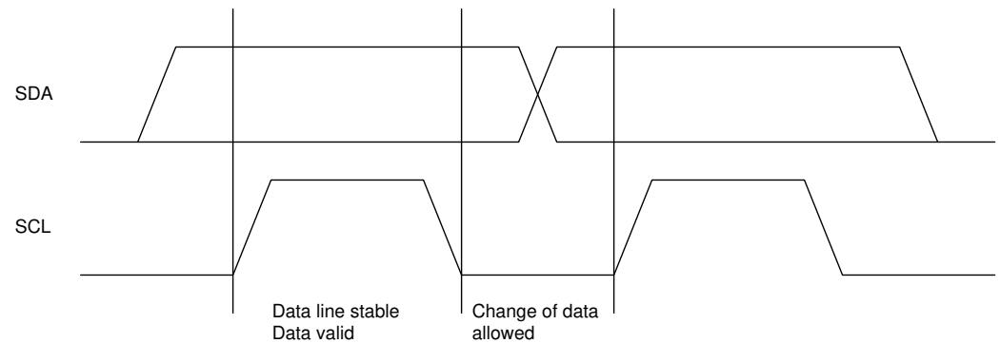  
Figure 7-7. I2C Data Validity

# 7.5.2 START and STOP Conditions

All transactions begin with a START (S) and can be terminated by a STOP (P). A high level to low level transition on the SDA line while SCL is at high level defines a START condition. A low level to high level transition on the SDA line when the SCL is at high level defines a STOP condition.

START and STOP conditions are always generated by the master. The bus is considered busy after the START condition, and free after the STOP condition.

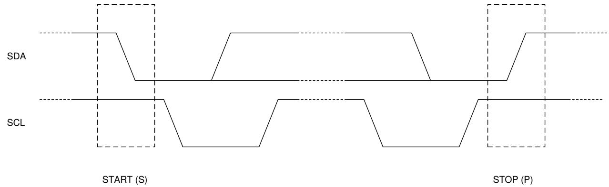  
Figure 7-8. I2C START and STOP Conditions

# 7.5.3 Byte Format

Every byte on the SDA line must be eight bits long. The number of bytes to be transmitted per transfer is unrestricted. Each byte has to be followed by an acknowledge bit. Data is transferred with the most significant bit (MSB) first. If a slave cannot receive or transmit another complete byte of data until it has performed some other function, it can hold the clock line SCL low to force the master into a wait state (clock stretching). Data transfer then continues when the slave is ready for another byte of data and release the clock line SCL.

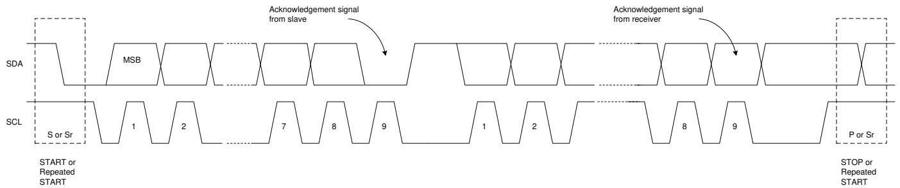  
Figure 7-9. Byte Format

# 7.5.4 Acknowledge (ACK) and Not Acknowledge (NACK)

The acknowledge takes place after every byte. The acknowledge bit allows the receiver to signal the transmitter that the byte was successfully received and another byte may be sent. All clock pulses, including the acknowledge ${ \mathfrak { g m } }$ clock pulse, are generated by the master.

The transmitter releases the SDA line during the acknowledge clock pulse so the receiver can pull the SDA line to low level and it remains stable low level during the high level period of this clock pulse.

The Not Acknowledge signal is when SDA remains high level during the ${ \mathfrak { g m } }$ clock pulse. The master can the generate either a STOP to abort the transfer or a repeated START to start a new transfer.

# 7.5.5 Slave Address and Data Direction Bit

After the START, a slave address is sent. This address is seven bits long followed by the eighth bit as a data direction bit (bit $\mathsf { R } / \overline { { \mathsf { W } } } )$ ). A zero indicates a transmission (WRITE) and a one indicates a request for data (READ).

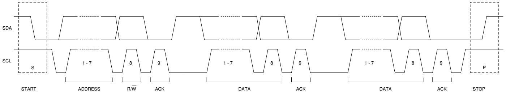  
Figure 7-10. Slave Address and Data Direction

# 7.5.6 Single Read and Write

Figure 7-11 and Figure 7-12 show the single-byte write and single-byte read format of the $\mathsf { I 2 C }$ communication.

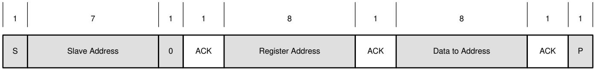  
Figure 7-11. Single-byte Write

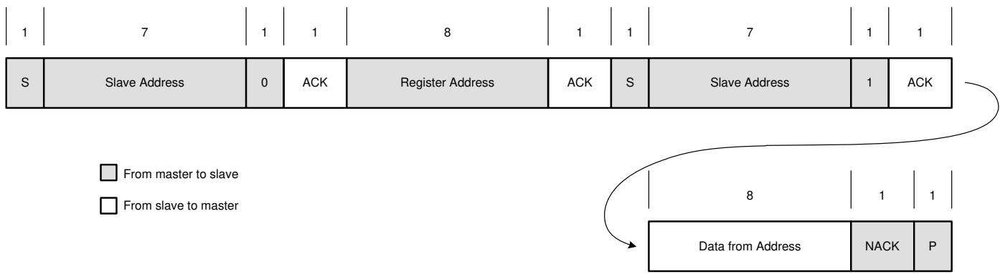  
Figure 7-12. Single-byte Read

If the register address is not defined, the TPS55288 sends back NACK and goes back to the idle state.

# 7.5.7 Multi-Read and Multi-Write

The TPS55288 supports multi-read and multi-write.

  
Figure 7-13. Multi-byte Write

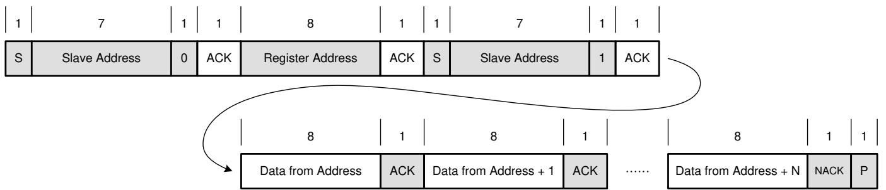  
Figure 7-14. Multi-byte Read

# 7.6 Register Maps

Table 7-3 lists the memory-mapped registers for the device registers. All register offset addresses not listed in Table 7-3 should be considered as reserved locations, and the register contents should not be modified.

Table 7-3. Device Registers   

<table><tr><td rowspan=1 colspan=1>Address</td><td rowspan=1 colspan=1>Acronym</td><td rowspan=1 colspan=1>Register Name</td><td rowspan=1 colspan=1>Section</td></tr><tr><td rowspan=1 colspan=1>0h, 1h</td><td rowspan=1 colspan=1>REF</td><td rowspan=1 colspan=1>Reference Voltage</td><td rowspan=1 colspan=1>Go</td></tr><tr><td rowspan=1 colspan=1>2h</td><td rowspan=1 colspan=1>IOUT_LIMIT</td><td rowspan=1 colspan=1>Current Limit Setting</td><td rowspan=1 colspan=1>Go</td></tr><tr><td rowspan=1 colspan=1>3h</td><td rowspan=1 colspan=1>VOUT_SR</td><td rowspan=1 colspan=1>Slew Rate</td><td rowspan=1 colspan=1>Go</td></tr><tr><td rowspan=1 colspan=1>4h</td><td rowspan=1 colspan=1>VOUT_FS</td><td rowspan=1 colspan=1>Feedback Selection</td><td rowspan=1 colspan=1>Go</td></tr><tr><td rowspan=1 colspan=1>5h</td><td rowspan=1 colspan=1>CDC</td><td rowspan=1 colspan=1>Cable Compensation</td><td rowspan=1 colspan=1>Go</td></tr><tr><td rowspan=1 colspan=1>6h</td><td rowspan=1 colspan=1>MODE</td><td rowspan=1 colspan=1>Mode Control</td><td rowspan=1 colspan=1>Go</td></tr><tr><td rowspan=1 colspan=1>7h</td><td rowspan=1 colspan=1>STATUS</td><td rowspan=1 colspan=1>Operating Status</td><td rowspan=1 colspan=1>G</td></tr></table>

# 7.6.1 REF Register (Address $\mathbf { \mu = 0 h }$ , 1h) [reset $=$ 11010010h, 00000000h]

REF is shown in Figure 7-15 and Figure 7-16 described in Table 7-4.

# Return to Summary Table.

REF sets the internal reference voltage of the TPS55288. The 01h register is the high byte and the 00h register is the low byte. One LSB of register 00h stands for $1 . 1 2 9 \mathrm { ~ m V }$ of the internal reference voltage. The default register value is 00000000 11010010b of $2 8 2 \ \mathsf { m V } .$ When the register value is 00000000 00000000b, the reference voltage is $4 5 ~ \mathsf { m V } .$ When the register value is 00000011 11000000b, the reference voltage is 1.129 V. The output voltage of the TPS55288 also depends on the output feedback ratio, which is either set in register 04h or set by an external resistor divider.

Writing register 01h enables the TPS55288 to load the 01h and 00h data into the internal 10-bit DAC. Writing the register 00h does not impact the internal reference voltage.

Figure 7-15. REF_LSB   

<table><tr><td rowspan=1 colspan=1>7</td><td rowspan=1 colspan=1>6</td><td rowspan=1 colspan=1>5</td><td rowspan=1 colspan=1>4</td><td rowspan=1 colspan=1>3</td><td rowspan=1 colspan=1>2</td><td rowspan=1 colspan=1>1</td><td rowspan=1 colspan=1>0</td></tr><tr><td rowspan=1 colspan=8>VREF</td></tr><tr><td rowspan=1 colspan=8>R/W-11010010b</td></tr></table>

Figure 7-16. REF_MSB   

<table><tr><td rowspan=1 colspan=1>15</td><td rowspan=1 colspan=1>14</td><td rowspan=1 colspan=1>13</td><td rowspan=1 colspan=1>12</td><td rowspan=1 colspan=1>11</td><td rowspan=1 colspan=1>10</td><td rowspan=1 colspan=1>9</td><td rowspan=1 colspan=1>8</td></tr><tr><td rowspan=1 colspan=6>Reserved</td><td rowspan=1 colspan=2>VREF</td></tr><tr><td rowspan=1 colspan=6>R/W-000000b</td><td rowspan=1 colspan=2>R/W-00b</td></tr></table>

Table 7-4. REF Register Field Descriptions   

<table><tr><td>Bit</td><td>Field</td><td>Type</td><td>Reset</td><td>Description</td></tr><tr><td>15-10</td><td>Reserved</td><td>R/W</td><td>000000b</td><td>Reserved</td></tr><tr><td>9-0</td><td>VREF</td><td>R/W</td><td>00 11010010b</td><td>Sets the internal reference voltage 00 00000000b= 45-mV reference voltage 00 00000001b = 46.129-mV reference voltage 00 00000010b = 47.258-mV reference voltage 00 11010010b = 282-mV reference voltage (Default) 01 10011010b = 508-mV reference voltage 10 11000110b = 846-mV reference voltage</td></tr></table>

# 7.6.2 IOUT_LIMIT Register (Address $=$ 2h) [reset $=$ 11100100h]

IOUT_LIMIT is shown in Figure 7-17 and described in Table 7-5.

Return to Summary Table.

IOUT_LIMIT sets the current limit target voltage between the ISP pin and the ISN pin. The default value in the current limit register is 11100100b standing for $5 0 \mathsf { m V } .$ 1 LSB stands for $0 . 5 \mathsf { m V } .$ . The bit7 enables the current limit or disables the current limit.

Figure 7-17. IOUT_LIMIT Register   

<table><tr><td rowspan=1 colspan=1>7</td><td rowspan=1 colspan=1>6</td><td rowspan=1 colspan=1>5</td><td rowspan=1 colspan=1>4</td><td rowspan=1 colspan=1>3</td><td rowspan=1 colspan=1>2</td><td rowspan=1 colspan=1></td><td rowspan=1 colspan=1>0</td></tr><tr><td rowspan=1 colspan=1>Current_Limit_EN</td><td rowspan=2 colspan=7>Current_Limit_SettingR/W-1100100b</td></tr><tr><td rowspan=1 colspan=1>R/W-1b</td></tr></table>

Table 7-5. IOUT_LIMIT Register Field Descriptions   

<table><tr><td rowspan=1 colspan=1>Bit</td><td rowspan=1 colspan=1>Field</td><td rowspan=1 colspan=1>Type</td><td rowspan=1 colspan=1>Reset</td><td rowspan=1 colspan=1>Description</td></tr><tr><td rowspan=1 colspan=1>7</td><td rowspan=1 colspan=1>Current_Limit_EN</td><td rowspan=1 colspan=1>R/W</td><td rowspan=1 colspan=1>1b</td><td rowspan=1 colspan=1>Enable or disable current limit.Ob = Current limit disabled1b = Current limit enabled (Default)</td></tr><tr><td rowspan=1 colspan=1>6-0</td><td rowspan=1 colspan=1>Current_Limit_Setting</td><td rowspan=1 colspan=1>R/W</td><td rowspan=1 colspan=1>1100100b</td><td rowspan=1 colspan=1>Sets the current limit target voltage between the ISP pin and the ISNpin000000Ob = VIsP-VISN =0 (mV)0000001b =VisP-ViSN=0.5 (mV)0000010b =VisP-VisN=1(mV)0000011b = Visp-VisN= 1.5 (mV)0000100b = Visp-VisN =2.0 (mV)1100100b = Visp-VIsN = 50.0 (mV) (Default)1111111b =VIsP-VIsN = 63.5 (mV)</td></tr></table>

# 7.6.3 VOUT_SR Register (Address $=$ 3h) [reset $=$ 00000001h]

VOUT_SR is shown in Figure 7-18 and described in Table 7-6.

Return to Summary Table.

Register 03h sets the slew rate of the output voltage change and the response delay time after the output current exceeds the setting output current limit.

The OCP_DELAY [1:0] bits set the response time of the TPS55288 when the output overcurrent limit is hit. This allows the TPS55288 to output high current in a relative short duration time. The default setting is $1 2 8 \mu \mathsf { s }$ so that the TPS55288 immediately limits the output current.

The SR [1:0] bits set $1 . 2 5 \mathsf { m V } / \mu \mathsf { s }$ , $2 . 5 \mathsf { m V } / \mathsf { \mu s }$ , 5mV/μs, and $1 0 \mathsf { m V } / \mu \mathsf { s }$ slew rate for output voltage change.

Figure 7-18. VOUT_SR Register   

<table><tr><td rowspan=1 colspan=1>7</td><td rowspan=1 colspan=1>6</td><td rowspan=1 colspan=1>5</td><td rowspan=1 colspan=1>4</td><td rowspan=1 colspan=1>3</td><td rowspan=1 colspan=1>2</td><td rowspan=1 colspan=1>1</td><td rowspan=1 colspan=1>0</td></tr><tr><td rowspan=1 colspan=2>RESERVED</td><td rowspan=1 colspan=2>OCP_DELAY</td><td rowspan=1 colspan=2>RESERVED</td><td rowspan=1 colspan=2>SR</td></tr><tr><td rowspan=1 colspan=2>R/W-0b</td><td rowspan=1 colspan=2>R/W-00b</td><td rowspan=1 colspan=2>R/W-00b</td><td rowspan=1 colspan=2>R/W-01b</td></tr></table>

Table 7-6. VOUT_SR Register Field Descriptions   

<table><tr><td rowspan=1 colspan=1>Bit</td><td rowspan=1 colspan=1>Field</td><td rowspan=1 colspan=1>Type</td><td rowspan=1 colspan=1>Reset</td><td rowspan=1 colspan=1>Description</td></tr><tr><td rowspan=1 colspan=1>7-6</td><td rowspan=1 colspan=1>RESERVED</td><td rowspan=1 colspan=1>RW</td><td rowspan=1 colspan=1>oob</td><td rowspan=1 colspan=1>Reserved</td></tr><tr><td rowspan=1 colspan=1>5-4</td><td rowspan=1 colspan=1>OCP_DELAY</td><td rowspan=1 colspan=1>RW</td><td rowspan=1 colspan=1>0ob</td><td rowspan=1 colspan=1>Sets the response time of the device when the output overcurrentlimit is reached.00b = 128 μs (Default)01b = Delay1.024x3 ms10b = Delay 1.024x6 ms11b = Delay 1.024 x 12 ms</td></tr><tr><td rowspan=1 colspan=1>3-2</td><td rowspan=1 colspan=1>RESERVED</td><td rowspan=1 colspan=1>R/W</td><td rowspan=1 colspan=1>00b</td><td rowspan=1 colspan=1>Reserved</td></tr><tr><td rowspan=1 colspan=1>1-0</td><td rowspan=1 colspan=1>SR</td><td rowspan=1 colspan=1>R/W</td><td rowspan=1 colspan=1>01b</td><td rowspan=1 colspan=1>Sets slew rate for output voltage change.00b = 1.25 mV/us output change slew rate01b = 2.5 mV/us output change slew rate (Default)10b = 5 mV/us output change slew rate11b = 10 mV/us output change slew rate</td></tr></table>

# 7.6.4 VOUT_FS Register (Address $=$ 4h) [reset $=$ 00000011h]

VOUT_FS is shown in Figure 7-19 and described in Table 7-7.

Return to Summary Table.

Register 04h sets the selection for the output feedback voltage, either by an internal resistor divider or external resistor divider, and sets the internal feedback ratio when using internal feedback resistor divider.

# Figure 7-19. VOUT_FS Register

<table><tr><td>7</td><td>6</td><td>5</td><td>4</td><td>3</td><td>2</td><td>1</td><td>0</td></tr><tr><td>FB</td><td></td><td></td><td>RESERVED</td><td></td><td></td><td>INTFB</td><td></td></tr><tr><td>R/W-0b</td><td colspan="5">R/W-00000b</td><td colspan="2">R/W-11b</td></tr></table>

Table 7-7. VOUT_FS Register Field Descriptions   

<table><tr><td rowspan=1 colspan=1>Bit</td><td rowspan=1 colspan=1>Field</td><td rowspan=1 colspan=1>Type</td><td rowspan=1 colspan=1>Reset</td><td rowspan=1 colspan=1>Description</td></tr><tr><td rowspan=1 colspan=1>7</td><td rowspan=1 colspan=1>FB</td><td rowspan=1 colspan=1>R/W</td><td rowspan=1 colspan=1>Ob</td><td rowspan=1 colspan=1>Output feedback voltageOb = Use internal output voltage feedback.The FB/iNT pin is theindicator for output short circuit protection,overcurrent status,andovervoltage status (Default).1b = Use external output voltage feedback.The FB/INT pin is thefeedback input of the output voltage.</td></tr><tr><td rowspan=1 colspan=1>6-2</td><td rowspan=1 colspan=1>RESERVED</td><td rowspan=1 colspan=1>R</td><td rowspan=1 colspan=1>00000b</td><td rowspan=1 colspan=1>Reserved</td></tr><tr><td rowspan=1 colspan=1>1-0</td><td rowspan=1 colspan=1>INTFB</td><td rowspan=1 colspan=1>R/W</td><td rowspan=1 colspan=1>11b</td><td rowspan=1 colspan=1>Internal feedbackratio00b = Set internal feedback ratio to 0.225601b = Set internal feedback ratio to 0.112810b = Set internal feedback ratio to 0.075211b = Set internal feedback ratio to O.0564(Default)</td></tr></table>

Table 7-8. Output Voltage vs Internal Reference   

<table><tr><td rowspan=1 colspan=1>INTFB1</td><td rowspan=1 colspan=1> INTFBO</td><td rowspan=1 colspan=1>REF=0000h</td><td rowspan=1 colspan=1>REF=000Dh</td><td rowspan=1 colspan=1>REF=0028h</td><td rowspan=1 colspan=1>REF=0078h</td><td rowspan=1 colspan=1>REF=03C0h</td><td rowspan=1 colspan=1> Output Voltage Step</td></tr><tr><td rowspan=1 colspan=1>0</td><td rowspan=1 colspan=1>0</td><td rowspan=1 colspan=1></td><td rowspan=1 colspan=1></td><td rowspan=1 colspan=1></td><td rowspan=1 colspan=1>0.8V</td><td rowspan=1 colspan=1>5V</td><td rowspan=1 colspan=1>5 mV</td></tr><tr><td rowspan=1 colspan=1>0</td><td rowspan=1 colspan=1>1</td><td rowspan=1 colspan=1></td><td rowspan=1 colspan=1></td><td rowspan=1 colspan=1>0.8 V</td><td rowspan=1 colspan=1></td><td rowspan=1 colspan=1>10V</td><td rowspan=1 colspan=1>10 mV</td></tr><tr><td rowspan=1 colspan=1>1</td><td rowspan=1 colspan=1>0</td><td rowspan=1 colspan=1></td><td rowspan=1 colspan=1>0.8V</td><td rowspan=1 colspan=1></td><td rowspan=1 colspan=1></td><td rowspan=1 colspan=1>15V</td><td rowspan=1 colspan=1>15 mV</td></tr><tr><td rowspan=1 colspan=1>1</td><td rowspan=1 colspan=1>1</td><td rowspan=1 colspan=1>0.8V</td><td rowspan=1 colspan=1></td><td rowspan=1 colspan=1></td><td rowspan=1 colspan=1></td><td rowspan=1 colspan=1>20V</td><td rowspan=1 colspan=1>20 mV</td></tr></table>

# 7.6.5 CDC Register (Address $=$ 5h) [reset $=$ 11100000h]

CDC is shown in Figure 7-20 and described in Table 7-9.

Return to Summary Table.

Register 05h sets masks for SC bit, OCP bit, and OVP bit in register 07h. In addition, register 05h sets the voltage rise added to the setting output voltage with respect to the sensed differential voltage between the ISP pin and the ISN pin.

The OCP_MASK must be 0 when the OE bit or the Current_Limit_EN bit is changed from 0 to 1. After the OE bit and the Current_Limit_EN bit are set, set the OCP_MASK to 1 to enable the OCP fault indication output.

Figure 7-20. CDC Register   

<table><tr><td rowspan=1 colspan=1>7</td><td rowspan=1 colspan=1>6</td><td rowspan=1 colspan=1>5</td><td rowspan=1 colspan=1>4</td><td rowspan=1 colspan=1>3</td><td rowspan=1 colspan=1>2</td><td rowspan=1 colspan=1>1</td><td rowspan=1 colspan=1>0</td></tr><tr><td rowspan=1 colspan=1>SC_MASK</td><td rowspan=1 colspan=1>OCP_MASK</td><td rowspan=1 colspan=1>OVP_MASK</td><td rowspan=1 colspan=1>RESERVED</td><td rowspan=1 colspan=1>CDC_OPTION</td><td rowspan=1 colspan=3>CDC</td></tr><tr><td rowspan=1 colspan=1>R/W-1b</td><td rowspan=1 colspan=1>R/W-1b</td><td rowspan=1 colspan=1>R/W-1b</td><td rowspan=1 colspan=1>R/W-0b</td><td rowspan=1 colspan=1>R/W-0b</td><td rowspan=1 colspan=3>R/W-000b</td></tr></table>

Table 7-9. CDC Register Field Descriptions   

<table><tr><td rowspan=1 colspan=1>Bit</td><td rowspan=1 colspan=1>Field</td><td rowspan=1 colspan=1>Type</td><td rowspan=1 colspan=1>Reset</td><td rowspan=1 colspan=1>Description</td></tr><tr><td rowspan=1 colspan=1>7</td><td rowspan=1 colspan=1>SC_MASK</td><td rowspan=1 colspan=1>R/W</td><td rowspan=1 colspan=1>1b</td><td rowspan=1 colspan=1>Short circuit maskOb = Disabled SC indication1b = Enable SC indication (Default)</td></tr><tr><td rowspan=1 colspan=1>6</td><td rowspan=1 colspan=1>OCP_MASK</td><td rowspan=1 colspan=1>R/W</td><td rowspan=1 colspan=1>1b</td><td rowspan=1 colspan=1>Overcurrent maskOb = Disabled OCP indication1b = Enable OCP indication (Default)</td></tr><tr><td rowspan=1 colspan=1>5</td><td rowspan=1 colspan=1>OVP_MASK</td><td rowspan=1 colspan=1>R/W</td><td rowspan=1 colspan=1>1b</td><td rowspan=1 colspan=1>Overvoltage maskOb = Disabled OVP indication1b = Enable OVP indication (Default)</td></tr><tr><td rowspan=1 colspan=1>4</td><td rowspan=1 colspan=1>RESERVED</td><td rowspan=1 colspan=1>R/W</td><td rowspan=1 colspan=1>Ob</td><td rowspan=1 colspan=1>Reserved</td></tr><tr><td rowspan=1 colspan=1>3</td><td rowspan=1 colspan=1>CDC_OPTION</td><td rowspan=1 colspan=1>R/W</td><td rowspan=1 colspan=1>Ob</td><td rowspan=1 colspan=1>Select the cable voltage droop compensation approach.Ob = Internal CDC compensation by the register 05H (Default)1b = External CDC compensation by a resistor at the CDC pin</td></tr><tr><td rowspan=1 colspan=1>2-0</td><td rowspan=1 colspan=1>CDC</td><td rowspan=1 colspan=1>R/W</td><td rowspan=1 colspan=1>000b</td><td rowspan=1 colspan=1>Compensation for voltage droop over the cable000b = O-V output voltage rise with 50 mV at VIsp - VIsn (Default)001b = 0.1-Voutput voltage rise with 50 mV at VIsp - VisN010b = 0.2-Voutput voltage rise with 50 mVat VisP - VIsN011b=0.3-Voutput voltage rise with 50 mVat Visp - VisN100b = 0.4-Voutput voltage rise with 50 mVat Visp - VisN101b = 0.5-Voutput voltage rise with 50 mV at VisP - VisN110b=0.6-Voutput voltage rise with 50 mVat Visp - VisN111b = 0.7-V output voltage rise with 50 mV at Visp - VisN</td></tr></table>

# 7.6.6 MODE Register (Address $= 6 1$ ) [reset $=$ 00100000h]

MODE is shown in Figure 7-21 and described in Table 7-10.

Return to Summary Table.

MODE controls the operating mode of the TPS55288.

Figure 7-21. MODE Register   

<table><tr><td rowspan=1 colspan=1>7</td><td rowspan=1 colspan=1>6</td><td rowspan=1 colspan=1>5</td><td rowspan=1 colspan=1>4</td><td rowspan=1 colspan=1>3</td><td rowspan=1 colspan=1>2</td><td rowspan=1 colspan=1>1</td><td rowspan=1 colspan=1>0</td></tr><tr><td rowspan=1 colspan=1>OE</td><td rowspan=1 colspan=1>FSWDBL</td><td rowspan=1 colspan=1>HICCUP</td><td rowspan=1 colspan=1>DISCHG</td><td rowspan=1 colspan=1>VCC</td><td rowspan=1 colspan=1>I2CADD</td><td rowspan=1 colspan=1>PFM</td><td rowspan=1 colspan=1>MODE</td></tr><tr><td rowspan=1 colspan=1>R/W-0b</td><td rowspan=1 colspan=1>R/W-0b</td><td rowspan=1 colspan=1>R/W-1b</td><td rowspan=1 colspan=1>R/W-0b</td><td rowspan=1 colspan=1>R/W-0b</td><td rowspan=1 colspan=1>R/W-0b</td><td rowspan=1 colspan=1>R/W-0b</td><td rowspan=1 colspan=1>R/W-0b</td></tr></table>

Table 7-10. MODE Register Field Descriptions   

<table><tr><td rowspan=1 colspan=1>Bit</td><td rowspan=1 colspan=1>Field</td><td rowspan=1 colspan=1>Type</td><td rowspan=1 colspan=1>Reset</td><td rowspan=1 colspan=1>Description</td></tr><tr><td rowspan=1 colspan=1>7</td><td rowspan=1 colspan=1>OE</td><td rowspan=1 colspan=1>R/W</td><td rowspan=1 colspan=1>ob</td><td rowspan=1 colspan=1>Output enableOb = Output disabled (Default)1b = Output enable</td></tr><tr><td rowspan=1 colspan=1>6</td><td rowspan=1 colspan=1>FSWDBL</td><td rowspan=1 colspan=1>R/W</td><td rowspan=1 colspan=1>ob</td><td rowspan=1 colspan=1>Switching frequency doubling in buck-boost modeTl does not recommend using double frequency function at switchingfrequency above 1.6 MHz.Ob = Keep the switching frequency unchanged during buck-boostmode (Default)1b = Double the switching frequency during buck-boost mode.</td></tr><tr><td rowspan=1 colspan=1>5</td><td rowspan=1 colspan=1>HICCUP</td><td rowspan=1 colspan=1>R/W</td><td rowspan=1 colspan=1>1b</td><td rowspan=1 colspan=1>Hiccup modeOb = Disable the hiccup during output short circuit protection.1b = Enable the hiccup during output short circuit protection (Default)</td></tr><tr><td rowspan=1 colspan=1>4</td><td rowspan=1 colspan=1>DISCHG</td><td rowspan=1 colspan=1>R/W</td><td rowspan=1 colspan=1>Ob</td><td rowspan=1 colspan=1>Output dischargeOb = Disabled VOUT discharge when the device is in shutdownmode (Default)1b = Enable VOUT discharge. VOUT is discharged to ground by aninternal 100-mA current sink</td></tr><tr><td rowspan=1 colspan=1>3</td><td rowspan=1 colspan=1>vcC</td><td rowspan=1 colspan=1>R/W</td><td rowspan=1 colspan=1>Ob</td><td rowspan=1 colspan=1>Vcc optionOb = Select internal LDO for Vcc (Default)1b = Select external 5-V power supply for Vcc</td></tr><tr><td rowspan=1 colspan=1>2</td><td rowspan=1 colspan=1>I2CADD</td><td rowspan=1 colspan=1>R/W</td><td rowspan=1 colspan=1>Ob</td><td rowspan=1 colspan=1>|2C addressOb = Set I²C slave address to 74h (Default)1b = Set I²C slave address to 75h</td></tr><tr><td rowspan=1 colspan=1>1</td><td rowspan=1 colspan=1>PFM</td><td rowspan=1 colspan=1>R/W</td><td rowspan=1 colspan=1>Ob</td><td rowspan=1 colspan=1>Select operating mode at light load conditionOb = PFM operating mode at light load condition (Default)1b = FPWM operating mode at light load condition</td></tr><tr><td rowspan=1 colspan=1>0</td><td rowspan=1 colspan=1>MODE</td><td rowspan=1 colspan=1>R/W</td><td rowspan=1 colspan=1>Ob</td><td rowspan=1 colspan=1>Mode control approachOb = Set VCC,i2CADD,and PFM controlled by external resistor(Default)1b = Set VCC, I2CADD,and PFM controlled by internal register</td></tr></table>

# 7.6.7 STATUS Register (Address $=$ 7h) [reset $=$ 00000011h]

STATUS is shown in Figure 7-22 and described in Table 7-11.

# Return to Summary Table.

The STATUS register stores the operating status of the TPS55288. When any of the SCP bit, the OCP bit, or the OVP bit are set, and the corresponding mask bit in register 05h is set as well, the FB/,17ࡄ pin outputs low logic level to indicate the situation. Reading register 07h clears the SCP bit, OCP bit, and OVP bit. After the SCP bit, OCP bit, or OVP bit is set, it does not reset until the register is read. If the situation still exists, the corresponding bit is set again.

Figure 7-22. STATUS Register   

<table><tr><td rowspan=1 colspan=1>7</td><td rowspan=1 colspan=1>6</td><td rowspan=1 colspan=1>5</td><td rowspan=1 colspan=1>4</td><td rowspan=1 colspan=1>3</td><td rowspan=1 colspan=1>2</td><td rowspan=1 colspan=1>1</td><td rowspan=1 colspan=1>0</td></tr><tr><td rowspan=1 colspan=1>SCP</td><td rowspan=1 colspan=1>OCP</td><td rowspan=1 colspan=1>OVP</td><td rowspan=1 colspan=1>Reserved</td><td rowspan=1 colspan=1>Reserved</td><td rowspan=1 colspan=1>Reserved</td><td rowspan=1 colspan=2>STATUS</td></tr><tr><td rowspan=1 colspan=1>R-0b</td><td rowspan=1 colspan=1>R-0b</td><td rowspan=1 colspan=1>R-0b</td><td rowspan=1 colspan=1>R/W-0b</td><td rowspan=1 colspan=1>R/W-0b</td><td rowspan=1 colspan=1>R/W-0b</td><td rowspan=1 colspan=2>R-11b</td></tr></table>

Table 7-11. STATUS Register Field Descriptions   

<table><tr><td rowspan=1 colspan=1>Bit</td><td rowspan=1 colspan=1>Field</td><td rowspan=1 colspan=1>Type</td><td rowspan=1 colspan=1>Reset</td><td rowspan=1 colspan=1>Description</td></tr><tr><td rowspan=1 colspan=1>7</td><td rowspan=1 colspan=1>SCP</td><td rowspan=1 colspan=1>R</td><td rowspan=1 colspan=1>Ob</td><td rowspan=1 colspan=1>Short circuit protectionOb = No short circuit1b = Short circuit happens. Does not reset until it is read.</td></tr><tr><td rowspan=1 colspan=1>6</td><td rowspan=1 colspan=1>OCP</td><td rowspan=1 colspan=1>R</td><td rowspan=1 colspan=1>ob</td><td rowspan=1 colspan=1>Overcurrent protectionOb = No output overcurrent1b = Output current hits the current limit sensed at the ISP and theISN pin. Does not reset until it is read.</td></tr><tr><td rowspan=1 colspan=1>5</td><td rowspan=1 colspan=1>OVP</td><td rowspan=1 colspan=1>R</td><td rowspan=1 colspan=1>Ob</td><td rowspan=1 colspan=1>Overvoltage protectionOb = No OVP1b = Output voltage exceeds the OVP threshold. Does not reset untilit is read.</td></tr><tr><td rowspan=1 colspan=1>4</td><td rowspan=1 colspan=1>RESERVED</td><td rowspan=1 colspan=1>R</td><td rowspan=1 colspan=1>ob</td><td rowspan=1 colspan=1>Reserved</td></tr><tr><td rowspan=1 colspan=1>3</td><td rowspan=1 colspan=1>RESERVED</td><td rowspan=1 colspan=1>R</td><td rowspan=1 colspan=1>Ob</td><td rowspan=1 colspan=1>Reserved</td></tr><tr><td rowspan=1 colspan=1>2</td><td rowspan=1 colspan=1>RESERVED</td><td rowspan=1 colspan=1>R</td><td rowspan=1 colspan=1>Ob</td><td rowspan=1 colspan=1>Reserved</td></tr><tr><td rowspan=1 colspan=1>1-0</td><td rowspan=1 colspan=1>STATUS</td><td rowspan=1 colspan=1>R</td><td rowspan=1 colspan=1>11b</td><td rowspan=1 colspan=1>Operating status00b = Boost01b = Buck10b = Buck-Boost11b = Reserved</td></tr></table>

# 7.6.8 Register Summary

The Table 7-12 summarizes the default settings of the registers in the TPS55288.

Table 7-12. Default Settings of Registers   

<table><tr><td rowspan=1 colspan=1>Register Address</td><td rowspan=1 colspan=1>Register Name</td><td rowspan=1 colspan=1>R/W</td><td rowspan=1 colspan=1>Default Values</td></tr><tr><td rowspan=1 colspan=1>00h</td><td rowspan=1 colspan=1>VREF_LSB</td><td rowspan=1 colspan=1>R/W</td><td rowspan=1 colspan=1>11010010</td></tr><tr><td rowspan=1 colspan=1>01h</td><td rowspan=1 colspan=1>VREF_MSB</td><td rowspan=1 colspan=1>R/W</td><td rowspan=1 colspan=1>00000000</td></tr><tr><td rowspan=1 colspan=1>02h</td><td rowspan=1 colspan=1>IOUT_LIMIT</td><td rowspan=1 colspan=1>R/W</td><td rowspan=1 colspan=1>11100100</td></tr><tr><td rowspan=1 colspan=1>03h</td><td rowspan=1 colspan=1>VOUT_SR</td><td rowspan=1 colspan=1>R/W</td><td rowspan=1 colspan=1>00000001</td></tr><tr><td rowspan=1 colspan=1>04h</td><td rowspan=1 colspan=1>VOUT_FS</td><td rowspan=1 colspan=1>R/W</td><td rowspan=1 colspan=1>00000011</td></tr><tr><td rowspan=1 colspan=1>05h</td><td rowspan=1 colspan=1>CDC</td><td rowspan=1 colspan=1>R/W</td><td rowspan=1 colspan=1>11100000</td></tr><tr><td rowspan=1 colspan=1>06h</td><td rowspan=1 colspan=1>MODE</td><td rowspan=1 colspan=1>R/W</td><td rowspan=1 colspan=1>00100000</td></tr><tr><td rowspan=1 colspan=1>07h</td><td rowspan=1 colspan=1>STATUS</td><td rowspan=1 colspan=1>R</td><td rowspan=1 colspan=1>00OO0011</td></tr></table>

# 8 Application and Implementation

# Note

Information in the following applications sections is not part of the TI component specification, and TI does not warrant its accuracy or completeness. TI’s customers are responsible for determining suitability of components for their purposes, as well as validating and testing their design implementation to confirm system functionality.

# 8.1 Application Information

The TPS55288 can operate over a wide range of $2 . 7 . \mathrm { V }$ to 36-V input voltage and output $0 . 8 \ V$ to $^ { 2 2 \lor . }$ It can transition among buck mode, buck-boost mode, and boost mode smoothly according to the input voltage and the setting output voltage. The TPS55288 operates in buck mode when the input voltage is greater than the output voltage and in boost mode when the input voltage is less than the output voltage. When the input voltage is close to the output voltage, the TPS55288 operates in one-cycle buck and one-cycle boost mode alternately. The switching frequency is set by an external resistor. To reduce the switching power loss in high power conditions, it is recommended to set the switching frequency below $5 0 0 ~ \mathsf { k H z }$ . If a system requires higher switching frequency above $5 0 0 ~ { \mathsf { k H z } }$ , it is recommended to set the lower switch current limit for better thermal performance.

# 8.2 Typical Application

The TPS55288 provides a small size solution for USB PD power supply application with the input voltage ranging from 9 V to $_ { 2 0 \lor . }$

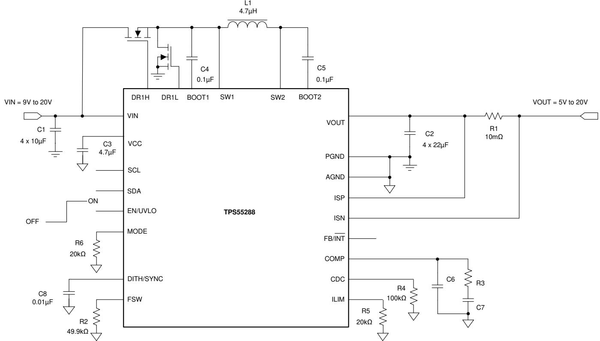  
Figure 8-1. USB PD Power Supply With 9-V to 20-V Input Voltage

# 8.2.1 Design Requirements

The design parameters are listed in Table 8-1:

Table 8-1. Design Parameters   

<table><tr><td rowspan=1 colspan=1> PARAMETERS</td><td rowspan=1 colspan=1>VALUES</td></tr><tr><td rowspan=1 colspan=1>Input voltage</td><td rowspan=1 colspan=1>9Vto 20 V</td></tr><tr><td rowspan=1 colspan=1> Output voltage</td><td rowspan=1 colspan=1>5V to 20V</td></tr><tr><td rowspan=1 colspan=1>Output current limit</td><td rowspan=1 colspan=1>5A</td></tr><tr><td rowspan=1 colspan=1>Output voltage ripple</td><td rowspan=1 colspan=1>±50mV</td></tr><tr><td rowspan=1 colspan=1>Operating mode at light load</td><td rowspan=1 colspan=1>PFM</td></tr></table>

# 8.2.2 USB PD Power Supply Detailed Design Procedure

# 8.2.2.1 Switching Frequency

The switching frequency of the TPS55288 is set by a resistor at the FSW pin. Use Equation 3 to calculate the resistance for the desired frequency. To reduce the switching power loss with such a high current application, a $1 \%$ standard resistor of $4 9 . 9 \mathsf { k } \Omega$ is selected for 400-kHz switching frequency for this application.

# 8.2.2.2 Output Voltage Setting

The TPS55288 has $\mathsf { I 2 C }$ interface to set the internal reference voltage. A microcontroller can easily set the desired output voltage by writing the proper data into the reference voltage registers through ${ \mathsf { I } } ^ { 2 } { \mathsf { C } }$ bus.

# 8.2.2.3 Inductor Selection

Since the selection of the inductor affects steady state operation, transient behavior, and loop stability, the inductor is the most important component in power regulator design. There are three important inductor specifications: inductance, saturation current, and DC resistance.

The TPS55288 is designed to work with inductor values between $1 \ \mu \ H$ and $1 0 ~ \mu \mathsf { H }$ . The inductor selection is based on consideration of both buck and boost modes of operation.

For buck mode, the inductor selection is based on limiting the peak-to-peak current ripple to the maximum inductor current at the maximum input voltage. In CCM, Equation 9 shows the relationship between the inductance and the inductor ripple current.

$$
L = \frac { \big ( \mathsf { V } _ { \mathsf { I N ( M A X ) } } - \mathsf { V } _ { \mathsf { O U T } } \big ) \times \mathsf { V } _ { \mathsf { O U T } } } { \Delta \mathsf { I } _ { \mathsf { L } ( \mathsf { P } \mathrm { - } \mathsf { P } ) } \times \mathsf { f } _ { \mathsf { S W } } \times \mathsf { V } _ { \mathsf { I N ( M A X ) } } }
$$

# where

$\mathsf { V } _ { \mathsf { I N } ( \mathsf { M A X } ) }$ is the maximum input voltage   
$\mathsf { V } _ { \mathsf { O U T } }$ is the output voltage   
$\Delta \mathsf { I } _ { \mathsf { L } ( \mathsf { P } - \mathsf { P } ) }$ is the peak to peak ripple current of the inductor   
$\mathsf { f } _ { \mathsf { S W } }$ is the switching frequency

For a certain inductor, the inductor ripple current achieves maximum value when VOUT equals half of the maximum input voltage. Choosing higher inductance gets smaller inductor current ripple while smaller inductance gets larger inductor current ripple.

For boost mode, the inductor selection is based on limiting the peak-to-peak current ripple to the maximum inductor current at the maximum output voltage. In CCM, Equation 10 shows the relationship between the inductance and the inductor ripple current.

$$
\mathsf { L } = \frac { \mathsf { V } _ { \mathsf { I N } } \times \left( \mathsf { V } _ { \mathsf { O U T } ( \mathsf { M A X } ) } - \mathsf { V } _ { \mathsf { I N } } \right) } { \Delta \mathsf { I } _ { \mathsf { L } ( \mathsf { P } - \mathsf { P } ) } \times \mathsf { f } _ { \mathsf { S W } } \times \mathsf { V } _ { \mathsf { O U T } ( \mathsf { M A X } ) } }
$$

# where

$V _ { \mathsf { I N } }$ is the input voltage • $\mathsf { V } _ { \mathsf { O U T } ( \mathsf { M A X } ) }$ is the maximum output voltage $\Delta \mathsf { I } _ { \mathsf { L } ( \mathsf { P } - \mathsf { P } ) }$ is the peak to peak ripple current of the inductor $\mathsf { f } _ { \mathsf { S W } }$ is the switching frequency

For a certain inductor, the inductor ripple current achieves maximum value when $V _ { \mathsf { I N } }$ equals to the half of the maximum output voltage. Choosing higher inductance gets smaller inductor current ripple while smaller inductance gets larger inductor current ripple.

For this application example, a $4 . 7 – \mu \ H$ inductor is selected, which produces approximate maximum inductor current ripple of $50 \%$ of the highest average inductor current in buck mode and $50 \%$ of the highest average inductor current in boost mode.

In buck mode, the inductor DC current equals to the output current. In boost mode, the inductor DC current can be calculated with Equation 11.

$$
| \mathsf { \Pi } _ { \mathsf { L } ( \mathsf { D C } ) } = \frac { \mathsf { V } _ { \mathsf { O U T } } \times \mathsf { I } _ { \mathsf { O U T } } } { \mathsf { V } _ { \mathsf { I N } } \times \mathsf { I } }
$$

# where

• $\mathsf { V } _ { \mathsf { O U T } }$ is the output voltage IOUT is the output current $V _ { \mathsf { I N } }$ is the input voltage $\boldsymbol { \mathsf { n } }$ is the power conversion efficiency

For a given maximum output current of the buck-boost converter TPS55288, the maximum inductor DC current happens at the minimum input voltage and maximum output voltage. Set the inductor current limit of the TPS55288 higher than the calculated maximum inductor DC current to make sure the TPS55288 has the desired output current capability.

In boost mode, the inductor ripple current is calculated with Equation 12.

$$
\Delta \mathsf { I } _ { \mathsf { L } ( \mathsf { P - P } ) } \mathrm { = } \frac { \mathsf { V } _ { \mathsf { I N } } \times ( \mathsf { V } _ { \mathsf { O U T } } - \mathsf { V } _ { \mathsf { I N } } ) } { \mathsf { L } \times \mathsf { f } _ { \mathsf { S W } } \times \mathsf { V } _ { \mathsf { O U T } } }
$$

# where

$\Delta \mathsf { I } _ { \mathsf { L } ( \mathsf { P } - \mathsf { P } ) }$ is the inductor ripple current L is the inductor value fSW is the switching frequency $\mathsf { V } _ { \mathsf { O U T } }$ is the output voltage $V _ { \mathsf { I N } }$ is the input voltage

Therefore, the inductor peak current is calculated with Equation 13.

$$
A _ { \mathsf { L } ( \mathsf { P } ) } = \mathsf { I } _ { \mathsf { L } ( \mathsf { D C } ) } + \frac { \Delta \mathsf { I } _ { \mathsf { L } ( \mathsf { P } - \mathsf { P } ) } } { 2 }
$$

Normally, it is advisable to work with an inductor peak-to-peak current of less than $40 \%$ of the average inductor current for maximum output current. A smaller ripple from a larger valued inductor reduces the magnetic hysteresis losses in the inductor and EMI, but in the same way, load transient response time is increased. The selected inductor must have higher saturation current than the calculated peak current.

The conversion efficiency is dependent on the resistance of its current path. The switching loss associated with the switching MOSFETs, and the inductor core loss. Therefore, the overall efficiency is affected by the inductor

DC resistance (DCR), equivalent series resistance (ESR) at the switching frequency, and the core loss. Table 8-2 lists recommended inductors for the TPS55288. In this application example, the Coilcraft inductor XAL1010-472 is selected for its small size, high saturation current, and small DCR.

Table 8-2. Recommended Inductors   

<table><tr><td rowspan=1 colspan=1> PART NUMBER</td><td rowspan=1 colspan=1>L(uH)</td><td rowspan=1 colspan=1>DCR(MAXIMUM)(mΩ)</td><td rowspan=1 colspan=1> SATURATION CURRENT / HEAT RATING CURRENT (A)</td><td rowspan=1 colspan=1> SIZE (L x W x H mm)</td><td rowspan=1 colspan=1>(VENDOR</td></tr><tr><td rowspan=1 colspan=1>XAL1010-472ME</td><td rowspan=1 colspan=1>4.7</td><td rowspan=1 colspan=1>10</td><td rowspan=1 colspan=1>25.4/17.5</td><td rowspan=1 colspan=1>11.3 × 10 ×10</td><td rowspan=1 colspan=1>Coilcraft</td></tr><tr><td rowspan=1 colspan=1>IHLP5050EZER4R7</td><td rowspan=1 colspan=1>4.7</td><td rowspan=1 colspan=1>10.1</td><td rowspan=1 colspan=1>17.8/15.3</td><td rowspan=1 colspan=1>13.5 × 12.9 × 5</td><td rowspan=1 colspan=1>Vishay</td></tr><tr><td rowspan=1 colspan=1>125CDMCCDS-4R7MC</td><td rowspan=1 colspan=1>4.7</td><td rowspan=1 colspan=1>10</td><td rowspan=1 colspan=1>22/14</td><td rowspan=1 colspan=1>13.5 × 12.6×5</td><td rowspan=1 colspan=1>Sumida</td></tr></table>

(1) See the Third-party Products disclaimer.

# 8.2.2.4 Input Capacitor

In buck mode, the input capacitor supplies high ripple current. The RMS current in the input capacitors is given by Equation 14.

$$
| \mathsf { \Gamma } _ { \mathsf { C I N } ( \mathsf { R M S } ) } = \mathsf { I } _ { \mathsf { O U T } } \times \sqrt { \frac { \mathsf { V } _ { \mathsf { O U T } } \times ( \mathsf { V } _ { \mathsf { I N } } - \mathsf { V } _ { \mathsf { O U T } } ) } { \mathsf { V } _ { \mathsf { I N } } \times \mathsf { V } _ { \mathsf { I N } } } }
$$

where

• ICIN(RMS) is the RMS current through the input capacitor • IOUT is the output current

The maximum RMS current occurs at the output voltage is half of the input voltage, which gives $\mathsf { I } _ { \mathsf { C I N } ( \mathsf { R M S } ) } = \mathsf { I } _ { \mathsf { O U T } } /$ 2. Ceramic capacitors are recommended for their low ESR and high ripple current capability. A total of $2 0 ~ \mu \mathsf { F }$ effective capacitance is a good starting point for this application.

# 8.2.2.5 Output Capacitor

In boost mode, the output capacitor conducts high ripple current. The output capacitor RMS ripple current is given by Equation 15, where the minimum input voltage and the maximum output voltage correspond to the maximum capacitor current.

$$
\mathsf { I } _ { \mathsf { C O U T } ( \mathsf { R M S } ) } = \mathsf { I } _ { \mathsf { O U T } } \times \sqrt { \frac { \mathsf { V } _ { \mathsf { O U T } } } { \mathsf { V } _ { \mathsf { I N } } } } - 1
$$

# where

• ICOUT(RMS) is the RMS current through the output capacitor • IOUT is the output current

In this example, the maximum output ripple RMS current is 5.5 A.

The ESR of the output capacitor causes an output voltage ripple given by Equation 16 in boost mode.

$$
V _ { \mathsf { R I P P L E ( E S R ) } } = \frac { \mathsf { I _ { O U T } } \times \mathsf { V _ { O U T } } } { \mathsf { V _ { I N } } } \times \mathsf { R _ { C O U T } }
$$

where

# • RCOUT is the ESR of the output capacitance

The capacitance also causes a capacitive output voltage ripple given by Equation 17 in boost mode. When input voltage reaches the minimum value and the output voltage reaches the maximum value, there is the largest output voltage ripple caused by the capacitance.

$$
V _ { \mathsf { R I P P L E ( C A P ) } } = \frac { \mathsf { I _ { O U T } } \times \left( 1 - \frac { \mathsf { V _ { I N } } } { \mathsf { V _ { O U T } } } \right) } { \mathsf { C _ { O U T } } \times \mathsf { f _ { S W } } }
$$

Typically, a combination of ceramic capacitors and bulk electrolytic capacitors is needed to provide low ESR, high ripple current, and small output voltage ripple. From the required output voltage ripple, use Equation 16 and Equation 17 to calculate the minimum required effective capacitance of the ${ \mathsf { C o u r } }$ .

# 8.2.2.6 Output Current Limit

The output current limit is implemented by putting a current sense resistor between the ISP and ISN pins along with setting a limit voltage between the ISP pin and the ISN pin through register 02h. The maximum value of the limit voltage between the ISP and ISN pins is $6 3 . 5 ~ \mathsf { m V } .$ The default limit voltage is $5 0 ~ \mathsf { m V } .$ The current sense resistor between the ISP and ISN pins should be selected to ensure that the output current limit is set high enough for output. The output current limit setting resistor is given by Equation 18.

$$
\mathsf { R } _ { \mathsf { S N S } } = \frac { \mathsf { V } _ { \mathsf { S N S } } } { \mathsf { I } _ { \mathsf { O U T \_ L I M I T } } }
$$

where

• $\mathsf { V } _ { \mathsf { S N S } }$ is the current limit setting voltage between the ISP and ISN pins • IOUT_LIMIT is the desired output current limit

Because the power dissipation is large, make sure the current sense resistor has enough power dissipation capability with large package.

# 8.2.2.7 Loop Stability

The TPS55288 uses average current control scheme. The inner current loop uses internal compensation and requires the inductor value must be larger than $1 . 2 / \mathfrak { f } _ { \mathsf { S W } }$ . The outer voltage loop requires an external compensation. The COMP pin is the output of the internal voltage error amplifier. An external compensation network comprised of resistor and ceramic capacitors is connected to the COMP pin.

The TPS55288 operates in buck mode or boost mode. Therefore, both buck and boost operating modes require loop compensations. The restrictive one of both compensations is selected as the overall compensation from a loop stability point of view. Typically for a converter designed either work in buck mode or boost mode, the boost mode compensation design is more restrictive due to the presence of a right half plane zero (RHPZ).

The power stage in boost mode can be modeled by Equation 19.

$$
\mathsf { G } _ { \mathsf { P S } } ( \mathsf { s } ) = \frac { \mathsf { R } _ { \mathsf { L O A D } } \times ( 1 - \mathsf { D } ) } { 2 \times \mathsf { R } _ { \mathsf { S E N S E } } } \times \frac { \left( 1 + \frac { \mathsf { s } } { 2 \pi \times \mathsf { f } _ { \mathsf { E S R Z } } } \right) \times \left( 1 - \frac { \mathsf { s } } { 2 \pi \times \mathsf { f } _ { \mathsf { R H P Z } } } \right) } { 1 + \frac { \mathsf { s } } { 2 \pi \times \mathsf { f } _ { \mathsf { P } } } }
$$

where

• $\mathsf { R } _ { \mathsf { L O A D } }$ is the output load resistance D is the switching duty cycle in boost mode   
RSENSE is the equivalent internal current sense resistor, which is 0.055 Ω

The power stage has two zeros and one pole generated by the output capacitor and load resistance. Use Equation 20 to Equation 22 to calculate them.

$$
\mathsf { f } _ { \mathsf { P } } = \frac { 2 } { 2 \pi \times \mathsf { R } _ { \mathsf { L O A D } } \times \mathsf { C } _ { \mathsf { O U T } } }
$$

The internal transconductance amplifier together with the compensation network at the COMP pin constitutes the control portion of the loop. The transfer function of the control portion is shown by Equation 23.

$$
\mathsf { G } _ { \mathtt { C } } ( \mathsf { S } ) = \frac { \mathsf { G } _ { \mathtt { E A } } \times \mathsf { R } _ { \mathsf { E A } } \times \mathsf { V } _ { \mathtt { R E F } } } { \mathsf { V } _ { \mathtt { O U T } } } \times \frac { \left( 1 + \frac { \mathsf { S } } { 2 \pi \times \mathsf { f } _ { \mathtt { C O M P } } } \right) } { \left( 1 + \frac { \mathsf { S } } { 2 \pi \times \mathsf { f } _ { \mathtt { C O M P } 1 } } \right) \times \left( 1 + \frac { \mathsf { S } } { 2 \pi \times \mathsf { f } _ { \mathtt { C O M P } 2 } } \right) }
$$

where

$\mathsf { G } _ { \mathsf { E A } }$ is the transconductance of the error amplifier $\mathsf { R } _ { \mathsf { E A } }$ is the output resistance of the error amplifier VREF is the reference voltage input to the error amplifier $\mathsf { V } _ { \mathsf { O U T } }$ is the output voltage • fCOMP1 and fCOMP2 are the pole’s frequency of the compensation network • fCOMZ is the zero’s frequency of the compensation network

The total open-loop gain is the product of $\mathsf { G } _ { \mathsf { P S } } ( \mathsf { s } )$ and ${ \sf G } _ { \sf C } ( { \sf s } )$ . The next step is to choose the loop crossover frequency, $\mathsf { f } _ { \mathsf { C } }$ , at which the total open-loop gain is 1, namely 0 dB. The higher in frequency that the loop gain stays above 0 dB before crossing over, the faster the loop response. It is generally accepted that the loop gain cross over 0 dB at the frequency no higher than the lower of either $\boldsymbol { 1 } / \boldsymbol { 1 0 }$ of the switching frequency, $\mathsf { f } _ { \mathsf { S W } }$ or 1/5 of the RHPZ frequency, fRHPZ.

Then, set the value of $\mathsf { R } _ { \mathsf { C } } , \mathsf { C } _ { \mathsf { C } }$ and $C _ { \mathsf { P } }$ by Equation 24 to Equation 26.

$$
\mathsf { R } _ { \mathsf { C } } = \frac { 2 \pi \times \mathsf { V } _ { \mathrm { O U T } } \times \mathsf { R } _ { \mathsf { S E N S E } } \times \mathsf { C } _ { \mathrm { O U T } } \times \mathsf { f } _ { \mathsf { C } } } { ( 1 \cdot \mathsf { D } ) \times \mathsf { V } _ { \mathsf { R E F } } \times \mathsf { G } _ { \mathsf { E A } } }
$$

where

• $\mathsf { f } _ { \mathsf { C } }$ is the selected crossover frequency

$$
\begin{array} { r } { \mathsf { C } _ { \mathsf { C } } = \frac { \mathsf { R } _ { \mathsf { L O A D } } \times \mathsf { C } _ { \mathsf { O U T } } } { 2 \times \mathsf { R } _ { \mathsf { C } } } } \\ { \mathsf { C } _ { \mathsf { P } } = \frac { \mathsf { R } _ { \mathsf { C O U T } } \times \mathsf { C } _ { \mathsf { O U T } } } { \mathsf { R } _ { \mathsf { C } } } } \end{array}
$$

If the calculated $C _ { \mathsf { P } }$ is less than 10 pF, it can be left open.

Designing the loop for greater than $4 5 ^ { \circ }$ of phase margin and greater than 10-dB gain margin eliminates output voltage ringing during the line and load transient.

# TPS55288 36-V, 16-A Buck-boost Converter with I2C Interface

# 1 Features

• Programmable power supply (PPS) support for USB power delivery (USB PD)

Wide input voltage range: 2.7 V to 36 V Programmable output voltage range: $0 . 8 \vee$ to $_ { 2 2 \vee }$ with $2 0 \mathrm { - m V }$ step $\pm 1 \%$ reference voltage accuracy Adjustable output voltage compensation for voltage droop over the cable Programmable output current limit up to 6.35 A with 50-mA step $\pm 5 \%$ accurate output current monitoring – $\mathsf { I 2 C }$ interface

• High efficiency over entire load range $9 7 \%$ efficiency at $\mathsf { V } _ { \mathsf { I N } } = 1 2 \mathsf { V } ,$ ${ \mathsf { V } } _ { \mathsf { O U T } } = 2 0 { \mathsf { V } }$ and $\mathsf { I } _ { \mathsf { O U T } } = 3 \ .$ A Programmable PFM and FPWM mode at light load

• Avoid frequency interference and crosstalk – Optional clock synchronization Programmable switching frequency from 200 kHz to 2.2 MHz

EMI mitigation – Optional programmable spread spectrum – Lead-less package

• Rich protection features

Output overvoltage protection   
Hiccup mode for output short-circuit protection   
Thermal shutdown protection   
Programmable average inductor current limit up   
to 16 A

• Small solution size

– Maximum switching frequency up to 2.2 MHz – $4 . 0 \mathrm { - } \mathsf { m m } \times 3 . 5 \mathrm { - } \mathsf { m m }$ Hotrod™ QFN package • Fixed 4-ms soft-start time

Create a custom design using the TPS55288 with the WEBENCH® Power Designer

# 2 Applications

USB PD   
Docking station   
Industrial PC   
Power bank   
Monitor   
Wireless charger

# 3 Description

The TPS55288 is a synchronous four-switch buckboost converter capable of regulating the output voltage at, above, or below the input voltage. The TPS55288 operates over $2 . 7 . \mathrm { V }$ to 36-V wide input voltage and capable of outputing $0 . 8 – \lor$ to 22-V voltage to support a variety of applications.

The TPS55288 integrates two 16-A MOSFETs of the boost leg to balance the solution size and efficiency. With the programmable output voltage and output current limit through ${ \mathsf { I } } ^ { 2 } { \mathsf { C } }$ interface, the TPS55288 is fully compliant to the USB PD specification. The TPS55288 is capable of delivering 100 W from 12-V input voltage.

The TPS55288 employs average current-mode control scheme. The switching frequency is programmable from 200 kHz to 2.2 MHz by an external resistor and can be synchronized to an external clock. The TPS55288 also provides optional spread spectrum to minimize peak EMI.

The TPS55288 offers output over-voltage protection, average inductor current limit, cycle-by-cycle peak current limit and output short circuit protection. The TPS55288 also ensures safe operating with optional output current limit and hiccup-mode protection in sustained overload conditions.

The TPS55288 can use a small inductor and small capacitors with high switching frequency. It is available in $4 . 0 \mathrm { - } \mathsf { m m } \times 3 . 5 \mathrm { - } \mathsf { m m } \mathsf { Q F N }$ package.

Device Information   

<table><tr><td rowspan=1 colspan=1>PART NUMBER</td><td rowspan=1 colspan=1> PACKAGE((1)</td><td rowspan=1 colspan=1>BODY SIZE</td></tr><tr><td rowspan=1 colspan=1>TPS55288</td><td rowspan=1 colspan=1>VQFN-HR</td><td rowspan=1 colspan=1>4.00 mm × 3.50 mm</td></tr></table>

(1) For all available packages, see the orderable addendum at the end of the data sheet.

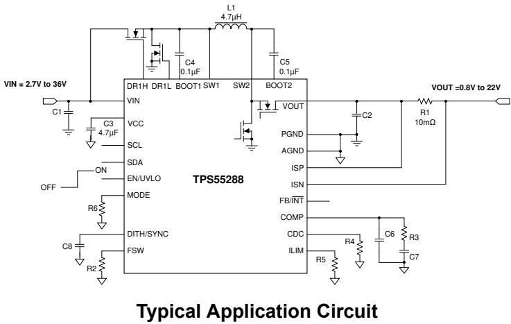

# Table of Contents

# 1 Features...

# 6 Specifications.. 5

6.1 Absolute Maximum Ratings.. 5   
6.2 ESD Ratings... 5   
6.3 Recommended Operating Conditions.. .5   
6.4 Thermal Information.. .6   
6.5 Electrical Characteristics... .6   
$6 . 6 1 ^ { 2 } \mathrm { C }$ Timing Characteristics.. 9   
6.7 Typical Characteristics.. 10

# 7 Detailed Description.. .14

7.1 Overview.. 14   
7.2 Functional Block Diagram.. 15   
7.3 Feature Description.... .15   
7.4 Device Functional Modes.. .22   
$7 . 5 1 ^ { 2 } \mathrm { C }$ Serial Interface. .22   
7.6 Register Maps.. .26

# 8 Application and Implementation.. 35

8.1 Application Information. 35   
8.2 Typical Application.. 35

# 9 Power Supply Recommendations.. .43

10 Layout.. .44   
10.1 Layout Guidelines.. . 44   
10.2 Layout Example... . 45

# 11 Device and Documentation Support.. .46

11.1 Device Support... .46   
11.2 Receiving Notification of Documentation Updates.. 46   
11.3 Support Resources.. 46   
11.4 Trademarks.. 46   
11.5 Electrostatic Discharge Caution.. . 46   
11.6 Glossary..... . 46

# 12 Mechanical, Packaging, and Orderable

Information.. 46

# 4 Revision History

# Changes from Revision A (August 2020) to Revision B (December 2020) Page

• Updated thermal information footnote.. 6   
• Updated Output Current Limit section.. . 21   
Updated CDC Register $( A d d r e s s = 5 h )$ [reset $=$ 11100000h] section.. . 31   
• Updated MODE Register $( A d d r e s s = 6 h ,$ ) [reset $=$ 00100000h] section.. . 32

# Changes from Revision \* (November 2018) to Revision A (August 2020) Page

Changed device status from Advance Information to Production Data.......   
Updated the numbering format for tables, figures and cross-references throughout the document..

# 5 Pin Configuration and Functions

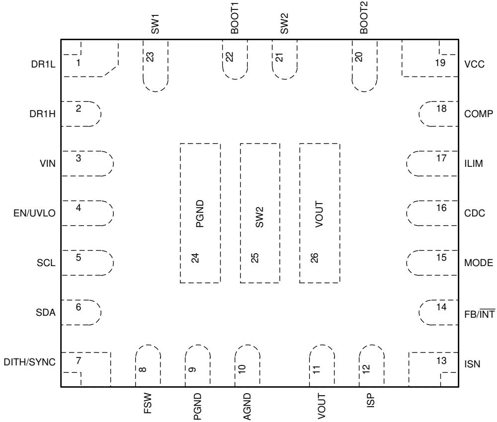  
Figure 5-1. 26-pin VQFN-HR, RPM Package (Transparent Top View)

Table 5-1. Pin Functions   

<table><tr><td rowspan=1 colspan=2> PIN</td><td rowspan=2 colspan=1>/0</td><td rowspan=2 colspan=1>DESCRIPTION</td></tr><tr><td rowspan=1 colspan=1>NO.</td><td rowspan=1 colspan=1> NAME</td></tr><tr><td rowspan=1 colspan=1>1</td><td rowspan=1 colspan=1>DR1L</td><td rowspan=1 colspan=1>0</td><td rowspan=1 colspan=1>Gate driver output for low-side MOSFET in buck side</td></tr><tr><td rowspan=1 colspan=1>2</td><td rowspan=1 colspan=1>DR1H</td><td rowspan=1 colspan=1>0</td><td rowspan=1 colspan=1>Gate driver output for high-side MOSFET in buck side</td></tr><tr><td rowspan=1 colspan=1>3</td><td rowspan=1 colspan=1>VIN</td><td rowspan=1 colspan=1>PWR</td><td rowspan=1 colspan=1>Input power supply for the IC</td></tr><tr><td rowspan=1 colspan=1>4</td><td rowspan=1 colspan=1>EN/UVLO</td><td rowspan=1 colspan=1>一</td><td rowspan=1 colspan=1>Enable logic input and programmable input voltage undervoltage lockout (UVLO) input. Logic highlevel enables the device.Logic low level disables the device and turns it into shutdown mode. Afterthe voltage at the EN/UVLO pin is above the logic high voltage of 1.15 V,this pin acts asprogrammable UVLO input with 1.23-V internal reference.</td></tr><tr><td rowspan=1 colspan=1>5</td><td rowspan=1 colspan=1>SCL</td><td rowspan=1 colspan=1>1</td><td rowspan=1 colspan=1>Clock of I2C interface</td></tr><tr><td rowspan=1 colspan=1>6</td><td rowspan=1 colspan=1>SDA</td><td rowspan=1 colspan=1>1/0</td><td rowspan=1 colspan=1>Data of I2C interface</td></tr><tr><td rowspan=1 colspan=1>7</td><td rowspan=1 colspan=1>DITH/SYNC</td><td rowspan=1 colspan=1>一</td><td rowspan=1 colspan=1>Dithering frequency seting and synchronous clock input. Use a capacitor between this pin andground to set the dithering frequency.When this pin is short to ground or pulled above 1.2 V,there isno dithering function. An external clock can be applied at this pin to synchronize the switchingfrequency.</td></tr><tr><td rowspan=1 colspan=1>8</td><td rowspan=1 colspan=1>FSW</td><td rowspan=1 colspan=1>0</td><td rowspan=1 colspan=1>The switching frequency is programmed by a resistor between this pin and the AGND pin.</td></tr><tr><td rowspan=1 colspan=1>9,24</td><td rowspan=1 colspan=1>PGND</td><td rowspan=1 colspan=1>PWR</td><td rowspan=1 colspan=1>Power ground of the IC. It is connected to the source of the low-side MOSFET.</td></tr><tr><td rowspan=1 colspan=1>10</td><td rowspan=1 colspan=1>AGND</td><td rowspan=1 colspan=1>PWR</td><td rowspan=1 colspan=1>Signal ground of the IC</td></tr><tr><td rowspan=1 colspan=1>11,26</td><td rowspan=1 colspan=1>VOUT</td><td rowspan=1 colspan=1>PWR</td><td rowspan=1 colspan=1>Output of the buck-boost converter</td></tr><tr><td rowspan=1 colspan=1>12</td><td rowspan=1 colspan=1>ISP</td><td rowspan=1 colspan=1></td><td rowspan=1 colspan=1>Positive input of the current sense amplifier.An optional current sense resistor connected betweenthe ISP pin and the ISN pin can limit the output current.If the sensed voltage reaches the currentlimit seting value in the register,a slow constant current control loop becomes active and starts toregulate the voltage between the ISP pin and the ISN pin. Connecting the ISP pin and the ISN pintogether with the VOUT pin can disable the output current limit function.</td></tr></table>

Table 5-1. Pin Functions (continued)   

<table><tr><td rowspan=1 colspan=2>PIN</td><td rowspan=2 colspan=1> 1/0</td><td rowspan=2 colspan=1>DESCRIPTION</td></tr><tr><td rowspan=1 colspan=1>NO.</td><td rowspan=1 colspan=1> NAME</td></tr><tr><td rowspan=1 colspan=1>13</td><td rowspan=1 colspan=1>ISN</td><td rowspan=1 colspan=1>一</td><td rowspan=1 colspan=1>Negative input of the current sense amplifier. An optional current sense resistor connected betweenthe ISP pin and the ISN pin can limit the output current.If the sensed voltage reaches the currentlimit setting value in the register,a slow constant current control loop becomes active and starts toregulate the voltage between the ISP pin and the ISN pin. Connecting the ISP pin and the ISN pintogether with the VOUT pin can disable the output current limit function.</td></tr><tr><td rowspan=1 colspan=1>14</td><td rowspan=1 colspan=1>FB/INT</td><td rowspan=1 colspan=1>1/0</td><td rowspan=1 colspan=1>When the device is set to use external output voltage feedback, connect to the center tap of aresistor divider to program the output voltage.When the device is set to use internal feedback,thispin is a fault indicator output.When there is an internal fault happening,this pin outputs logic lowlevel.</td></tr><tr><td rowspan=1 colspan=1>15</td><td rowspan=1 colspan=1>MODE</td><td rowspan=1 colspan=1>一</td><td rowspan=1 colspan=1>Set the operation modes of the TPS55288 by a resistor between this pin and AGND to select PFMmode,or forced PWM mode in light load condition to select the internal LDO or external 5 Vfor VCC,and to select different I²C address.</td></tr><tr><td rowspan=1 colspan=1>16</td><td rowspan=1 colspan=1>CDC</td><td rowspan=1 colspan=1>0</td><td rowspan=1 colspan=1>Voltage output proportional to the sensed voltage between the ISP pin and the ISN pin. Use aresistor between this pin and AGND to increase the output voltage to compensate voltage droopacross the cable caused by the cable resistance.</td></tr><tr><td rowspan=1 colspan=1>17</td><td rowspan=1 colspan=1>ILIM</td><td rowspan=1 colspan=1>0</td><td rowspan=1 colspan=1>Average inductor current limit setting pin. Connect an external resistor between this pin and theAGND pin.</td></tr><tr><td rowspan=1 colspan=1>18</td><td rowspan=1 colspan=1>COMP</td><td rowspan=1 colspan=1>一</td><td rowspan=1 colspan=1>Output of the internal error amplifier. Connect the loop compensation network between this pin andthe AGND pin.</td></tr><tr><td rowspan=1 colspan=1>19</td><td rowspan=1 colspan=1>vCC</td><td rowspan=1 colspan=1>0</td><td rowspan=1 colspan=1>Output of the internal regulator. A ceramic capacitor of more than 4.7 uF is required between this pinand the AGND pin.</td></tr><tr><td rowspan=1 colspan=1>20</td><td rowspan=1 colspan=1>BOOT2</td><td rowspan=1 colspan=1>0</td><td rowspan=1 colspan=1>Power supply for high-side MOSFET gate driver in boost side.A ceramic capacitor of O.1 uF must beconnected between this pin and the SW2 pin.</td></tr><tr><td rowspan=1 colspan=1>21,25</td><td rowspan=1 colspan=1>SW2</td><td rowspan=1 colspan=1>一</td><td rowspan=1 colspan=1>The switching node pin of the boost side.It is connected to the drain of the internal low-side powerMOSFET and the source of internal high-side power MOSFET.</td></tr><tr><td rowspan=1 colspan=1>22</td><td rowspan=1 colspan=1>BOOT1</td><td rowspan=1 colspan=1>一</td><td rowspan=1 colspan=1>Power supply for high-side MOSFET gate driver in buck side.Aceramic capacitorof 0.1 uF must beconnected between this pin and the SW1 pin.</td></tr><tr><td rowspan=1 colspan=1>23</td><td rowspan=1 colspan=1>SW1</td><td rowspan=1 colspan=1>一</td><td rowspan=1 colspan=1>The switching node pin of the buck side.It is connected to the drain of the external low-side powerMOSFET and the source of external high-side power MOSFET.</td></tr></table>

# 6 Specifications 6.1 Absolute Maximum Ratings

over operating free-air temperature range (unless otherwise noted)(1)

<table><tr><td></td><td></td><td rowspan=1 colspan=1>MIN          MAX</td><td rowspan=1 colspan=1> UNIT</td></tr><tr><td rowspan=8 colspan=1>Voltage rangeat terminals(2)</td><td rowspan=1 colspan=1>VIN, SW1</td><td rowspan=1 colspan=1>-0.3            40</td><td rowspan=1 colspan=1>V</td></tr><tr><td rowspan=1 colspan=1>DRH1, BOOT1</td><td rowspan=1 colspan=1>SW1-0.3        SW1+6</td><td rowspan=1 colspan=1>V</td></tr><tr><td rowspan=1 colspan=1>VCC,DRL1, SCL,SDA,IIM,FSW,COMP,FB/INT,MODE,CDC, DITH/SYNC</td><td rowspan=1 colspan=1>-0.3              6</td><td rowspan=1 colspan=1>V</td></tr><tr><td rowspan=1 colspan=1>VOUT, SW2, ISP, ISN</td><td rowspan=1 colspan=1>-0.3            25</td><td rowspan=1 colspan=1>V</td></tr><tr><td rowspan=1 colspan=1>ISP, ISN</td><td rowspan=1 colspan=1>VOUT-6      VOUT+6</td><td rowspan=1 colspan=1>V</td></tr><tr><td rowspan=1 colspan=1>EN</td><td rowspan=1 colspan=1>-0.3            20</td><td rowspan=1 colspan=1>V</td></tr><tr><td rowspan=1 colspan=1>BOOT2</td><td rowspan=1 colspan=1>SW2-0.3        SW2+6</td><td rowspan=1 colspan=1>V</td></tr><tr><td rowspan=1 colspan=1>DRL1,SCL,SDA,ILIM,FSW,COMP,FB/INT,MODE,CDC, DITH/SYNC</td><td rowspan=1 colspan=1>-0.3      VCC+0.3</td><td rowspan=1 colspan=1>V</td></tr><tr><td rowspan=1 colspan=1>TJ</td><td rowspan=1 colspan=1>Operating Junction,Tj (3)</td><td rowspan=1 colspan=1>-40           150</td><td rowspan=1 colspan=1>℃</td></tr><tr><td rowspan=1 colspan=1>Tstg</td><td rowspan=1 colspan=1>Storage temperature</td><td rowspan=1 colspan=1>-65           150</td><td rowspan=1 colspan=1>℃</td></tr></table>

(1) Stresses beyond those listed under Absolute Maximum Rating may cause permanent damage to the device. These are stress ratings only, which do not imply functional operation of the device at these or any other conditions beyond those indicated under Recommended Operating Condition. Exposure to absolute-maximum-rated conditions for extended periods may affect device reliability.   
(2) All voltage values are with respect to network ground terminal.   
(3) High junction temperatures degrade operating lifetimes. Operating lifetime is de-rated for junction temperatures greater than $1 2 5 ^ { \circ } \mathrm { C }$ .

# 6.2 ESD Ratings

<table><tr><td></td><td></td><td></td><td rowspan=1 colspan=1>VALUE</td><td rowspan=1 colspan=1> UNIT</td></tr><tr><td rowspan=2 colspan=1>V(ESD (1)</td><td rowspan=2 colspan=1>Electrostatic discharge</td><td rowspan=1 colspan=1>Human body model (HBM) ESD stress voltage(2)</td><td rowspan=1 colspan=1>±2000</td><td rowspan=2 colspan=1>V</td></tr><tr><td rowspan=1 colspan=1>Charged device model (CDM) ESD stressvoltage(3)</td><td rowspan=1 colspan=1>±500</td></tr></table>

(1) Electrostatic discharge (ESD) to measure device sensitivity and immunity to damage caused by assembly line electrostatic discharges in to the device.   
(2) Level listed above is the passing level per ANSI, ESDA, and JEDEC JS-001. JEDEC document JEP155 states that 500-V HBM allows safe manufacturing with a standard ESD control process.   
(3) Level listed above is the passing level per EIA-JEDEC JESD22-C101. JEDEC document JEP157 states that 250-V CDM allows safe manufacturing with a standard ESD control process.

# 6.3 Recommended Operating Conditions

over operating free-air temperature range (unless otherwise noted)

<table><tr><td colspan="2"></td><td>MIN</td><td>NOM</td><td>MAX</td><td> UNIT</td></tr><tr><td>ViN</td><td>Input voltage range</td><td>2.7</td><td></td><td>36</td><td>v</td></tr><tr><td>VouT</td><td>Output voltage range</td><td>0.8</td><td></td><td>22</td><td>V</td></tr><tr><td>L</td><td>Effective inductance range</td><td>0.7</td><td>4.7</td><td>13</td><td>H</td></tr><tr><td>CIN</td><td>Effective input capacitance range</td><td>4.7</td><td>22</td><td></td><td>uF</td></tr><tr><td>CouT</td><td>Effective output capacitance range</td><td>10</td><td>100</td><td>1000</td><td>uF</td></tr><tr><td>T</td><td>Operating junction temperature</td><td>-40</td><td></td><td>125</td><td>℃</td></tr></table>

# 6.4 Thermal Information

<table><tr><td rowspan=3 colspan=2>THERMAL METRIC(1)</td><td rowspan=1 colspan=1>TPS55288</td><td rowspan=1 colspan=1>TPS55288</td><td rowspan=3 colspan=1> UNIT</td></tr><tr><td rowspan=1 colspan=1>VQFN-HR (RPM)-26 PINS</td><td rowspan=1 colspan=1>VQFN-HR (RPM)-26 PINS</td></tr><tr><td rowspan=1 colspan=1> Standard</td><td rowspan=1 colspan=1>EVM(2)</td></tr><tr><td rowspan=1 colspan=1>ReJA</td><td rowspan=1 colspan=1>Junction-to-ambient thermal resistance</td><td rowspan=1 colspan=1>47.5</td><td rowspan=1 colspan=1>25.8</td><td rowspan=1 colspan=1>C/W</td></tr><tr><td rowspan=1 colspan=1>ReJc(top)</td><td rowspan=1 colspan=1>Junction-to-case (top) thermal resistance</td><td rowspan=1 colspan=1>23.8</td><td rowspan=1 colspan=1>N/A</td><td rowspan=1 colspan=1>C/W</td></tr><tr><td rowspan=1 colspan=1>ReJB</td><td rowspan=1 colspan=1>Junction-to-board thermal resistance</td><td rowspan=1 colspan=1>12.8</td><td rowspan=1 colspan=1>N/A</td><td rowspan=1 colspan=1>C/W</td></tr><tr><td rowspan=1 colspan=1>JT</td><td rowspan=1 colspan=1>Junction-to-top characterization parameter</td><td rowspan=1 colspan=1>0.5</td><td rowspan=1 colspan=1>0.6</td><td rowspan=1 colspan=1>C/W</td></tr><tr><td rowspan=1 colspan=1>JB</td><td rowspan=1 colspan=1>Junction-to-board characterization parameter</td><td rowspan=1 colspan=1>12.7</td><td rowspan=1 colspan=1>11.6</td><td rowspan=1 colspan=1>C/W</td></tr><tr><td rowspan=1 colspan=1>ReJc(bot)</td><td rowspan=1 colspan=1>Junction-to-case (bottom) thermal resistance</td><td rowspan=1 colspan=1>7.8</td><td rowspan=1 colspan=1>N/A</td><td rowspan=1 colspan=1>C/W</td></tr></table>

(1) For more information about traditional and new thermal metrics, see the Semiconductor and IC Package Thermal Metrics application report.   
(2) Measured on TPS55288EVM-045, 4-layer, $2 { - } 0 z / 2 { - } 0 z / 2 { - } 0 z / 2 { - } 0 z$ copper $1 1 2 - m m \times 7 1 - m m \cdot$ PCB.

# 6.5 Electrical Characteristics

$\mathsf { T } _ { \mathsf { J } } = - 4 0 ^ { \circ } \mathsf { C }$ to $1 2 5 ^ { \circ } \mathrm { C }$ , $\mathsf { V } _ { \mathsf { I N } } = 1 2 \ : \mathsf { V }$ and ${ \mathsf { V } } _ { \mathsf { O U T } } = 2 0 { \mathsf { V } } .$ . Typical values are at ${ \bar { \mathsf { T } } } _ { \mathsf { J } } = 2 5 ^ { \circ } { \mathsf { C } }$ , unless otherwise noted.   

<table><tr><td colspan="2">VIN PARAMETER</td><td>TEST CONDITIONS</td><td>MIN</td><td>TYP</td><td>MAX</td><td> UNIT</td></tr><tr><td colspan="2">POWER SUPPLY</td><td></td><td></td><td></td><td></td><td></td></tr><tr><td colspan="2">Input voltage range</td><td></td><td>2.7</td><td></td><td>36</td><td>v</td></tr><tr><td>VIN</td><td></td><td>ViN rising</td><td>2.8</td><td>2.9</td><td>3.0</td><td>V</td></tr><tr><td rowspan="2">VvIN_UVLO</td><td rowspan="2">Under voltage lockout threshold</td><td>Vi falling</td><td>2.6</td><td>2.65</td><td>2.7</td><td>v</td></tr><tr><td>IC enabled,nooad,noswitchingV Quiescent current into the VIN pin =3Vto24VUV +0.1V,RFsw=100kΩ,Tj up to 125C</td><td></td><td>760</td><td>860</td><td>uA</td></tr><tr><td>lQ</td><td>Quiescent current into the VOUT pin</td><td>IC enabled,noadiing =2.9V,VOU=3Vo20VV=VEF + 0.1V,RFsw=100kΩ,Tjup to 125C</td><td></td><td>760</td><td>860</td><td>uA</td></tr><tr><td>sD</td><td>Shutdown current into the VIN pin</td><td>IC disabled,Vin =2.9Vto14V,Tup to 125℃</td><td></td><td>6.8</td><td>10</td><td>A</td></tr><tr><td>Vcc</td><td>Internal regulator output</td><td>Ivcc = 50mA,Vin =8V,VoU = 20V</td><td>5.0</td><td>5.2</td><td>5.4</td><td>v</td></tr><tr><td>Vcc_DO</td><td>vcC dropout</td><td>ViN = 5.0VVouT =20Vlvcc=60mA</td><td></td><td>200</td><td>320</td><td>mV</td></tr><tr><td>EN/UVLO</td><td></td><td>VIN = 14V,Vout = 5.OV,Ivcc= 60mA</td><td></td><td>110</td><td>170</td><td>mV</td></tr><tr><td colspan="7"></td></tr><tr><td>VEN_H</td><td>EN Logic high threshold</td><td>Vcc = 2.7V to 5.5V</td><td></td><td></td><td>1.15</td><td>v</td></tr><tr><td>VENL</td><td>EN Logic low threshold</td><td>Vcc = 2.7V to 5.5V</td><td>0.4</td><td></td><td></td><td>v</td></tr><tr><td>VEN_HYS</td><td>Enable threshold hysteresis</td><td>Vcc = 2.7V to 5.5V</td><td>0.05</td><td>0.12</td><td></td><td>V</td></tr><tr><td>VuvLO</td><td>UVLO rising threshold at the EN/UVLO pin</td><td>Vcc = 3.0V to 5.5V</td><td>1.20</td><td>1.23</td><td>1.26</td><td>V</td></tr><tr><td>VuvLO_HYS</td><td>UVLO threshold hysteresis</td><td>Vcc = 3.0V to 5.5V</td><td>8</td><td>14</td><td>20</td><td>mV</td></tr><tr><td>uvLo</td><td>Sourcing current at the EN/UVLO pin</td><td>VEN/UVLO = 1.3V</td><td>4.5</td><td>5</td><td>5.5</td><td>UA</td></tr><tr><td colspan="7">OUTPUT</td></tr><tr><td>VoUT</td><td>Output voltage range</td><td></td><td>0.8</td><td></td><td>22</td><td>v</td></tr><tr><td>VovP</td><td>Output overvoltage protection threshold</td><td></td><td>22.5</td><td>23.5</td><td>24.5</td><td>V</td></tr><tr><td>VoVP_HYS</td><td>Over voltage protection hysteresis</td><td></td><td></td><td>1</td><td></td><td>v</td></tr><tr><td>IFB_LKG</td><td>Leakage current at the FB pin</td><td>Tj up to 125℃</td><td></td><td></td><td>100</td><td>nA</td></tr><tr><td>IvoUT_LKG</td><td>Leakage current into the VOUT pin</td><td>IC disabled,Vou=20V,Vsw2OV Tj up to 125C</td><td></td><td>1</td><td>20</td><td>uA</td></tr><tr><td>IDISCHG</td><td>Output discharge current</td><td>VoUT = 20V,Vcc = 5.2V</td><td>40</td><td>100</td><td>170</td><td>mA</td></tr><tr><td colspan="7">www.ti.com SLVSF01B-NOVEMBER2018-REVISEDDECEMBER2020</td></tr><tr><td colspan="7">TJ =-40°C to 125C,Vin = 12 Vand Vout = 20 V. Typical values are at Tj = 25C, unless otherwise noted.</td></tr><tr><td colspan="3">PARAMETER TEST CONDITIONS</td><td colspan="3">MIN TYP MAX</td><td> UNIT</td></tr><tr><td>Resolution of reference voltage DAC</td><td colspan="2"></td><td></td><td>10</td><td></td><td>bits</td></tr><tr><td>INL</td><td colspan="2">Integral non-linearity</td><td>-4</td><td></td><td>4</td><td>LSB</td></tr><tr><td>DNL</td><td rowspan="3">Differential non-linearity</td><td>VOUT_FS=03h, REF=03C0h,</td><td>-1</td><td></td><td>2</td><td>LSB</td></tr><tr><td rowspan="3">Output voltage when VREF is set to VoUT_FULL 1.129V</td><td>VREF=1.129V</td><td>19.7</td><td>20</td><td>20.3</td><td>V</td></tr><tr><td>VOUT_FS=02h,REF=03C0h, VREF=1.129V</td><td>14.78</td><td>15</td><td>15.22</td><td>V</td></tr><tr><td>VOUT_FS=01h, REF=03C0h, VREF=1.129V VOUT_FS=00h,REF=03C0h,</td><td>9.85</td><td>10</td><td>10.15</td><td>V</td></tr><tr><td rowspan="5">VOUT_ZERO</td><td rowspan="5">Output voltage when VREF is set to 45mV</td><td>VREF=1.129V VOUT_FS=03h,REF=0000h,</td><td>4.93</td><td>5</td><td>5.07</td><td>V</td></tr><tr><td>VREF=45mV VOUT_FS=02h,REF=0000h,</td><td>0.74</td><td>0.8</td><td>0.86</td><td>V</td></tr><tr><td>VREF=45mV VOUT_FS=01h,REF=0000h,</td><td>0.56</td><td>0.6</td><td>0.64</td><td>V</td></tr><tr><td>VREF=45mV</td><td>0.37</td><td>0.4</td><td>0.43</td><td>V</td></tr><tr><td>VOUT_FS=00h,REF=0000h, VREF=45mV</td><td>0.18</td><td>0.2</td><td>0.22</td><td>V</td></tr><tr><td colspan="2">REFERENCEVOLTAGE</td><td colspan="5"></td></tr><tr><td rowspan="3">VREF</td><td rowspan="3">Reference voltage at the FB/INT pin when using external feedback</td><td>External feedback with REF=03C0h</td><td>1.117</td><td>1.129</td><td>1.141</td><td></td></tr><tr><td>External feedback with REF=02C6h</td><td>0.837</td><td>0.846</td><td>0.855</td><td>v v</td></tr><tr><td>External feedback with REF=019Ah</td><td>0.502</td><td>0.508</td><td>0.514</td><td>v</td></tr><tr><td></td><td></td><td>External feedback with REF=00D2h</td><td>0.276</td><td>0.282</td><td>0.288</td><td>v</td></tr><tr><td colspan="7">POWER SWITCH Low-side MOSFET on resistance on</td></tr><tr><td>RDs(on)</td><td>boost side High-side MOSFET on resistance on</td><td>Vout = 20V, Vcc= 5.2V</td><td></td><td>7.1</td><td></td><td>mΩ</td></tr><tr><td>INTERNAL CLOCK</td><td>boost side</td><td>Vout = 20V, Vcc= 5.2V</td><td></td><td>7.6</td><td></td><td>mΩ</td></tr><tr><td colspan="7"></td></tr><tr><td>fsw</td><td>Switching frequency</td><td>RFsw = 100kΩ</td><td>180</td><td>200</td><td>220</td><td>KHz</td></tr><tr><td></td><td></td><td>RFsw = 9.09kΩ</td><td>2000</td><td>2200</td><td>2400</td><td>KHz</td></tr><tr><td>toFF_min</td><td>Min. off time Min. on time</td><td>Boost mode</td><td></td><td>100</td><td>145</td><td>ns</td></tr><tr><td>toN_min VFsW</td><td>Voltage at the FSW pin</td><td>Buck mode</td><td></td><td>90</td><td>130</td><td>ns</td></tr><tr><td>CURRENT LIMIT</td><td colspan="2"></td><td></td><td>1</td><td></td><td>v</td></tr><tr><td rowspan="5">ILIM_AVG</td><td rowspan="5">Average inductor current limit</td><td>RILIM = 20kΩ,VI=8VV2V fsw= 400kHz,FPWM</td><td>14</td><td>16.5</td><td>19</td><td>A</td></tr><tr><td>RILIM = 20kQ,ViN= 8VVOU=20V fsw=400kHz,PFM</td><td>14</td><td>16.5</td><td>19</td><td>A</td></tr><tr><td>RILIM = 60kΩ,Vi=5VV14V fsw= 2.2MHz,FPWM</td><td>4</td><td>5.5</td><td></td><td>A</td></tr><tr><td>RILIM =60kQV=5VV fsw=2.2MHz,PFM</td><td>4</td><td>5.5</td><td></td><td>A</td></tr><tr><td>RILIM =20kΩ,VI=8VV2V fsw=400kHz,FPWM</td><td></td><td>25</td><td></td><td>A</td></tr><tr><td>ILIM_PK</td><td>Peak inductor current limit at high side</td><td>RILIM =20kQV=8VV=2V fsw= 400kHz, PFM</td><td></td><td>25</td><td></td><td>A</td></tr><tr><td>VILIM</td><td>Voltage at the ILIM pin</td><td>VOUT = 3V</td><td></td><td>0.6</td><td></td><td>v</td></tr></table>

<table><tr><td rowspan=2 colspan=6>Tj = -40°C to 125C, Vin = 12 Vand Vout = 20 V. Typical values are at Tj = 25C, unless otherwise noted.PARAMETER                            TEST CONDITIONS            MIN   TYP  MAX   UNIT</td></tr><tr><td rowspan=1 colspan=2>PARAMETER</td><td rowspan=1 colspan=1>TEST CONDITIONS</td><td rowspan=1 colspan=1>MIN   TYP  MAX</td><td rowspan=1 colspan=1>UNIT</td></tr><tr><td rowspan=2 colspan=1></td><td rowspan=2 colspan=1>VsNS</td><td rowspan=2 colspan=1>Current loop regulation voltagebetween the ISP and ISN pins</td><td rowspan=1 colspan=1>VisN=2V to 21V,IOUT_LIMITRegister= 11100100b</td><td rowspan=1 colspan=1>48    50    52</td><td rowspan=1 colspan=1>mV</td></tr><tr><td rowspan=1 colspan=1>VisN= 2Vto21VIOUT_LIMITRegister= 10111100b</td><td rowspan=1 colspan=1>28    30    32</td><td rowspan=1 colspan=1>mV</td></tr><tr><td></td><td rowspan=1 colspan=1>CABLE VOLT</td><td rowspan=1 colspan=1>CABLE VOLTAGE DROOP COMPENSATION</td><td rowspan=1 colspan=1></td><td rowspan=1 colspan=1></td><td rowspan=1 colspan=1></td></tr><tr><td></td><td rowspan=2 colspan=1>VcDC</td><td rowspan=2 colspan=1>Voltage at he CDC pin</td><td rowspan=1 colspan=1>RcDC=20korfatingVs50mV</td><td rowspan=1 colspan=1>0.95      1  1.05</td><td rowspan=1 colspan=1>V</td></tr><tr><td></td><td rowspan=1 colspan=1>RcDc=20Q orflatingVsVis2mV</td><td rowspan=1 colspan=1>40    75</td><td rowspan=1 colspan=1>mV</td></tr><tr><td></td><td rowspan=4 colspan=1>VoUT_CDC</td><td rowspan=4 colspan=1>vOUT increase for cable droopcompensation</td><td rowspan=1 colspan=1>Internal output feedback,CDC[2:0]=111,Visp-Vis=5mV</td><td rowspan=1 colspan=1>650   700   750</td><td rowspan=1 colspan=1>mV</td></tr><tr><td></td><td rowspan=1 colspan=1>Internal output feedback,CDC[2:0]=111,VisP-Vis2mV</td><td rowspan=1 colspan=1>30    60</td><td rowspan=1 colspan=1>mV</td></tr><tr><td></td><td rowspan=1 colspan=1>Internal output feedback,CDC[2:0]=001,Visp-Vs50mV</td><td rowspan=1 colspan=1>70    100   130</td><td rowspan=1 colspan=1>mV</td></tr><tr><td></td><td rowspan=1 colspan=1>Internal output feedback,CDC[2:0]=001VispVis1</td><td rowspan=1 colspan=1>20    40</td><td rowspan=1 colspan=1>mV</td></tr><tr><td></td><td rowspan=3 colspan=1>IFB_CDC</td><td rowspan=3 colspan=1>FB/INT pin sinking current</td><td rowspan=1 colspan=1>External output feedback, RcDc =20kΩ,VisP-S=50mV</td><td rowspan=1 colspan=1>7.23    7.5   7.87</td><td rowspan=1 colspan=1>HA</td></tr><tr><td></td><td rowspan=1 colspan=1>External output fedback, RcDc =20kΩ,VisP-Vis=0mV</td><td rowspan=1 colspan=1>0    0.3</td><td rowspan=1 colspan=1>HA</td></tr><tr><td></td><td rowspan=1 colspan=1>External output feedback, RcDc =floating,Visp-Vs=50mV</td><td rowspan=1 colspan=1>0    0.3</td><td rowspan=1 colspan=1>UA</td></tr><tr><td></td><td rowspan=1 colspan=1>ERRORAMPLIFIER</td><td rowspan=1 colspan=1>IFIER</td><td rowspan=1 colspan=1></td><td rowspan=1 colspan=1></td><td rowspan=1 colspan=1></td></tr><tr><td></td><td rowspan=1 colspan=1>IsINK</td><td rowspan=1 colspan=1>COMP pin sink current</td><td rowspan=1 colspan=1>VFB =VREF +400mVV=1.5VVcc=5V</td><td rowspan=1 colspan=1>20</td><td rowspan=1 colspan=1>uA</td></tr><tr><td></td><td rowspan=1 colspan=1>ISOURCE</td><td rowspan=1 colspan=1>COMP pin source current</td><td rowspan=1 colspan=1>VFB =VREF -400mV,VC=1.5VVcc=5V</td><td rowspan=1 colspan=1>60</td><td rowspan=1 colspan=1>HA</td></tr><tr><td></td><td rowspan=1 colspan=1>VcCLPH</td><td rowspan=1 colspan=1>High clamp voltage at the COMP pin</td><td rowspan=1 colspan=1></td><td rowspan=1 colspan=1>1.8</td><td rowspan=1 colspan=1>V</td></tr><tr><td rowspan=3 colspan=1></td><td rowspan=1 colspan=1>VcCLPL</td><td rowspan=1 colspan=1>Low clamp voltage at the COMP pin</td><td rowspan=1 colspan=1></td><td rowspan=1 colspan=1>0.7</td><td rowspan=1 colspan=1>v</td></tr><tr><td rowspan=1 colspan=1>GEA</td><td rowspan=1 colspan=1>Error amplifier transconductance</td><td rowspan=1 colspan=1></td><td rowspan=1 colspan=1>190</td><td rowspan=1 colspan=1>uAV</td></tr><tr><td rowspan=1 colspan=1>SOFT START</td><td rowspan=1 colspan=1></td><td rowspan=1 colspan=1></td><td rowspan=1 colspan=1></td><td rowspan=1 colspan=1></td></tr><tr><td rowspan=6 colspan=1></td><td rowspan=1 colspan=1>tss</td><td rowspan=1 colspan=1>Soft-start time</td><td rowspan=1 colspan=1></td><td rowspan=1 colspan=1>3      4      5</td><td rowspan=1 colspan=1>ms</td></tr><tr><td rowspan=1 colspan=1>DR1H GATE DRIVER</td><td rowspan=1 colspan=1>RIVER</td><td rowspan=1 colspan=1></td><td rowspan=1 colspan=1></td><td rowspan=1 colspan=1></td></tr><tr><td rowspan=1 colspan=1>VDR1HL</td><td rowspan=1 colspan=1>Low-state voltage drop</td><td rowspan=1 colspan=1>VDR1H-VsW1,100-mA sinking</td><td rowspan=1 colspan=1>0.1</td><td rowspan=1 colspan=1>V</td></tr><tr><td rowspan=1 colspan=1>VDR1H_H</td><td rowspan=1 colspan=1>High-state voltage drop</td><td rowspan=1 colspan=1>VBOOT1-VDR1H100-mAsourcing</td><td rowspan=1 colspan=1>0.2</td><td rowspan=1 colspan=1>V</td></tr><tr><td rowspan=1 colspan=1>DR1L GATE DRIVER</td><td rowspan=1 colspan=1>RIVER4</td><td rowspan=1 colspan=1></td><td rowspan=1 colspan=1></td><td rowspan=1 colspan=1></td></tr><tr><td rowspan=1 colspan=1>VDR1L_L</td><td rowspan=1 colspan=1>Low-state voltage drop</td><td rowspan=1 colspan=1>100-mA sinking</td><td rowspan=1 colspan=1>0.1</td><td rowspan=1 colspan=1>v</td></tr><tr><td rowspan=1 colspan=1></td><td rowspan=1 colspan=1>VDR1LH</td><td rowspan=1 colspan=1>High-state voltage drop</td><td rowspan=1 colspan=1>Vcc-VDR1L,100-mA sourcing</td><td rowspan=1 colspan=1>0.2</td><td rowspan=1 colspan=1>v</td></tr><tr><td></td><td rowspan=1 colspan=1>SPREAD SPECTRUM</td><td rowspan=1 colspan=1>CTRUM</td><td></td><td></td><td rowspan=1 colspan=1></td></tr><tr><td></td><td rowspan=1 colspan=1>IDITH_CHG</td><td rowspan=1 colspan=1>Dithering charge current</td><td rowspan=1 colspan=1>VDITH/SYNC = 1.0V, RFsw=49.9kΩ,voltagerising from0.85V</td><td rowspan=1 colspan=1>2</td><td rowspan=1 colspan=1>A</td></tr><tr><td></td><td rowspan=1 colspan=1>IDITH_DIS</td><td rowspan=1 colspan=1>Dithering discharge current</td><td rowspan=1 colspan=1>VDITH/SYNC= 1.0V,Rsw=49.9kvoltagefalling from1.15V</td><td rowspan=1 colspan=1>2</td><td rowspan=1 colspan=1>uA</td></tr><tr><td></td><td rowspan=1 colspan=1>VDITH_H</td><td rowspan=1 colspan=1>Dither high threshold</td><td rowspan=1 colspan=1></td><td rowspan=1 colspan=1>1.07</td><td rowspan=1 colspan=1>v</td></tr><tr><td></td><td rowspan=1 colspan=1>VDITH_L</td><td rowspan=1 colspan=1>Dither low threshold</td><td rowspan=1 colspan=1></td><td rowspan=1 colspan=1>0.93</td><td rowspan=1 colspan=1>V</td></tr><tr><td rowspan=4 colspan=1></td><td rowspan=1 colspan=1>SYNCHRONC</td><td rowspan=1 colspan=1>US CLOCK号</td><td rowspan=1 colspan=1></td><td rowspan=1 colspan=1></td><td rowspan=1 colspan=1></td></tr><tr><td rowspan=1 colspan=1>VSNYC_H</td><td rowspan=1 colspan=1>Sync clock high voltage threshold</td><td rowspan=1 colspan=1></td><td rowspan=1 colspan=1>1.2</td><td rowspan=1 colspan=1>v</td></tr><tr><td rowspan=1 colspan=1>VsYNC_L</td><td rowspan=1 colspan=1>Sync clock low voltage threshold</td><td rowspan=1 colspan=1></td><td rowspan=1 colspan=1>0.4</td><td rowspan=1 colspan=1>V</td></tr><tr><td rowspan=1 colspan=1>tsYNC_MIN</td><td rowspan=1 colspan=1>Minimum sync clock pulse width</td><td rowspan=1 colspan=1></td><td rowspan=1 colspan=1>50</td><td rowspan=1 colspan=1>ns</td></tr></table>

$\mathsf { T } _ { \mathsf { J } } = - 4 0 ^ { \circ } \mathsf { C }$ to $1 2 5 ^ { \circ } \mathrm { C }$ , $\mathsf { V } _ { \mathsf { I N } } = 1 2 \ : \mathsf { V }$ and $\mathsf { V } _ { \mathsf { O U T } } = 2 0 \cdot$ V. Typical values are at ${ \bar { \mathsf { T } } } _ { \mathsf { J } } = 2 5 ^ { \circ } { \mathsf { C } }$ , unless otherwise noted.   

<table><tr><td colspan="2">PARAMETER</td><td>TEST CONDITIONS</td><td> MIN</td><td>TYP</td><td> MAX</td><td> UNIT</td></tr><tr><td>HICCUP</td><td></td><td></td><td></td><td></td><td></td><td></td></tr><tr><td colspan="2">tHICCUP Hiccup off time</td><td></td><td></td><td>76</td><td></td><td>ms</td></tr><tr><td colspan="2">MODE RESISTANCE DETECTION</td><td colspan="3"></td><td></td><td></td></tr><tr><td>IMODE</td><td rowspan="7">Sourcing current from the MODE pin</td><td>VMODE = 2.5V</td><td>9</td><td>10</td><td>11</td><td>UA</td></tr><tr><td>VMODE_DT1</td><td></td><td>1.147</td><td>1.220</td><td>1.293</td><td>V</td></tr><tr><td>VMODE_DT2</td><td></td><td>0.824</td><td>0.88</td><td>0.936</td><td>V</td></tr><tr><td>VMODE_DT3</td><td>Detection threshold voltage at the</td><td>0.571</td><td>0.614</td><td>0.657</td><td>V</td></tr><tr><td>VMODE_DT4</td><td></td><td>0.321</td><td>0.351</td><td>0.381</td><td>V</td></tr><tr><td>VMODE_DT5</td><td></td><td>0.168</td><td>0.189</td><td>0.210</td><td>v</td></tr><tr><td>VMODE_DT6</td><td></td><td>0.080 0.097</td><td></td><td>0.114</td><td>V</td></tr><tr><td>VMODE_DT7</td><td></td><td></td><td>0.014</td><td>0.027</td><td>0.040</td><td>V</td></tr><tr><td colspan="7">LOGIC INTERFACE</td></tr><tr><td>Vi2C_10</td><td>IO voltage range for I2C</td><td></td><td>1.7</td><td></td><td>5.5</td><td>v</td></tr><tr><td>Vi2C_H</td><td>I²C input high threshold</td><td>Vcc = 2.7V to 5.5V</td><td></td><td></td><td>1.2</td><td>V</td></tr><tr><td>Vi2c_L</td><td>|2C input low threshold</td><td>Vcc = 2.7V to 5.5V</td><td>0.4</td><td></td><td></td><td>v</td></tr><tr><td>IFB/NT_H</td><td>Leakage current into FB/INT pin when outputting high impedance</td><td>VFB/INT = 5V</td><td></td><td></td><td>100</td><td>nA</td></tr><tr><td>VFB/INT_L</td><td>Output low voltage range of the FB/ INT pin</td><td>Sinking 4mA current</td><td></td><td>0.03</td><td>0.1</td><td>V</td></tr><tr><td colspan="7">PROTECTION</td></tr><tr><td>TSD</td><td>Thermal shutdown threshold</td><td>Tjrsing</td><td></td><td>175</td><td></td><td>℃</td></tr><tr><td>TsD_HYS</td><td>Thermal shutdown hysteresis</td><td>Tj falling below TSD</td><td></td><td>20</td><td></td><td>℃</td></tr></table>

# 6.6 I2C Timing Characteristics

$\mathsf { T } _ { \mathsf { J } } = - 4 0 ^ { \circ } \mathsf { C }$ to $1 2 5 ^ { \circ } \mathrm { C }$ , $\mathsf { V } _ { \mathsf { I N } } = 1 2 \ : \mathsf { V }$ and ${ \mathsf { V } } _ { \mathsf { O U T } } = 2 0 { \mathsf { V } } .$ Typical values are at ${ \bar { \mathsf { T } } } _ { \mathsf { J } } = 2 5 ^ { \circ } { \mathsf { C } }$ , unless otherwise noted.

<table><tr><td rowspan=1 colspan=2> PARAMETER</td><td rowspan=1 colspan=1>TEST CONDITIONS</td><td rowspan=1 colspan=1>MIN   TYP  MAX</td><td rowspan=1 colspan=1> UNIT</td></tr><tr><td rowspan=1 colspan=5>I2C TIMING</td></tr><tr><td rowspan=1 colspan=1>fscL</td><td rowspan=1 colspan=1>SCL clock frequency</td><td rowspan=1 colspan=1></td><td rowspan=1 colspan=1>100             1000</td><td rowspan=1 colspan=1>kHz</td></tr><tr><td rowspan=1 colspan=1>tBUF</td><td rowspan=1 colspan=1>Bus free time between a STOP andSTART condition</td><td rowspan=1 colspan=1>Fast mode plus</td><td rowspan=1 colspan=1>0.5</td><td rowspan=1 colspan=1>us</td></tr><tr><td rowspan=1 colspan=1>tHD(STA)</td><td rowspan=1 colspan=1>Hold time (repeated) START condition</td><td rowspan=1 colspan=1></td><td rowspan=1 colspan=1>260</td><td rowspan=1 colspan=1>ns</td></tr><tr><td rowspan=1 colspan=1>tLow</td><td rowspan=1 colspan=1>Low period of the SCL clock</td><td rowspan=1 colspan=1></td><td rowspan=1 colspan=1>0.5</td><td rowspan=1 colspan=1>us</td></tr><tr><td rowspan=1 colspan=1>tHIGH</td><td rowspan=1 colspan=1>High period of the SCL clock</td><td rowspan=1 colspan=1></td><td rowspan=1 colspan=1>260</td><td rowspan=1 colspan=1>ns</td></tr><tr><td rowspan=1 colspan=1>tsU(STA)</td><td rowspan=1 colspan=1>Setup time for a repeated STARTcondition</td><td rowspan=1 colspan=1></td><td rowspan=1 colspan=1>260</td><td rowspan=1 colspan=1>ns</td></tr><tr><td rowspan=1 colspan=1>tsU(DAT)</td><td rowspan=1 colspan=1>Data setup time</td><td rowspan=1 colspan=1></td><td rowspan=1 colspan=1>50</td><td rowspan=1 colspan=1>ns</td></tr><tr><td rowspan=1 colspan=1>tHD(DAT)</td><td rowspan=1 colspan=1>Data hold time</td><td rowspan=1 colspan=1></td><td rowspan=1 colspan=1>0</td><td rowspan=1 colspan=1>us</td></tr><tr><td rowspan=1 colspan=1>RCL</td><td rowspan=1 colspan=1>Rise time of SCL signal</td><td rowspan=1 colspan=1></td><td rowspan=1 colspan=1>120</td><td rowspan=1 colspan=1>ns</td></tr><tr><td rowspan=1 colspan=1>tRCL1</td><td rowspan=1 colspan=1>Rise time of SCL signal after arepeated START condition and afteran ACK bit</td><td rowspan=1 colspan=1></td><td rowspan=1 colspan=1>120</td><td rowspan=1 colspan=1>ns</td></tr><tr><td rowspan=1 colspan=1>tFCL</td><td rowspan=1 colspan=1>Falltime of SCL signal</td><td rowspan=1 colspan=1></td><td rowspan=1 colspan=1>120</td><td rowspan=1 colspan=1>ns</td></tr><tr><td rowspan=1 colspan=1>tRDA</td><td rowspan=1 colspan=1>Rise time of SDA signal</td><td rowspan=1 colspan=1></td><td rowspan=1 colspan=1>120</td><td rowspan=1 colspan=1>ns</td></tr><tr><td rowspan=1 colspan=1>tFDA</td><td rowspan=1 colspan=1>Fall time of SDA signal</td><td rowspan=1 colspan=1></td><td rowspan=1 colspan=1>120</td><td rowspan=1 colspan=1>ns</td></tr><tr><td rowspan=1 colspan=1>tsU(STO)</td><td rowspan=1 colspan=1>Setup time of STOP condition</td><td rowspan=1 colspan=1></td><td rowspan=1 colspan=1>260</td><td rowspan=1 colspan=1>ns</td></tr><tr><td rowspan=1 colspan=1>CB</td><td rowspan=1 colspan=1>Capacitive load for SDA and SCL</td><td rowspan=1 colspan=1></td><td rowspan=1 colspan=1>200</td><td rowspan=1 colspan=1>pF</td></tr></table>

# 6.7 Typical Characteristics

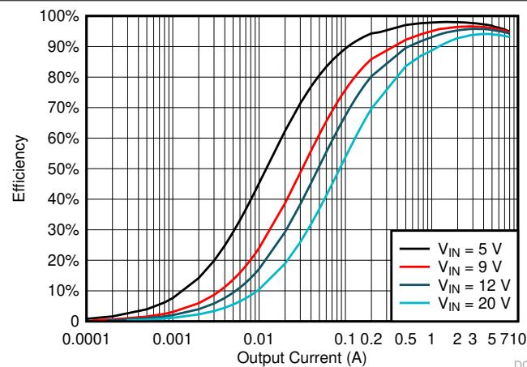  
$\mathsf { V } _ { \mathsf { I N } } = 1 2 \mathsf { V } ,$ ${ \bar { \mathsf { T } } } _ { \mathsf { A } } = 2 5 ^ { \circ } { \mathsf { C } }$ , $\mathsf { f } _ { \mathsf { S W } } = 4 0 0 ~ \mathsf { k H z }$ , unless otherwise noted.

  
Figure 6-1. Efficiency vs Output Current, $\mathsf { V } _ { 0 \mathsf { U T } } = \mathsf { 5 } \mathsf { V } _ { : }$ FPWM

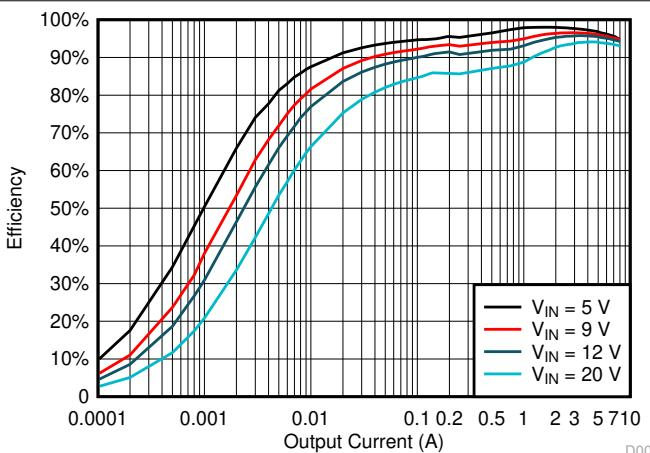  
Figure 6-2. Efficiency vs Output Current, $\mathsf { v } _ { \mathsf { o u r } } = \mathsf { \pmb { 5 } } \mathsf { v } ,$ PFM

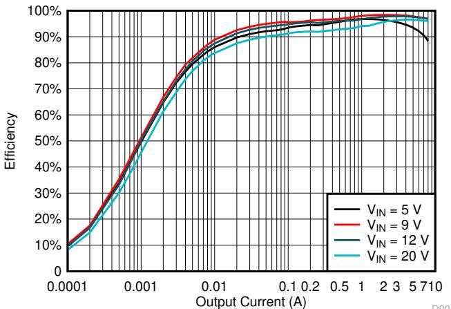  
Figure 6-4. Efficiency vs Output Current, $\mathsf { V } _ { \mathsf { O U T } } = \mathsf { 9 V }$ , PFM

  
Figure 6-3. Efficiency vs Output Current, $\mathsf { V } _ { \mathsf { O U T } } = \mathsf { 9 l }$ , FPWM   
Figure 6-5. Efficiency vs Output Current, $\mathsf { V } _ { \mathsf { O U T } } = \mathsf { 1 } 2 \mathsf { V } ,$ FPWM

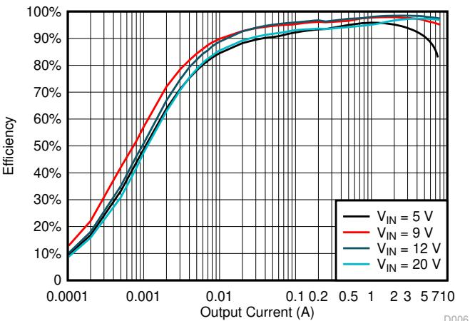  
Figure 6-6. Efficiency vs Output Current, $\mathsf { V } _ { \mathsf { O U T } } = \mathsf { 1 } 2 \mathsf { V } ,$ PFM

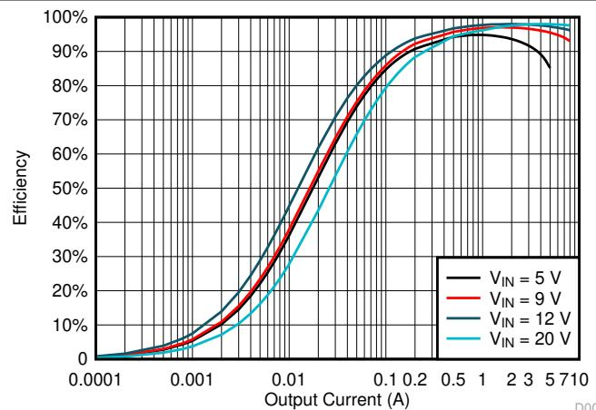  
Figure 6-7. Efficiency vs Output Current, $\mathsf { V } _ { \mathsf { O U T } } = 1 5 \mathsf { V } ,$ , FPWM

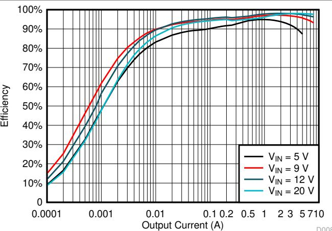  
Figure 6-8. Efficiency vs Output Current, $\mathsf { V } _ { \mathsf { O U T } } = 1 5 \mathsf { V } ,$ PFM

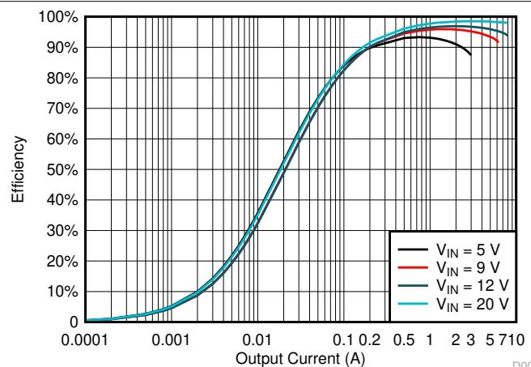  
Figure 6-9. Efficiency vs Output Current, $\mathsf { V } _ { \mathsf { O U T } } = 2 \mathsf { 0 } \mathsf { V } ,$ , FPWM

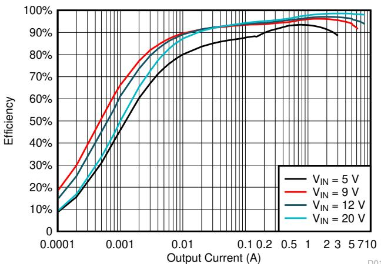  
Figure 6-10. Efficiency vs Output Current, $\mathsf { V } _ { \mathsf { O U T } } = 2 \mathsf { 0 } \mathsf { V } _ { \mathrm { i } }$ , PFM

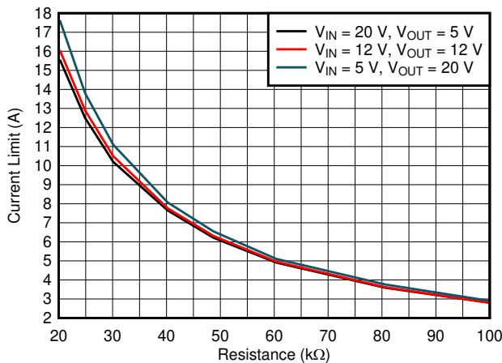  
Figure 6-11. Average Inductor Current Limit vs Setting Resistance

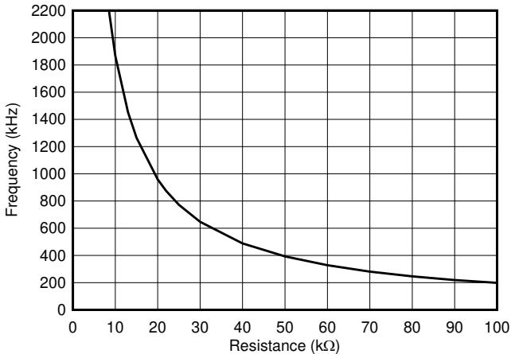  
Figure 6-12. Switching Frequency vs Setting Resistance

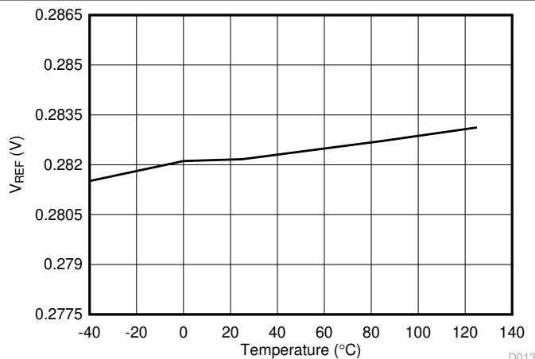  
Figure 6-13. Reference Voltage vs Temperature $( \mathsf { V } _ { \mathsf { R E F } } = 0 . 2 8 2 \ : \mathsf { V } )$

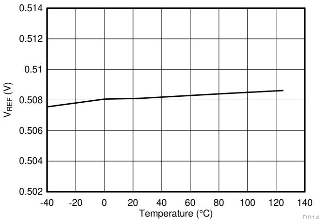  
Figure 6-14. Reference Voltage vs Temperature $( \mathsf { V } _ { \mathsf { R E F } } = 0 . 5 0 8 \ : \mathsf { V } )$

  
Figure 6-15. Reference Voltage vs Temperature $( \mathsf { V } _ { \mathsf { R E F } } = 0 . 8 4 6 \ \mathsf { V } )$

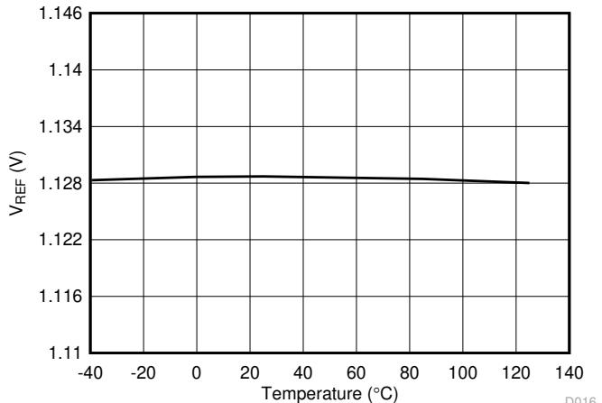  
Figure 6-16. Reference Voltage vs Temperature $( \mathsf { V } _ { \mathsf { R E F } } = 1 . 1 2 9 \ : \mathsf { V } )$

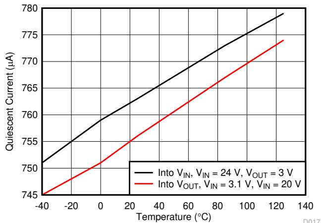  
Figure 6-17. Quiescent Current vs Temperature

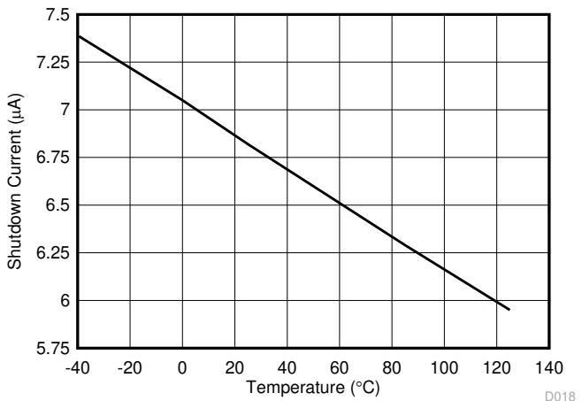  
Figure 6-18. Shutdown Current vs Temperature

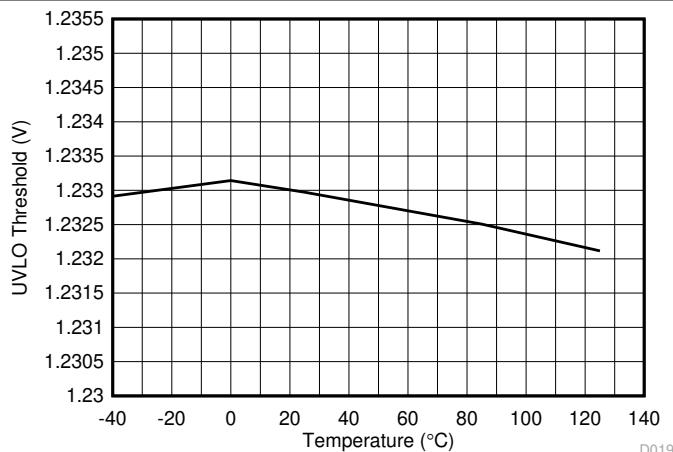  
Figure 6-19. ENABLE/UVLO Rising Threshold vs Temperature

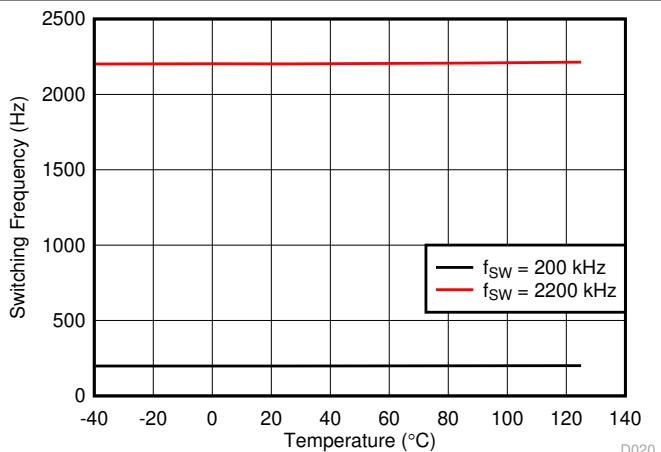  
Figure 6-20. Switching Frequency vs Temperature

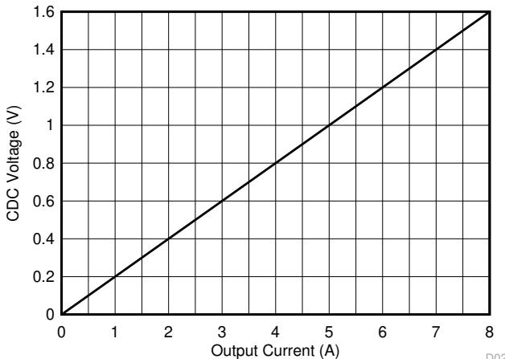  
Figure 6-21. CDC Voltage vs Output Current with RSENSE = 10 mΩ

# 7 Detailed Description 7.1 Overview

The TPS55288 is a 16-A buck-boost DC-to-DC converter with the two boost MOSFETs integrated. The TPS55288 can operate over a wide range of 2.7-V to 36-V input voltage and an output voltage of $0 . 8 \vee$ to $^ { 2 2 \lor . }$ It can transition among buck mode, buck-boost mode, and boost mode smoothly according to the input voltage and the set output voltage. The TPS55288 operates in buck mode when the input voltage is greater than the output voltage and in boost mode when the input voltage is less than the output voltage. When the input voltage is close to the output voltage, the TPS55288 operates in one-cycle buck and one-cycle boost mode alternately.

The TPS55288 uses an average current mode control scheme. Current mode control provides simplified loop compensation, rapid response to the load transients, and inherent line voltage rejection. An error amplifier compares the feedback voltage with the internal reference voltage. The output of the error amplifier determines the average inductor current.

An internal oscillator can be configured to operate over a wide range of frequency from $2 0 0 ~ \mathsf { k H z }$ to 2.2 MHz. The internal oscillator can also synchronize to an external clock applied to the DITH/SYNC pin. To minimize EMI, the TPS55288 can dither the switching frequency at $\pm 7 \%$ of the set frequency.

The TPS55288 works in fixed-frequency PWM mode at moderate to heavy load currents. In light load condition, the TPS55288 can be configured to automatically transition to PFM mode or be forced in PWM mode by either connecting a resistor at the MODE pin or setting the corresponding bit in an internal register.

The output voltage of the TPS55288 is adjustable by setting the internal register through $\mathsf { I 2 C }$ interface. An internal 10-bit DAC adjusts the reference voltage related to the value written into the REF register. The device can also limit the output current by placing a current sense resistor in the output path. These two functions support the programmable power supply (PPS) feature of the USB PD.

The TPS55288 provides average inductor current limit set by a resistor at the ILIM pin. In addition, it provides cycle-by-cycle peak inductor current limit during transient to protect the device against overcurrent condition beyond the capability of the device.

A precision voltage threshold of $1 . 2 3 \mathrm { V }$ with $5 { \cdot } { \mu } A$ sourcing current at the EN/UVLO pin supports programmable input undervoltage lockout (UVLO) with hysteresis. The output overvoltage protection (OVP) feature turns off the high-side FETs to prevent damage to the devices powered by the TPS55288.

The device provides hiccup mode option to reduce the heating in the power components when output short circuit happens. When the hiccup mode is enabled, the TPS55288 turns off for 76 ms and restarts at soft startup.

# 7.2 Functional Block Diagram

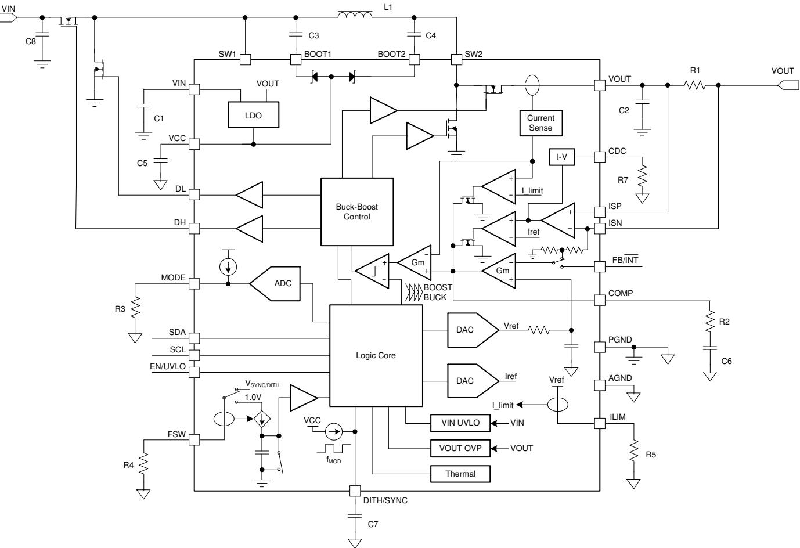

# 7.3 Feature Description

# 7.3.1 VCC Power Supply

An internal LDO to supply the TPS55288 outputs regulated 5.2-V voltage at the VCC pin with $6 0 { \cdot } \mathsf { m } \mathsf { A }$ output current capability. When $V _ { \mathsf { I N } }$ is less than $\mathsf { V } _ { \mathsf { O U T } }$ , the internal LDO selects the power supply source by comparing $V _ { \sf I N }$ to a rising threshold of $_ { 6 . 2 \vee }$ with $0 . 3 – \mathsf { V }$ hysteresis. When $V _ { \mathsf { I N } }$ is higher than $6 . 2 \ V ,$ the supply for LDO is $V _ { \mathsf { I N } }$ . When $V _ { \mathsf { I N } }$ is lower than $5 . 9 \lor ,$ , the supply for LDO is $\mathsf { V } _ { \mathsf { O U T } }$ . When $\mathsf { V } _ { \mathsf { O U T } }$ is less than $V _ { \mathsf { I N } }$ , the internal LDO selects the power supply source by comparing $\mathsf { V } _ { \mathsf { O U T } }$ to a rising threshold of $_ { 6 . 2 \vee }$ with $0 . 3 – \mathsf { V }$ hysteresis. When $\mathsf { V } _ { \mathsf { O U T } }$ is higher than $6 . 2 \ V ,$ the supply for LDO is $\mathsf { V } _ { \mathsf { O U T } }$ . When $\mathsf { V } _ { \mathsf { O U T } }$ is lower than $5 . 9 \lor ,$ , the supply for LDO is $V _ { \mathsf { I N } }$ . Table 7-1 shows the supply source selection for the internal LDO.

Table 7-1. $\mathsf { v } _ { \mathsf { c c } }$ Power Supply Logic   

<table><tr><td rowspan=1 colspan=1>VIN</td><td rowspan=1 colspan=1>VouT</td><td rowspan=1 colspan=1>INPUT for Vcc LDO</td></tr><tr><td rowspan=1 colspan=1>ViN &gt;6.2V</td><td rowspan=1 colspan=1>VouT&gt;ViN</td><td rowspan=1 colspan=1>VIN</td></tr><tr><td rowspan=1 colspan=1>VIN&lt;5.9V</td><td rowspan=1 colspan=1>VouT&gt;ViN</td><td rowspan=1 colspan=1>VouT</td></tr><tr><td rowspan=1 colspan=1>ViN &gt;VoUT</td><td rowspan=1 colspan=1>VouT&gt; 6.2 V</td><td rowspan=1 colspan=1>VouT</td></tr><tr><td rowspan=1 colspan=1>VIN &gt;VOUT</td><td rowspan=1 colspan=1>VouT&lt;5.9V</td><td rowspan=1 colspan=1>VIN</td></tr></table>

To minimize the power dissipation of the internal LDO when both input voltage and output voltage are high, an external $5 { - } \mathsf { V }$ power source can be applied at the VCC pin to supply the TPS55288. The external 5-V power supply must have at least $1 0 0 { \cdot } \mathsf { m } \mathsf { A }$ output current capability and must be within the $4 . 7 5 – \lor$ to $5 . 5 – \lor$ regulation range. To use an external power supply for $\mathsf { V } _ { \mathsf { C C } }$ , a resistor with proper resistance must be connected to the MODE pin.

# 7.3.2 Operation Mode Setting

By placing different resistors between the MODE pin and AGND pin, the TPS55288 selects the internal power supply or external power supply for $\mathsf { V } _ { \mathsf { C C } }$ , selects one of two different $\mathsf { I 2 C }$ addresses, and selects the PFM mode or the forced PWM mode in light load conditions. Table 7-2 shows the resistance values for each selection. After the TPS55288 is enabled, an $\mathsf { I 2 C }$ master device can control these three operating modes by writing the corresponding value into the internal registers regardless the resistance settings at the MODE pin. See details in Section 7.6.

Table 7-2. $\mathsf { v } _ { \mathsf { c c } }$ Source, $\mathsf { I } ^ { 2 } \mathsf { C }$ Slave Address and PFM/PWM Programming   

<table><tr><td rowspan=1 colspan=1>RESISTOR VALUE(kΩ)</td><td rowspan=1 colspan=1>Vcc SOURCE</td><td rowspan=1 colspan=1>I²C SLAVE ADDRESS</td><td rowspan=1 colspan=1>OPERATING MODE AT LIGHTLOAD</td></tr><tr><td rowspan=1 colspan=1>0</td><td rowspan=1 colspan=1>Internal</td><td rowspan=1 colspan=1>74h</td><td rowspan=1 colspan=1>PWM</td></tr><tr><td rowspan=1 colspan=1>6.19</td><td rowspan=1 colspan=1> Internal</td><td rowspan=1 colspan=1>74h</td><td rowspan=1 colspan=1>PFM</td></tr><tr><td rowspan=1 colspan=1>14.3</td><td rowspan=1 colspan=1>Internal</td><td rowspan=1 colspan=1>75h</td><td rowspan=1 colspan=1>PWM</td></tr><tr><td rowspan=1 colspan=1>24.9</td><td rowspan=1 colspan=1>Internal</td><td rowspan=1 colspan=1>75h</td><td rowspan=1 colspan=1>PFM</td></tr><tr><td rowspan=1 colspan=1>51.1</td><td rowspan=1 colspan=1>External</td><td rowspan=1 colspan=1>74h</td><td rowspan=1 colspan=1>PWM</td></tr><tr><td rowspan=1 colspan=1>75.0</td><td rowspan=1 colspan=1>External</td><td rowspan=1 colspan=1>74h</td><td rowspan=1 colspan=1>PFM</td></tr><tr><td rowspan=1 colspan=1>105</td><td rowspan=1 colspan=1>External</td><td rowspan=1 colspan=1>75h</td><td rowspan=1 colspan=1>PWM</td></tr><tr><td rowspan=1 colspan=1>Open</td><td rowspan=1 colspan=1>External</td><td rowspan=1 colspan=1>75h</td><td rowspan=1 colspan=1>PFM</td></tr></table>

# 7.3.3 Input Undervoltage Lockout

When the input voltage is below $2 . 6 \ V ,$ the TPS55288 is disabled. When the input voltage is above ${ } _ { 3 } \lor ,$ the TPS55288 can be enabled by pulling the EN pin to a high voltage above $1 . 3 \lor .$ .

# 7.3.4 Enable and Programmable UVLO

The TPS55288 has a dual function enable and undervoltage lockout (UVLO) circuit. When the input voltage at the VIN pin is above the input UVLO rising threshold of $\textsf { 3 V }$ and the EN/UVLO pin is pulled above $1 . 1 5 \mathrm { V }$ but less than the enable UVLO threshold of $1 . 2 3 \lor ,$ the TPS55288 is enabled but still in standby mode. The TPS55288 starts to detect the resistance between the MODE pin and ground. After that, the TPS55288 selects the power supply for $\mathsf { V } _ { \mathsf { C C } }$ , the $\mathsf { I 2 C }$ slave address, and the PFM or FPWM mode for light load condition accordingly.

The EN/UVLO pin has an accurate UVLO voltage threshold to support programmable input undervoltage lockout with hysteresis. When the EN/UVLO pin voltage is greater than the UVLO threshold of $1 . 2 3 \lor ,$ the TPS55288 is enabled for ${ \mathsf { I } } ^ { 2 } { \mathsf { C } }$ communication and switching operation. A hysteresis current IUVLO_HYS is sourced out of the EN/ UVLO pin to provide hysteresis that prevents on/off chattering in the presence of noise with a slowly changing input voltage.

By using resistor divider as shown in Figure 7-1, the turnon threshold is calculated using Equation 1.

$$
V _ { I N ( U V L O \_ O N ) } = V _ { U V L O } \times ( 1 + { \frac { \mathrm { R 1 } } { R 2 } } )
$$

where

• $\mathsf { V } _ { \mathsf { U V L O } }$ is the UVLO threshold of $1 . 2 3 \lor$ at the EN/UVLO pin

The hysteresis between the UVLO turnon threshold and turnoff threshold is set by the upper resistor in the EN/ UVLO resistor divider and is given by the Equation 2.

$$
\Delta V _ { I N ( U V L O ) } = I _ { U V L O \_ H Y S } \ \times R 1
$$

# where

• IUVLO_HYS is the sourcing current from the EN/UVLO pin when the voltage at the EN/UVLO pin is above VUVLO

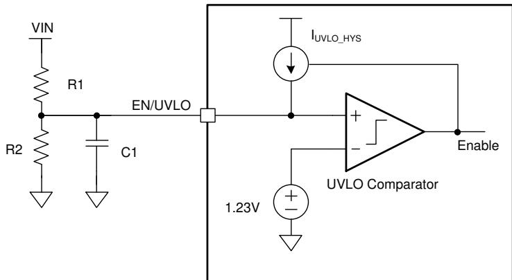  
Figure 7-1. Programmable UVLO With Resistor Divider at the EN/UVLO pin

Using an NMOSFET together with a resistor divider can implement both logic enable and programmable UVLO as shown in Figure 7-2. The EN logic high level must be greater than enable threshold plus the $\mathsf { V } _ { \mathsf { I h } }$ of the NMOSFET Q1. The Q1 also eliminates the leakage current from VIN to ground through the UVLO resistor divider during shutdown mode.

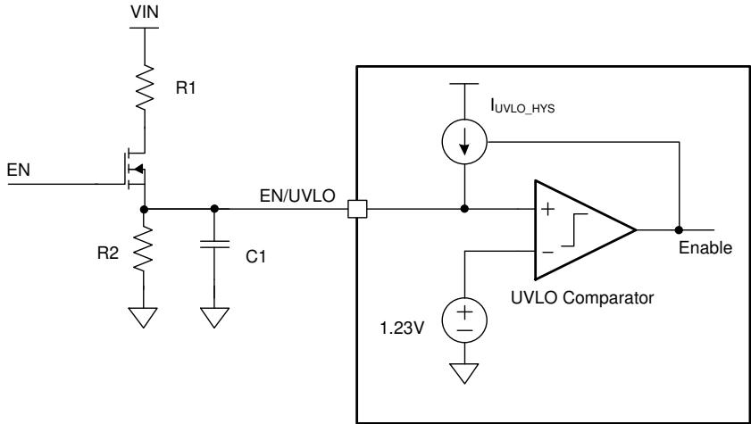  
Figure 7-2. Logic Enable and Programmable UVLO

# 7.3.5 Soft Start

When the input voltage is above the UVLO threshold and the voltage at the EN/UVLO pin is above the enable UVLO threshold, the TPS55288 is ready to accept the command from $\mathsf { I 2 C }$ master device. An $\mathsf { I 2 C }$ master device can configure the internal registers of the TPS55288 before setting the OE bit of the register 06h. Once an $\mathsf { I 2 C }$ master device sets the OE bit to 1, the TPS55288 starts to ramp up the output voltage by ramping an internal reference voltage from $0 \vee$ to a voltage set in the internal registers 00h and 01h within typical $4 \mathsf { m } \mathsf { s }$ .

# 7.3.6 Shutdown and Load Discharge

When the EN/UVLO pin voltage is pulled below $0 . 4 \lor ,$ , the TPS55288 is in shutdown mode, and all functions are disabled. All internal registers are reset to default values.

When the EN/UVLO pin is at high logic level and the OE bit is cleared to 0, the TPS55288 turns off the switching operation but keeps the ${ \mathsf { I } } ^ { 2 } { \mathsf { C } }$ interface active. Simultaneously, if the DISCHG bit in the register 06h is set to 1, the TPS55288 discharges the output voltage below $0 . 8 \vee$ by an internal constant current.

# 7.3.7 Switching Frequency

The TPS55288 uses a fixed frequency average current control scheme. The switching frequency is between 200 kHz and 2.2 MHz set by placing a resistor at the FSW pin. An internal amplifier holds this pin at a fixed voltage of

1 V. The setting resistance is between maximum of 100kΩ and minimum of $9 . 0 9 \mathrm { k } \Omega$ . Use Equation 3 to calculate the resistance by a given switching frequency.

$$
f _ { S W } = \frac { 1 0 0 0 } { 0 . 0 5 \times R _ { F S W } + 2 0 } ~ \mathrm { ( M H z ) }
$$

where

# • $\mathsf { R } _ { \mathsf { F S W } }$ is the resistance at the FSW pin

For noise-sensitive applications, the TPS55288 can be synchronized to an external clock signal applied to the DITH/SYNC pin. The duty cycle of the external clock is recommended in the range of $30 \%$ to $70 \%$ . A resistor also must be connected to the FSW pin when the TPS55288 is switching by the external clock. The external clock frequency at the DITH/SYNC pin must have lower than $0 . 4 \mathrm { - } \mathsf { V }$ low level voltage and must be within $\pm 3 0 \%$ of the corresponding frequency set by the resistor. Figure 7-3 is a recommended configuration.

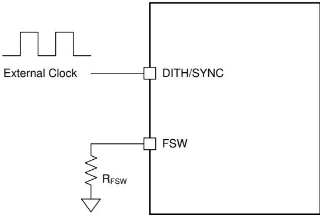  
Figure 7-3. External Clock Configuration

# 7.3.8 Switching Frequency Dithering

The TPS55288 provides an optional switching frequency dithering that is enabled by connecting a capacitor from the DITH/SYNC pin to ground. Figure 7-4 illustrates the dithering circuit. By charging and discharging the capacitor, a triangular waveform centered at $1 \vee$ is generated at the DITH/SYNC pin. The triangular waveform modulates the oscillator frequency by $\pm 7 \%$ of the nominal frequency set by the resistance at the FSW pin. The capacitance at the DITH/SYNC pin sets the modulation frequency. A small capacitance modulates the oscillator frequency at a fast rate than a large capacitance. For the dithering circuit to effectively reduce peak EMI, the modulation rate normally is below 1 kHz. Equation 4 calculates the capacitance required to set the modulation frequency, $\mathsf { F } _ { \mathsf { M O D } }$ .

$$
C _ { D I T H } = \frac { 1 } { 2 . 8 \times R _ { F S W } \times F _ { M O D } } \left( F \right)
$$

where

• RFSW is the switching frequency setting resistance (Ω) at the FSW pin • $\mathsf { F } _ { \mathsf { M O D } }$ is the modulation frequency $( \mathsf { H } z )$ of the dithering

Connecting the DITH/SYNC pin below $0 . 4 \lor$ or above $1 . 2 \lor$ disables switching frequency dithering. The dithering function also is disabled when an external synchronous clock is used.

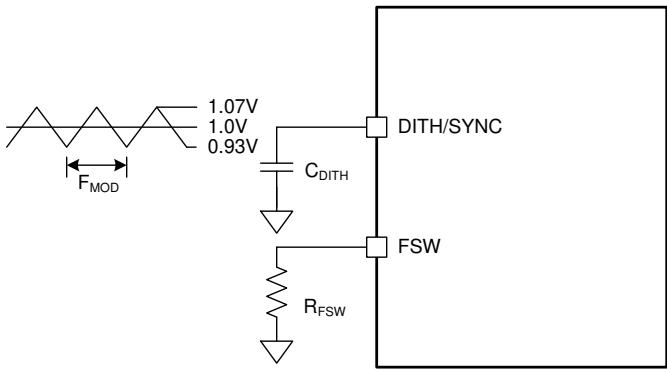  
Figure 7-4. Switching Frequency Dithering

# 7.3.9 Inductor Current Limit

The TPS55288 implements both peak current and average inductor current limit by a resistor connected to the ILIM pin. The average current mode control loop uses the current sense information at the high-side MOSFET of the boost leg to clamp the maximum average inductor current to 16.5 A (typical) when the resistor is ${ } ^ { 2 0 \mathsf { k } \Omega }$ . Use large resistance to get smaller average inductor current limit. Use Equation 5 to calculate the resistance for a desired average inductor current limit.

$$
I _ { A V G \_ L I M I T } = \frac { \operatorname* { m i n } ( 1 , 0 . 6 \times V _ { O U T } ) \times 3 3 0 0 0 0 } { R _ { I L I M } }
$$

# where

• IAVG_LIMIT is the average inductor current limit • ${ \mathsf { R } } _ { | \mathsf { L } | \mathsf { M } }$ is the resistance $( \Omega )$ between the ILIM pin and analog ground

Besides the average current limit, a peak current limit protection is implemented during transient to protect the device against over current condition beyond the capability of the device.

# 7.3.10 Internal Charge Path

Each of the two high-side MOSFET drivers is biased from its floating bootstrap capacitor, which is normally recharged by $\mathsf { V } _ { \mathsf { C C } }$ through both the external and internal bootstrap diodes when the low-side MOSFET is turned on. When the TPS55288 operates exclusively in the buck or boost regions, one of the high-side MOSFETs is constantly on. An internal charge path, from VOUT and BOOT2 to BOOT1 or from VIN and BOOT1 to BOOT2, charges the bootstrap capacitor to $\mathsf { V } _ { \mathsf { C C } }$ so that the high-side MOSFET remains on.

# 7.3.11 Output Voltage Setting

There are two ways to set the output voltage: changing the feedback ratio and changing the reference voltage. The TPS55288 has a 10-bit DAC to program the reference voltage from $4 5 \mathsf { m V }$ to $1 . 2 \lor .$ The TPS55288 also can select an internal feedback resistor divider or an external resistor divider by setting the FB bit in register 04h. When the FB bit is set to 0, the output voltage feedback ratio is set in internal register $0 4 \hslash$ . When the FB bit is set to 1, the output voltage feedback ratio is set by an external resistor divider.

When using internal output voltage feedback settings, there are four feedback ratios programmable by writing the INTFB[1:0] bits of register 04h. With this function, the TPS55288 can limit the maximum output voltage to different values. In addition, the minimum step of the output voltage change is also programmed to $2 0 ~ \mathsf { m V } ;$ , 15 mV, $1 0 \mathsf { m V } ,$ , and $5 \mathsf { m V } ,$ , accordingly.

When using an external output voltage feedback resistor divider as shown in Figure 7-5, use Equation 6 to calculate the output voltage with the reference voltage at the FB/INT pin.

$$
\mathsf { V } _ { O U T } = V _ { R E F } \times ( 1 + \frac { R _ { F B \_ U P } } { R _ { F B \_ B T } } )
$$

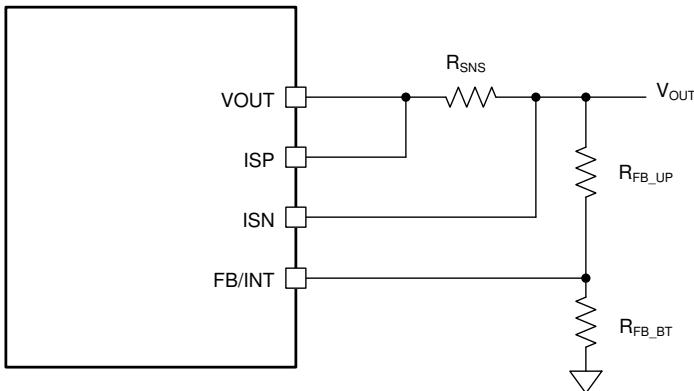  
Figure 7-5. Output Voltage Setting by External Resistor Divider

TI recommends using $1 0 0 ~ \mathsf { k } \Omega$ for the up resistor $\mathsf { R } _ { \mathsf { F B } }$ _UP. The reference voltage $V _ { \mathsf { R E F } }$ at the FB/INT pin is programmable from $4 5 ~ \mathsf { m V }$ to $1 . 2 \lor$ by writing a 10-bit data into register 00h and 01h.

# 7.3.12 Output Current Monitoring and Cable Voltage Droop Compensation

The TPS55288 outputs a voltage at the CDC pin proportional to the sensed voltage across a output current sensing resistor between the ISP pin and the ISN pin. Equation 7 shows the exact voltage at the CDC pin related to the sensed output current.

$$
\mathrm { V } _ { C D C } = 2 0 \times ( V _ { I S P } - V _ { I S N } )
$$

To compensate the voltage droop across a cable from the output of the USB port to its powered device, the TPS55288 can lift its output voltage in proportion to the load current. There are two methods in the TPS55288 to implement the compensation: by setting internal register 05h or by placing a resistor between the CDC pin and AGND pin.

When using internal output voltage feedback, it is recommended to use the internal compensation setting. When using an external resistor divider at the FB/INT pin to set the output voltage, it is recommended to use the external compensation setting by placing a resistor at the CDC pin.

By default, the internal cable voltage droop compensation function is enabled with $_ { 0 \mathrm { ~ V ~ } }$ added to the output voltage. Write the value into the bit CDC [2:0] in register 05h to get the desired voltage compensation.

When using external output voltage feedback, external compensation is better than the internal register for its high accuracy. The output voltage rises in proportion to the current sourcing from the CDC pin through the resistor at the CDC pin. It is recommended to use $1 0 0  – \ k \Omega$ resistance for the up resistor of the feedback resistor divider. Equation 8 shows the output voltage rise related to the sensed output current, the resistance at the CDC pin, and the up resistor of the output voltage feedback resistor divider.

$$
\nabla _ { O U T \_ C D C } = 3 \times R _ { F B \_ U P } \times ( \frac { V _ { I S P } - V _ { I S N } } { R _ { C D C } } )
$$

where

• $\mathsf { R } _ { \mathsf { F B \_ U P } }$ is the up resistor of the resistor divider between the output and the FB/INT pin • RCDC is the resistor at the CDC pin

When RFB_UP is $1 0 0 ~ \mathsf { k } \Omega$ , the output voltage rise versus the sensed output current and the resistor at the CDC pin is shown in Figure 7-6.